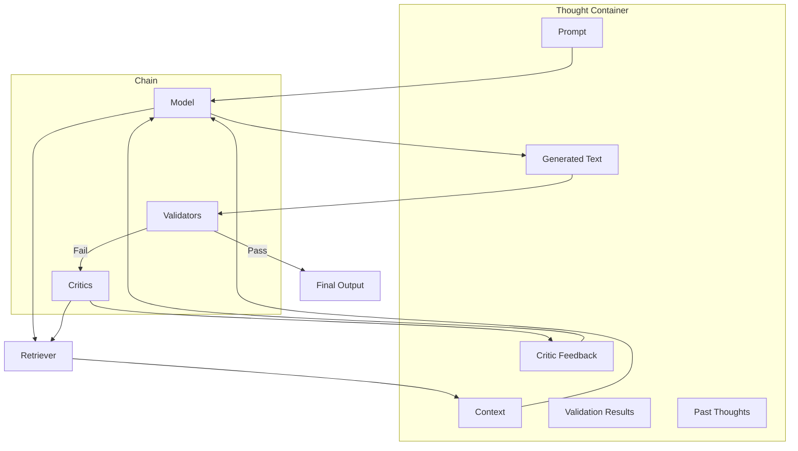

# Sifaka Architecture - Golden Reference

## Core Architecture

Sifaka is built around a central Chain architecture with a Thought container that flows through the system.

### Chain Components

A Chain consists of four key components:
1. **Thought**: The central state container that flows through the system
2. **Model**: Generates text based on the prompt and context in the Thought
3. **Validators**: Check if the generated text meets specific criteria
4. **Critics**: Improve text that fails validation by providing feedback

```
Chain = [Thought, Model, [Validators], [Critics]]
```

### Thought Container

The Thought container is the central state object that passes information between all components:

- **Prompt**: The original user query or instruction
- **Context**: Retrieved information from external sources
  - **Pre-generation Context**: Retrieved before text generation
  - **Post-generation Context**: Retrieved after text generation
- **Text**: The generated text from the model
- **Validation Results**: Results from validators
- **Critic Feedback**: Feedback from critics
- **History**: Previous iterations of the Thought

### Flow of Execution

1. **Initial Setup**:
   - A Thought is created with a Prompt
   - Retrievers may be called to add Pre-generation Context to the Thought

2. **Text Generation**:
   - The Model receives the Thought (with Prompt and Pre-generation Context)
   - The Model may call Retrievers directly to get additional context
   - The Model generates Text and adds it to the Thought

3. **Validation**:
   - Validators check the Text in the Thought
   - Validation Results are added to the Thought
   - If all validations pass, the Thought is returned

4. **Critic Improvement** (if validation fails):
   - Critics receive the Thought (with Text, Validation Results, and Context)
   - Critics may call Retrievers directly to get additional context
   - Critics generate feedback and add it to the Thought
   - The Thought is passed back to the Model for improvement
   - This cycle continues until validation passes or max iterations are reached

## Key Relationships

### Retrievers

- **Retrievers are directly available to both Models and Critics**
- Models can call Retrievers to get additional context before or during text generation
- Critics can call Retrievers to get additional context for improving text
- Retrievers add their results to the Thought container

### Models

- Models receive the Thought with Prompt and Pre-generation Context
- Models can call Retrievers directly to get additional context
- Models generate Text and add it to the Thought

### Critics

- Critics receive the Thought with Text, Validation Results, and Context
- Critics can call Retrievers directly to get additional context
- Critics generate feedback and add it to the Thought
- Critics can be specialized (ReflexionCritic, SelfRAGCritic, etc.)

## Diagram



## Implementation Notes

- The Thought container is immutable; new instances are created at each stage
- Retrievers can be called at multiple points in the flow
- Critics can use different strategies for improvement (reflection, retrieval, etc.)
- The Chain orchestrates the flow but components can interact directly with Retrievers
