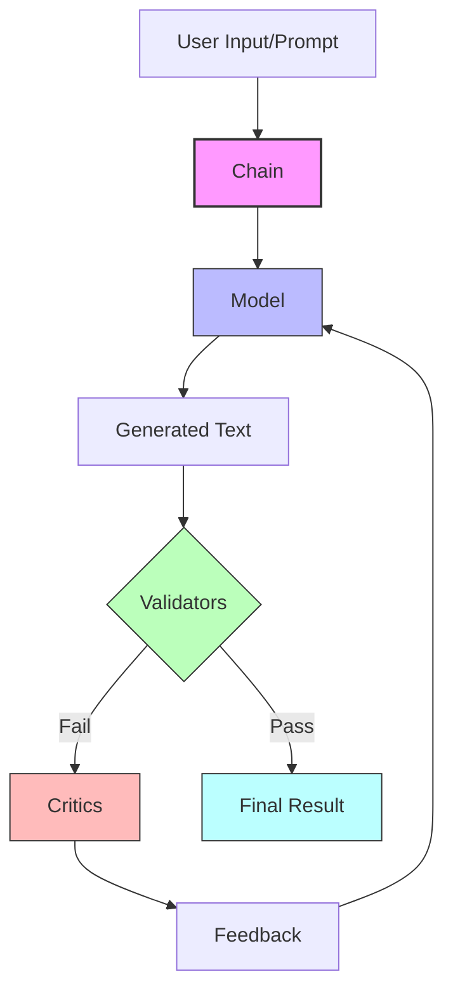

# Sifaka: A Framework for Reliable LLM Applications

Sifaka is a powerful framework for building reliable, robust, and responsible language model applications. It provides a modular architecture for text generation, validation, improvement, and evaluation with built-in guardrails.

## Core Concept

Sifaka's core concept is the **Chain**, which orchestrates the process of:

1. Generating text using a language model
2. Validating the generated text against specified criteria
3. Improving the text using specialized critics
4. Repeating until validation passes or max attempts reached



## Key Components

- **Chain**: The main orchestrator that coordinates the generation, validation, and improvement flow
- **Model**: Interface for text generation models (OpenAI, Anthropic, etc.)
- **Validators**: Components that check if text meets specific criteria (length, content, format, etc.)
- **Critics**: Specialized components that analyze and improve text quality
  - **ReflexionCritic**: Uses reflection to improve text based on past feedback
  - **SelfRAGCritic**: Uses retrieval-augmented generation to improve text with external knowledge
  - **SelfRefineCritic**: Iteratively refines text through self-critique
  - **ConstitutionalCritic**: Ensures text adheres to specified principles
  - **PromptCritic**: General-purpose critic with customizable instructions
  - **NCriticsCritic**: Ensemble of specialized critics for comprehensive feedback

## Installation

```bash
pip install sifaka
pip install python-dotenv  # For loading environment variables
```

## Environment Setup

Sifaka requires API keys for the language models you want to use. You can set these as environment variables in your shell or use a `.env` file.

1. Copy the `.env.example` file to `.env`:
   ```bash
   cp .env.example .env
   ```

2. Edit the `.env` file with your API keys:
   ```
   OPENAI_API_KEY=your_openai_api_key_here
   ```

The examples will automatically load these environment variables using `python-dotenv`.

## Quick Start

```python
import os
from dotenv import load_dotenv
from sifaka import Chain
from sifaka.validators import length, prohibited_content
from sifaka.critics.reflexion import create_reflexion_critic
from sifaka.models.openai import OpenAIModel

# Load environment variables from .env file if it exists
load_dotenv()

# Get API key from environment variables
api_key = os.environ.get("OPENAI_API_KEY")
if not api_key:
    raise ValueError("OPENAI_API_KEY environment variable not set")

# Create a model
model = OpenAIModel(model_name="gpt-4", api_key=api_key)

# Create a chain with validators and critics
chain = (Chain()
    .with_model(model)
    .with_prompt("Write a short story about a robot.")
    .validate_with(length(min_words=50, max_words=500))
    .validate_with(prohibited_content(prohibited=["violent", "harmful"]))
    .improve_with(create_reflexion_critic(model=model))
)

# Run the chain
result = chain.run()

# Check the result
if result.passed:
    print("Chain execution succeeded!")
    print(result.text)
else:
    print("Chain execution failed validation")
    print(result.validation_results[0].message)
```

## Working with Critics

Critics are the most important part of Sifaka. They analyze text and provide feedback for improvement.

```python
import os
from dotenv import load_dotenv
from sifaka import Chain
from sifaka.models.openai import OpenAIModel
from sifaka.critics.self_refine import create_self_refine_critic
from sifaka.critics.reflexion import create_reflexion_critic

# Load environment variables from .env file if it exists
load_dotenv()

# Get API key from environment variables
api_key = os.environ.get("OPENAI_API_KEY")
if not api_key:
    raise ValueError("OPENAI_API_KEY environment variable not set")

# Create a model
model = OpenAIModel(model_name="gpt-4", api_key=api_key)

# Create critics
self_refine_critic = create_self_refine_critic(
    model=model,
    max_refinement_iterations=3
)

reflexion_critic = create_reflexion_critic(
    model=model,
    reflection_rounds=2
)

# Create a chain with multiple critics
chain = (Chain()
    .with_model(model)
    .with_prompt("Explain quantum computing to a high school student.")
    .improve_with(self_refine_critic)
    .improve_with(reflexion_critic)
)

# Run the chain
result = chain.run()
print(result.text)
```

## Advanced Configuration

Sifaka provides a centralized configuration system for all components:

```python
import os
from dotenv import load_dotenv
from sifaka import Chain
from sifaka.config import SifakaConfig, ModelConfig, ValidatorConfig, CriticConfig
from sifaka.validators import length, prohibited_content
from sifaka.critics.self_refine import create_self_refine_critic

# Load environment variables from .env file if it exists
load_dotenv()

# Get API key from environment variables
api_key = os.environ.get("OPENAI_API_KEY")
if not api_key:
    raise ValueError("OPENAI_API_KEY environment variable not set")

# Create a custom configuration
config = SifakaConfig(
    model=ModelConfig(
        temperature=0.8,
        max_tokens=500,
        top_p=0.9,
        api_key=api_key,  # Use environment variable for API key
    ),
    validator=ValidatorConfig(
        min_words=100,
        max_words=500,
        prohibited_content=["violence", "hate speech"]
    ),
    critic=CriticConfig(
        temperature=0.5,
        refinement_rounds=3,
        system_prompt="You are an expert editor that improves text for clarity and conciseness."
    ),
    debug=True,
    log_level="DEBUG",
)

# Create a model
from sifaka.models.openai import OpenAIModel
model = OpenAIModel(model_name="gpt-4", api_key=api_key)

# Use the configuration with a chain
chain = (
    Chain(config)
    .with_model(model)
    .with_prompt("Write a short story about a robot.")
    .validate_with(length(min_words=config.validator.min_words, max_words=config.validator.max_words))
    .validate_with(prohibited_content(prohibited=config.validator.prohibited_content))
    .improve_with(create_self_refine_critic(model=model, max_refinement_iterations=config.critic.refinement_rounds))
)

# Run the chain
result = chain.run()
```

## Choosing the Right Critic

- **PromptCritic**: General-purpose text improvement with simple feedback
- **ReflexionCritic**: When learning from past feedback is important for improvement
- **ConstitutionalCritic**: When adherence to specific principles or guidelines is critical
- **SelfRAGCritic**: When external knowledge is needed to validate or improve content
- **SelfRefineCritic**: When complex text requires multiple refinement iterations
- **NCriticsCritic**: When you need comprehensive feedback from multiple perspectives

## Documentation

For more detailed information about Sifaka, check out the following documentation:

- [Components Overview](docs/COMPONENTS.md) - Overview of all Sifaka components
- [Chain Documentation](docs/CHAIN.md) - Detailed documentation for the Chain class
- [Models Documentation](docs/MODELS.md) - Documentation for model integrations
- [Validators Documentation](docs/VALIDATORS.md) - Documentation for validators
- [Critics Documentation](docs/CRITICS.md) - Documentation for critics
- [Retrievers Documentation](docs/RETRIEVERS.md) - Documentation for retrievers
- [Classifiers Documentation](docs/CLASSIFIERS.md) - Documentation for classifiers
- [API Reference](docs/API_REFERENCE.md) - Comprehensive API reference
- [Architecture](docs/ARCHITECTURE.md) - Detailed architecture documentation with diagrams

## Contributing

Contributions are welcome! Please feel free to submit a Pull Request. See [CONTRIBUTING.md](docs/CONTRIBUTING.md) for guidelines.

## License

[MIT License](LICENSE)