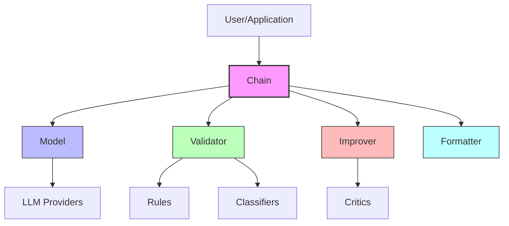

# Sifaka

Sifaka is a comprehensive framework for building reliable, robust, and responsible language model applications. It provides a modular architecture for text generation, validation, improvement, and evaluation with built-in guardrails.

## Overview

Sifaka enables you to:

1. **Build reliable LLM applications** with configurable validation and improvement cycles
2. **Implement robust guardrails** using a flexible rule system
3. **Ensure responsible AI outputs** with advanced critics and classifiers
4. **Integrate with multiple LLM providers** through a unified interface
5. **Extend and customize** with a modular, composable architecture

## Architecture

Sifaka follows a modular, component-based architecture that allows for flexible composition and extension.



The primary components are:

1. **Chain**: Orchestrates the generation, validation, and improvement flow
2. **Models**: Adapters for different LLM providers
3. **Rules & Classifiers**: Validation components for content quality and safety
4. **Critics**: Improvement components that provide feedback and suggestions
5. **Formatter**: Structures and formats the final output

## Quick Start

```python
from sifaka.chain import Chain
from sifaka.models import OpenAIProvider
from sifaka.rules import create_length_rule, create_prohibited_content_rule
from sifaka.critics import create_prompt_critic

# Set up a model provider
model = OpenAIProvider(
    model_name="gpt-4",
    api_key="your-openai-key"
)

# Create validation rules
rules = [
    create_length_rule(min_chars=50, max_chars=500),
    create_prohibited_content_rule(
        prohibited_terms=["offensive", "harmful"]
    )
]

# Create a critic for improving content
critic = create_prompt_critic(
    llm_provider=model,
    system_prompt="You are an expert editor who improves text while maintaining its meaning."
)

# Create a chain with all components
chain = Chain(
    model=model,
    validators=rules,
    improver=critic,
    max_attempts=3
)

# Generate content with automatic validation and improvement
result = chain.run("Write a short story about friendship.")

print(f"Final output: {result.output}")
print(f"All validations passed: {result.all_passed}")
print(f"Attempts made: {result.attempt_count}")
```

## LAC Critic Example

The LAC (LLM-Based Actor-Critic) critic combines language feedback and value scoring to improve language model outputs. It's based on research demonstrating that detailed language feedback improves model decision making.

```python
from sifaka.critics import create_lac_critic
from sifaka.models import OpenAIProvider

# Create a model provider
model = OpenAIProvider(
    model_name="gpt-4",
    api_key="your-openai-key"
)

# Create a LAC critic
critic = create_lac_critic(
    llm_provider=model,
    system_prompt="You are an expert writing coach focused on clarity and accuracy."
)

# Example task and response to evaluate
task = "Explain the concept of quantum computing in simple terms."
response = "Quantum computers use qubits instead of bits, which can be both 0 and 1 at the same time."

# Get feedback and value score
result = critic.critique(response, {"task": task})

print(f"Feedback: {result['feedback']}")
print(f"Value score: {result['value']}")

# Generate improved response
improved_response = critic.improve(response, task)
print(f"Improved response: {improved_response}")
```

## Module Overview

Sifaka is organized into several core modules:

- **chain**: Orchestration of the generation, validation, and improvement pipeline
- **models**: Adapters for different LLM providers like OpenAI, Anthropic, etc.
- **rules**: Validation rules for content and formatting
- **critics**: Components for providing feedback and improving text
- **classifiers**: Text classification and categorization
- **retrieval**: Information retrieval from various sources
- **interfaces**: Core interfaces and protocols defining component contracts
- **adapters**: Integrations with external libraries and frameworks
- **core**: Core components and utilities
- **utils**: Common utilities for logging, state management, etc.

Each module is designed to be used independently or in combination through the Chain orchestrator.

## Advanced Features

### Custom Rules

```python
from sifaka.rules import Rule, BaseValidator, create_rule_result

class ReadabilityValidator(BaseValidator):
    """Check text readability score."""

    def __init__(self, min_score=60, max_score=100):
        self.min_score = min_score
        self.max_score = max_score

    def validate(self, text):
        # Calculate readability score
        score = calculate_readability(text)

        # Check if score is within acceptable range
        if score < self.min_score:
            return create_rule_result(
                passed=False,
                message=f"Text is too complex. Score: {score}",
                score=0.0
            )

        return create_rule_result(
            passed=True,
            message="Text has appropriate readability",
            score=1.0
        )
```

### Extending the Framework

Sifaka is designed to be extended with custom components:

1. **Custom Model Providers**: Add new LLM providers by implementing the Model interface
2. **Custom Rules**: Create domain-specific validation rules
3. **Custom Critics**: Implement specialized content improvement strategies
4. **Custom Classifiers**: Build classifiers for domain-specific text categories
5. **Custom Chain Components**: Add new steps to the generation and validation flow

## Contributing

Contributions are welcome! Please feel free to submit a Pull Request.

## License

[MIT License](LICENSE)
