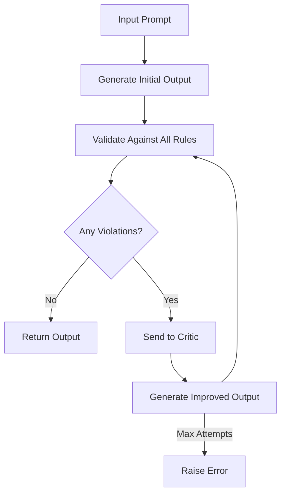

# Sifaka: Reflection and Reliability for LLMs

<div style="display: flex; align-items: start;">
<div style="flex: 1;">

**Sifaka** is an open-source framework that adds **reflection and reliability** to large language model (LLM) applications. It helps developers build safer, more reliable AI systems by:

- Catching hallucinations before they reach users
- Enforcing rules and tone consistency
- Providing transparency and auditability

Whether you're building AI-powered tools for legal research, customer support, or creative generation, Sifaka makes your outputs **safer, smarter, and more transparent.**

</div>
<div style="flex: 0 0 40%; margin-left: 20px;">
  
</div>
</div>

[](https://badge.fury.io/py/sifaka)
[](https://opensource.org/licenses/MIT)
[](https://www.python.org/downloads/)

## 🌟 What is Sifaka?

Sifaka works through a process called "reflection," where:

1. An LLM generates an initial response to a prompt
2. The response is validated against a set of rules (length, prohibited content, format, etc.)
3. If any rules are violated, a "critic" component improves the response
4. This process repeats until all rules pass or a maximum number of attempts is reached

This approach ensures that LLM outputs meet your specific requirements before they reach users.

Sifaka is provider-agnostic and works with multiple LLM providers including **OpenAI** (GPT models), **Anthropic** (Claude models), and others, giving you flexibility in choosing the right model for your needs.

## 📦 Installation

```bash
# Basic installation
pip install sifaka

# With specific integrations
pip install sifaka[sentiment]    # Sentiment analysis support
pip install sifaka[openai]       # OpenAI support
pip install sifaka[anthropic]    # Anthropic support
pip install sifaka[langgraph]    # LangGraph support
pip install sifaka[langchain]    # LangChain support

# With all integrations
pip install sifaka[all]

# With development tools
pip install sifaka[dev]
```

## 🚀 Quick Start

```python
from sifaka import Reflector
from sifaka.models import OpenAIProvider, AnthropicProvider
from sifaka.rules import LengthRule, ProhibitedContentRule
from sifaka.critics import PromptCritic
from dotenv import load_dotenv

# Load environment variables
load_dotenv()

# Initialize the provider (choose one)
# OpenAI provider
# provider = OpenAIProvider(model_name="gpt-4")

# Anthropic provider
provider = AnthropicProvider(model_name="claude-3-haiku-20240307")

# Create rules
length_rule = LengthRule(
    name="length_check",
    description="Checks if output length is within bounds",
    config={
        "min_length": 100,
        "max_length": 500
    }
)

prohibited_terms = ProhibitedContentRule(
    name="content_filter",
    description="Checks for prohibited or inappropriate content",
    config={
        "prohibited_terms": ["controversial", "inappropriate"]
    }
)

# Create a critic for improving outputs that fail validation
critic = PromptCritic(model=provider)

# Create a reflector with rules and critic
reflector = Reflector(
    name="content_validator",
    model=provider,
    rules=[length_rule, prohibited_terms],
    critic=critic
)

# Use the reflector
try:
    result = reflector.reflect(
        "Write a professional email about a search project update",
        max_attempts=3  # Try up to 3 times to fix any violations
    )
    print(f"Final result:\n{result}")
except RuntimeError as e:
    print(f"Failed to generate valid output: {e}")
```

## 🔑 API Keys and Configuration

Sifaka supports multiple LLM providers and requires API keys for authentication:

```python
# Environment variables (recommended)
export OPENAI_API_KEY="your-openai-api-key"
export ANTHROPIC_API_KEY="your-anthropic-api-key"

# Or direct configuration
# OpenAI
from sifaka.models import OpenAIProvider
openai_provider = OpenAIProvider(
    model_name="gpt-4",
    api_key="your-openai-api-key"
)

# Anthropic
from sifaka.models import AnthropicProvider
anthropic_provider = AnthropicProvider(
    model_name="claude-3-haiku-20240307",
    api_key="your-anthropic-api-key"
)
```

## 🧩 Architecture

Sifaka is built around four main components:

### 1. Reflector

The core component that orchestrates the reflection process:

```python
reflector = Reflector(
    name="content_validator",
    model=model,
    rules=[rule1, rule2],  # List of rules to apply
    critic=critic          # Optional critic for improvement
)

result = reflector.reflect("Your prompt here")
```

### 2. Rules

Validate LLM outputs against specific criteria:

```python
# Built-in rules
from sifaka.rules import (
    LengthRule,              # Control output length
    ProhibitedContentRule,   # Filter prohibited terms
    SentimentRule,           # Ensure positive sentiment
    ToxicityRule,            # Prevent toxic content
    FormatRule               # Enforce specific formats
)

# Custom rules
from sifaka.rules import Rule, RuleResult

class CustomRule(Rule):
    def validate(self, output: str) -> RuleResult:
        # Your validation logic here
        return RuleResult(
            passed=True,
            message="Validation passed",
            metadata={"key": "value"}
        )
```

### 3. Critics

Improve LLM outputs when they fail validation:

```python
from sifaka.critics import PromptCritic

critic = PromptCritic(
    model=provider,
    system_prompt="You are an editor that improves text..."
)
```

### 4. Model Providers

Interface with different LLM services:

```python
from sifaka.models import OpenAIProvider, AnthropicProvider

openai_model = OpenAIProvider(model_name="gpt-4")
anthropic_model = AnthropicProvider(model_name="claude-3-haiku-20240307")
```

## 🔄 How Reflection Works



## 📏 Built-in Rules

Sifaka provides a comprehensive set of rules:

### Content Rules

- **LengthRule**: Controls output length based on character or word count
  ```python
  length_rule = LengthRule(
      name="length_check",
      config={"min_length": 100, "max_length": 500, "unit": "characters"}
  )
  ```

- **ProhibitedContentRule**: Filters prohibited terms and phrases
  ```python
  prohibited_rule = ProhibitedContentRule(
      name="content_filter",
      config={
          "prohibited_terms": ["inappropriate", "offensive"],
          "case_sensitive": False,
          "whole_word_match": True
      }
  )
  ```

- **FormatRule**: Ensures specific formatting requirements are met
  ```python
  format_rule = FormatRule(
      name="format_check",
      config={
          "required_format": "markdown",  # or "json", "yaml", etc.
          "schema": {...},  # Optional JSON schema for validation
      }
  )
  ```

### Safety Rules

- **ToxicityRule**: Prevents toxic or harmful content
  ```python
  toxicity_rule = ToxicityRule(
      name="toxicity_check",
      config={"max_toxicity": 0.7}  # 0-1 scale
  )
  ```

- **SentimentRule**: Controls emotional tone of content
  ```python
  sentiment_rule = SentimentRule(
      name="sentiment_check",
      config={
          "min_sentiment": 0.0,  # Minimum sentiment score (-1 to 1)
          "target_sentiment": "positive"  # or "neutral", "negative"
      }
  )
  ```

### Domain-Specific Rules

- **LegalCitationRule**: Validates legal citations and references
- **CodeRule**: Validates code snippets and programming content

## 📊 Classifiers

Sifaka includes various text analysis classifiers for advanced content validation:

### Text Analysis Classifiers

- **ProfanityClassifier**: Detects and censors inappropriate language
  ```python
  from sifaka.classifiers import ProfanityClassifier

  classifier = ProfanityClassifier(
      name="profanity_check",
      custom_words={"word1", "word2"},  # Optional additional words
      censor_char="*"  # Character for censoring
  )

  result = classifier.classify("Your text here")
  print(f"Label: {result.label}")  # "clean" or "profane"
  print(f"Censored text: {result.metadata['censored_text']}")
  ```

- **SentimentClassifier**: Analyzes the emotional tone of text
  ```python
  from sifaka.classifiers import SentimentClassifier

  classifier = SentimentClassifier(
      name="sentiment_analyzer",
      threshold=0.5  # Threshold for positive/negative classification
  )

  result = classifier.classify("Your text here")
  print(f"Sentiment: {result.label}")  # "positive", "negative", or "neutral"
  print(f"Score: {result.metadata['sentiment_score']}")
  ```

### Safety Classifiers

- **ToxicityClassifier**: Identifies toxic, harmful, or inappropriate content
  ```python
  from sifaka.classifiers import ToxicityClassifier

  classifier = ToxicityClassifier(
      name="toxicity_check",
      threshold=0.7  # Toxicity threshold
  )
  ```

- **ReadabilityClassifier**: Assesses text complexity and readability
- **LanguageClassifier**: Identifies the language of text
- **LLMClassifier**: Uses Large Language Models for sophisticated classification tasks

### Classifiers vs Rules: Performance Considerations

Classifiers and rules have different performance characteristics:

1. **Relationship**: Rules often use classifiers internally to perform validation
   ```python
   # A ToxicityRule internally uses a ToxicityClassifier
   toxicity_rule = ToxicityRule(config={"max_toxicity": 0.7})

   # Direct classifier usage
   classifier = ToxicityClassifier()
   result = classifier.classify("Your text")
   ```

2. **Computational Cost**:
   - Each classifier has a `cost` attribute indicating its computational expense
   - Lightweight classifiers (like `ProfanityClassifier`) are very fast
   - ML-based classifiers (like `ToxicityClassifier`) have moderate cost
   - LLM-based classifiers (like `LLMClassifier`) are the most expensive due to API calls

3. **When to use direct classifiers vs rules**:
   - Use **direct classifiers** when you need raw classification results or custom processing
   - Use **rules** when you need validation logic or want to use Sifaka's reflection framework

4. **Performance optimization tips**:
   - Cache expensive classifier results when processing similar texts
   - Use lightweight classifiers as initial filters before expensive ones
   - Set appropriate thresholds to balance accuracy and performance
   - Use the performance monitor to identify bottlenecks

The most expensive operations are typically API calls to LLM services and complex ML model inference.

## 🚀 Performance Optimization

Sifaka provides several optimization features:

```python
# Parallel rule validation
reflector = Reflector(
    name="optimized_validator",
    model=provider,
    rules=[rule1, rule2],
    parallel_validation=True
)

# Rule prioritization
length_rule = LengthRule(
    name="length",
    config={"min_length": 100, "max_length": 200},
    priority=2,  # Higher priority runs first
    cost=1       # Lower cost runs before higher cost at same priority
)

# Batch processing
results = reflector.reflect_batch([
    "First prompt",
    "Second prompt",
    "Third prompt"
], batch_size=10)
```

### Using the Performance Monitor

Sifaka includes a built-in performance monitoring system that helps you track and optimize your application:

```python
from sifaka import Reflector
from sifaka.models import AnthropicProvider
from sifaka.rules import LengthRule, ProhibitedContentRule
from sifaka.monitoring import PerformanceMonitor

# Create a performance monitor
monitor = PerformanceMonitor()

# Initialize reflector with the monitor
reflector = Reflector(
    name="monitored_validator",
    model=AnthropicProvider(model_name="claude-3-haiku-20240307"),
    rules=[
        LengthRule(name="length", config={"min_length": 100, "max_length": 500}),
        ProhibitedContentRule(name="content", config={"prohibited_terms": ["inappropriate"]})
    ],
    performance_monitor=monitor
)

# Use the reflector
reflector.reflect("Write a short story about AI")

# Get performance metrics
metrics = monitor.get_metrics()
print(f"Average generation time: {metrics['avg_generation_time_ms']}ms")
print(f"Average validation time: {metrics['avg_validation_time_ms']}ms")
print(f"Average critique time: {metrics['avg_critique_time_ms']}ms")
print(f"Rules per second: {metrics['rules_per_second']}")
print(f"Success rate: {metrics['success_rate']}")

# Get rule-specific metrics
rule_metrics = monitor.get_rule_metrics()
for rule_name, metrics in rule_metrics.items():
    print(f"Rule '{rule_name}' average time: {metrics['avg_time_ms']}ms")
    print(f"Rule '{rule_name}' pass rate: {metrics['pass_rate']}")

# Export metrics to JSON
monitor.export_metrics("performance_metrics.json")

# Reset metrics for a new test run
monitor.reset()
```

The performance monitor tracks:
- Generation time (how long it takes to generate initial outputs)
- Validation time (how long it takes to validate outputs)
- Critique time (how long it takes to improve outputs)
- Success rates (how often outputs pass validation)
- Rule-specific metrics (which rules are most expensive or fail most often)

You can use these metrics to identify bottlenecks and optimize your application.

## 🔌 Framework Integrations

### LangGraph Integration

```python
from langgraph.graph import Graph
from sifaka.integrations.langgraph import wrap_graph

# Create your LangGraph
graph = Graph()
# ... configure your graph ...

# Wrap with Sifaka
sifaka_graph = wrap_graph(
    graph=graph,
    rules=[rule1, rule2],
    critique=True
)
```

### LangChain Integration

```python
from langchain.chains import LLMChain
from sifaka.integrations.langchain import wrap_chain

# Create your LangChain
chain = LLMChain(...)

# Wrap with Sifaka
sifaka_chain = wrap_chain(
    chain=chain,
    rules=[rule1, rule2],
    critique=True
)
```

## 📋 Requirements

- Python 3.8+
- pydantic
- requests
- typing-extensions

Optional dependencies:
- anthropic (for Claude models)
- openai (for OpenAI models)
- detoxify (for toxicity detection)
- nltk (for sentiment analysis)
- langchain (for LangChain integration)
- langgraph (for LangGraph integration)

## 🧪 Running Tests

Sifaka includes a comprehensive test suite to ensure reliability. Here's how to run the tests:

### Setup Test Environment

```bash
# Install development dependencies
pip install sifaka[dev]

# Or if you're using Poetry
poetry install --with dev
```

### Running All Tests

```bash
# Run all tests
pytest

# Run with coverage report
pytest --cov=sifaka

# Generate HTML coverage report
pytest --cov=sifaka --cov-report=html
```

### Running Specific Tests

```bash
# Run tests for a specific module
pytest tests/test_rules/

# Run a specific test file
pytest tests/test_reflector.py

# Run tests matching a pattern
pytest -k "rule or critic"
```

### Running Benchmarks

Sifaka includes benchmarks to measure performance:

```bash
# Run all benchmarks
python run_benchmarks.py

# Run specific benchmark categories
python run_benchmarks.py --categories rules classifiers

# Run with specific number of samples
python run_benchmarks.py --num-samples 1000
```

The benchmark results will be saved in the `benchmark_results` directory, including:
- Performance metrics in JSON format
- Visualization charts
- Summary report in markdown

## Reflection Configuration

The reflection module provides powerful text reflection and pattern matching capabilities through configurable rules. The main configuration class `ReflectionConfig` allows fine-tuning of how text symmetry is validated.

### ReflectionConfig Parameters

| Parameter | Type | Default | Description |
|-----------|------|---------|-------------|
| `mirror_mode` | str | "horizontal" | Mode of reflection validation: "horizontal", "vertical", or "both". Horizontal checks for palindrome-like symmetry, vertical for line-based symmetry. |
| `symmetry_threshold` | float | 1.0 | Threshold for symmetry validation (0.0 to 1.0). A value of 1.0 requires perfect symmetry, while lower values allow partial matches. For example, 0.8 means text must be 80% symmetric. |
| `preserve_whitespace` | bool | True | Whether to consider whitespace in symmetry validation. If False, whitespace is stripped before checking. |
| `preserve_case` | bool | True | Whether to make validation case-sensitive. If False, text is converted to lowercase before checking. |
| `ignore_punctuation` | bool | False | Whether to ignore punctuation marks during validation. If True, only alphanumeric characters are considered. |
| `cache_size` | int | 100 | Size of the internal cache for validation results. |
| `priority` | int | 1 | Priority of the rule when multiple rules are applied. |
| `cost` | float | 1.0 | Computational cost factor for the rule. |

### Examples

```python
from sifaka.reflector import create_reflection_rule

# Perfect palindrome check (case-sensitive)
palindrome_rule = create_reflection_rule(
    name="strict_palindrome",
    description="Check for perfect palindromes",
    mirror_mode="horizontal",
    symmetry_threshold=1.0,
    preserve_case=True
)

# Relaxed visual symmetry (80% threshold)
visual_rule = create_reflection_rule(
    name="visual_symmetry",
    description="Check for visual symmetry",
    mirror_mode="both",
    symmetry_threshold=0.8,
    preserve_whitespace=True
)

# Case-insensitive partial matching
relaxed_rule = create_reflection_rule(
    name="relaxed_matching",
    description="Relaxed symmetry checking",
    mirror_mode="horizontal",
    symmetry_threshold=0.6,
    preserve_case=False,
    ignore_punctuation=True
)
```

### Predefined Configurations

The module includes several predefined configurations for common use cases:

1. **Palindrome**
   ```python
   {
       "mirror_mode": "horizontal",
       "preserve_whitespace": False,
       "preserve_case": False,
       "ignore_punctuation": True,
       "symmetry_threshold": 1.0
   }
   ```

2. **Visual Mirror**
   ```python
   {
       "mirror_mode": "both",
       "preserve_whitespace": True,
       "preserve_case": True,
       "ignore_punctuation": False,
       "symmetry_threshold": 0.8
   }
   ```

3. **Partial Symmetry**
   ```python
   {
       "mirror_mode": "horizontal",
       "preserve_whitespace": True,
       "preserve_case": True,
       "ignore_punctuation": False,
       "symmetry_threshold": 0.6
   }
   ```

### Validation Examples

```python
# Using the palindrome configuration
rule = create_reflection_rule(
    name="palindrome",
    description="Check for palindromes",
    **DEFAULT_REFLECTION_CONFIGS["palindrome"]
)

# Perfect palindrome (passes)
result = rule._validate_impl("A man a plan a canal Panama")
assert result.passed  # True
assert result.metadata["symmetry_score"] == 1.0

# Almost symmetric (fails with strict threshold)
result = rule._validate_impl("almost symmetric")
assert not result.passed
assert result.metadata["symmetry_score"] < 1.0

# Visual symmetry with multiple lines
rule = create_reflection_rule(
    name="visual",
    description="Check visual symmetry",
    **DEFAULT_REFLECTION_CONFIGS["visual_mirror"]
)

result = rule._validate_impl("""
*   *   *
  * * *
    *
  * * *
*   *   *
""")
assert result.passed  # True
```
