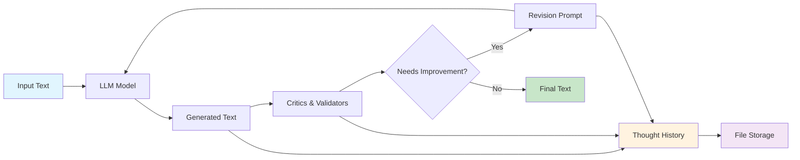

# Sifaka

**Simple AI text improvement through research-backed critique with complete observability**

[](https://python.org)
[](LICENSE)
[](https://github.com/sifaka-ai/sifaka)
[](https://github.com/sifaka-ai/sifaka/actions/workflows/ci.yml)
[](https://github.com/sifaka-ai/sifaka/actions/workflows/ci.yml)
[](https://pypi.org/project/sifaka/)

## What is Sifaka?

Sifaka improves AI-generated text through iterative critique using research-backed techniques. Instead of hoping your AI output is good enough, Sifaka provides a transparent feedback loop where AI systems validate and improve their own outputs.

**Core Value**: See exactly how AI improves your text through research-backed techniques with complete audit trails.

## Quick Start

```bash
pip install sifaka
```

```python
from sifaka import improve_sync

# Simple one-liner
result = improve_sync("Write about renewable energy benefits")
print(result.final_text)

# With options
result = improve_sync(
    "Write about renewable energy benefits",
    critics=["reflexion", "constitutional"],
    max_iterations=3
)
print(f"Improved through {result.iteration} iterations")
```

## Key Features

- **🔬 Research-Backed**: Implements Reflexion, Constitutional AI, and Self-Refine
- **👁️ Complete Observability**: Full audit trail of every improvement
- **🎯 Simple API**: One function does everything you need
- **💾 Memory-Safe**: Bounded history prevents memory leaks
- **⚡ Fast**: Minimal dependencies, maximum performance

## How It Works

1. **Generate**: Create initial text with your preferred model
2. **Validate**: Check output against quality criteria
3. **Critique**: Apply research-backed improvement techniques
4. **Improve**: Iterate until quality standards are met
5. **Observe**: Complete audit trail of the entire process

## 🏗️ Architecture

Sifaka is built around a simple but powerful architecture that prioritizes observability and research-backed methods:



### Core Design Principles

1. **🎯 Simplicity First** - Single function API with sensible defaults
2. **📊 Complete Observability** - Full audit trail of every operation
3. **🔬 Research-Backed** - All critics implement peer-reviewed papers
4. **🛡️ Production Ready** - Memory-bounded, error-resilient
5. **🔌 Extensible** - Plugin architecture for storage and validation

## API Reference

### Main Function

```python
async def improve(
    text: str,
    *,
    critics: Optional[List[str]] = None,
    max_iterations: int = 3,
    validators: Optional[List[Validator]] = None,
    config: Optional[Config] = None,
    storage: Optional[StorageBackend] = None,
) -> SifakaResult:
    """Improve text through iterative critique."""
```

### Result Object

```python
class SifakaResult:
    """Complete result with audit trail."""
    final_text: str
    original_text: str
    iteration: int
    generations: list[Generation]  # Max 10 items
    validations: list[ValidationResult]  # Max 10 items
    critiques: list[CritiqueResult]  # Max 10 items
    processing_time: float
```

## Examples

### Basic Usage
```python
result = await improve("Write about climate change")
```

### With Multiple Critics
```python
result = await improve(
    "Explain quantum computing",
    critics=["reflexion", "constitutional", "self_refine", "n_critics"],
    max_iterations=5
)
```

### With Validators
```python
from sifaka.validators import LengthValidator, ContentValidator

result = await improve(
    "Write a research summary",
    validators=[
        LengthValidator(min_length=200, max_length=1000),
        ContentValidator(required_terms=["methodology", "results"])
    ]
)
```


### With Advanced Critics
```python
# Ensemble critique with multiple perspectives
result = await improve(
    "Write a research proposal",
    critics=["n_critics", "self_rag", "meta_rewarding"],
    max_iterations=4
)

# Self-consistency for reliable assessment
result = await improve(
    "Explain complex topic",
    critics=["self_consistency"],
    max_iterations=3
)

# Custom prompt-based critique
from sifaka.critics import create_academic_critic
result = await improve(
    "Write academic paper introduction",
    critics=["constitutional", "prompt"],  # Uses default PromptCritic
    max_iterations=3
)
```

### With GuardrailsAI (Optional)
```python
# pip install sifaka[guardrails]
from sifaka.validators import GuardrailsValidator

result = await improve(
    "Write a public statement",
    validators=[
        GuardrailsValidator(["toxic-language", "detect-pii"])
    ]
)
```


### With Advanced Configuration
```python
from sifaka import Config

# Configure advanced options
config = Config(
    model="gpt-4o",
    temperature=0.8,
    critic_model="claude-3-5-sonnet-20241022",
    force_improvements=True
)

result = await improve(
    "Write about AI ethics",
    config=config
)
```

## Installation Options

```bash
# Basic installation
pip install sifaka

# With Anthropic models
pip install sifaka[anthropic]

# With Gemini models
pip install sifaka[gemini]

# With GuardrailsAI validation
pip install sifaka[guardrails]

# Everything
pip install sifaka[all]
```

## Environment Setup

Set your API keys:

```bash
export OPENAI_API_KEY=your_key_here
export ANTHROPIC_API_KEY=your_key_here  # Optional
export GOOGLE_API_KEY=your_key_here     # Optional
```

## Research Foundation

Sifaka implements these research papers:

- **[Reflexion](https://arxiv.org/abs/2303.11366)** - Self-reflection for iterative improvement
- **[Constitutional AI](https://arxiv.org/abs/2212.08073)** - Principle-based evaluation
- **[Self-Refine](https://arxiv.org/abs/2303.17651)** - Iterative self-improvement
- **[N-Critics](https://arxiv.org/abs/2310.18679)** - Ensemble of diverse critical perspectives
- **[Self-RAG](https://arxiv.org/abs/2310.11511)** - Retrieval-augmented self-critique
- **[Meta-Rewarding](https://arxiv.org/abs/2407.19594)** - Two-stage judgment with meta-evaluation
- **[Self-Consistency](https://arxiv.org/abs/2203.11171)** - Multiple reasoning paths with consensus
- **Prompt Critic** - Configurable custom evaluation criteria

## Documentation

### User Guides
- **[Quick Start Guide](QUICKSTART.md)** - Get up and running in 5 minutes
- **[API Reference](API.md)** - Complete API documentation with examples
- **[Working Examples](examples/)** - Comprehensive examples for all critics
- **[CHANGELOG](CHANGELOG.md)** - Version history and migration guide

### Architecture & Development
- **[Architecture Overview](docs/architecture.md)** - System design and component relationships
- **[Architecture Decisions](docs/decisions/)** - Key technical decisions and rationale
- **[Plugin Development](docs/plugins.md)** - Guide for creating extensions
- **[Research Papers](README.md#research-foundation)** - Papers implemented by each critic

## Development

```bash
git clone https://github.com/sifaka-ai/sifaka
cd sifaka
pip install -e ".[dev]"
pytest
```

### Development Commands

```bash
# Run tests with coverage
make test

# Format code
make format

# Type checking
make type-check

# Security scan
make security

# All quality checks
make quality
```

## License

MIT License - see [LICENSE](LICENSE) file for details.