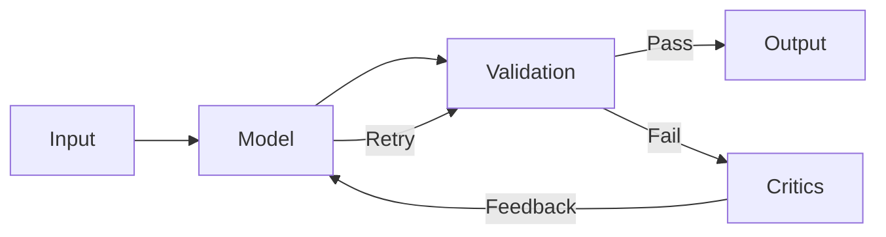
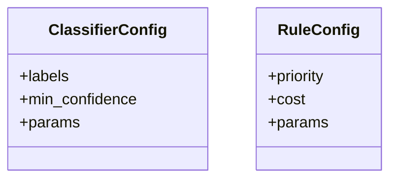

# Sifaka

Sifaka is a framework for improving large language model (LLM) outputs through validation, reflection, and refinement. It helps build more reliable AI systems by enforcing constraints and improving response quality.

[](https://www.python.org/downloads/)
[](https://opensource.org/licenses/MIT)

## Installation

Sifaka can be installed with different sets of dependencies depending on your needs:

### Basic Installation
```bash
pip install sifaka
```

### Installation with Specific Features

```bash
# Install with OpenAI support
pip install "sifaka[openai]"

# Install with Anthropic support
pip install "sifaka[anthropic]"

# Install with all classifiers
pip install "sifaka[classifiers]"

# Install with benchmarking tools
pip install "sifaka[benchmark]"

# Install everything (except development tools)
pip install "sifaka[all]"
```

### Development Installation
```bash
git clone https://github.com/sifaka-ai/sifaka.git
cd sifaka
pip install -e ".[dev]"  # Install with development dependencies
```

## Optional Dependencies

Sifaka's functionality can be extended through optional dependencies:

### Model Providers
- `openai`: OpenAI API support
- `anthropic`: Anthropic Claude API support
- `google-generativeai`: Google Gemini API support

### Classifiers
- `toxicity`: Toxicity detection using Detoxify
- `sentiment`: Sentiment analysis using VADER
- `profanity`: Profanity detection
- `language`: Language detection
- `readability`: Text readability analysis
- `ner`: Named Entity Recognition using spaCy
- and so on

### Integrations
- `guardrails-ai`: Integration with Guardrails AI for advanced validation

### Benchmarking
- `benchmark`: Tools for performance benchmarking and analysis

## Documentation

Sifaka provides comprehensive documentation to help you get started and understand the framework:

### Component Documentation

For detailed documentation on specific components, see the [docs/components](docs/components) directory:

- [Rules](docs/components/rules.md) - Binary pass/fail validation of text
- [Classifiers](docs/components/classifiers.md) - Analysis and categorization of text
- [Critics](docs/components/critics.md) - Feedback and suggestions for improving text
- [Model Providers](docs/components/model_providers.md) - Connection to language models for text generation
- [Chains](docs/components/chains.md) - Orchestration of models, rules, and critics

### API Reference

For detailed API reference documentation, see the [docs/api_reference](docs/api_reference) directory:

- [Rules API](docs/api_reference/rules/README.md) - API reference for rules and validators
- [Classifiers API](docs/api_reference/classifiers/README.md) - API reference for classifiers
- [Critics API](docs/api_reference/critics/README.md) - API reference for critics
- [Models API](docs/api_reference/models/README.md) - API reference for model providers
- [Chain API](docs/api_reference/chain/README.md) - API reference for chains
- [Adapters API](docs/api_reference/adapters/README.md) - API reference for adapters

### Specific Implementations
- [Guardrails Integration](docs/components/guardrails_integration.md) - Integration with Guardrails AI

## Key Features

- ✅ **Validation Rules**: Enforce constraints like length limits and content restrictions
- ✅ **Response Critics**: Provide feedback to improve model outputs
- ✅ **Chain Architecture**: Create feedback loops for iterative improvement
- ✅ **Model Agnostic**: Works with Claude, OpenAI, and other LLM providers
- ✅ **Streamlined Configuration**: Unified configuration system using ClassifierConfig and RuleConfig
- ✅ **Standardized State Management**: Consistent state handling across all components

## Core Concepts

### What is a Chain?

A Chain is the central orchestrator that processes text through a series of steps:
1. Takes input text
2. Sends it to a language model
3. Validates the output
4. Improves it if needed
5. Returns the final result



### Components of a Chain

1. **Model Provider**
   - Connects to LLMs (OpenAI, Claude, etc.)
   - Handles the actual text generation
   - Supports retry mechanisms
   - Implements rate limiting and caching

2. **Rules vs Classifiers**
   - Rules: Binary pass/fail checks
     - Example: "Text must be 100-200 words"
     - Example: "Must not contain profanity"
   - Classifiers: Analyze and categorize text
     - Example: "Is this toxic or safe?"
     - Example: "What language is this written in?"
   - A Classifier can be turned into a Rule:
     ```python
     # Classifier says: "This text is in English (confidence: 0.9)"
     # Rule says: "PASS if classifier says English with >0.7 confidence"
     ```

3. **Critics**
   - Help improve text that fails validation
   - Two types:
     - `PromptCritic`: One-shot improvement
       ```
       Input: "Text too long"
       Output: "Here's how to make it shorter..."
       ```
     - `ReflexionCritic`: Learns from past attempts
       ```
       Attempt 1: "Too informal"
       Attempt 2: "Better but still casual"
       Attempt 3: "Now I understand - needs to be business formal"
       ```

4. **Monitoring**
   - Tracks performance metrics
   - Monitors validation results
   - Logs improvement attempts
   - Provides detailed statistics

### How it Works

1. You create a chain with your components:
   ```python
   from sifaka.chain import create_simple_chain
   from sifaka.models import create_anthropic_provider
   from sifaka.rules import create_length_rule
   from sifaka.rules import create_language_rule
   from sifaka.critics import create_prompt_critic
   import os

   # Create components
   model = create_anthropic_provider(
       model_name="claude-3-opus-20240229",
       api_key=os.environ.get("ANTHROPIC_API_KEY")  # Get API key from environment variable
   )
   rules = [
       create_length_rule(min_chars=10, max_chars=1000),
       create_language_rule(allowed_languages=["en"])
   ]
   critic = create_prompt_critic(
       llm_provider=model,
       system_prompt="You are an expert editor that improves text."
   )

   # Create chain
   chain = create_simple_chain(
       model=model,
       rules=rules,
       critic=critic,
       max_attempts=3
   )
   ```

2. The chain manages the improvement loop:
   ```python
   result = chain.run("Write about AI")
   # 1. Sends to model
   # 2. Checks rules
   # 3. If fails, uses critic to improve
   # 4. Retries with improved prompt
   # 5. Continues until success or max attempts
   # 6. Returns detailed results

   # Access the results
   print(f"Output: {result.output}")
   print(f"All rules passed: {all(r.passed for r in result.rule_results)}")
   if result.critique_details:
       print(f"Critique feedback: {result.critique_details.get('feedback', '')}")
   ```

## Configuration System

Sifaka uses a streamlined configuration system with two main configuration classes:



- `ClassifierConfig`: Manages classifier parameters and thresholds
- `RuleConfig`: Controls rule behavior and execution priority

## Integration with Guardrails

Sifaka provides seamless integration with [Guardrails AI](https://www.guardrailsai.com/), allowing you to:

- Use Guardrails' validation and transformation capabilities
- Leverage Guardrails' extensive rule library
- Combine both systems' strengths for robust content validation

Example integration:
```python
from sifaka.adapters.rules.guardrails_adapter import create_guardrails_rule
from sifaka.chain import create_simple_chain
from sifaka.models import create_openai_provider
import os

# Import the Guardrails validator from the hub
from guardrails.hub import ProfanityFree

# First create a Guardrails validator
profanity_validator = ProfanityFree()

# Create a guardrails rule using the validator
guardrails_rule = create_guardrails_rule(
    guardrails_validator=profanity_validator,
    name="profanity_rule",
    description="Validates text is free of profanity"
)

# Create a chain with the guardrails rule
model = create_openai_provider(
    model_name="gpt-4",
    api_key=os.environ.get("OPENAI_API_KEY")  # Get API key from environment variable
)
chain = create_simple_chain(
    model=model,
    rules=[guardrails_rule],
    max_attempts=3
)

# Run the chain
result = chain.run("Write a short story")
```

## License

Sifaka is licensed under the MIT License. See [LICENSE](LICENSE) for details.
