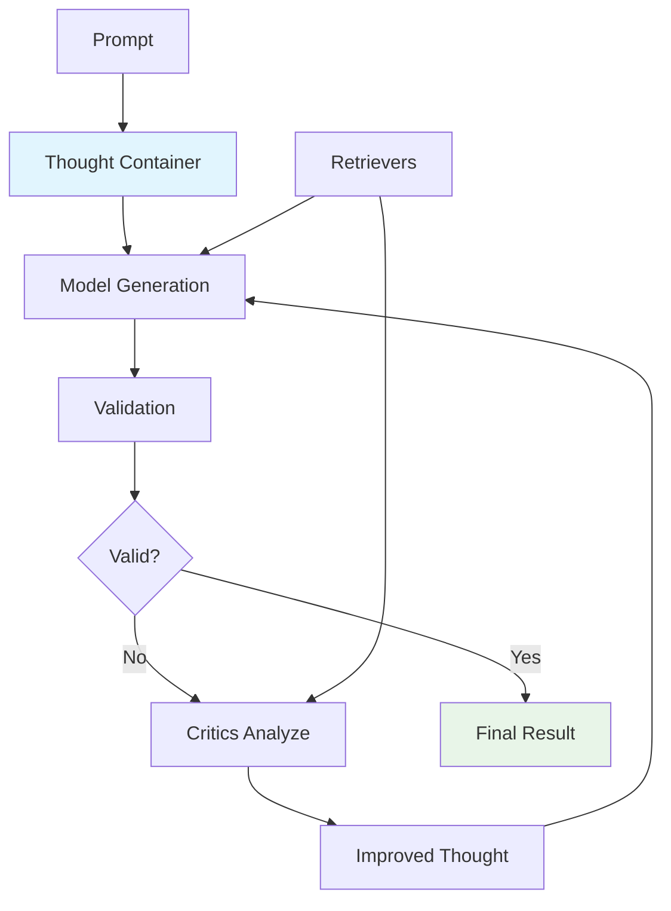

# Sifaka

[](https://github.com/sifaka-ai/sifaka)
[](https://python.org)
[](LICENSE)

A framework for reliable AI text generation with validation, critique, and iterative improvement.

## What is Sifaka?

Sifaka implements a **Thought-centric architecture** where a central state container flows through a chain of AI components. Unlike traditional pipeline approaches, every step of the generation process is tracked, validated, and can be iteratively improved.

**Core Architecture:**
```
Thought → Model → Validators → Critics → Improved Thought
```

The **Thought** container maintains complete state including:
- Original prompt and generated text
- Validation results and critic feedback
- Retrieved context documents
- Complete iteration history
- Exact prompts sent to models

## Key Principles

**Academic Research Integration**: Sifaka implements cutting-edge AI research as production-ready components:
- **Reflexion** (Shinn et al. 2023) - Self-reflection for iterative improvement
- **Self-Refine** (Madaan et al. 2023) - Iterative self-improvement through critique and revision
- **Self-RAG** (Asai et al. 2023) - Retrieval-augmented self-critique
- **Constitutional AI** (Anthropic) - Principle-based text evaluation
- **N-Critics** (Mousavi et al. 2023) - Ensemble of specialized critics

**Validation-First Design**: Built-in validation and iterative improvement as core concepts, not afterthoughts.

**Complete Observability**: Every iteration, validation, and critique is tracked with full audit trails for debugging and analysis.

**MCP Integration**: Uses Model Context Protocol for standardized external service communication and 3-tier storage (Memory → Redis → Milvus).

## How It Works



### The Thought Container

The **Thought** is a Pydantic model that serves as the central state container:

```python
from sifaka.core.thought import Thought

# Create a thought
thought = Thought(
    prompt="Write a story about AI",
    system_prompt="You are a creative writer"
)

# Thoughts are immutable - operations return new instances
updated_thought = thought.set_text("Once upon a time...")
next_iteration = thought.next_iteration()

# Complete audit trail
print(f"Iteration: {thought.iteration}")
print(f"History: {len(thought.history)} previous iterations")
```

### Components

**Models**: Support for OpenAI, Anthropic, HuggingFace, Ollama, and Mock providers
**Validators**: Length, regex, content, format, ML classifiers, GuardrailsAI integration
**Critics**: Reflexion, Self-Refine, Self-RAG, Constitutional AI, N-Critics, custom prompt-based
**Retrievers**: In-memory, Redis-cached, MCP-based with 3-tier storage
**Storage**: Memory, File, Redis, Milvus with unified protocol

## Installation

```bash
# Core installation
pip install sifaka

# With model providers
pip install sifaka[models]

# With retrievers and storage
pip install sifaka[retrievers]

# With ML classifiers
pip install sifaka[classifiers]

# Everything
pip install sifaka[all]
```

## Quick Start

```python
from sifaka import Chain
from sifaka.models import create_model
from sifaka.validators import LengthValidator
from sifaka.critics import ReflexionCritic

# Create components
model = create_model("openai:gpt-4")  # Requires OPENAI_API_KEY
validator = LengthValidator(min_length=50, max_length=500)
critic = ReflexionCritic(model=model)

# Create chain
chain = Chain(
    model=model,
    prompt="Write a short story about a robot learning to help humans.",
    max_improvement_iterations=2
)

# Add validation and improvement
chain.validate_with(validator).improve_with(critic)

# Run and get complete results
thought = chain.run()

print(f"Generated text: {thought.text}")
print(f"Iterations: {thought.iteration}")
print(f"Validation results: {thought.validation_results}")
```

## Advanced Usage

### Working with Critics

```python
from sifaka.critics.constitutional import ConstitutionalCritic
from sifaka.critics.self_rag import SelfRAGCritic

# Constitutional AI with custom principles
constitutional_critic = ConstitutionalCritic(
    model=model,
    principles=[
        "Be helpful and informative",
        "Avoid harmful or offensive content",
        "Provide accurate information"
    ]
)

# Self-RAG with retrieval context
self_rag_critic = SelfRAGCritic(
    model=model,
    retriever=retriever
)

chain.improve_with(constitutional_critic).improve_with(self_rag_critic)
```

### Storage and Persistence

```python
from sifaka.storage import MemoryStorage, FileStorage, CachedStorage

# File persistence
file_storage = FileStorage("./thoughts.json")
chain = Chain(model=model, storage=file_storage)

# Layered storage (Memory → File)
layered_storage = CachedStorage(
    cache=MemoryStorage(),
    persistence=FileStorage("./thoughts.json")
)
```

### MCP Integration

```python
from sifaka.storage import RedisStorage, MilvusStorage
from sifaka.mcp import MCPServerConfig, MCPTransportType

# Redis via MCP (using local server)
redis_config = MCPServerConfig(
    name="redis-server",
    transport_type=MCPTransportType.STDIO,
    url="cd mcp/mcp-redis && python -m main.py"
)
redis_storage = RedisStorage(redis_config)

# Milvus via MCP for vector search (using local server)
milvus_config = MCPServerConfig(
    name="milvus-server",
    transport_type=MCPTransportType.STDIO,
    url="cd mcp/mcp-server-milvus && python -m mcp_server_milvus"
)
milvus_storage = MilvusStorage(milvus_config, collection_name="thoughts")
```

## Environment Setup

Set API keys as environment variables or in a `.env` file:

```bash
# .env file
OPENAI_API_KEY=your_openai_api_key
ANTHROPIC_API_KEY=your_anthropic_api_key
HUGGINGFACE_API_TOKEN=your_hf_token
```

## Storage Backends

Sifaka supports multiple storage backends for different use cases:

- **Memory**: In-memory storage for development and testing
- **File**: JSON file persistence for simple deployments
- **Redis**: High-performance caching via MCP
- **Milvus**: Vector storage for semantic search via MCP

For detailed installation and configuration instructions, see **[Storage Documentation](docs/STORAGE.md)**.

## Documentation

- **[API Reference](docs/API_REFERENCE.md)** - Complete API documentation
- **[Architecture Guide](docs/ARCHITECTURE.md)** - System design and interactions
- **[Storage Guide](docs/STORAGE.md)** - Storage backends and configuration
- **[Examples](examples/)** - Working examples for different providers
- **[Contributing Guide](docs/CONTRIBUTING.md)** - Guidelines for contributors

## Development

```bash
# Install development dependencies
make install-dev

# Format code
make format

# Run tests
make test
```

## License

MIT License - see [LICENSE](LICENSE) file for details.
