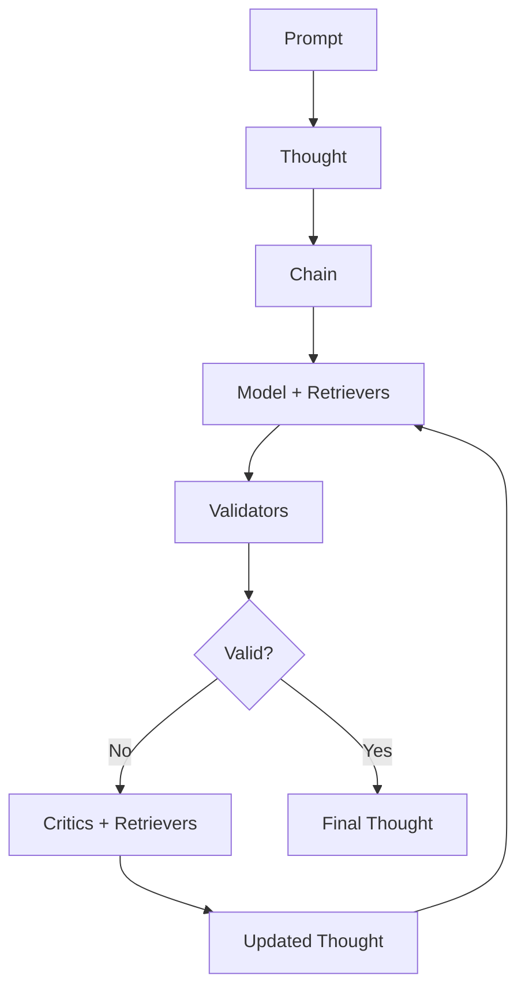

# Sifaka: A Framework for Reliable LLM Applications

[](https://github.com/sifaka-ai/sifaka)
[](https://python.org)
[](LICENSE)

Sifaka is a production-ready framework for building reliable AI text generation chains with validation, critique, error recovery, and performance monitoring.

## 🎯 Core Concept

Sifaka's core concept is the **Chain** that orchestrates:

```
Chain = [Model + Validators + Critics]
```

Where Models and Critics may be augmented by Retrievers for context.

The Chain process:

1. **Generate** text using a language model (with optional retrieval context)
2. **Validate** the generated text against criteria
3. **Improve** the text using critics if validation fails (with optional retrieval context)
4. **Repeat** until validation passes or max iterations reached

## 🏗️ Architecture



**Thoughts** flow through the Chain, carrying state between components.

## 🧩 Key Components

- **🧠 Thought**: Central state container
- **⛓️ Chain**: Main orchestrator
- **🤖 Models**: Text generation (OpenAI, Anthropic, etc.)
- **✅ Validators**: Text quality checks
- **🔍 Critics**: Text improvement suggestions
- **📚 Retrievers**: Document retrieval for context
- **🛡️ Error Recovery**: Automatic failure handling
- **📊 Performance**: Real-time monitoring

### Available Models

```python
from sifaka.models.base import create_model

# OpenAI Models
model = create_model("openai:gpt-4")
model = create_model("openai:gpt-3.5-turbo")

# Anthropic Models
model = create_model("anthropic:claude-3-sonnet")
model = create_model("anthropic:claude-3-haiku")

# HuggingFace Models
model = create_model("huggingface:microsoft/DialoGPT-medium", use_inference_api=True, api_token="your_hf_token")
model = create_model("huggingface:microsoft/DialoGPT-small", use_inference_api=False, device="auto")

# Ollama Models (Local)
model = create_model("ollama:llama3.2:1b")
model = create_model("ollama:mistral")
model = create_model("ollama:codellama")

# Mock Models (Testing)
model = create_model("mock:default")
```

### Available Critics

- **🔄 ReflexionCritic**: Uses reflection to improve text based on past feedback
- **🔍 SelfRefineCritic**: Iteratively refines text through self-critique
- **⚖️ ConstitutionalCritic**: Ensures text adheres to specified principles
- **📝 PromptCritic**: General-purpose critic with customizable instructions
- **🤖 SelfRAGCritic**: Retrieval-augmented generation with self-critique
- **👥 NCriticsCritic**: Ensemble of specialized critics for comprehensive feedback

### Available Validators

- **📏 LengthValidator**: Checks text length constraints
- **🔤 RegexValidator**: Pattern matching and forbidden content detection
- **📊 ContentValidator**: Checks for prohibited content and words
- **📋 FormatValidator**: Validates text format (JSON, Markdown, custom)
- **🤖 ClassifierValidator**: Uses ML classifiers for validation
- **️ GuardrailsValidator**: Integrates GuardrailsAI for PII detection, content safety, and more

### Available Retrievers

- **🧪 MockRetriever**: Returns predefined documents for testing
- **💭 InMemoryRetriever**: Simple keyword-based retrieval from in-memory documents
- **🔄 CachedRetriever**: Wraps any retriever with 3-tier caching (Memory → Redis → Milvus)
- **🛡️ ResilientRetriever**: Adds error recovery with circuit breakers and fallbacks

## Installation

### Quick Start
```bash
pip install sifaka[models,retrievers,classifiers]
```

### Modular Installation
Sifaka uses a modular dependency system. Install only what you need:

```bash
# Core installation
pip install sifaka

# With OpenAI models
pip install sifaka[openai]

# With all model providers
pip install sifaka[models]

# With retrievers and vector databases
pip install sifaka[retrievers]

# With ML classifiers
pip install sifaka[classifiers]

# Everything for production
pip install sifaka[all]

# Development installation
pip install sifaka[full]
```

See [INSTALLATION.md](INSTALLATION.md) for detailed installation options.

## Environment Setup

Sifaka requires API keys for the language models you want to use. You can set these as environment variables in your shell or use a `.env` file.

1. Copy the `.env.example` file to `.env`:
   ```bash
   cp .env.example .env
   ```

2. Edit the `.env` file with your API keys:
   ```
   OPENAI_API_KEY=your_openai_api_key_here
   ```

The examples will automatically load these environment variables using `python-dotenv`.

## Quick Start

```python
from sifaka.core.chain import Chain
from sifaka.models.base import create_model
from sifaka.validators.base import LengthValidator, RegexValidator
from sifaka.critics.reflexion import ReflexionCritic
from sifaka.retrievers import MockRetriever

# Create a model (using mock for this example)
model = create_model("mock:example-model")

# Create validators
length_validator = LengthValidator(min_length=50, max_length=1000)
content_validator = RegexValidator(
    required_patterns=[r"robot|AI"],
    forbidden_patterns=[r"violent|harmful"]
)

# Create a critic
critic = ReflexionCritic(model_name="mock:critic-model")

# Create a retriever with relevant documents
retriever = MockRetriever(
    documents=[
        "Robots are machines that can be programmed to perform tasks.",
        "Artificial Intelligence enables machines to learn and adapt.",
        "The future of robotics includes autonomous systems and smart assistants."
    ]
)

# Create and configure the chain
chain = Chain(
    model=model,
    prompt="Write a short story about a robot learning to help humans.",
    model_retrievers=[retriever],  # Context for the model
    max_improvement_iterations=2,
    apply_improvers_on_validation_failure=True,
)

# Add validators and critics using the fluent API
chain.validate_with(length_validator).validate_with(content_validator).improve_with(critic)

# Run the chain - returns a Thought object
thought = chain.run()

# Extract all information from the thought
print(f"Generated text: {thought.text}")
print(f"Iteration: {thought.iteration}")
print(f"Thought ID: {thought.id}")
print(f"Chain ID: {thought.chain_id}")

# Access validation results
if thought.validation_results:
    for name, validation_result in thought.validation_results.items():
        status = "✅ Passed" if validation_result.passed else "❌ Failed"
        print(f"{name}: {status}")
        if validation_result.message:
            print(f"  Message: {validation_result.message}")

# Access critic feedback
if thought.critic_feedback:
    for feedback in thought.critic_feedback:
        print(f"Critic {feedback.critic_name}: {feedback.feedback}")

# Access retrieved context
if thought.pre_generation_context:
    print("Pre-generation context:")
    for doc in thought.pre_generation_context:
        print(f"- {doc.text} (score: {doc.score})")

# Access the complete history
if thought.history:
    print(f"Total iterations in history: {len(thought.history)}")
    for ref in thought.history:
        print(f"- Iteration {ref.iteration}: {ref.summary}")

# The thought is a complete Pydantic model - you can serialize it
thought_json = thought.model_dump_json()
print(f"Serialized thought: {thought_json[:100]}...")
```

## Working with the Thought Container

The Thought container is the central state container in Sifaka. It passes information between all components and maintains the history of iterations.

```python
from sifaka.core.thought import Thought, Document, CriticFeedback, ValidationResult
from datetime import datetime

# Create a basic thought
thought = Thought(
    prompt="Write a short story about a robot.",
    system_prompt="You are a creative writer."
)

# Add pre-generation context
thought = thought.add_pre_generation_context([
    Document(
        text="Robots are machines that can be programmed to perform tasks.",
        metadata={"source": "definition"},
        score=0.95
    ),
    Document(
        text="Asimov's Three Laws of Robotics are rules for robots in his science fiction.",
        metadata={"source": "literature"},
        score=0.85
    )
])

# Set generated text
thought = thought.set_text("Once upon a time, there was a robot named R2D2...")

# Add validation results
thought = thought.add_validation_result(
    "LengthValidator",
    ValidationResult(
        passed=True,
        message="Text meets length requirements",
        score=1.0
    )
)

# Add critic feedback
thought = thought.add_critic_feedback(
    CriticFeedback(
        critic_name="ReflexionCritic",
        violations=["The story lacks character development"],
        suggestions=["Add more details about the robot's personality"]
    )
)

# Create the next iteration
next_thought = thought.next_iteration()
print(f"Current iteration: {thought.iteration}")
print(f"Next iteration: {next_thought.iteration}")
print(f"History count: {len(next_thought.history)}")
```

## Working with Retrievers

Retrievers find relevant documents for a query. The Chain orchestrates all retrieval automatically - you just provide the retriever to the Chain and it handles everything:

```python
from sifaka.core.thought import Thought
from sifaka.retrievers.base import InMemoryRetriever
from sifaka.models.base import create_model
from sifaka.critics.base import ReflexionCritic
from sifaka.chain import Chain

# Create a retriever
retriever = InMemoryRetriever()

# Add documents to the retriever
retriever.add_document("doc1", "Robots are machines that can be programmed to perform tasks.")
retriever.add_document("doc2", "Asimov's Three Laws of Robotics are rules for robots in his science fiction.")
retriever.add_document("doc3", "Machine learning allows robots to learn from data and improve over time.")

# Create a model and critic (no retriever needed - Chain handles it)
model = create_model("mock:default")
critic = ReflexionCritic(model=model)

# Create a Chain with the retriever - it orchestrates ALL retrieval
chain = Chain(
    model=model,
    prompt="Write a short story about a robot that learns.",
    retriever=retriever,  # Chain handles all retrieval automatically
    pre_generation_retrieval=True,   # Retrieve before generation
    post_generation_retrieval=True,  # Retrieve after generation
    critic_retrieval=True,           # Retrieve for critics
)

chain.improve_with(critic)

# Run the chain - it handles all retrieval automatically:
# 1. Pre-generation retrieval: Gets context before text generation
# 2. Text generation: Model uses the retrieved context
# 3. Post-generation retrieval: Gets context after text generation
# 4. Critic retrieval: Gets fresh context for critics during improvement
result = chain.run()

# Print the retrieved context
print("Pre-generation context:")
for doc in result.pre_generation_context:
    print(f"- {doc.text} (score: {doc.score})")

print("\nPost-generation context:")
for doc in result.post_generation_context:
    print(f"- {doc.text} (score: {doc.score})")
```

### Available Retrievers

Sifaka provides several retriever implementations:

- **MockRetriever**: Returns predefined documents for testing
- **InMemoryRetriever**: Simple keyword-based retrieval from in-memory documents
- **RedisRetriever**: Redis-based caching retriever that can wrap other retrievers for performance

### Redis Caching for Performance

The RedisRetriever provides powerful caching capabilities to improve performance:

```python
from sifaka.retrievers.redis import RedisRetriever, create_redis_retriever
from sifaka.retrievers.base import InMemoryRetriever

# Create a base retriever
base_retriever = InMemoryRetriever()
base_retriever.add_document("doc1", "Python is excellent for AI development.")
base_retriever.add_document("doc2", "Machine learning frameworks like TensorFlow use Python.")

# Wrap with Redis caching (recommended approach)
cached_retriever = RedisRetriever(
    base_retriever=base_retriever,
    redis_host="localhost",  # Default
    redis_port=6379,         # Default
    cache_ttl=300,           # 5 minutes cache
)

# Use in chain for automatic caching
chain = Chain(
    model=model,
    prompt="Explain Python's role in AI development.",
    retriever=cached_retriever,  # Automatic caching for all retrievals
)

# First run: cache miss, retrieves from base_retriever and caches
result1 = chain.run()

# Second run: cache hit, much faster retrieval
result2 = chain.run()

# Check cache statistics
stats = cached_retriever.get_cache_stats()
print(f"Cached queries: {stats['cached_queries']}")
```

You can also use RedisRetriever as a standalone document store:

```python
# Standalone Redis document store
redis_store = RedisRetriever(cache_ttl=3600)  # 1 hour cache

# Add documents directly
redis_store.add_document("ai_doc", "Artificial intelligence is transforming technology.")
redis_store.add_document("ml_doc", "Machine learning enables computers to learn from data.")

# Retrieve documents
results = redis_store.retrieve("artificial intelligence machine learning")
print(f"Found {len(results)} relevant documents")
```

## Working with Critics

Critics analyze text, identify issues, and provide suggestions for improvement. The Chain orchestrates retrieval for critics automatically:

```python
from sifaka.core.thought import Thought
from sifaka.critics.base import ReflexionCritic
from sifaka.models.base import create_model
from sifaka.retrievers.base import InMemoryRetriever
from sifaka.chain import Chain

# Create a retriever
retriever = InMemoryRetriever()
retriever.add_document("doc1", "Quantum computing uses quantum bits or qubits.")
retriever.add_document("doc2", "Superposition allows qubits to exist in multiple states simultaneously.")
retriever.add_document("doc3", "Quantum entanglement connects qubits in ways that classical bits cannot be connected.")

# Create a model and critic (no retriever needed - Chain handles it)
model = create_model("mock:default")
critic = ReflexionCritic(model=model)

# Create a Chain that orchestrates retrieval for critics
chain = Chain(
    model=model,
    prompt="Explain quantum computing to a high school student.",
    retriever=retriever,  # Chain handles all retrieval for critics
    critic_retrieval=True,  # Enable retrieval for critics
)

chain.improve_with(critic)

# Run the chain - it automatically:
# 1. Generates initial text
# 2. Retrieves context for critics
# 3. Critics use the retrieved context to provide better feedback
result = chain.run()

# Print the final result
print(f"Final text: {result.text}")
print(f"Validation results: {result.validation_results}")
print(f"Retrieved context documents: {len(result.post_generation_context)}")
```

## Redis & 3-Tier Storage Setup

Sifaka uses a unified 3-tier storage architecture: **Memory → Redis → Milvus** for optimal performance.

### Setting up Redis

1. **Start Redis with Docker**:
   ```bash
   docker run -d -p 6379:6379 redis:latest
   ```

2. **Install Redis MCP Server**:
   ```bash
   npm install -g @modelcontextprotocol/server-redis
   ```

3. **Install Milvus MCP Server**:
   ```bash
   npm install -g @milvus-io/mcp-server-milvus
   ```

### Using 3-Tier Storage

```python
from sifaka.storage import SifakaStorage
from sifaka.mcp import MCPServerConfig, MCPTransportType
from sifaka.retrievers import InMemoryRetriever

# Configure storage backends
redis_config = MCPServerConfig(
    name="redis-server",
    transport_type=MCPTransportType.STDIO,
    url="npx -y @modelcontextprotocol/server-redis redis://localhost:6379"
)

milvus_config = MCPServerConfig(
    name="milvus-server",
    transport_type=MCPTransportType.STDIO,
    url="npx -y @milvus-io/mcp-server-milvus"
)

# Create unified storage manager
storage = SifakaStorage(
    redis_config=redis_config,
    milvus_config=milvus_config,
    memory_size=100,  # L1 cache size
    cache_ttl=300     # L2 cache TTL (5 minutes)
)

# Wrap any retriever with 3-tier caching
base_retriever = InMemoryRetriever()
cached_retriever = storage.get_retriever_cache(base_retriever)

# Use in chain - automatic L1 → L2 → L3 caching
chain = Chain(
    model=model,
    prompt="Your prompt here",
    retrievers=[cached_retriever]
)
```

### Using Different Retrievers for Models vs Critics

The Chain supports separate retrievers for models and critics, enabling powerful use cases like fact-checking:

```python
# Example: Different retrievers for models vs critics
from sifaka.chain import Chain
from sifaka.retrievers import MockRetriever

# Create specialized retrievers
recent_retriever = MockRetriever(documents=[
    "Latest AI news from Twitter",
    "Recent developments in machine learning"
])

factual_retriever = MockRetriever(documents=[
    "Scientific papers on AI safety",
    "Authoritative sources on machine learning"
])

# Use different retrievers for different purposes
chain = Chain(
    model=model,
    prompt="Write about recent AI developments",
    model_retrievers=[recent_retriever],    # Model gets recent context
    critic_retrievers=[factual_retriever]   # Critics get authoritative context
)

# Or using fluent API
chain = Chain(model=model, prompt="Write about AI") \
    .with_model_retrievers([recent_retriever]) \
    .with_critic_retrievers([factual_retriever]) \
    .validate_with(validator) \
    .improve_with(critic)

# The Chain calls:
# - model_retrievers for pre-generation context (before model)
# - critic_retrievers for post-generation context (for critics)
```

## Error Recovery

Sifaka provides robust error recovery mechanisms to handle failures gracefully:

```python
from sifaka.models.resilient import ResilientModel
from sifaka.retrievers.resilient import ResilientRetriever
from sifaka.utils.circuit_breaker import CircuitBreakerConfig
from sifaka.utils.retry import RetryConfig
from sifaka.utils.fallback import FallbackConfig

# Create resilient model with fallbacks
primary_model = create_model("openai:gpt-4", api_key=api_key)
fallback_model = create_model("anthropic:claude-3-sonnet", api_key=anthropic_key)

resilient_model = ResilientModel(
    primary_model=primary_model,
    fallback_models=[fallback_model],
    circuit_breaker_config=CircuitBreakerConfig(failure_threshold=3),
    retry_config=RetryConfig(max_attempts=3, backoff_factor=2.0),
    fallback_config=FallbackConfig(max_fallbacks=2)
)

# Use resilient model in chain - automatic error recovery
chain = Chain(model=resilient_model, prompt="Write about AI safety.")
result = chain.run()  # Automatically handles failures with retries and fallbacks
```

## Persistence

Sifaka provides built-in persistence for thoughts and chain state using the unified storage system:

```python
from sifaka.core.thought import Thought
from sifaka.storage import SifakaStorage

# Create storage manager (same as above)
storage = SifakaStorage(redis_config=redis_config, milvus_config=milvus_config)

# Get thought storage
thought_storage = storage.get_thought_storage()

# Save a thought
thought = Thought(prompt="Write about AI", text="AI is transforming...")
thought_storage.save_thought(thought)

# Load thoughts with vector search
similar_thoughts = thought_storage.search_thoughts("artificial intelligence", limit=5)
print(f"Found {len(similar_thoughts)} similar thoughts")

# Load specific thought
loaded_thought = thought_storage.load_thought(thought.id)
print(f"Loaded thought prompt: {loaded_thought.prompt}")
```

The unified storage system provides:
- **Memory caching**: Fastest access for recent thoughts
- **Redis caching**: Cross-process shared cache with TTL
- **Milvus persistence**: Vector search and long-term storage

### Simple JSON Persistence

For basic use cases, you can also use simple JSON serialization:

```python
from sifaka.core.thought import Thought
import json

# Create a thought
thought = Thought(prompt="Write a short story about a robot.")

# Serialize to JSON
thought_json = thought.model_dump_json()

# Save to file
with open("thought.json", "w") as f:
    f.write(thought_json)

# Load from JSON
with open("thought.json", "r") as f:
    loaded_json = f.read()
    loaded_thought = Thought.model_validate_json(loaded_json)

print(f"Loaded thought prompt: {loaded_thought.prompt}")
```

## Documentation


## Development

### Code Formatting

Sifaka uses automated code formatting to maintain consistent code style. We use the following tools:

- **Black**: Code formatting
- **isort**: Import sorting
- **autoflake**: Removing unused imports
- **Ruff**: Linting with automatic fixes
- **mypy**: Type checking

To set up the development environment:

```bash
# Install development dependencies
make install-dev

# Format code
make format

# Run linting checks
make lint

# Run tests
make test
```

The CI pipeline will automatically format code in pull requests, so you don't need to worry about formatting issues.

## Contributing

Contributions are welcome! Please feel free to submit a Pull Request. See [CONTRIBUTING.md](docs/CONTRIBUTING.md) for guidelines.

## License

[MIT License](LICENSE)
