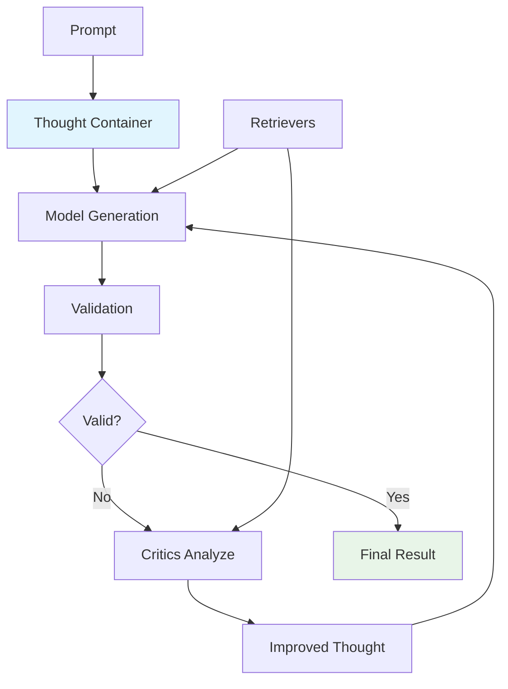

# Sifaka

[](https://github.com/sifaka-ai/sifaka)
[](https://python.org)
[](LICENSE)

An open-source framework that adds reflection and reliability to large language model (LLM) applications.

## What is Sifaka?

Sifaka is a tool for adding reflection and reliability to large language model (LLM) applications. It implements research-backed techniques for validating, critiquing, and iteratively improving AI-generated text through a transparent, observable process.

**Core Architecture:**
```
Thought → Model → Validators → Critics → Improved Thought
```

Sifaka implements a **Thought-centric architecture** where a central state container flows through a chain of AI components. Unlike traditional pipeline approaches, every step of the generation process is tracked, validated, and can be iteratively improved.

The **Thought** container maintains complete state including:
- Original prompt and generated text
- Validation results and critic feedback
- Retrieved context documents
- Complete iteration history
- Exact prompts sent to models

## Key Principles

**Academic Research Integration**: Sifaka implements cutting-edge AI research as production-ready components:
- **Reflexion** (Shinn et al. 2023) - Self-reflection for iterative improvement
- **Self-Refine** (Madaan et al. 2023) - Iterative self-improvement through critique and revision
- **Self-RAG** (Asai et al. 2023) - Retrieval-augmented self-critique
- **Constitutional AI** (Anthropic) - Principle-based text evaluation
- **Meta-Rewarding** (Wu et al. 2024) - Two-stage judgment with meta-evaluation
- **Self-Consistency** (Wang et al. 2022) - Multiple critique generation with consensus
- **N-Critics** (Mousavi et al. 2023) - Ensemble of specialized critics

**Validation-First Design**: Built-in validation and iterative improvement as core concepts, not afterthoughts.

**Complete Observability**: Every iteration, validation, and critique is tracked with full audit trails for debugging and analysis.

**MCP Integration**: Uses Model Context Protocol for standardized external service communication and 3-tier storage (Memory → Redis → Milvus).

## How It Works



### The Thought Container

The **Thought** is a Pydantic model that serves as the central state container:

```python
from sifaka.core.thought import Thought

# Create a thought
thought = Thought(
    prompt="Write a story about AI",
    system_prompt="You are a creative writer"
)

# Thoughts are immutable - operations return new instances
updated_thought = thought.set_text("Once upon a time...")
next_iteration = thought.next_iteration()

# Complete audit trail
print(f"Iteration: {thought.iteration}")
print(f"History: {len(thought.history or [])} previous iterations")
print(f"Next iteration: {next_iteration.iteration}")
print(f"Next iteration history: {len(next_iteration.history or [])} previous iterations")
```

### Components

- **Models**: Support for OpenAI, Anthropic, Google Gemini, HuggingFace, Ollama, and Mock providers
- **Validators**: Length, regex, content, format, ML classifiers, GuardrailsAI integration
- **Classifiers**: Bias, Language, Profanity, Sentiment, Spam, Toxicity detection with ML and rule-based fallbacks
- **Critics**: Reflexion, Self-Refine, Self-RAG, Constitutional AI, Meta-Rewarding, Self-Consistency, N-Critics, custom prompt-based
- **Retrievers**: In-memory, Redis-cached, MCP-based with 3-tier storage
- **Storage**: Memory, File, Redis, Milvus with unified protocol

## Installation

```bash
# Core installation
pip install sifaka

# With model providers
pip install sifaka[models]

# With retrievers and storage
pip install sifaka[retrievers]

# With ML classifiers
pip install sifaka[classifiers]

# Everything
pip install sifaka[all]
```

## Quick Start

### Simple Setup (Recommended)

```python
from sifaka.quickstart import QuickStart

# One-liner setup for common use cases
chain = QuickStart.for_production(
    "openai:gpt-4",  # Requires OPENAI_API_KEY
    # "gemini:gemini-1.5-flash",  # Or use Gemini (requires GOOGLE_API_KEY)
    "Write a short story about a robot learning to help humans.",
    storage="memory",  # Use memory storage (or configure Redis/Milvus paths)
    validators=["length"],
    critics=["reflexion", "self_consistency"]
)

# Run the chain
thought = chain.run()
print(f"Generated text: {thought.text}")
```

### More Examples

```python
# Development setup (fast, uses mock model)
dev_chain = QuickStart.for_development()

# Research setup (comprehensive, with retrievers)
research_chain = QuickStart.for_research(
    "anthropic:claude-3-5-sonnet-latest",  # Requires ANTHROPIC_API_KEY
    "Analyze the impact of AI on scientific research",
    storage="memory"  # Use memory storage (or configure Redis/Milvus paths)
)

# Preset-based configuration
content_chain = QuickStart.from_preset(
    "content_generation",
    "openai:gpt-4",  # Requires OPENAI_API_KEY
    "Write a blog post about sustainable energy"
)
```

### Manual Setup (Advanced)

```python
from sifaka import Chain
from sifaka.models import create_model
from sifaka.validators import LengthValidator
from sifaka.critics import ReflexionCritic

# Create components
model = create_model("openai:gpt-4")  # Requires OPENAI_API_KEY
validator = LengthValidator(min_length=50, max_length=500)
critic = ReflexionCritic(model=model)

# Create chain
chain = Chain(
    model=model,
    prompt="Write a short story about a robot learning to help humans.",
    max_improvement_iterations=2
)

# Add validation and improvement
chain = chain.validate_with(validator).improve_with(critic)

# Run and get complete results
thought = chain.run()

print(f"Generated text: {thought.text}")
print(f"Iterations: {thought.iteration}")
print(f"Validation results: {thought.validation_results}")
```

## Advanced Usage

### Feedback Summarization

Sifaka supports automatic summarization of validation results and critic feedback to improve the quality and conciseness of improvement prompts. This feature uses configurable local or API-based models to create focused summaries.

```python
from sifaka.critics import FeedbackSummarizer, SelfRefineCritic
from sifaka.models import create_model
from sifaka import Chain

# Create a model and critic
model = create_model("openai:gpt-4")  # Requires OPENAI_API_KEY

# Create a summarizer with T5 (default local model)
summarizer = FeedbackSummarizer()

# Or use API-based summarization
api_summarizer = FeedbackSummarizer(
    model_type="api",
    api_model="openai:gpt-3.5-turbo",
    max_length=100
)

# Integrate with critics for enhanced feedback processing
class SummarizingSelfRefineCritic(SelfRefineCritic):
    def __init__(self, model, **kwargs):
        super().__init__(model=model, **kwargs)
        self.feedback_summarizer = FeedbackSummarizer(
            model_name="t5-small",
            max_length=120
        )

    def improve(self, thought):
        # Get summarized feedback for more focused improvements
        summary = self.feedback_summarizer.summarize_thought_feedback(thought)
        # Use summary in improvement prompt...

# Use standalone for analysis
summary = summarizer.summarize_thought_feedback(thought)
print(f"Feedback Summary: {summary}")
```

**Key Features:**
- **Multiple Models**: T5, BART, Pegasus, and API-based models (OpenAI, Anthropic)
- **Configurable**: Custom prompts, length limits, and model parameters
- **Selective**: Summarize validation results, critic feedback, or both
- **Robust**: Fallback mechanisms and caching for reliability

For detailed configuration and examples, see the **[Feedback Summarizer Guide](docs/feedback-summarizer.md)**.

### Working with Critics

```python
from sifaka.critics.constitutional import ConstitutionalCritic
from sifaka.critics.self_refine import SelfRefineCritic
from sifaka.models import create_model
from sifaka.storage import FileStorage
from sifaka.retrievers import InMemoryRetriever
from sifaka import Chain

# Create a model for the critics
model = create_model("openai:gpt-4")  # Requires OPENAI_API_KEY

# Chain-level retrievers (fallback for all critics)
chain_retriever = InMemoryRetriever()

# Constitutional AI with custom principles
constitutional_critic = ConstitutionalCritic(
    model=model,
    principles=[
        "Be helpful and informative",
        "Avoid harmful or offensive content",
        "Provide accurate information"
    ]
)

# Self-Refine critic for iterative improvement
self_refine_critic = SelfRefineCritic(model=model)

# Create a chain with retriever
chain = Chain(
    model=model,
    prompt="Write a comprehensive analysis of the benefits and risks of artificial intelligence in healthcare, including specific examples and recommendations.",
    critic_retrievers=[chain_retriever],  # Chain-level retriever (fallback for all critics)
    storage=FileStorage("./thoughts.json"),  # Persistent storage
    max_improvement_iterations=2,
    always_apply_critics=True  # Ensures critics always run, even if validation passes
)

# Add critics - IMPORTANT: This creates a NEW chain instance with critics
chain = chain.improve_with(constitutional_critic).improve_with(self_refine_critic)

# Run the chain and get results
result = chain.run()

# Inspect the results
print(f"Final iteration: {result.iteration}")
print(f"History length: {len(result.history or [])}")
print(f"Critic feedback count: {len(result.critic_feedback or [])}")

# The thoughts.json file will contain:
# - Complete critic feedback for each iteration
# - Proper history chains showing iteration progression
# - Context propagation with previous feedback passed to next iteration
```

### Working with Classifiers

```python
from sifaka.classifiers import (
    ToxicityClassifier, SentimentClassifier, BiasClassifier,
    create_toxicity_validator, create_sentiment_validator
)
from sifaka.validators.classifier import create_classifier_validator
from sifaka import Chain

# Use classifiers standalone for analysis
toxicity_classifier = ToxicityClassifier()
result = toxicity_classifier.classify("This is a sample text.")
print(f"Toxicity: {result.label} (confidence: {result.confidence:.2f})")

sentiment_classifier = SentimentClassifier()
result = sentiment_classifier.classify("I love this framework!")
print(f"Sentiment: {result.label} (confidence: {result.confidence:.2f})")

# Create validators from classifiers
toxicity_validator = create_toxicity_validator(threshold=0.8)
sentiment_validator = create_sentiment_validator(required_sentiment="positive", min_confidence=0.7)

# Use with chains for content filtering
chain = Chain(model=model, prompt="Write a positive review of a new smartphone, highlighting its camera quality and battery life")
chain = chain.validate_with(toxicity_validator).validate_with(sentiment_validator)

# Custom classifier integration
bias_classifier = BiasClassifier()
custom_validator = create_classifier_validator(
    bias_classifier,
    threshold=0.6,
    invalid_labels=["biased"]  # Reject text classified as biased
)
chain = chain.validate_with(custom_validator)
```

### Storage and Persistence

```python
from sifaka.storage import MemoryStorage, FileStorage, CachedStorage
from sifaka import Chain
from sifaka.models import create_model

# Create a model for the chain
model = create_model("openai:gpt-4")  # Requires OPENAI_API_KEY

# File persistence
file_storage = FileStorage("./thoughts.json")
chain = Chain(model=model, storage=file_storage)

# Layered storage (Memory → File)
layered_storage = CachedStorage(
    cache=MemoryStorage(),
    persistence=FileStorage("./thoughts.json")
)
```

### MCP Integration

```python
from sifaka.quickstart import QuickStart

# Using Redis storage with custom MCP server path
chain = QuickStart.with_redis(
    "openai:gpt-4",
    prompt="Your prompt here",
    mcp_redis_command="uv run --directory /path/to/mcp-redis src/main.py"
)

# Using Milvus storage with custom MCP server path
chain = QuickStart.with_milvus(
    "openai:gpt-4",
    prompt="Your prompt here",
    mcp_milvus_command="uv run --directory /path/to/mcp-server-milvus src/mcp_server_milvus/server.py --milvus-uri http://localhost:19530"
)

# Production setup with file storage (saves thoughts to disk)
from sifaka.validators.base import LengthValidator
from sifaka.critics.reflexion import ReflexionCritic
from sifaka.models import create_model
from sifaka.storage import FileStorage
from sifaka import Chain

# Create components
model = create_model("openai:gpt-4")  # Requires OPENAI_API_KEY
file_storage = FileStorage("./thoughts.json")

# Create chain with file storage and always apply critics
chain = Chain(
    model=model,
    storage=file_storage,
    prompt="Write a comprehensive analysis of renewable energy trends in 2024, including solar, wind, and battery storage technologies",
    max_improvement_iterations=3,
    always_apply_critics=True  # Ensures critics always run, even if validation passes
)

# Add validators and critics
length_validator = LengthValidator(min_length=50, max_length=2000)
reflexion_critic = ReflexionCritic(model=model)

chain = chain.validate_with(length_validator).improve_with(reflexion_critic)
```

## MCP Server Setup

To use Redis and Milvus storage, you need to set up the official MCP servers:

### Redis MCP Server

```bash
# Clone the official Redis MCP server
git clone https://github.com/redis/mcp-redis.git
cd mcp-redis

# Install dependencies
uv sync

# Start Redis (if not already running)
docker run -d -p 6379:6379 redis:latest

# Test the MCP server
uv run src/main.py
```

### Milvus MCP Server

```bash
# Clone the official Milvus MCP server
git clone https://github.com/zilliztech/mcp-server-milvus.git
cd mcp-server-milvus

# Install dependencies
uv sync

# Start Milvus (if not already running)
docker run -d -p 19530:19530 milvusdb/milvus:latest

# Test the MCP server
uv run src/mcp_server_milvus/server.py --milvus-uri http://localhost:19530
```

For detailed setup instructions, see the [Storage Setup Guide](docs/guides/storage-setup.md).

## Environment Setup

Set API keys as environment variables or in a `.env` file:

```bash
# .env file
OPENAI_API_KEY=your_openai_api_key
ANTHROPIC_API_KEY=your_anthropic_api_key
GOOGLE_API_KEY=your_google_api_key
HUGGINGFACE_API_TOKEN=your_hf_token
```

## Storage Backends

Sifaka supports multiple storage backends for different use cases:

- **Memory**: In-memory storage for development and testing
- **File**: JSON file persistence for simple deployments
- **Redis**: High-performance caching via MCP
- **Milvus**: Vector storage for semantic search via MCP

For detailed installation and configuration instructions, see **[Storage Setup Guide](docs/guides/storage-setup.md)**.

## Documentation

### Getting Started
- **[Installation Guide](docs/getting-started/installation.md)** - Complete installation instructions
- **[First Chain](docs/getting-started/first-chain.md)** - Your first Sifaka chain
- **[Basic Concepts](docs/getting-started/basic-concepts.md)** - Core concepts and terminology

### User Guides
- **[Custom Models](docs/guides/custom-models.md)** - Creating and using custom models
- **[Custom Validators](docs/guides/custom-validators.md)** - Building custom validation logic
- **[Classifiers](docs/guides/classifiers.md)** - Using built-in text classifiers for content analysis
- **[Feedback Summarizer](docs/feedback-summarizer.md)** - Automatic summarization of critic and validation feedback
- **[Storage Setup](docs/guides/storage-setup.md)** - Storage backends and configuration
- **[Configuration](docs/guides/configuration.md)** - Advanced configuration options
- **[Performance Tuning](docs/guides/performance-tuning.md)** - Optimization and performance tips

### Troubleshooting
- **[Common Issues](docs/troubleshooting/common-issues.md)** - Solutions to frequent problems
- **[Import Problems](docs/troubleshooting/import-problems.md)** - Resolving import and dependency issues
- **[Configuration Errors](docs/troubleshooting/configuration-errors.md)** - Fixing configuration problems

### Reference
- **[API Reference](docs/api/api-reference.md)** - Complete API documentation
- **[Architecture](docs/architecture.md)** - System design and interactions
- **[Examples](examples/)** - Working examples for different providers
- **[Critics](docs/critics.md)** - Critics and their use cases

### Guidelines
- **[Contributing](docs/guidelines/contributing.md)** - Guidelines for contributors
- **[Import Standards](docs/guidelines/import-standards.md)** - Import conventions and best practices
- **[Async/Sync Guidelines](docs/guidelines/async-sync-guidelines.md)** - Async and sync patterns
- **[Docstring Standards](docs/guidelines/docstring-standards.md)** - Documentation standards

## Development

```bash
# Install development dependencies
make install-dev

# Format code
make format

# Run tests
make test
```

## License

MIT License - see [LICENSE](LICENSE) file for details.
