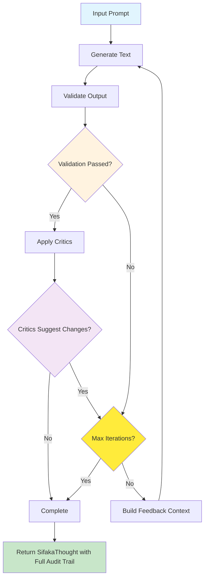

# Sifaka

[](https://python.org)
[](LICENSE)
[](https://github.com/sifaka-ai/sifaka)

## What is Sifaka?

Sifaka implements cutting-edge AI research papers as working code. Instead of just generating text and hoping it's good, Sifaka creates a feedback loop where AI systems validate, critique, and iteratively improve their own outputs until they meet your quality standards.

**The Problem**: Most AI text generation is a black box - you send a prompt, get back text, and hope it's good enough. No validation, no improvement, no guarantees.

**Sifaka's Solution**: A transparent, observable pipeline where every generation goes through validation and improvement cycles, implementing techniques from papers like Reflexion, Constitutional AI, and Self-RAG.

**Key Innovations**:
- **Research-to-Code**: Direct implementations of 7+ major AI research papers
- **Guaranteed Quality**: Validation-first design ensures outputs meet your criteria
- **Complete Observability**: Full audit trails of every decision, iteration, and improvement
- **Iterative Improvement**: AI systems that get better at their tasks through self-critique
- **Built on PydanticAI**: Type safety, structured output, and async support (both projects are in active development)

## Installation

```bash
# Core installation
pip install sifaka

# With model providers
pip install sifaka[models]

# With everything
pip install sifaka[all]
```

## Quick Start

```python
import asyncio
from sifaka import SifakaEngine
from sifaka.validators import LengthValidator
from sifaka.critics import ReflexionCritic
from sifaka.graph import SifakaDependencies

async def main():
    # Create validators and critics
    validator = LengthValidator(min_length=50, max_length=500)
    critic = ReflexionCritic(model_name="openai:gpt-3.5-turbo")

    # Create dependencies with custom configuration
    dependencies = SifakaDependencies.create_custom(
        generator_model="openai:gpt-4",
        validators=[validator],
        critics={"reflexion": critic}
    )

    # Create Sifaka engine
    engine = SifakaEngine(dependencies=dependencies)

    # Process a thought
    thought = await engine.think("Write about renewable energy trends.")
    print(f"Generated: {thought.final_text}")
    print(f"Iterations: {thought.iteration}")
    print(f"Validation passed: {thought.validation_passed()}")

# Run the async function
asyncio.run(main())
```

## How It Works

1. **Create Thought**: A central state container tracks the entire process
2. **Generate**: PydanticAI agent generates text with optional tool calling
3. **Validate**: Built-in validators check the output quality
4. **Critique**: If validation fails, critics provide improvement feedback
5. **Iterate**: The process repeats with feedback until validation passes or max iterations reached

The `Thought` container maintains complete audit trails including prompts, generations, validation results, critic feedback, and tool calls.

## What Makes Sifaka Special?

**🔬 Research-Backed**: Direct implementations of breakthrough papers:
- **Reflexion** (Shinn et al. 2023) - Self-reflection for iterative improvement
- **Constitutional AI** (Anthropic) - Principle-based text evaluation
- **Self-Refine** (Madaan et al. 2023) - Iterative self-improvement through critique
- **Self-RAG** (Asai et al. 2023) - Retrieval-augmented self-critique
- **Meta-Rewarding** (Wu et al. 2024) - Two-stage judgment with meta-evaluation

**🎯 Built on PydanticAI**: Full type safety, structured output, async support, and tool calling (both projects are in active development)

**📊 Complete Observability**: Every decision is logged with full audit trails and conversation history

**🔄 Iterative Improvement**: Systems that get better through validation and critique cycles with configurable weighting

## How Sifaka Works

Sifaka uses a simple PydanticAI graph-based workflow to systematically improve AI text generation:



### The Sifaka Process

1. **Thought Creation**: A `SifakaThought` container is created to track the entire process with complete audit trails
2. **Generation**: PydanticAI agent generates text, incorporating weighted feedback from previous iterations
3. **Validation**: All configured validators run in parallel to check requirements (length, format, content, etc.)
4. **Critique**: If validation passes, all critics run in parallel to evaluate quality and suggest improvements
5. **Feedback Weighting**: Validation feedback (60% weight) and critic feedback (40% weight) are combined for next iteration
6. **Conversation History**: Each iteration's complete conversation history (requests and responses) is preserved
7. **Decision**: Based on weighted feedback, the system either continues iterating or finalizes the result

### Key Features

- **Simple Architecture**: Clear workflow with PydanticAI graph orchestration
- **Complete Audit Trails**: Every generation, validation, and critique is logged with full conversation history
- **Configurable Weighting**: Default 60/40 split between validation and critic feedback (customizable)
- **Research-Backed Critics**: Implementations of Reflexion, Constitutional AI, Self-Refine, and more
- **Type Safety**: Full Pydantic integration throughout the workflow
- **Active Development**: Built on PydanticAI with async support and structured output

## Environment Setup

Set API keys in your environment:

```bash
export OPENAI_API_KEY=your_openai_api_key
export ANTHROPIC_API_KEY=your_anthropic_api_key
export GOOGLE_API_KEY=your_google_api_key
```

## Advanced Examples

### Using SifakaEngine with Custom Dependencies

```python
import asyncio
from pydantic_ai import Agent
from sifaka import SifakaEngine
from sifaka.graph import SifakaDependencies
from sifaka.validators import LengthValidator
from sifaka.critics import ConstitutionalCritic

async def main():
    # Create PydanticAI agent with tools
    agent = Agent("openai:gpt-4", system_prompt="You are a helpful assistant.")

    @agent.tool_plain
    def search_web(query: str) -> str:
        """Search the web for information."""
        return f"Search results for: {query}"

    # Create custom dependencies
    dependencies = SifakaDependencies(
        generator_agent=agent,
        validators=[LengthValidator(min_length=100, max_length=1000)],
        critics={"constitutional": ConstitutionalCritic(model_name="openai:gpt-3.5-turbo")},
        retrievers={}
    )

    # Create engine
    engine = SifakaEngine(dependencies=dependencies)

    # Process thought with tool calling
    thought = await engine.think("Search for Python tutorials and explain the basics")
    print(f"Final text: {thought.final_text}")
    print(f"Tool calls made: {len(thought.tool_calls)}")

asyncio.run(main())
```

### Using Multiple Critics and Storage

```python
import asyncio
from sifaka import SifakaEngine
from sifaka.graph import SifakaDependencies
from sifaka.validators import LengthValidator, ContentValidator
from sifaka.utils.thought_inspector import (
    print_iteration_details,
    print_all_iterations,
    get_latest_conversation_messages,
    get_conversation_messages_for_iteration,
    print_conversation_messages,
    print_critic_summary,
    print_validation_summary,
    get_thought_overview,
    # Backward compatibility (deprecated)
    get_latest_model_prompts,
    get_model_prompts_for_iteration,
    print_model_prompts,
)

async def main():
    length_validator = LengthValidator(min_length=100, max_length=3000)

    content_validator = ContentValidator(
        required=["renewable", "energy"],
        case_sensitive=False,  # Ensure case-insensitive matching
        prohibited=["politics", "political"]
    )

    # Create dependencies with multiple components
    dependencies = SifakaDependencies.create_custom(
        generator_model="openai:gpt-4",
        validators=[length_validator, content_validator],
        critic_models={
            "constitutional": "openai:gpt-3.5-turbo",
            "self_refine": "openai:gpt-3.5-turbo",
            "reflexion": "openai:gpt-3.5-turbo"
        }
    )

    # Create engine
    engine = SifakaEngine(dependencies=dependencies)

    # Process thought
    thought = await engine.think("Write about the benefits of renewable energy.", max_iterations=3)

    print(f"Final text: {thought.final_text}")
    print(f"Iterations: {thought.iteration}")
    print(f"Validation results: {len(thought.validations)}")
    print(f"Critique results: {len(thought.critiques)}")

    # NEW: Use the utility functions
    print("\n" + "="*60)
    print("LATEST ITERATION DETAILS")
    print("="*60)
    print_iteration_details(thought)

    print("\n" + "="*60)
    print("ALL ITERATIONS")
    print("="*60)
    print_all_iterations(thought)

    print("\n" + "="*60)
    print("CRITIC FEEDBACK SUMMARY")
    print("="*60)
    print_critic_summary(thought)

    print("\n" + "="*60)
    print("VALIDATION SUMMARY")
    print("="*60)
    print_validation_summary(thought)

    print("\n" + "="*60)
    print("CONVERSATION MESSAGES (TRUNCATED)")
    print("="*60)
    print_conversation_messages(thought, full_messages=False)

    # Get overview
    overview = get_thought_overview(thought)
    print("\n" + "="*60)
    print("THOUGHT OVERVIEW")
    print("="*60)
    for key, value in overview.items():
        print(f"{key}: {value}")

    # Direct access to conversation messages
    latest_messages = get_latest_conversation_messages(thought)
    print(f"\nLatest iteration has {len(latest_messages)} conversation messages")

asyncio.run(main())
```

## Development

```bash
# Install development dependencies
uv pip install -e ".[dev]"

# Run tests
make test

# Format code
make format
```

## Contributing

We welcome contributions! See the [examples/](examples/) directory for working examples of different critics and validators.

## License

MIT License - see [LICENSE](LICENSE) file for details.
