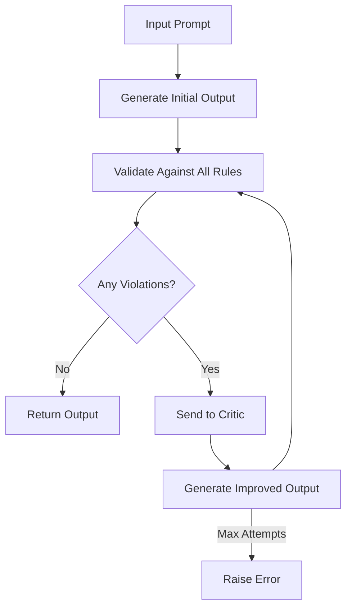

<p align="center">
  
</p>

# Sifaka: Reflection and Reliability for LLMs

[](https://badge.fury.io/py/sifaka)
[](https://opensource.org/licenses/MIT)
[](https://www.python.org/downloads/)

**Sifaka** is an open-source framework that adds **reflection and reliability** to large language model (LLM) applications. It helps developers build safer, more reliable AI systems by:

- Catching hallucinations before they reach users
- Enforcing rules and tone consistency
- Providing transparency and auditability

Whether you're building AI-powered tools for legal research, customer support, or creative generation, Sifaka makes your outputs **safer, smarter, and more transparent.**

## 🌟 Features

- **Rule-Based Validation**: Define constraints to validate LLM outputs
- **Reflection Through Critique**: Improve responses through self-reflection
- **Modular Architecture**: Easily extend with custom rules and components
- **Provider Agnostic**: Works with OpenAI, Anthropic, and other LLM providers
- **Tracing & Auditing**: Comprehensive logging of the reflection process
- **Pydantic Integration**: Leverage Pydantic for structured data validation

## 📦 Installation

```bash
# Basic installation
pip install sifaka

# With OpenAI support
pip install sifaka[openai]

# With Anthropic support
pip install sifaka[anthropic]

# With all integrations
pip install sifaka[all]

# With development tools
pip install sifaka[dev]
```

## 🔑 API Keys and Configuration

Sifaka supports multiple LLM providers and requires API keys for authentication. Here's how to set up your API keys:

### Environment Variables

The recommended way to set API keys is through environment variables:

```bash
# OpenAI
export OPENAI_API_KEY="your-openai-api-key"

# Anthropic
export ANTHROPIC_API_KEY="your-anthropic-api-key"

# Google (if using Vertex AI)
export GOOGLE_APPLICATION_CREDENTIALS="path/to/your/credentials.json"
```

### Configuration File

Alternatively, you can create a `.env` file in your project root:

```bash
# .env
OPENAI_API_KEY=your-openai-api-key
ANTHROPIC_API_KEY=your-anthropic-api-key
GOOGLE_APPLICATION_CREDENTIALS=path/to/your/credentials.json
```

Then load it in your code:

```python
from dotenv import load_dotenv
load_dotenv()
```

### Direct Configuration

You can also pass API keys directly when initializing providers:

```python
from sifaka.models import OpenAIProvider, AnthropicProvider

# OpenAI with direct API key
openai_model = OpenAIProvider(
    model_name="gpt-4",
    api_key="your-openai-api-key"
)

# Anthropic with direct API key
anthropic_model = AnthropicProvider(
    model_name="claude-3-haiku-20240307",
    api_key="your-anthropic-api-key"
)
```

### Example Usage with API Keys

Here's a complete example showing different ways to use API keys:

```python
from sifaka import Reflector
from sifaka.models import OpenAIProvider, AnthropicProvider
from sifaka.rules import ProhibitedContentRule
from dotenv import load_dotenv

# Load environment variables
load_dotenv()

# Method 1: Using environment variables
# openai_model = AnthropicProvider(model_name="gpt-4")

# Method 2: Using direct API key
anthropic_model = AnthropicProvider(
    model_name="claude-3-haiku-20240307"
)

# Create rules
prohibited_terms = ProhibitedContentRule(
    name="content_filter",
    description="Checks for prohibited or inappropriate content",
    config={
        "prohibited_terms": ["controversial", "inappropriate"]
    }
)

# Create a critic for improving outputs that fail validation
critic = PromptCritique(model=anthropic_model)

# Create a reflector with rules and critique
reflector = Reflector(
    name="content_validator",
    model=anthropic_model,
    rules=[prohibited_terms],
    critique=True,
    critic=critic
)

# Use the reflector
result = reflector.reflect(
    "Write a professional email about a search project update"
)
print(result)
```

### Security Best Practices

1. **Never commit API keys** to version control
2. Use **environment variables** in production
3. Consider using a **secrets management service** for production
4. Rotate API keys **regularly**
5. Use **least privilege** API keys with minimal permissions

## 🚀 Quick Start

```python
from sifaka import Reflector
from sifaka.models import AnthropicProvider
from sifaka.rules import ProhibitedContentRule, FormatRule, SentimentRule, ToxicityRule, LengthRule
from sifaka.rules.legal import LegalCitationRule
from sifaka.critique import PromptCritique
from sifaka.utils.logging import get_logger
import logging
from dotenv import load_dotenv

# Configure logging to show only relevant information
logging.basicConfig(level=logging.WARNING)  # Set base logging to WARNING
logger = get_logger(__name__, level=logging.INFO)  # Show info for our script
logging.getLogger("sifaka").setLevel(logging.INFO)  # Show info for Sifaka
logging.getLogger("anthropic").setLevel(logging.WARNING)  # Silence Anthropic debug logs
logging.getLogger("httpx").setLevel(logging.WARNING)  # Silence HTTP debug logs
logging.getLogger("httpcore").setLevel(logging.WARNING)  # Silence HTTP debug logs

# Load environment variables
load_dotenv()

# Initialize the provider
provider = AnthropicProvider(model_name="claude-3-sonnet-20240229")

# Create rules
length_rule = LengthRule(
    name="length_check",
    description="Checks if output length is within bounds",
    config={
        "min_length": 100,
        "max_length": 500  # Reduced max length to make the output more concise
    }
)

prohibited_terms = ProhibitedContentRule(
    name="content_filter",
    description="Checks for prohibited or inappropriate content",
    config={
        "prohibited_terms": ["controversial", "inappropriate"]
    }
)

format_rule = FormatRule(
    name="format_check",
    description="Ensures output is in markdown format",
    config={
        "required_format": "markdown"
    }
)

sentiment_rule = SentimentRule(
    name="sentiment_check",
    description="Ensures output has positive sentiment",
    config={
        "min_sentiment": 0.0
    }
)

toxicity_rule = ToxicityRule(
    name="toxicity_check",
    description="Checks for toxic content",
    config={
        "max_toxicity": 0.5
    }
)

legal_citations = LegalCitationRule(
    name="legal_citation_check",
    description="Validates legal citations in the text",
    config={}
)

# Create a critic for improving outputs that fail validation
critic = PromptCritique(
    name="content_improver",
    description="Improves content based on rule violations",
    model=provider,
    system_prompt=(
        "You are an editor that makes text more concise while preserving key information. "
        "When asked to adjust text length, you MUST ensure the output is within the specified character limits."
    ),
    user_prompt_template=(
        "Please improve this text to STRICTLY meet the length requirements:\n\n"
        "Text: {output}\n\n"
        "Issues: {feedback}\n\n"
        "IMPORTANT: Your response MUST be between {min_length}-{max_length} characters.\n"
        "Current length: {current_length} characters\n\n"
        "Provide a concise version that fits these exact requirements."
    )
)

# Create a reflector with rules and critique
reflector = Reflector(
    name="legal_content_validator",
    model=provider,
    rules=[
        length_rule,
        prohibited_terms,
        format_rule,
        sentiment_rule,
        toxicity_rule,
        legal_citations
    ],
    critic=critic
)

# Get a response and validate it
logger.info("Starting reflection process...")
try:
    result = reflector.reflect(
        "Write about the Supreme Court case Brown v. Board of Education",
        max_attempts=3  # Try up to 3 times to fix any violations
    )
    logger.info("Final result:\n%s", result)
except RuntimeError as e:
    logger.error("Failed to generate valid output: %s", e)
```

## 🧩 Architecture

Sifaka is built around a modular architecture with four main components:

1. **Reflector**: The core component that orchestrates the reflection process
2. **Rules**: Validate LLM outputs against specific criteria
3. **Critique**: Improve LLM outputs based on rule violations
4. **Model Providers**: Interface with different LLM providers

### Reflector

The `Reflector` class is the main entry point for Sifaka. It takes a list of rules and critique options, and applies them to LLM outputs.

```python
from sifaka import Reflector
from sifaka.models import AnthropicProvider

# Initialize model
model = AnthropicProvider(model_name="claude-3-haiku-20240307")

# Create reflector
reflector = Reflector(
    name="content_validator",
    model=model,
    rules=[rule1, rule2],  # List of rules to apply
    critique=True          # Enable critique
)

# Use the reflector
result = reflector.reflect("Your prompt here")
```

### Rules

Rules validate LLM outputs against specific criteria. Sifaka comes with several built-in rules:

```python
from sifaka.rules import (
    LengthRule,
    ProhibitedContentRule,
    SentimentRule,
    ToxicityRule,
    FormatRule
)
from sifaka.rules.legal import LegalCitationRule

# Create rules
length_rule = LengthRule(
    name="min_max_length_rule",
    description="Checks if output length is between 100 and 1000 characters",
    config={"min_length": 100, "max_length": 1000}
)

content_rule = ProhibitedContentRule(
    name="content_rule",
    description="Checks for prohibited terms",
    config={"prohibited_terms": ["bad", "inappropriate"]}
)

format_rule = FormatRule(
    name="format_rule",
    description="Validates output format",
    config={"required_format": "markdown"}
)

legal_rule = LegalCitationRule(
    name="legal_citations_rule",
    description="Validates legal citations in the output"
)
```

### Creating Custom Rules

You can create custom rules by inheriting from the `Rule` base class:

```python
from sifaka.rules import Rule, RuleResult
from typing import Optional, Dict, Any

class CustomRule(Rule):
    def __init__(
        self,
        name: str,
        description: str,
        config: Optional[Dict[str, Any]] = None,
        **kwargs
    ):
        super().__init__(name=name, description=description, config=config or {}, **kwargs)
        # Initialize your rule-specific configuration here

    def validate(self, output: str) -> RuleResult:
        # Implement your validation logic here
        return RuleResult(
            valid=True,
            messages=["Validation passed"],
            metadata={"key": "value"}
        )
```

## Custom Rules

You can create custom rules by inheriting from the `Rule` base class:

```python
from sifaka.rules import Rule, RuleResult
from typing import Optional, Dict, Any

class CustomRule(Rule):
    def __init__(
        self,
        name: str,
        description: str,
        config: Optional[Dict[str, Any]] = None,
        **kwargs
    ):
        super().__init__(name=name, description=description, config=config or {}, **kwargs)
        # Initialize your rule-specific configuration here

    def validate(self, output: str) -> RuleResult:
        # Implement your validation logic here
        return RuleResult(
            valid=True,
            messages=["Validation passed"],
            metadata={"key": "value"}
        )
```

## Framework Integrations

### LangGraph Integration

Sifaka integrates seamlessly with LangGraph for building complex LLM workflows:

```python
from langgraph.graph import Graph
from sifaka.integrations.langgraph import wrap_graph
from sifaka.rules import LengthRule, ProhibitedContentRule

# Create your LangGraph
graph = Graph()
# ... configure your graph ...

# Create rules
rules = [
    LengthRule(
        name="length_check",
        description="Checks if output length is within bounds",
        config={"min_length": 100, "max_length": 1000}
    ),
    ProhibitedContentRule(
        name="content_filter",
        description="Checks for prohibited terms",
        config={"prohibited_terms": ["bad", "worse", "worst"]}
    )
]

# Wrap the graph with Sifaka's features
sifaka_graph = wrap_graph(
    graph=graph,
    rules=rules,
    critique=True
)

# Run the graph
output = sifaka_graph({"input": "Your input here"})
```

Sifaka supports various LangGraph components:
- `wrap_graph()` - For basic graphs
- `wrap_state_graph()` - For state-based graphs
- `wrap_tool_node()` - For tool nodes
- `wrap_channel()` - For channels

### LangChain Integration

Sifaka also integrates with LangChain for enhanced LLM application development:

```python
from langchain.chains import LLMChain
from sifaka.integrations.langchain import wrap_chain
from sifaka.rules import LengthRule, ProhibitedContentRule

# Create your LangChain chain
chain = LLMChain(...)

# Create rules
rules = [
    LengthRule(
        name="length_check",
        description="Checks if output length is within bounds",
        config={"min_length": 100, "max_length": 1000}
    ),
    ProhibitedContentRule(
        name="content_filter",
        description="Checks for prohibited terms",
        config={"prohibited_terms": ["bad", "worse", "worst"]}
    )
]

# Wrap the chain with Sifaka's features
sifaka_chain = wrap_chain(
    chain=chain,
    rules=rules,
    critique=True
)

# Run the chain
output = sifaka_chain.run("Your input here")
```

Sifaka provides several LangChain integrations:
- `wrap_chain()` - For LLM chains
- `wrap_memory()` - For memory components
- `wrap_callback_handler()` - For callback handlers
- Document processing integration with rules

## Installation

```bash
pip install sifaka  # Basic installation
pip install sifaka[langgraph]  # With LangGraph support
pip install sifaka[langchain]  # With LangChain support
pip install sifaka[all]  # With all integrations
```

## Requirements

- Python 3.8+
- anthropic
- pydantic
- langgraph (optional)
- langchain (optional)

## Built-in Rules

```

## 🔄 How Reflection Works

Here's how the reflection process works:



Let's walk through an example:

```python
from sifaka import Reflector
from sifaka.models import AnthropicProvider
from sifaka.rules import LengthRule
from sifaka.critique import PromptCritique
import logging

# Configure logging
logging.basicConfig(level=logging.INFO)
logger = get_logger(__name__, level=logging.INFO)

# Initialize provider
provider = AnthropicProvider(model_name="claude-3-sonnet-20240229")

# Create a simple length rule
length_rule = LengthRule(
    name="length_check",
    description="Keep output between 100-200 characters",
    config={
        "min_length": 100,
        "max_length": 1200
    }
)

# Create a critic
critic = PromptCritique(
    name="content_improver",
    description="Improves content based on rule violations",
    model=provider,
    system_prompt=(
        "You are an editor that makes text more concise while preserving key information. "
        "When asked to adjust text length, you MUST ensure the output is within the specified character limits."
    ),
    user_prompt_template=(
        "Please improve this text to STRICTLY meet the length requirements:\n\n"
        "Text: {output}\n\n"
        "Issues: {feedback}\n\n"
        "IMPORTANT: Your response MUST be between {min_length}-{max_length} characters.\n"
        "Current length: {current_length} characters\n\n"
        "Provide a concise version that fits these exact requirements."
    )
)

# Create reflector with system prompt for initial generation
reflector = Reflector(
    name="length_validator",
    model=provider,
    rules=[length_rule],
    critic=critic
)

# Example walkthrough
logger.info("Step 1: Starting with input prompt...")
prompt = f"""
Explain quantum computing.

IMPORTANT: Your response must be between 100-1200 characters in length.
"""

logger.info("Step 2: Generate initial output...")
try:
    result = reflector.reflect(prompt, max_attempts=3)
    logger.info("Success! Final output:\n%s", result)
except RuntimeError as e:
    logger.error("Failed after max attempts: %s", e)

"""
The process will look like this:

1. Initial Generation:
   - Model generates first response
   - Length Rule checks character count
   - If too long/short, sends to critic

2. First Attempt (if needed):
   - Critic receives violation info
   - Generates improved version
   - Rules check again

3. Second Attempt (if needed):
   - If still violating, critic tries again
   - Rules check once more

4. Final Result:
   - Either succeeds within max attempts
   - Or raises error if can't fix
"""
```

This example shows:
1. How rules validate the output
2. How the critic tries to fix violations
3. The multiple attempt process
4. Success/failure handling

Each rule can define its own validation logic, and the critic will try to fix any violations while preserving the essential content.

## 🚀 Performance Optimization

Sifaka provides several ways to optimize performance:

### Parallel Rule Validation

Enable parallel validation when rules are independent:

```python
from sifaka import Reflector
from sifaka.models import AnthropicProvider
from sifaka.rules import LengthRule, ProhibitedContentRule

reflector = Reflector(
    name="optimized_validator",
    model=provider,
    rules=[length_rule, prohibited_terms],
    parallel_validation=True  # Enable parallel validation
)
```

### Rule Caching

Cache expensive rule validations:

```python
from sifaka.rules import ToxicityRule
from functools import lru_cache

class CachedToxicityRule(ToxicityRule):
    @lru_cache(maxsize=1000)
    def validate(self, output: str) -> RuleResult:
        return super().validate(output)

# Use the cached version
toxicity_rule = CachedToxicityRule(
    name="toxicity_check",
    description="Checks for toxic content with caching",
    config={"max_toxicity": 0.5}
)
```

### Batch Processing

Group validations for efficiency:

```python
from sifaka import BatchReflector

batch_reflector = BatchReflector(
    name="batch_validator",
    model=provider,
    rules=[length_rule, prohibited_terms],
    batch_size=10  # Process 10 items at once
)

# Process multiple items efficiently
results = batch_reflector.reflect_batch([
    "First prompt",
    "Second prompt",
    "Third prompt"
])
```

### Memory Management

Control memory usage with configuration:

```python
reflector = Reflector(
    name="memory_efficient",
    model=provider,
    rules=[length_rule, prohibited_terms],
    max_cache_size=1000,  # Limit cache size
    clear_history=True    # Clear history after each reflection
)
```

### Model Configuration

Optimize model settings for your use case:

```python
from sifaka.models import AnthropicProvider

provider = AnthropicProvider(
    model_name="claude-3-haiku-20240307",
    request_timeout=30,     # Adjust timeout
    max_retries=2,         # Limit retries
    temperature=0.1        # Lower temperature for faster responses
)
```

### Performance Monitoring

Monitor and tune performance:

```python
from sifaka.monitoring import PerformanceMonitor

monitor = PerformanceMonitor()
reflector = Reflector(
    name="monitored_validator",
    model=provider,
    rules=[length_rule, prohibited_terms],
    performance_monitor=monitor
)

# Get performance metrics
metrics = monitor.get_metrics()
print(f"Average validation time: {metrics['avg_validation_time_ms']}ms")
print(f"Rules per second: {metrics['rules_per_second']}")
```

### Best Practices

1. **Rule Ordering**: Place fast rules before slow ones
2. **Batch Size**: Adjust batch size based on available memory
3. **Cache Tuning**: Monitor cache hit rates and adjust sizes
4. **Async Operations**: Use async where possible for I/O bound operations
5. **Resource Limits**: Set appropriate timeouts and retry limits

## Rule Prioritization

Rules can be prioritized to optimize validation performance. Each rule has two attributes that control its execution order:

- `priority` (int): Higher numbers run first. Use this to run more important rules before less important ones.
- `cost` (int): Higher numbers indicate more computational expense. Among rules with the same priority, lower cost rules run first.

Example:

```python
from sifaka.rules import LengthRule, ToxicityRule
from sifaka.providers import AnthropicProvider
from sifaka import Reflector

# High priority, low cost rule runs first
length_rule = LengthRule(
    name="length",
    description="Check output length",
    config={"min_length": 100, "max_length": 200},
    priority=2,  # High priority
    cost=1       # Low cost
)

# Lower priority, high cost rule runs second
toxicity_rule = ToxicityRule(
    name="toxicity",
    description="Check for toxic content",
    config={"max_toxicity": 0.7},
    priority=1,  # Lower priority
    cost=3       # Higher cost due to API call
)

provider = AnthropicProvider(api_key="your-key")
reflector = Reflector(
    provider=provider,
    rules=[length_rule, toxicity_rule]
)

result = reflector.reflect("Tell me about machine learning")
print(result)
```

The reflector will:
1. Run the length rule first (priority=2)
2. Only if length passes, run the toxicity rule (priority=1)
3. If using parallel validation and a rule fails, cancel remaining lower priority rules

This optimization is especially useful when:
- Some rules are more critical than others
- Rules have varying computational costs
- You want to fail fast on important checks