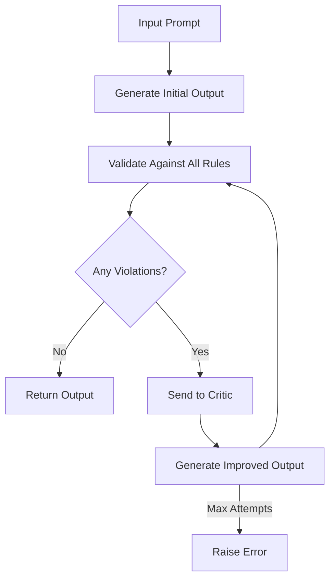

# Sifaka: Reflection and Reliability for LLMs

<div style="display: flex; align-items: start;">
<div style="flex: 1;">

**Sifaka** is an open-source framework that adds **reflection and reliability** to large language model (LLM) applications. It helps developers build safer, more reliable AI systems by:

- Catching hallucinations before they reach users
- Enforcing rules and tone consistency
- Providing transparency and auditability

Whether you're building AI-powered tools for legal research, customer support, or creative generation, Sifaka makes your outputs **safer, smarter, and more transparent.**

</div>
<div style="flex: 0 0 40%; margin-left: 20px;">
  
</div>
</div>

[](https://badge.fury.io/py/sifaka)
[](https://opensource.org/licenses/MIT)
[](https://www.python.org/downloads/)

## 🌟 What is Sifaka?

Sifaka is a framework for building reliable and transparent LLM applications through a combination of:

1. **Content Reflection**: Using critics to analyze and improve LLM outputs
2. **Rule-Based Validation**: Enforcing constraints on content
3. **Pattern Analysis**: Detecting structural patterns in text

The framework follows this process:

1. An LLM generates an initial response
2. The response is validated against rules (content, format, patterns)
3. If rules fail, a critic reflects on and improves the response
4. This cycle continues until all rules pass or max attempts reached

## 🔄 Version 1.0.0 Migration Guide

### Breaking Changes

1. **Reflector Deprecation**
   - The `Reflector` class has been deprecated and moved to specialized pattern rules
   - Pattern detection is now handled by `SymmetryRule` and `RepetitionRule`
   - The old `Reflector` class will be removed in version 2.0.0

Before (0.2.x):
```python
from sifaka.reflector import Reflector

reflector = Reflector(
    reflection_config=ReflectionConfig(
        mirror_mode="both",
        symmetry_threshold=0.8
    )
)

result = reflector.validate("Your text here")
```

After (1.0.0):
```python
from sifaka.rules import SymmetryRule, RepetitionRule
from sifaka.rules.base import RuleConfig, RulePriority

# For symmetry detection
symmetry_rule = SymmetryRule(
    name="symmetry_check",
    description="Checks for text symmetry patterns",
    config=RuleConfig(
        priority=RulePriority.MEDIUM,
        metadata={
            "mirror_mode": "both",
            "symmetry_threshold": 0.8,
            "preserve_whitespace": True,
            "preserve_case": True,
            "ignore_punctuation": True,
        }
    )
)

# For pattern detection
repetition_rule = RepetitionRule(
    name="repetition_check",
    description="Detects repetitive patterns",
    config=RuleConfig(
        priority=RulePriority.MEDIUM,
        metadata={
            "pattern_type": "repeat",
            "pattern_length": 3,
            "case_sensitive": True,
            "allow_overlap": False,
        }
    )
)

# Use with other rules
rules = [symmetry_rule, repetition_rule, length_rule, prohibited_terms]
chain = Chain(model=provider, rules=rules, critic=critic)
```

2. **Architecture Updates**
   - Pattern detection is now part of the rules system
   - Clearer separation between reflection (critics) and pattern detection (rules)
   - More consistent API across all rule types

### Deprecation Timeline
- 1.0.0: `Reflector` marked as deprecated with warnings
- 1.1.x: Bug fixes and improvements to pattern rules
- 2.0.0: `Reflector` class removed entirely

## 🏗️ Architecture

Sifaka has three main components and supports two operating modes:

### Operating Modes

1. **Validation-only Mode**
   - Uses rules to validate output without attempting improvements
   - Fails fast when validation rules are not met
   - Useful for strict enforcement of rules
   - Example:
   ```python
   validation_chain = Chain(
       model=provider,
       rules=[length_rule, prohibited_terms],
       max_attempts=1  # Single attempt since no critic
   )
   ```

2. **Critic Mode**
   - Uses both rules and critics to validate and improve output
   - Attempts to fix rule violations through reflection
   - Provides detailed feedback and suggestions
   - Example:
   ```python
   critic_chain = Chain(
       model=provider,
       rules=[length_rule, prohibited_terms],
       critic=critic,
       max_attempts=3  # Multiple attempts for improvement
   )
   ```

### 1. Critics (Reflection)

Critics are the core reflection mechanism, analyzing and improving content:

```python
from sifaka.critics import PromptCritic
from sifaka.critics.prompt import PromptCriticConfig

critic = PromptCritic(
    config=PromptCriticConfig(
        name="quality_critic",
        description="Improves content quality",
        system_prompt="You are an expert editor...",
    ),
    model=provider
)

# Reflect on and improve content
improved = critic.critique(content)
```

### 2. Rules (Validation)

Rules enforce constraints on content. Sifaka provides several types:

```python
from sifaka.rules import (
    # Content Rules
    LengthRule,              # Control length
    ProhibitedContentRule,   # Filter content
    SentimentRule,           # Check sentiment
    ToxicityRule,           # Prevent toxicity

    # Format Rules
    FormatRule,             # Enforce format
    JSONRule,               # Validate JSON

    # Pattern Rules
    SymmetryRule,           # Check symmetry
    RepetitionRule,         # Find patterns
)

# Example: Create a length rule
length_rule = LengthRule(
    name="length_check",
    min_length=100,
    max_length=500
)

# Example: Create pattern rules
symmetry_rule = SymmetryRule(
    name="symmetry_check",
    config=SymmetryConfig(
        mirror_mode="both",
        symmetry_threshold=0.8
    )
)

repetition_rule = RepetitionRule(
    name="repetition_check",
    config=RepetitionConfig(
        pattern_type="repeat",
        pattern_length=3
    )
)
```

### 3. Providers (LLM Integration)

Sifaka supports multiple LLM providers:

```python
from sifaka.models import (
    OpenAIProvider,
    AnthropicProvider,
    # ... other providers
)

provider = AnthropicProvider(
    model_name="claude-3-haiku-20240307",
    api_key="your-api-key"
)
```

## 🔄 Putting It All Together

Here's how the components work together:

```python
from sifaka.core import Chain

# Create components
rules = [length_rule, prohibited_terms, pattern_rule]
critic = PromptCritic(config=critic_config, model=provider)

# Create chain
chain = Chain(
    model=provider,
    rules=rules,
    critic=critic,
    max_attempts=3
)

# Generate content with validation and reflection
result = chain.run("Write a professional email...")
```

## 📊 Understanding Results

Sifaka provides detailed insights about the content:

```python
# Rule validation results
for rule_result in result.rule_results:
    print(f"{rule_result.name}: {rule_result.passed}")
    print(f"Message: {rule_result.message}")
    print(f"Details: {rule_result.metadata}")

# Critic's reflection
if result.critique_details:
    print(f"Quality Score: {result.critique_details['score']}")
    print(f"Feedback: {result.critique_details['feedback']}")
    print(f"Issues: {result.critique_details['issues']}")
    print(f"Suggestions: {result.critique_details['suggestions']}")

# Pattern analysis
if result.pattern_details:
    print(f"Patterns found: {result.pattern_details['match_count']}")
    print(f"Examples: {result.pattern_details['matches_found']}")
```

## 📦 Installation

```bash
# Basic installation
pip install sifaka

# With specific integrations
pip install sifaka[sentiment]    # Sentiment analysis support
pip install sifaka[openai]       # OpenAI support
pip install sifaka[anthropic]    # Anthropic support
pip install sifaka[langgraph]    # LangGraph support
pip install sifaka[langchain]    # LangChain support

# With all integrations
pip install sifaka[all]

# With development tools
pip install sifaka[dev]
```

## 🚀 Quick Start

Here are two examples showing both operating modes:

```python
from sifaka.models import AnthropicProvider
from sifaka.models.base import ModelConfig
from sifaka.rules import LengthRule, ProhibitedContentRule, SymmetryRule, RepetitionRule
from sifaka.rules.base import RuleConfig, RulePriority
from sifaka.critics import PromptCritic
from sifaka.critics.prompt import PromptCriticConfig
from sifaka.integrations.langchain import wrap_chain, ChainConfig
from dotenv import load_dotenv

# Load environment variables
load_dotenv()

# Initialize the provider with configuration
config = ModelConfig(
    api_key=os.environ.get("ANTHROPIC_API_KEY"),
    temperature=0.7,  # Balanced between creativity and consistency
    max_tokens=2000,  # Sufficient for detailed responses
)

provider = AnthropicProvider(
    model_name="claude-3-haiku-20240307",
    config=config
)

# Create rules
length_rule = LengthRule(
    name="length_check",
    description="Checks if output length is within bounds",
    config=RuleConfig(
        priority=RulePriority.HIGH,
        metadata={
            "min_length": 100,
            "max_length": 500,
            "unit": "characters"
        }
    )
)

prohibited_terms = ProhibitedContentRule(
    name="content_filter",
    description="Checks for prohibited or inappropriate content",
    config=RuleConfig(
        priority=RulePriority.HIGH,
        metadata={
            "prohibited_terms": ["controversial", "inappropriate"],
            "case_sensitive": False
        }
    )
)

symmetry_rule = SymmetryRule(
    name="symmetry_check",
    description="Checks for text symmetry patterns",
    config=RuleConfig(
        priority=RulePriority.MEDIUM,
        metadata={
            "mirror_mode": "both",
            "symmetry_threshold": 0.8,
            "preserve_whitespace": True,
            "preserve_case": True,
            "ignore_punctuation": True,
        }
    )
)

# Create a critic (for critic mode)
critic_config = PromptCriticConfig(
    name="content_quality_critic",
    description="Improves text quality",
    system_prompt="You are an expert editor focused on improving text quality, clarity, and effectiveness.",
    temperature=0.7,
    max_tokens=1000
)
critic = PromptCritic(config=critic_config, model=provider)

# Example 1: Validation-only Mode
validation_chain = wrap_chain(
    chain=provider.get_langchain_llm(),
    config=ChainConfig(
        rules=[length_rule, prohibited_terms, symmetry_rule],
        critique=False,
        max_attempts=1  # Single attempt since no critic
    )
)

try:
    result = validation_chain.run(
        "Write a professional email about a project update"
    )
    print("Validation passed!")
except ValueError as e:
    print(f"Validation failed: {e}")

# Example 2: Critic Mode
critic_chain = wrap_chain(
    chain=provider.get_langchain_llm(),
    config=ChainConfig(
        rules=[length_rule, prohibited_terms, symmetry_rule],
        critique=True,
        critic=critic,
        max_attempts=3  # Multiple attempts for improvement
    )
)

try:
    result = critic_chain.run(
        "Write a professional email about a project update"
    )
    print("Final result:", result)

    # Access validation results
    for rule_result in result.rule_results:
        print(f"\n{rule_result.name} validation:")
        print(f"- Passed: {rule_result.passed}")
        print(f"- Message: {rule_result.message}")

    # Access critic's feedback
    if result.critique_details:
        print("\nCritic's Analysis:")
        print(f"- Score: {result.critique_details.get('score')}")
        print(f"- Feedback: {result.critique_details.get('feedback')}")
except ValueError as e:
    print(f"All improvement attempts failed: {e}")
```

## 🔑 API Keys and Configuration

Sifaka supports multiple LLM providers and requires API keys for authentication:

```python
# Environment variables (recommended)
export OPENAI_API_KEY="your-openai-api-key"
export ANTHROPIC_API_KEY="your-anthropic-api-key"

# Or direct configuration
# OpenAI
from sifaka.models import OpenAIProvider
openai_provider = OpenAIProvider(
    model_name="gpt-4",
    api_key="your-openai-api-key"
)

# Anthropic
from sifaka.models import AnthropicProvider
anthropic_provider = AnthropicProvider(
    model_name="claude-3-haiku-20240307",
    api_key="your-anthropic-api-key"
)
```

## 🧩 Architecture

Sifaka is built around four main components:

### 1. Reflector

The core component that orchestrates the reflection process:

```python
reflector = Reflector(
    name="content_validator",
    model=model,
    rules=[rule1, rule2],  # List of rules to apply
    critic=critic          # Optional critic for improvement
)

result = reflector.reflect("Your prompt here")
```

### 2. Rules

Validate LLM outputs against specific criteria:

```python
# Built-in rules
from sifaka.rules import (
    LengthRule,              # Control output length
    ProhibitedContentRule,   # Filter prohibited terms
    SentimentRule,           # Ensure positive sentiment
    ToxicityRule,            # Prevent toxic content
    FormatRule               # Enforce specific formats
)

# Custom rules
from sifaka.rules import Rule, RuleResult

class CustomRule(Rule):
    def validate(self, output: str) -> RuleResult:
        # Your validation logic here
        return RuleResult(
            passed=True,
            message="Validation passed",
            metadata={"key": "value"}
        )
```

### 3. Critics

Improve LLM outputs when they fail validation:

```python
from sifaka.critics import PromptCritic
from sifaka.critics.prompt import PromptCriticConfig

# Create critic configuration
critic_config = PromptCriticConfig(
    name="content_quality_critic",
    description="Improves text quality focusing on professionalism and clarity",
    system_prompt="You are an expert editor that improves text quality, focusing on professionalism, clarity, and effectiveness.",
    temperature=0.7,
    max_tokens=1000
)

# Create the critic
critic = PromptCritic(
    config=critic_config,
    model=provider
)
```

### 4. Model Providers

Interface with different LLM services:

```python
from sifaka.models import OpenAIProvider, AnthropicProvider

openai_model = OpenAIProvider(model_name="gpt-4")
anthropic_model = AnthropicProvider(model_name="claude-3-haiku-20240307")
```

## 🔄 How Reflection Works



## 📏 Built-in Rules

Sifaka provides a comprehensive set of rules:

### Content Rules

- **LengthRule**: Controls output length based on character or word count
  ```python
  length_rule = LengthRule(
      name="length_check",
      config={"min_length": 100, "max_length": 500, "unit": "characters"}
  )
  ```

- **ProhibitedContentRule**: Filters prohibited terms and phrases
  ```python
  prohibited_rule = ProhibitedContentRule(
      name="content_filter",
      config={
          "prohibited_terms": ["inappropriate", "offensive"],
          "case_sensitive": False,
          "whole_word_match": True
      }
  )
  ```

- **FormatRule**: Ensures specific formatting requirements are met
  ```python
  format_rule = FormatRule(
      name="format_check",
      config={
          "required_format": "markdown",  # or "json", "yaml", etc.
          "schema": {...},  # Optional JSON schema for validation
      }
  )
  ```

### Safety Rules

- **ToxicityRule**: Prevents toxic or harmful content
  ```python
  toxicity_rule = ToxicityRule(
      name="toxicity_check",
      config={"max_toxicity": 0.7}  # 0-1 scale
  )
  ```

- **SentimentRule**: Controls emotional tone of content
  ```python
  sentiment_rule = SentimentRule(
      name="sentiment_check",
      config={
          "min_sentiment": 0.0,  # Minimum sentiment score (-1 to 1)
          "target_sentiment": "positive"  # or "neutral", "negative"
      }
  )
  ```

### Domain-Specific Rules

- **LegalCitationRule**: Validates legal citations and references
- **CodeRule**: Validates code snippets and programming content

## 📊 Classifiers

Sifaka includes various text analysis classifiers for advanced content validation:

### Text Analysis Classifiers

- **ProfanityClassifier**: Detects and censors inappropriate language
  ```python
  from sifaka.classifiers import ProfanityClassifier

  classifier = ProfanityClassifier(
      name="profanity_check",
      custom_words={"word1", "word2"},  # Optional additional words
      censor_char="*"  # Character for censoring
  )

  result = classifier.classify("Your text here")
  print(f"Label: {result.label}")  # "clean" or "profane"
  print(f"Censored text: {result.metadata['censored_text']}")
  ```

- **SentimentClassifier**: Analyzes the emotional tone of text
  ```python
  from sifaka.classifiers import SentimentClassifier

  classifier = SentimentClassifier(
      name="sentiment_analyzer",
      threshold=0.5  # Threshold for positive/negative classification
  )

  result = classifier.classify("Your text here")
  print(f"Sentiment: {result.label}")  # "positive", "negative", or "neutral"
  print(f"Score: {result.metadata['sentiment_score']}")
  ```

### Safety Classifiers

- **ToxicityClassifier**: Identifies toxic, harmful, or inappropriate content
  ```python
  from sifaka.classifiers import ToxicityClassifier

  classifier = ToxicityClassifier(
      name="toxicity_check",
      threshold=0.7  # Toxicity threshold
  )
  ```

- **ReadabilityClassifier**: Assesses text complexity and readability
- **LanguageClassifier**: Identifies the language of text
- **LLMClassifier**: Uses Large Language Models for sophisticated classification tasks

### Classifiers vs Rules: Performance Considerations

Classifiers and rules have different performance characteristics:

1. **Relationship**: Rules often use classifiers internally to perform validation
   ```python
   # A ToxicityRule internally uses a ToxicityClassifier
   toxicity_rule = ToxicityRule(config={"max_toxicity": 0.7})

   # Direct classifier usage
   classifier = ToxicityClassifier()
   result = classifier.classify("Your text")
   ```

2. **Computational Cost**:
   - Each classifier has a `cost` attribute indicating its computational expense
   - Lightweight classifiers (like `ProfanityClassifier`) are very fast
   - ML-based classifiers (like `ToxicityClassifier`) have moderate cost
   - LLM-based classifiers (like `LLMClassifier`) are the most expensive due to API calls

3. **When to use direct classifiers vs rules**:
   - Use **direct classifiers** when you need raw classification results or custom processing
   - Use **rules** when you need validation logic or want to use Sifaka's reflection framework

4. **Performance optimization tips**:
   - Cache expensive classifier results when processing similar texts
   - Use lightweight classifiers as initial filters before expensive ones
   - Set appropriate thresholds to balance accuracy and performance
   - Use the performance monitor to identify bottlenecks

The most expensive operations are typically API calls to LLM services and complex ML model inference.

## 🚀 Performance Optimization

Sifaka provides several optimization features:

```python
# Parallel rule validation
reflector = Reflector(
    name="optimized_validator",
    model=provider,
    rules=[rule1, rule2],
    parallel_validation=True
)

# Rule prioritization
length_rule = LengthRule(
    name="length",
    config={"min_length": 100, "max_length": 200},
    priority=2,  # Higher priority runs first
    cost=1       # Lower cost runs before higher cost at same priority
)

# Batch processing
results = reflector.reflect_batch([
    "First prompt",
    "Second prompt",
    "Third prompt"
], batch_size=10)
```

### Using the Performance Monitor

Sifaka includes a built-in performance monitoring system that helps you track and optimize your application:

```python
from sifaka import Reflector
from sifaka.models import AnthropicProvider
from sifaka.rules import LengthRule, ProhibitedContentRule
from sifaka.monitoring import PerformanceMonitor

# Create a performance monitor
monitor = PerformanceMonitor()

# Initialize reflector with the monitor
reflector = Reflector(
    name="monitored_validator",
    model=AnthropicProvider(model_name="claude-3-haiku-20240307"),
    rules=[
        LengthRule(name="length", config={"min_length": 100, "max_length": 500}),
        ProhibitedContentRule(name="content", config={"prohibited_terms": ["inappropriate"]})
    ],
    performance_monitor=monitor
)

# Use the reflector
reflector.reflect("Write a short story about AI")

# Get performance metrics
metrics = monitor.get_metrics()
print(f"Average generation time: {metrics['avg_generation_time_ms']}ms")
print(f"Average validation time: {metrics['avg_validation_time_ms']}ms")
print(f"Average critique time: {metrics['avg_critique_time_ms']}ms")
print(f"Rules per second: {metrics['rules_per_second']}")
print(f"Success rate: {metrics['success_rate']}")

# Get rule-specific metrics
rule_metrics = monitor.get_rule_metrics()
for rule_name, metrics in rule_metrics.items():
    print(f"Rule '{rule_name}' average time: {metrics['avg_time_ms']}ms")
    print(f"Rule '{rule_name}' pass rate: {metrics['pass_rate']}")

# Export metrics to JSON
monitor.export_metrics("performance_metrics.json")

# Reset metrics for a new test run
monitor.reset()
```

The performance monitor tracks:
- Generation time (how long it takes to generate initial outputs)
- Validation time (how long it takes to validate outputs)
- Critique time (how long it takes to improve outputs)
- Success rates (how often outputs pass validation)
- Rule-specific metrics (which rules are most expensive or fail most often)

You can use these metrics to identify bottlenecks and optimize your application.

## 🔌 Framework Integrations

### LangGraph Integration

```python
from langgraph.graph import Graph
from sifaka.integrations.langgraph import wrap_graph

# Create your LangGraph
graph = Graph()
# ... configure your graph ...

# Wrap with Sifaka
sifaka_graph = wrap_graph(
    graph=graph,
    rules=[rule1, rule2],
    critique=True
)
```

### LangChain Integration

```python
from langchain.chains import LLMChain
from sifaka.integrations.langchain import wrap_chain

# Create your LangChain
chain = LLMChain(...)

# Wrap with Sifaka
sifaka_chain = wrap_chain(
    chain=chain,
    rules=[rule1, rule2],
    critique=True
)
```

## 📋 Requirements

- Python 3.8+
- pydantic
- requests
- typing-extensions

Optional dependencies:
- anthropic (for Claude models)
- openai (for OpenAI models)
- detoxify (for toxicity detection)
- nltk (for sentiment analysis)
- langchain (for LangChain integration)
- langgraph (for LangGraph integration)

## 🧪 Running Tests

Sifaka includes a comprehensive test suite to ensure reliability. Here's how to run the tests:

### Setup Test Environment

```bash
# Install development dependencies
pip install sifaka[dev]

# Or if you're using Poetry
poetry install --with dev
```

### Running All Tests

```bash
# Run all tests
pytest

# Run with coverage report
pytest --cov=sifaka

# Generate HTML coverage report
pytest --cov=sifaka --cov-report=html
```

### Running Specific Tests

```bash
# Run tests for a specific module
pytest tests/test_rules/

# Run a specific test file
pytest tests/test_reflector.py

# Run tests matching a pattern
pytest -k "rule or critic"
```

### Running Benchmarks

Sifaka includes benchmarks to measure performance:

```bash
# Run all benchmarks
python run_benchmarks.py

# Run specific benchmark categories
python run_benchmarks.py --categories rules classifiers

# Run with specific number of samples
python run_benchmarks.py --num-samples 1000
```

The benchmark results will be saved in the `benchmark_results` directory, including:
- Performance metrics in JSON format
- Visualization charts
- Summary report in markdown

## Reflection Configuration

The reflection module provides powerful text reflection and pattern matching capabilities through configurable rules. The main configuration class `ReflectionConfig` allows fine-tuning of how text symmetry is validated.

### ReflectionConfig Parameters

| Parameter | Type | Default | Description |
|-----------|------|---------|-------------|
| `mirror_mode` | str | "horizontal" | Mode of reflection validation: "horizontal", "vertical", or "both". Horizontal checks for palindrome-like symmetry, vertical for line-based symmetry. |
| `symmetry_threshold` | float | 1.0 | Threshold for symmetry validation (0.0 to 1.0). A value of 1.0 requires perfect symmetry, while lower values allow partial matches. For example, 0.8 means text must be 80% symmetric. |
| `preserve_whitespace` | bool | True | Whether to consider whitespace in symmetry validation. If False, whitespace is stripped before checking. |
| `preserve_case` | bool | True | Whether to make validation case-sensitive. If False, text is converted to lowercase before checking. |
| `ignore_punctuation` | bool | False | Whether to ignore punctuation marks during validation. If True, only alphanumeric characters are considered. |
| `cache_size` | int | 100 | Size of the internal cache for validation results. |
| `priority` | int | 1 | Priority of the rule when multiple rules are applied. |
| `cost` | float | 1.0 | Computational cost factor for the rule. |

### Examples

```python
from sifaka.reflector import create_reflection_rule

# Perfect palindrome check (case-sensitive)
palindrome_rule = create_reflection_rule(
    name="strict_palindrome",
    description="Check for perfect palindromes",
    mirror_mode="horizontal",
    symmetry_threshold=1.0,
    preserve_case=True
)

# Relaxed visual symmetry (80% threshold)
visual_rule = create_reflection_rule(
    name="visual_symmetry",
    description="Check for visual symmetry",
    mirror_mode="both",
    symmetry_threshold=0.8,
    preserve_whitespace=True
)

# Case-insensitive partial matching
relaxed_rule = create_reflection_rule(
    name="relaxed_matching",
    description="Relaxed symmetry checking",
    mirror_mode="horizontal",
    symmetry_threshold=0.6,
    preserve_case=False,
    ignore_punctuation=True
)
```

### Predefined Configurations

The module includes several predefined configurations for common use cases:

1. **Palindrome**
   ```python
   {
       "mirror_mode": "horizontal",
       "preserve_whitespace": False,
       "preserve_case": False,
       "ignore_punctuation": True,
       "symmetry_threshold": 1.0
   }
   ```

2. **Visual Mirror**
   ```python
   {
       "mirror_mode": "both",
       "preserve_whitespace": True,
       "preserve_case": True,
       "ignore_punctuation": False,
       "symmetry_threshold": 0.8
   }
   ```

3. **Partial Symmetry**
   ```python
   {
       "mirror_mode": "horizontal",
       "preserve_whitespace": True,
       "preserve_case": True,
       "ignore_punctuation": False,
       "symmetry_threshold": 0.6
   }
   ```

### Validation Examples

```python
# Using the palindrome configuration
rule = create_reflection_rule(
    name="palindrome",
    description="Check for palindromes",
    **DEFAULT_REFLECTION_CONFIGS["palindrome"]
)

# Perfect palindrome (passes)
result = rule._validate_impl("A man a plan a canal Panama")
assert result.passed  # True
assert result.metadata["symmetry_score"] == 1.0

# Almost symmetric (fails with strict threshold)
result = rule._validate_impl("almost symmetric")
assert not result.passed
assert result.metadata["symmetry_score"] < 1.0

# Visual symmetry with multiple lines
rule = create_reflection_rule(
    name="visual",
    description="Check visual symmetry",
    **DEFAULT_REFLECTION_CONFIGS["visual_mirror"]
)

result = rule._validate_impl("""
*   *   *
  * * *
    *
  * * *
*   *   *
""")
assert result.passed  # True
```

## 📚 Examples

Sifaka comes with several example implementations demonstrating different use cases:

### 1. Basic Usage (`examples/basic_usage.py`)

Demonstrates fundamental pattern analysis capabilities:

```python
from sifaka.models import AnthropicProvider
from sifaka.rules import LengthRule, ProhibitedContentRule, SymmetryRule, RepetitionRule

def analyze_text(text: str):
    # Create basic validation rules
    length_rule = LengthRule(
        name="length_check",
        description="Checks if output length is within bounds",
        config={
            "min_length": 30,
            "max_length": 100,
            "unit": "characters"
        }
    )

    # Configure pattern detection rules
    symmetry_rule = SymmetryRule(
        name="symmetry_check",
        description="Checks for text symmetry patterns",
        config={
            "mirror_mode": "both",
            "symmetry_threshold": 0.8,
            "preserve_whitespace": True
        }
    )

    # Analyze text with multiple rules
    results = {
        "length": length_rule._validate_impl(text),
        "symmetry": symmetry_rule._validate_impl(text),
        # ... additional rule validations
    }
    return results
```

### 2. Pydantic Integration (`examples/pydantic_integration.py`)

Shows how to use Sifaka with Pydantic models and LangChain:

```python
from pydantic import BaseModel, Field
from langchain.prompts import PromptTemplate
from langchain.output_parsers import PydanticOutputParser
from sifaka.integrations.langchain import wrap_chain

class MovieReview(BaseModel):
    """Structured movie review model with validation"""
    title: str = Field(..., description="The title of the movie")
    rating: float = Field(..., ge=0.0, le=10.0)
    summary: str = Field(..., min_length=50, max_length=500)
    recommended: bool = Field(...)

# Create the Pydantic parser
parser = PydanticOutputParser(pydantic_object=MovieReview)

# Create LangChain pipeline with Sifaka validation
chain = wrap_chain(
    chain=your_langchain_pipeline,
    config=ChainConfig(
        output_parser=parser,
        critique=True
    )
)

# Generate and validate reviews
result = chain.run({"movie_title": "The Matrix"})
review = MovieReview.model_validate(result)
```

### 3. Combined Classifiers (`examples/combined_classifiers.py`)

Demonstrates using multiple classifiers and pattern rules together:

```python
from sifaka.classifiers.sentiment import SentimentClassifier
from sifaka.classifiers.readability import ReadabilityClassifier
from sifaka.rules import SymmetryRule, RepetitionRule

def analyze_text(text: str):
    # Initialize classifiers
    sentiment_classifier = SentimentClassifier(
        name="tone_analyzer",
        min_confidence=0.7
    )

    readability_classifier = ReadabilityClassifier(
        name="readability_analyzer",
        min_confidence=0.7
    )

    # Configure pattern rules
    symmetry_rule = SymmetryRule(
        name="symmetry_check",
        config={
            "mirror_mode": "both",
            "symmetry_threshold": 0.4
        }
    )

    # Perform multi-faceted analysis
    results = {
        "sentiment": sentiment_classifier.classify(text),
        "readability": readability_classifier.classify(text),
        "symmetry": symmetry_rule._validate_impl(text)
    }
    return results
```

Each example demonstrates different aspects of Sifaka:
- Basic usage shows fundamental pattern analysis
- Pydantic integration shows structured data validation
- Combined classifiers show how to use multiple analysis types together

For more details, check the full examples in the `examples/` directory.
