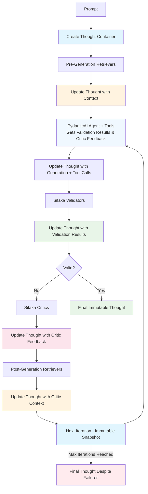

# Sifaka

[](https://github.com/sifaka-ai/sifaka)
[](https://python.org)
[](LICENSE)
[](https://github.com/sifaka-ai/sifaka)

A PydanticAI-native framework for building reliable AI text generation workflows with validation, criticism, and iterative improvement.

## 🚨 **Version 0.3.0 Breaking Changes**

**Sifaka 0.3.0** is a major release that simplifies the framework by adopting a PydanticAI-only architecture:

### **🔥 Complete Architectural Simplification**
- **✅ PydanticAI-Only**: Sifaka is now exclusively built on PydanticAI agents
- **🗑️ Traditional Chain Removed**: Complete removal of the legacy Traditional Chain implementation
- **🗑️ QuickStart Removed**: Removed QuickStart utility class (was based on Traditional Chain)
- **🧹 No Backward Compatibility**: Clean break from legacy APIs for a focused, modern codebase

### **🎯 What This Means**
- **Simpler**: Single chain implementation via `create_pydantic_chain()`
- **Modern**: All workflows use PydanticAI agents with native tool calling
- **Focused**: No more dual-API confusion or maintenance burden
- **Future-Ready**: Fully aligned with PydanticAI's evolution and best practices

### **⚠️ Temporary Limitations**
- **HuggingFace Models**: Temporarily disabled due to PydanticAI dependency conflicts
- **Guardrails AI**: Temporarily disabled due to griffe version incompatibility
- **Workaround**: Use OpenAI, Anthropic, or Gemini models (recommended approach)

## What is Sifaka?

Sifaka is a PydanticAI-native framework for building reliable AI text generation workflows. It implements research-backed techniques for validating, critiquing, and iteratively improving AI-generated text through a transparent, observable process.

**Architecture:**
```
PydanticAI Agent → Tools → Thought → Validators → Critics → Improved Agent
```

Sifaka implements a **Thought-centric architecture** where a central state container flows through a chain of AI components. The PydanticAI approach uses agents with native tool calling, maintaining complete audit trails and iterative improvement.

The **Thought** container maintains complete state including:
- Original prompt and generated text
- Validation results and critic feedback
- Retrieved context documents
- Tool calls and their results
- Complete iteration history
- Exact prompts sent to models

## Key Principles

**Academic Research Integration**: Sifaka implements cutting-edge AI research as production-ready components:
- **Reflexion** (Shinn et al. 2023) - Self-reflection for iterative improvement
- **Self-Refine** (Madaan et al. 2023) - Iterative self-improvement through critique and revision
- **Self-RAG** (Asai et al. 2023) - Retrieval-augmented self-critique
- **Constitutional AI** (Anthropic) - Principle-based text evaluation
- **Meta-Rewarding** (Wu et al. 2024) - Two-stage judgment with meta-evaluation
- **Self-Consistency** (Wang et al. 2022) - Multiple critique generation with consensus
- **N-Critics** (Mousavi et al. 2023) - Ensemble of specialized critics

**Validation-First Design**: Built-in validation and iterative improvement as core concepts, not afterthoughts.

**Complete Observability**: Every iteration, validation, and critique is tracked with full audit trails for debugging and analysis.

**MCP Integration**: Uses Model Context Protocol for standardized external service communication and 3-tier storage (Memory → Redis → Milvus). ⚠️ *MCP storage currently under repair*

## How It Works

### 🚀 PydanticAI Chain Architecture



**Key Principles:**
- **Thought-First**: The Thought container is created before any processing begins
- **Continuous Updates**: Every component (retrievers, agent, validators, critics) updates the Thought
- **Feedback Integration**: PydanticAI agent receives validation results and critic feedback in subsequent iterations
- **Immutable Iterations**: Each iteration creates an immutable snapshot via `next_iteration()`
- **Guaranteed Completion**: A final Thought emerges either from successful validation OR after max iterations
- **Complete Audit Trail**: The Thought maintains the full history of all updates and iterations

### The Thought Container

The **Thought** is a Pydantic model that serves as the central state container:

```python
from sifaka.core.thought import Thought

# Create a thought
thought = Thought(
    prompt="Write a story about AI",
    system_prompt="You are a creative writer"
)

# Thoughts are immutable - operations return new instances
updated_thought = thought.set_text("Once upon a time...")
next_iteration = thought.next_iteration()

# Complete audit trail
print(f"Iteration: {thought.iteration}")
print(f"History: {len(thought.history or [])} previous iterations")
print(f"Next iteration: {next_iteration.iteration}")
print(f"Next iteration history: {len(next_iteration.history or [])} previous iterations")
```

### Components

- **Models**: Support for OpenAI, Anthropic, Google Gemini, HuggingFace, Ollama, and Mock providers
- **Validators**: Length, regex, content, format, ML classifiers, GuardrailsAI integration
- **Classifiers**: Bias, Language, Profanity, Sentiment, Spam, Toxicity detection with ML and rule-based fallbacks
- **Critics**: Reflexion, Self-Refine, Self-RAG, Constitutional AI, Meta-Rewarding, Self-Consistency, N-Critics, custom prompt-based
- **Retrievers**: In-memory, Redis-cached, MCP-based with 3-tier storage
- **Storage**: Memory, File, Redis, Milvus with unified protocol

## Installation

```bash
# Core installation
pip install sifaka

# With model providers
pip install sifaka[models]

# With retrievers and storage
pip install sifaka[retrievers]

# With ML classifiers
pip install sifaka[classifiers]

# Everything
pip install sifaka[all]
```

## ⚠️ Current Limitations

### HuggingFace Models (Coming Soon)
HuggingFace model integration is currently disabled due to dependency conflicts between `pydantic-ai` and HuggingFace libraries. This affects:
- Direct HuggingFace model usage in PydanticAI chains
- HuggingFace-specific examples and documentation

**Workaround**: Use OpenAI, Anthropic, or Gemini models (recommended approach).

**Status**: 🚀 **Coming Soon** - Will be re-enabled when PydanticAI adds native HuggingFace support or dependency conflicts are resolved.

### Guardrails AI (Coming Soon)
Guardrails AI integration is currently disabled due to dependency conflicts between `guardrails-ai` and `pydantic-ai` (griffe version incompatibility). This affects:
- GuardrailsValidator usage
- Guardrails-based validation examples

**Workaround**: Use built-in validators (LengthValidator, RegexValidator) or custom validators. The GuardrailsValidator code remains in place for future re-enablement.

**Status**: 🚀 **Coming Soon** - Will be re-enabled when guardrails-ai and pydantic-ai resolve their griffe version incompatibility.

### Text Summarization with T5 (Coming Soon)
Enhanced text summarization capabilities using T5 models for feedback summarization are being developed. This will include:
- Automatic summarization of validation results and critic feedback
- Configurable T5 model variants (t5-small, t5-base, t5-large)
- Integration with existing critic workflows

**Status**: 🚀 **Coming Soon** - Advanced T5-based summarization features are in active development.

## Quick Start

### PydanticAI Chain Setup

**Best for**: Modern applications with tool calling, structured outputs, and type safety

```python
from sifaka.agents import create_pydantic_chain
from sifaka.models import create_model
from sifaka.validators import LengthValidator
from sifaka.critics import ReflexionCritic
from pydantic_ai import Agent

# Create PydanticAI agent with tools
agent = Agent("openai:gpt-4", system_prompt="You are a helpful assistant")

@agent.tool_plain
def search_web(query: str) -> str:
    """Search the web for information."""
    return f"Search results for: {query}"

# Create Sifaka chain with PydanticAI integration
chain = create_pydantic_chain(
    agent=agent,
    validators=[LengthValidator(min_length=50, max_length=500)],
    critics=[ReflexionCritic(model=create_model("openai:gpt-4"))],
    always_apply_critics=True
)

result = chain.run("Research the latest AI developments")
```

**Advantages**: ✅ Native tool calling ✅ Type safety ✅ Simple setup ✅ Modern async patterns ✅ Extensible via tools

### Example Usage

```python
# Run the chain
result = chain.run("Research the latest AI developments")
print(f"Generated text: {result.text}")
print(f"Iterations: {result.iteration}")
print(f"Validation results: {result.validation_results}")
```

## Advanced Usage

### Feedback Summarization

> **✅ Available Now**: Enhanced feedback summarization using both local and API-based models is now available with support for T5, BART, Pegasus, and API-based models.

Sifaka supports automatic summarization of validation results and critic feedback to improve the quality and conciseness of improvement prompts. This feature uses configurable local or API-based models to create focused summaries.

```python
from sifaka.critics import FeedbackSummarizer, SelfRefineCritic
from sifaka.models import create_model
from sifaka import Chain

# Create a model and critic
model = create_model("openai:gpt-4")  # Requires OPENAI_API_KEY

# Create a summarizer with T5 (default local model)
summarizer = FeedbackSummarizer()

# Or use API-based summarization
api_summarizer = FeedbackSummarizer(
    model_type="api",
    api_model="openai:gpt-3.5-turbo",
    max_length=100
)

# Integrate with critics for enhanced feedback processing
class SummarizingSelfRefineCritic(SelfRefineCritic):
    def __init__(self, model, **kwargs):
        super().__init__(model=model, **kwargs)
        self.feedback_summarizer = FeedbackSummarizer(
            model_name="t5-small",
            max_length=120
        )

    def improve(self, thought):
        # Get summarized feedback for more focused improvements
        summary = self.feedback_summarizer.summarize_thought_feedback(thought)
        # Use summary in improvement prompt...

# Use standalone for analysis
summary = summarizer.summarize_thought_feedback(thought)
print(f"Feedback Summary: {summary}")
```

**Key Features:**
- **Multiple Models**: T5, BART, Pegasus, and API-based models (OpenAI, Anthropic)
- **Configurable**: Custom prompts, length limits, and model parameters
- **Selective**: Summarize validation results, critic feedback, or both
- **Robust**: Fallback mechanisms and caching for reliability

For detailed configuration and examples, see the **[Feedback Summarizer Guide](docs/feedback-summarizer.md)**.

### Working with Critics

```python
from pydantic_ai import Agent
from sifaka.agents import create_pydantic_chain
from sifaka.critics.constitutional import ConstitutionalCritic
from sifaka.critics.self_refine import SelfRefineCritic
from sifaka.models import create_model
from sifaka.storage import FileStorage
from sifaka.retrievers import InMemoryRetriever

# Create PydanticAI agent
agent = Agent("openai:gpt-4", system_prompt="You are a helpful assistant.")

# Create critics
model = create_model("openai:gpt-4")  # For critics
constitutional_critic = ConstitutionalCritic(
    model=model,
    principles=[
        "Be helpful and informative",
        "Avoid harmful or offensive content",
        "Provide accurate information"
    ]
)
self_refine_critic = SelfRefineCritic(model=model)

# Create chain with critics and retrievers
chain = create_pydantic_chain(
    agent=agent,
    critics=[constitutional_critic, self_refine_critic],
    critic_retrievers=[InMemoryRetriever()],
    storage=FileStorage("./thoughts.json"),
    max_improvement_iterations=2,
    always_apply_critics=True
)

# Run the chain
result = chain.run("Write a comprehensive analysis of AI in healthcare.")

# Inspect the results
print(f"Final iteration: {result.iteration}")
print(f"History length: {len(result.history or [])}")
print(f"Critic feedback count: {len(result.critic_feedback or [])}")
```

### Working with Classifiers

```python
from sifaka.classifiers import (
    ToxicityClassifier, SentimentClassifier, BiasClassifier,
    create_toxicity_validator, create_sentiment_validator
)
from sifaka.validators.classifier import create_classifier_validator
from sifaka import Chain

# Use classifiers standalone for analysis
toxicity_classifier = ToxicityClassifier()
result = toxicity_classifier.classify("This is a sample text.")
print(f"Toxicity: {result.label} (confidence: {result.confidence:.2f})")

sentiment_classifier = SentimentClassifier()
result = sentiment_classifier.classify("I love this framework!")
print(f"Sentiment: {result.label} (confidence: {result.confidence:.2f})")

# Create validators from classifiers
toxicity_validator = create_toxicity_validator(threshold=0.8)
sentiment_validator = create_sentiment_validator(required_sentiment="positive", min_confidence=0.7)

# Use with chains for content filtering
chain = Chain(model=model, prompt="Write a positive review of a new smartphone, highlighting its camera quality and battery life")
chain = chain.validate_with(toxicity_validator).validate_with(sentiment_validator)

# Custom classifier integration
bias_classifier = BiasClassifier()
custom_validator = create_classifier_validator(
    bias_classifier,
    threshold=0.6,
    invalid_labels=["biased"]  # Reject text classified as biased
)
chain = chain.validate_with(custom_validator)
```

### Storage and Persistence

```python
from sifaka.storage import MemoryStorage, FileStorage, CachedStorage
from sifaka import Chain
from sifaka.models import create_model

# Create a model for the chain
model = create_model("openai:gpt-4")  # Requires OPENAI_API_KEY

# File persistence
file_storage = FileStorage("./thoughts.json")
chain = Chain(model=model, storage=file_storage)

# Layered storage (Memory → File)
layered_storage = CachedStorage(
    cache=MemoryStorage(),
    persistence=FileStorage("./thoughts.json")
)
```

### Storage and Persistence

```python
from pydantic_ai import Agent
from sifaka.agents import create_pydantic_chain
from sifaka.validators import LengthValidator
from sifaka.critics.reflexion import ReflexionCritic
from sifaka.models import create_model
from sifaka.storage import FileStorage

# Create PydanticAI agent
agent = Agent("openai:gpt-4", system_prompt="You are a helpful assistant.")

# Create components
critic_model = create_model("openai:gpt-4")  # For critics
file_storage = FileStorage("./thoughts.json")

# Create chain with file storage
chain = create_pydantic_chain(
    agent=agent,
    validators=[LengthValidator(min_length=50, max_length=2000)],
    critics=[ReflexionCritic(model=critic_model)],
    storage=file_storage,
    max_improvement_iterations=3,
    always_apply_critics=True
)

# Run the chain
result = chain.run("Write a comprehensive analysis of renewable energy trends in 2024.")
print(f"Generated text: {result.text}")
```

## MCP Server Setup

To use Redis and Milvus storage, you need to set up the official MCP servers:

### Redis MCP Server

```bash
# Clone the official Redis MCP server
git clone https://github.com/redis/mcp-redis.git
cd mcp-redis

# Install dependencies
uv sync

# Start Redis (if not already running)
docker run -d -p 6379:6379 redis:latest

# Test the MCP server
uv run src/main.py
```

### Milvus MCP Server

```bash
# Clone the official Milvus MCP server
git clone https://github.com/zilliztech/mcp-server-milvus.git
cd mcp-server-milvus

# Install dependencies
uv sync

# Start Milvus (if not already running)
docker run -d -p 19530:19530 milvusdb/milvus:latest

# Test the MCP server
uv run src/mcp_server_milvus/server.py --milvus-uri http://localhost:19530
```

For detailed setup instructions, see the [Storage Setup Guide](docs/guides/storage-setup.md).

## Environment Setup

Set API keys as environment variables or in a `.env` file:

```bash
# .env file
OPENAI_API_KEY=your_openai_api_key
ANTHROPIC_API_KEY=your_anthropic_api_key
GOOGLE_API_KEY=your_google_api_key
HUGGINGFACE_API_TOKEN=your_hf_token
```

## Storage Backends

Sifaka supports multiple storage backends for different use cases:

- **Memory**: In-memory storage for development and testing
- **File**: JSON file persistence for simple deployments
- **Redis**: High-performance caching via MCP ⚠️ **Currently broken - high priority fix in progress**
- **Milvus**: Vector storage for semantic search via MCP ⚠️ **Currently broken - high priority fix in progress**

> **⚠️ MCP Storage Status**: Redis and Milvus storage backends via MCP are currently experiencing issues and are being actively fixed. For production use, we recommend Memory or File storage until MCP integration is restored. This is our highest priority fix.

For detailed installation and configuration instructions, see **[Storage Setup Guide](docs/guides/storage-setup.md)**.

## Documentation

### Quick Reference
- **[Quick Reference](docs/quick-reference.md)** - Common patterns and code snippets

### Getting Started
- **[Installation Guide](docs/getting-started/installation.md)** - Complete installation instructions
- **[First Chain](docs/getting-started/first-chain.md)** - Your first Sifaka chain
- **[Basic Concepts](docs/getting-started/basic-concepts.md)** - Core concepts and terminology

### User Guides
- **[Custom Models](docs/guides/custom-models.md)** - Creating and using custom models
- **[Custom Validators](docs/guides/custom-validators.md)** - Building custom validation logic
- **[Classifiers](docs/guides/classifiers.md)** - Using built-in text classifiers for content analysis
- **[Feedback Summarizer](docs/feedback-summarizer.md)** - Automatic summarization of critic and validation feedback
- **[Storage Setup](docs/guides/storage-setup.md)** - Storage backends and configuration
- **[Configuration](docs/guides/configuration.md)** - Advanced configuration options
- **[Performance Tuning](docs/guides/performance-tuning.md)** - Optimization and performance tips

### Troubleshooting
- **[Common Issues](docs/troubleshooting/common-issues.md)** - Solutions to frequent problems
- **[Import Problems](docs/troubleshooting/import-problems.md)** - Resolving import and dependency issues
- **[Configuration Errors](docs/troubleshooting/configuration-errors.md)** - Fixing configuration problems

### Reference
- **[API Reference](docs/api/api-reference.md)** - Complete API documentation
- **[Architecture](docs/architecture.md)** - System design and interactions
- **[Design Decisions](docs/DESIGN_DECISIONS.md)** - Key architectural decisions and trade-offs
- **[Examples](examples/)** - Working examples for different providers
- **[Critics](docs/critics.md)** - Critics and their use cases

### Guidelines
- **[Contributing](docs/guidelines/contributing.md)** - Guidelines for contributors
- **[Import Standards](docs/guidelines/import-standards.md)** - Import conventions and best practices
- **[Async/Sync Guidelines](docs/guidelines/async-sync-guidelines.md)** - Async and sync patterns
- **[Docstring Standards](docs/guidelines/docstring-standards.md)** - Documentation standards

## Development

```bash
# Install development dependencies
uv pip install -e ".[dev]"

# Format code
make format

# Run tests
make test

# Run specific test categories
pytest -m unit          # Unit tests only
pytest -m integration   # Integration tests only
pytest -m "not slow"    # Skip slow tests
```

## Contributing

We welcome contributions! Please see our [Contributing Guide](docs/guidelines/contributing.md) for details.

### Key Areas for Contribution
- **PydanticAI Integration**: Enhancing agent capabilities and tool integration
- **Critics**: Implementing new research-backed improvement techniques
- **Validators**: Adding domain-specific validation logic
- **Storage**: Improving MCP integration and adding new storage backends
- **Documentation**: Examples, guides, and API documentation

## License

MIT License - see [LICENSE](LICENSE) file for details.
