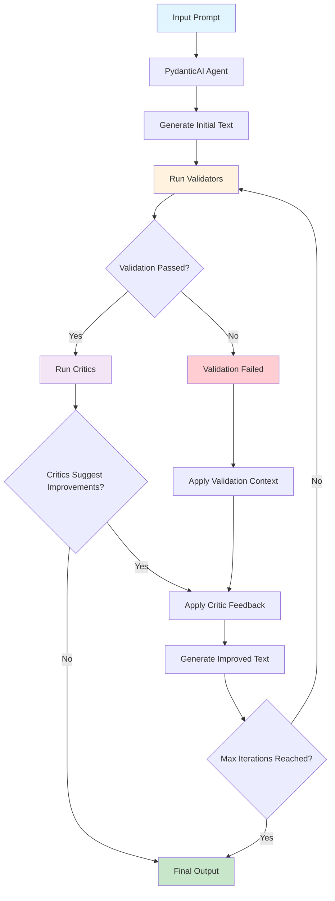

# Sifaka

[](https://python.org)
[](LICENSE)
[](https://github.com/sifaka-ai/sifaka)

## What is Sifaka?

Sifaka implements cutting-edge AI research papers as production-ready code. Instead of just generating text and hoping it's good, Sifaka creates a feedback loop where AI systems validate, critique, and iteratively improve their own outputs until they meet your quality standards.

**The Problem**: Most AI text generation is a black box - you send a prompt, get back text, and hope it's good enough. No validation, no improvement, no guarantees.

**Sifaka's Solution**: A transparent, observable pipeline where every generation goes through validation and improvement cycles, implementing techniques from papers like Reflexion, Constitutional AI, and Self-RAG.

**Key Innovations**:
- **Research-to-Production**: Direct implementations of 7+ major AI research papers
- **Guaranteed Quality**: Validation-first design ensures outputs meet your criteria
- **Complete Observability**: Full audit trails of every decision, iteration, and improvement
- **Iterative Improvement**: AI systems that get better at their tasks through self-critique
- ** (coming soon) Production-Ready**: Built on PydanticAI with type safety and async support

## Installation

```bash
# Core installation
pip install sifaka

# With model providers
pip install sifaka[models]

# With everything
pip install sifaka[all]
```

## Quick Start

```python
import asyncio
from pydantic_ai import Agent
from sifaka.agents import create_pydantic_chain
from sifaka.validators import LengthValidator
from sifaka.critics import ReflexionCritic
from sifaka.models import create_model

async def main():
    # Create PydanticAI agent
    agent = Agent("openai:gpt-4", system_prompt="You are a helpful assistant.")

    # Create Sifaka components
    validator = LengthValidator(min_length=50, max_length=500)
    critic = ReflexionCritic(model=create_model("openai:gpt-3.5-turbo"))

    # Create chain
    chain = create_pydantic_chain(
        agent=agent,
        validators=[validator],
        critics=[critic]
    )

    # Run the chain
    result = await chain.run("Write about renewable energy trends.")
    print(f"Generated: {result.text}")
    print(f"Iterations: {result.iteration}")

# Run the async function
asyncio.run(main())
```

## How It Works

1. **Create Thought**: A central state container tracks the entire process
2. **Generate**: PydanticAI agent generates text with optional tool calling
3. **Validate**: Built-in validators check the output quality
4. **Critique**: If validation fails, critics provide improvement feedback
5. **Iterate**: The process repeats with feedback until validation passes or max iterations reached

The `Thought` container maintains complete audit trails including prompts, generations, validation results, critic feedback, and tool calls.

## What Makes Sifaka Special?

**🔬 Research-Backed**: Direct implementations of breakthrough papers:
- **Reflexion** (Shinn et al. 2023) - Self-reflection for iterative improvement
- **Constitutional AI** (Anthropic) - Principle-based text evaluation
- **Self-Refine** (Madaan et al. 2023) - Iterative self-improvement through critique
- **Self-RAG** (Asai et al. 2023) - Retrieval-augmented self-critique
- **Meta-Rewarding** (Wu et al. 2024) - Two-stage judgment with meta-evaluation

**🎯 (coming soon) Production-Ready**: Built on PydanticAI with full type safety, async support, and tool calling

**📊 Complete Observability**: Every decision is logged - see exactly why your AI made each choice

**🔄 Guaranteed Improvement**: Systems that get measurably better through validation and critique cycles

## How Sifaka Works

Sifaka transforms unreliable AI text generation into a systematic quality assurance process through iterative validation and improvement:



### The Sifaka Process

1. **Generation**: PydanticAI agent generates initial text from your prompt
2. **Validation**: Multiple validators check the text against your requirements (length, format, content, etc.)
3. **Criticism**: If validation passes, critics evaluate quality and suggest improvements
4. **Improvement**: Failed validation or critic feedback triggers text regeneration with specific guidance
5. **Iteration**: Process repeats until validation passes and critics are satisfied (or max iterations reached)
6. **Observability**: Every step is logged in a `Thought` object for complete audit trails

### Key Benefits

- **Reliability**: Systematic validation ensures outputs meet your criteria
- **Quality**: Research-backed critics improve text beyond basic requirements
- **Transparency**: Complete audit trail shows why each decision was made
- **Flexibility**: Mix and match validators and critics for your specific needs
- **(coming soon) Production-Ready**: Built on PydanticAI with full async support and type safety

## Environment Setup

Set API keys in your environment:

```bash
export OPENAI_API_KEY=your_openai_api_key
export ANTHROPIC_API_KEY=your_anthropic_api_key
export GOOGLE_API_KEY=your_google_api_key
```

## Advanced Examples

### Adding Tool Calling

```python
import asyncio
from pydantic_ai import Agent
from sifaka.agents import create_pydantic_chain

async def main():
    # Create agent with tools
    agent = Agent("openai:gpt-4", system_prompt="You are a helpful assistant.")

    @agent.tool_plain
    def search_web(query: str) -> str:
        """Search the web for information."""
        return f"Search results for: {query}"

    @agent.tool_plain
    def calculate(expression: str) -> str:
        """Calculate mathematical expressions."""
        try:
            result = eval(expression)  # Note: Use safely in production
            return f"Result: {result}"
        except:
            return "Invalid expression"

    # Create chain with tools
    chain = create_pydantic_chain(agent=agent)
    result = await chain.run("Search for Python tutorials and calculate 15 * 24")
    print(f"Result: {result.text}")

asyncio.run(main())
```

### Using Multiple Critics

```python
import asyncio
from pydantic_ai import Agent
from sifaka.agents import create_pydantic_chain
from sifaka.critics import ConstitutionalCritic, SelfRefineCritic
from sifaka.validators import LengthValidator
from sifaka.models import create_model

async def main():
    # Create agent and critics
    agent = Agent("openai:gpt-4", system_prompt="You are a helpful assistant.")
    critic_model = create_model("openai:gpt-3.5-turbo")

    constitutional_critic = ConstitutionalCritic(
        model=critic_model,
        principles=["Be helpful", "Avoid harmful content", "Be accurate"]
    )
    self_refine_critic = SelfRefineCritic(model=critic_model)

    # Create chain with multiple critics
    chain = create_pydantic_chain(
        agent=agent,
        validators=[LengthValidator(min_length=100, max_length=1000)],
        critics=[constitutional_critic, self_refine_critic],
        max_improvement_iterations=3
    )

    result = await chain.run("Write about the benefits of renewable energy.")
    print(f"Final text: {result.text}")
    print(f"Iterations: {result.iteration}")

asyncio.run(main())
```

## Development

```bash
# Install development dependencies
uv pip install -e ".[dev]"

# Run tests
make test

# Format code
make format
```

## Contributing

We welcome contributions! See the [examples/](examples/) directory for working examples of different critics and validators.

## License

MIT License - see [LICENSE](LICENSE) file for details.
