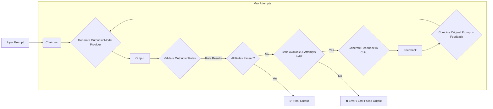

# Sifaka

Sifaka is a framework for improving large language model (LLM) outputs through validation, reflection, and refinement. It helps build more reliable AI systems by enforcing constraints and improving response quality.

[](https://www.python.org/downloads/)
[](https://opensource.org/licenses/MIT)

## Key Features

- ✅ **Validation Rules**: Enforce constraints like length limits and content restrictions
- ✅ **Response Critics**: Provide feedback to improve model outputs
- ✅ **Chain Architecture**: Create feedback loops for iterative improvement
- ✅ **Model Agnostic**: Works with Claude, OpenAI, and other LLM providers
- ✅ **Streamlined Configuration**: Unified configuration system using ClassifierConfig and RuleConfig

## Installation

```bash
# Basic installation
pip install sifaka

# Development installation
git clone https://github.com/your-username/sifaka.git
cd sifaka
pip install -e .
```

## Core Components

### 1. Rules

Rules validate responses against specific criteria:

```python
# Length rule checks if text is within specified length bounds
from sifaka.rules.formatting.length import create_length_rule

length_rule = create_length_rule(
    min_words=100,   # Minimum word count
    max_words=500,   # Maximum word count
)
```

### 2. Critics

Critics analyze and provide feedback on model outputs:

```python
from sifaka.critics.prompt import PromptCritic, PromptCriticConfig
from sifaka.models.anthropic import AnthropicProvider

# Create critic that uses Claude to provide feedback
critic = PromptCritic(
    llm_provider=claude_model,
    config=PromptCriticConfig(
        name="length_critic",
        description="A critic that helps adjust text length",
        system_prompt="You are an editor who specializes in adjusting text length."
    )
)
```

### 3. Chains

Chains orchestrate the validation and improvement process:

```python
from sifaka.chain import Chain

# Create a chain with a model, rules, and critic
chain = Chain(
    model=model,            # LLM Provider
    rules=[length_rule],    # Validation rules
    critic=critic,          # Improvement critic
    max_attempts=3          # Max retries before giving up
)

# Run the chain with a prompt
result = chain.run("Write about artificial intelligence")
```

### Sifaka Workflow Diagram

The diagram below illustrates the flow within the `Chain.run` method:



### 4. Classifiers

Classifiers analyze text and categorize it according to specific criteria:

```python
from sifaka.classifiers.toxicity import ToxicityClassifier
from sifaka.classifiers.base import ClassifierConfig

# Create a toxicity classifier with custom thresholds
classifier = ToxicityClassifier(
    config=ClassifierConfig(
        labels=["toxic", "severe_toxic", "obscene", "threat", "insult", "identity_hate", "non_toxic"],
        params={
            "general_threshold": 0.6,
            "severe_toxic_threshold": 0.8,
            "threat_threshold": 0.7,
        }
    )
)

# Classify text
result = classifier.classify("Your text to analyze")
print(f"Label: {result.label}, Confidence: {result.confidence}")
```

## Configuration System

Sifaka uses a streamlined configuration system with two main configuration classes:

### ClassifierConfig

Used by all classifiers to manage their configuration parameters:

```python
from sifaka.classifiers.base import ClassifierConfig

config = ClassifierConfig(
    labels=["positive", "neutral", "negative"],  # Available classification labels
    cost=1.0,                                   # Relative computational cost
    min_confidence=0.7,                         # Minimum confidence threshold
    params={                                    # All classifier-specific parameters
        "model_name": "default",
        "threshold": 0.5,
    }
)
```

### RuleConfig

Used by all rules to manage their configuration parameters:

```python
from sifaka.rules.base import RuleConfig, RulePriority

config = RuleConfig(
    priority=RulePriority.HIGH,      # Rule execution priority
    cache_size=100,                  # Cache size for validation results
    cost=1.0,                        # Relative computational cost
    params={                         # All rule-specific parameters
        "threshold": 0.7,
        "max_length": 500,
    }
)
```

## Usage Examples

### Example 1: Claude with Length Critic (Condense Text)

This example uses Claude with a critic to reduce verbose responses:

```python
# Load environment variables (.env file with ANTHROPIC_API_KEY)
from dotenv import load_dotenv
load_dotenv()

import os
from sifaka.models.anthropic import AnthropicProvider
from sifaka.models.base import ModelConfig
from sifaka.rules.formatting.length import create_length_rule
from sifaka.critics.prompt import PromptCritic, PromptCriticConfig
from sifaka.chain import Chain

# Configure Claude model
model = AnthropicProvider(
    model_name="claude-3-sonnet-20240229",
    config=ModelConfig(
        api_key=os.environ.get("ANTHROPIC_API_KEY"),
        temperature=0.7,
        max_tokens=1500,
    )
)

# Create length rule (max 400 words)
length_rule = create_length_rule(
    min_words=100,
    max_words=400,
    rule_id="word_limit_rule"
)

# Create critic to help condense text
critic = PromptCritic(
    llm_provider=model,
    config=PromptCriticConfig(
        name="length_critic",
        description="A critic that helps condense text while preserving meaning",
        system_prompt=(
            "You are an editor who specializes in making text more concise "
            "while preserving core content and meaning."
        )
    )
)

# Create chain with model, rule, and critic
chain = Chain(model=model, rules=[length_rule], critic=critic, max_attempts=3)

# Run the chain with a prompt that would naturally generate verbose output
result = chain.run("Explain how large language models work in detail")
```

### Example 2: Content Safety Validation

This example uses a toxicity classifier with a rule to ensure content safety:

```python
from sifaka.classifiers.toxicity import ToxicityClassifier
from sifaka.classifiers.base import ClassifierConfig
from sifaka.rules.content.safety import create_toxicity_rule
from sifaka.critics.prompt import PromptCritic, PromptCriticConfig
from sifaka.models import OpenAIProvider
from sifaka.chain import Chain
import os

# Configure OpenAI model for content generation
model = OpenAIProvider(
    model_name="gpt-4",
    config=ModelConfig(
        api_key=os.environ.get("OPENAI_API_KEY"),
        temperature=0.7
    )
)

# Configure toxicity classifier
classifier = ToxicityClassifier(
    config=ClassifierConfig(
        labels=["toxic", "severe_toxic", "obscene", "threat", "insult", "identity_hate", "non_toxic"],
        params={
            "general_threshold": 0.5,
            "severe_toxic_threshold": 0.7,
        }
    )
)

# Create toxicity rule
toxicity_rule = create_toxicity_rule(
    config={
        "threshold": 0.6,
        "indicators": [
            "hate",
            "offensive",
            "vulgar",
            "profanity",
        ]
    }
)

# Create critic to help improve content that violates toxicity rules
critic = PromptCritic(
    llm_provider=model,
    config=PromptCriticConfig(
        name="content_safety_critic",
        description="A critic that helps ensure content is appropriate and non-toxic",
        system_prompt=(
            "You are an editor who specializes in ensuring content is appropriate, "
            "respectful, and free from offensive or harmful language."
        )
    )
)

# Create chain with model, rule, and critic
chain = Chain(model=model, rules=[toxicity_rule], critic=critic, max_attempts=3)

# Run the chain
result = chain.run("Write a social media post about community values")
```

## Full Examples

For complete, runnable examples, see the `/examples` directory:

- `claude_length_critic.py`: Demonstrates reducing text length
- `claude_expand_length_critic.py`: Demonstrates expanding text length
- `toxicity_filtering.py`: Demonstrates content safety validation

## License

MIT
