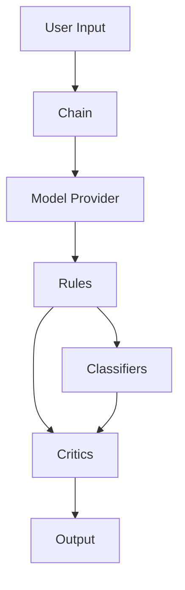
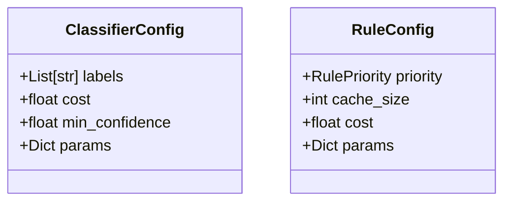

# Sifaka

Sifaka is a framework for improving large language model (LLM) outputs through validation, reflection, and refinement. It helps build more reliable AI systems by enforcing constraints and improving response quality.

[](https://www.python.org/downloads/)
[](https://opensource.org/licenses/MIT)

## Installation

Sifaka can be installed with different sets of dependencies depending on your needs:

### Basic Installation
```bash
pip install sifaka
```

### Installation with Specific Features

```bash
# Install with OpenAI support
pip install "sifaka[openai]"

# Install with Anthropic support
pip install "sifaka[anthropic]"

# Install with all classifiers
pip install "sifaka[classifiers]"

# Install with benchmarking tools
pip install "sifaka[benchmark]"

# Install everything (except development tools)
pip install "sifaka[all]"
```

### Development Installation
```bash
git clone https://github.com/sifaka-ai/sifaka.git
cd sifaka
pip install -e ".[dev]"  # Install with development dependencies
```

## Optional Dependencies

Sifaka's functionality can be extended through optional dependencies:

### Model Providers
- `openai`: OpenAI API support
- `anthropic`: Anthropic Claude API support
- `google-generativeai`: Google Gemini API support

### Classifiers
- `toxicity`: Toxicity detection using Detoxify
- `sentiment`: Sentiment analysis using VADER
- `profanity`: Profanity detection
- `language`: Language detection
- `readability`: Text readability analysis

### Benchmarking
- `benchmark`: Tools for performance benchmarking and analysis

## Key Features

- ✅ **Validation Rules**: Enforce constraints like length limits and content restrictions
- ✅ **Response Critics**: Provide feedback to improve model outputs
- ✅ **Chain Architecture**: Create feedback loops for iterative improvement
- ✅ **Model Agnostic**: Works with Claude, OpenAI, and other LLM providers
- ✅ **Streamlined Configuration**: Unified configuration system using ClassifierConfig and RuleConfig

## Architecture

Sifaka follows a modular architecture with several key components working together:



### Core Components

1. **Model Providers**
   - Interface with different LLM APIs (OpenAI, Anthropic, etc.)
   - Handle API key management and request formatting
   - Support streaming and non-streaming responses

2. **Rules**
   - Validate responses against specific criteria
   - Can be combined in rule chains
   - Support custom rule creation
   - Examples: length rules, style rules, content rules

3. **Critics**
   - Analyze and improve model outputs
   - Two main types:
     - `PromptCritic`: Single-pass improvement
     - `ReflexionCritic`: Learning-based improvement with memory
   - Can be chained for multi-step refinement

4. **Classifiers**
   - Analyze text for specific attributes
   - Support multiple classification types
   - Configurable thresholds and parameters
   - Can be used for content safety and quality control

5. **Chains**
   - Orchestrate the validation and improvement process
   - Support different retry strategies
   - Can combine multiple rules and critics
   - Handle error cases and fallbacks

### Configuration System

Sifaka uses a streamlined configuration system with two main configuration classes:



- `ClassifierConfig`: Manages classifier parameters and thresholds
- `RuleConfig`: Controls rule behavior and execution priority

## Integration with Guardrails

Sifaka provides seamless integration with [Guardrails AI](https://www.guardrailsai.com/), allowing you to:

- Use Guardrails' validation and transformation capabilities
- Leverage Guardrails' extensive rule library
- Combine both systems' strengths for robust content validation

Example integration:
```python
from sifaka.adapters.rules.guardrails_adapter import GuardrailsAdapter
from sifaka.domain import Domain

guardrails_adapter = GuardrailsAdapter()
domain = Domain({
    "name": "text",
    "rules": {
        "guardrails": {
            "enabled": True,
            "adapter": guardrails_adapter
        }
    }
})
```

## License

Sifaka is licensed under the MIT License. See [LICENSE](LICENSE) for details.


