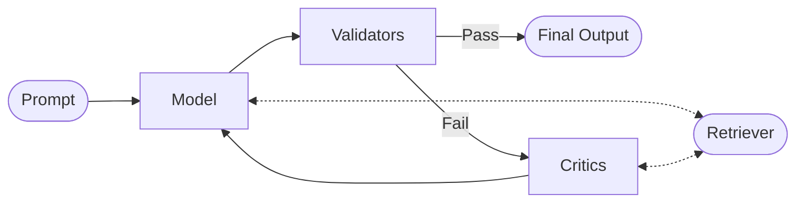

# Sifaka: A Framework for Reliable LLM Applications

Sifaka is a powerful framework for building reliable, robust, and responsible language model applications. It provides a modular architecture for text generation, validation, improvement, and evaluation with built-in guardrails.

## Core Concept

Sifaka's core concept is the **Chain** consisting of a **Thought** container, a **Model**, **Validators**, and **Critics**:

```
Chain = [Thought, Model, [Validators], [Critics]]
```

The Chain orchestrates the process of:

1. Creating a Thought with a Prompt
2. Retrieving relevant context for the prompt (optional)
3. Generating text using a language model with the prompt & context
4. Validating the generated text against specified criteria
5. If validation fails, improving the text using specialized critics
6. Repeating until validation passes or max attempts reached

## How Sifaka Works

### The Chain Process



1. **Input**: A prompt is provided to the Chain
2. **Model Generation**: The Model generates text based on the prompt and any retrieved context
3. **Validation**: Validators check if the generated text meets specified criteria
4. **Decision Point**:
   - If validation passes → Return the generated text as output
   - If validation fails → Send to Critics for improvement
5. **Critic Improvement**: Critics analyze the text, provide feedback, and suggest improvements
6. **Iteration**: The improved text is sent back to the Model for regeneration
7. **Repeat**: Steps 2-6 repeat until validation passes or max iterations are reached

### The Thought Container

The Thought container holds all information as it flows through the Chain:

- **Prompt**: The original user query or instruction
- **Context**: Information retrieved from external sources
  - **Pre-generation Context**: Retrieved before text generation (used by the Model)
  - **Post-generation Context**: Retrieved after text generation (used by Validators and Critics)
- **Generated Text**: The text produced by the Model
- **Validation Results**: Pass/fail status and details from each Validator
- **Critic Feedback**: Issues identified and suggestions from Critics
- **History**: Record of previous iterations

### Retriever Access

- **Both Models and Critics can directly call Retrievers**
- Models use Retrievers to get context before or during text generation
- Critics use Retrievers to get additional context when analyzing and improving text

## Key Components

- **Thought**: The central state container that passes information between all components
- **Chain**: The main orchestrator that coordinates the generation, validation, and improvement flow
- **Model**: Interface for text generation models (OpenAI, Anthropic, etc.)
  - Models can directly call retrievers to get additional context
- **Validators**: Components that check if text meets specific criteria (length, content, format, etc.)
- **Critics**: Specialized components that analyze and improve text quality
  - Critics can directly call retrievers to get additional context
  - **ReflexionCritic**: Uses reflection to improve text based on past feedback
  - **SelfRAGCritic**: Uses retrieval-augmented generation to improve text with external knowledge
  - **SelfRefineCritic**: Iteratively refines text through self-critique
  - **ConstitutionalCritic**: Ensures text adheres to specified principles
  - **PromptCritic**: General-purpose critic with customizable instructions
  - **NCriticsCritic**: Ensemble of specialized critics for comprehensive feedback
- **Retrievers**: Components that find relevant documents for context
  - Available to both models and critics
  - **InMemoryRetriever**: Simple in-memory document retrieval
  - **VectorDBRetriever**: Retrieval from vector databases (Milvus, Elasticsearch)

## Installation

```bash
pip install sifaka
pip install python-dotenv  # For loading environment variables
```

## Environment Setup

Sifaka requires API keys for the language models you want to use. You can set these as environment variables in your shell or use a `.env` file.

1. Copy the `.env.example` file to `.env`:
   ```bash
   cp .env.example .env
   ```

2. Edit the `.env` file with your API keys:
   ```
   OPENAI_API_KEY=your_openai_api_key_here
   ```

The examples will automatically load these environment variables using `python-dotenv`.

## Quick Start

```python
import os
from dotenv import load_dotenv
from sifaka.chain import Chain
from sifaka.validators.base import LengthValidator, RegexValidator
from sifaka.critics.base import ReflexionCritic
from sifaka.models.base import create_model
from sifaka.retrievers.base import MockRetriever
from sifaka.core.thought import Thought

# Load environment variables from .env file if it exists
load_dotenv()

# Get API key from environment variables
api_key = os.environ.get("OPENAI_API_KEY")
if not api_key:
    raise ValueError("OPENAI_API_KEY environment variable not set")

# Create a model
model = create_model("openai:gpt-4", api_key=api_key)

# Create validators and critics
length_validator = LengthValidator(min_length=50, max_length=1000)
content_validator = RegexValidator(
    forbidden_patterns=["violent", "harmful"]
)
critic = ReflexionCritic(model=model)

# Create a retriever
retriever = MockRetriever()

# Create a thought with the prompt
prompt = "Write a short story about a robot."
thought = Thought(prompt=prompt)

# Add pre-generation context
thought = retriever.retrieve_for_thought(thought, is_pre_generation=True)

# Create a chain with validators and critics
chain = Chain(
    model=model,
    prompt=prompt,
    max_improvement_iterations=3,
    apply_improvers_on_validation_failure=True,
)

chain.validate_with(length_validator)
chain.validate_with(content_validator)
chain.improve_with(critic)

# Run the chain
result = chain.run()

# Check the result
print(f"Generated text: {result.text}")

# Access validation results
for name, validation_result in result.validation_results.items():
    print(f"{name}: {'Passed' if validation_result.passed else 'Failed'}")
    if validation_result.issues:
        print(f"Issues: {validation_result.issues}")
```

## Working with the Thought Container

The Thought container is the central state container in Sifaka. It passes information between all components and maintains the history of iterations.

```python
from sifaka.core.thought import Thought, Document, CriticFeedback, ValidationResult
from datetime import datetime

# Create a basic thought
thought = Thought(
    prompt="Write a short story about a robot.",
    system_prompt="You are a creative writer."
)

# Add pre-generation context
thought = thought.add_pre_generation_context([
    Document(
        text="Robots are machines that can be programmed to perform tasks.",
        metadata={"source": "definition"},
        score=0.95
    ),
    Document(
        text="Asimov's Three Laws of Robotics are rules for robots in his science fiction.",
        metadata={"source": "literature"},
        score=0.85
    )
])

# Set generated text
thought = thought.set_text("Once upon a time, there was a robot named R2D2...")

# Add validation results
thought = thought.add_validation_result(
    "LengthValidator",
    ValidationResult(
        passed=True,
        message="Text meets length requirements",
        score=1.0
    )
)

# Add critic feedback
thought = thought.add_critic_feedback(
    CriticFeedback(
        critic_name="ReflexionCritic",
        issues=["The story lacks character development"],
        suggestions=["Add more details about the robot's personality"]
    )
)

# Create the next iteration
next_thought = thought.next_iteration()
print(f"Current iteration: {thought.iteration}")
print(f"Next iteration: {next_thought.iteration}")
print(f"History count: {len(next_thought.history)}")
```

## Working with Retrievers

Retrievers find relevant documents for a query and can be used by both models and critics at various points in the chain:

```python
from sifaka.core.thought import Thought
from sifaka.retrievers.base import InMemoryRetriever
from sifaka.models.base import create_model
from sifaka.critics.base import ReflexionCritic

# Create a retriever
retriever = InMemoryRetriever()

# Add documents to the retriever
retriever.add_document("doc1", "Robots are machines that can be programmed to perform tasks.")
retriever.add_document("doc2", "Asimov's Three Laws of Robotics are rules for robots in his science fiction.")
retriever.add_document("doc3", "Machine learning allows robots to learn from data and improve over time.")

# Create a thought with the prompt
thought = Thought(prompt="Write a short story about a robot that learns.")

# Method 1: Standalone retrieval before model generation
thought = retriever.retrieve_for_thought(thought, is_pre_generation=True)

# Create a model with direct access to the retriever
model = create_model("mock:default", retriever=retriever)

# Method 2: Model can call the retriever directly during generation
text = model.generate_with_thought(thought)
thought = thought.set_text(text)

# Method 3: Standalone retrieval after model generation
thought = retriever.retrieve_for_thought(thought, is_pre_generation=False)

# Create a critic with direct access to the retriever
critic = ReflexionCritic(model=model, retriever=retriever)

# Method 4: Critic can call the retriever directly during critique
critique = critic.critique(thought)
thought = thought.set_critique(critique)

# Print the retrieved context
print("Pre-generation context:")
for doc in thought.pre_generation_context:
    print(f"- {doc.text} (score: {doc.score})")

print("\nPost-generation context:")
for doc in thought.post_generation_context:
    print(f"- {doc.text} (score: {doc.score})")
```

## Working with Critics

Critics analyze text, identify issues, and provide suggestions for improvement. They can also use retrievers to get additional context:

```python
from sifaka.core.thought import Thought
from sifaka.critics.base import ReflexionCritic
from sifaka.models.base import create_model
from sifaka.retrievers.base import InMemoryRetriever

# Create a retriever
retriever = InMemoryRetriever()
retriever.add_document("doc1", "Quantum computing uses quantum bits or qubits.")
retriever.add_document("doc2", "Superposition allows qubits to exist in multiple states simultaneously.")
retriever.add_document("doc3", "Quantum entanglement connects qubits in ways that classical bits cannot be connected.")

# Create a model
model = create_model("mock:default")

# Create a critic with direct access to the retriever
critic = ReflexionCritic(model=model, retriever=retriever)

# Create a thought with text
thought = Thought(
    prompt="Explain quantum computing to a high school student.",
    text="Quantum computing uses qubits which can be 0 and 1 at the same time due to superposition."
)

# The critic can use the retriever to get additional context during critique
critique = critic.critique(thought)
thought = thought.set_critique(critique)

# The critic can also use the retriever during improvement
improved_text = critic.improve(thought)
thought = thought.set_text(improved_text)

# Print the critique and improved text
print("Critique:")
print(f"Issues: {critique['issues']}")
print(f"Suggestions: {critique['suggestions']}")
print(f"\nImproved text: {improved_text}")
```

## Persistence Options

The Thought container can be persisted in various ways:

```python
from sifaka.core.thought import Thought
import json

# Create a thought
thought = Thought(prompt="Write a short story about a robot.")

# Serialize to JSON
thought_json = thought.model_dump_json()

# Save to file
with open("thought.json", "w") as f:
    f.write(thought_json)

# Load from JSON
with open("thought.json", "r") as f:
    loaded_json = f.read()
    loaded_thought = Thought.model_validate_json(loaded_json)

print(f"Loaded thought prompt: {loaded_thought.prompt}")
```

In the future, Sifaka will support additional persistence options:
- Redis for caching
- Vector databases (Milvus, Elasticsearch) for semantic search
- PostgreSQL for relational storage with history tracking

## Documentation


## Development

### Code Formatting

Sifaka uses automated code formatting to maintain consistent code style. We use the following tools:

- **Black**: Code formatting
- **isort**: Import sorting
- **autoflake**: Removing unused imports
- **Ruff**: Linting with automatic fixes
- **mypy**: Type checking

To set up the development environment:

```bash
# Install development dependencies
make install-dev

# Format code
make format

# Run linting checks
make lint

# Run tests
make test
```

The CI pipeline will automatically format code in pull requests, so you don't need to worry about formatting issues.

## Contributing

Contributions are welcome! Please feel free to submit a Pull Request. See [CONTRIBUTING.md](docs/CONTRIBUTING.md) for guidelines.

## License

[MIT License](LICENSE)
