# Sifaka

[](https://python.org)
[](LICENSE)
[](https://github.com/sifaka-ai/sifaka)

## What is Sifaka?

Sifaka implements cutting-edge AI research papers as working code. Instead of just generating text and hoping it's good, Sifaka creates a feedback loop where AI systems validate, critique, and iteratively improve their own outputs until they meet your quality standards.

**The Problem**: Most AI text generation is a black box - you send a prompt, get back text, and hope it's good enough. No validation, no improvement, no guarantees.

**Sifaka's Solution**: A transparent, observable pipeline where every generation goes through validation and improvement cycles, implementing techniques from papers like Reflexion, Constitutional AI, and Self-RAG.

**Key Innovations**:
- **Research-to-Code**: Direct implementations of 8+ major AI research papers
- **Guaranteed Quality**: Validation-first design ensures outputs meet your criteria
- **Complete Observability**: Full audit trails of every decision, iteration, and improvement
- **Iterative Improvement**: AI systems that get better at their tasks through self-critique
- **Production Storage**: Multiple storage backends (Memory, File, Redis, PostgreSQL) with hybrid failover
- **Built on PydanticAI**: Type safety, structured output, and async support

## Installation

```bash
# Core installation
pip install sifaka

# With model providers
pip install sifaka[openai,anthropic,gemini]

# With storage backends
pip install sifaka[redis]  # Redis storage
pip install sifaka[postgresql]  # PostgreSQL storage

# With everything
pip install sifaka[all]
```

## Quick Start

### 🎯 PRIMARY API - Configuration Presets (Recommended)

**For 90% of use cases, just use the presets:**

```python
import asyncio
import sifaka

async def main():
    # Ready-to-use presets for common scenarios
    result = await sifaka.academic_writing("Explain quantum computing")
    result = await sifaka.creative_writing("Write a short story about AI")
    result = await sifaka.technical_docs("Document the API endpoints")
    result = await sifaka.business_writing("Write a project proposal")
    result = await sifaka.quick_draft("Brainstorm marketing ideas")
    result = await sifaka.high_quality("Write a research summary")

    print(f"Result: {result.final_text}")

asyncio.run(main())
```

**Available Presets:**
- `academic_writing` / `academic` - Formal tone, comprehensive coverage, 300+ words
- `creative_writing` / `creative` - Engaging narrative, emotional impact, up to 800 words
- `technical_docs` / `technical` - Clear explanations, practical examples, 200+ words
- `business_writing` / `business` - Professional tone, concise communication, up to 500 words
- `quick_draft` / `draft` - Speed over perfection, minimal processing, 2 rounds
- `high_quality` / `premium` - Maximum quality, all critics, 7 rounds, 400+ words

### ⚙️ SECONDARY API - Simple Customization

**When presets aren't enough:**

```python
import asyncio
import sifaka

async def main():
    # Simple customization with sensible defaults
    result = await sifaka.improve(
        "Write about renewable energy benefits",
        max_rounds=5,
        model="openai:gpt-4",
        min_length=200,
        critics=["reflexion", "constitutional"]
    )
    print(f"Improved: {result.final_text}")

asyncio.run(main())
```

### 🔧 ADVANCED API - Full Control

**For complex use cases requiring full configuration:**

```python
import asyncio
from sifaka.advanced import SifakaEngine, SifakaConfig

async def main():
    # Full configuration control
    config = SifakaConfig(
        model="openai:gpt-4",
        max_iterations=5,
        critics=["reflexion", "constitutional"],
        validators=[...],  # Custom validators
        enable_persistence=True,
    )
    engine = SifakaEngine(config=config)

    result = await engine.think("Write about renewable energy trends.")
    print(f"Generated: {result.final_text}")

asyncio.run(main())
```

## How It Works

1. **Create Thought**: A central state container tracks the entire process
2. **Generate**: PydanticAI agent generates text with optional tool calling
3. **Validate**: Built-in validators check the output quality
4. **Critique**: If validation fails, critics provide improvement feedback
5. **Iterate**: The process repeats with feedback until validation passes or max iterations reached

The `Thought` container maintains complete audit trails including prompts, generations, validation results, critic feedback, and tool calls.

## What Makes Sifaka Special?

**🔬 Research-Backed**: Direct implementations of breakthrough papers:
- **Reflexion** (Shinn et al. 2023) - Self-reflection for iterative improvement
- **Constitutional AI** (Anthropic) - Principle-based text evaluation
- **Self-Refine** (Madaan et al. 2023) - Iterative self-improvement through critique
- **Self-RAG** (Asai et al. 2023) - Retrieval-augmented self-critique
- **Meta-Rewarding** (Wu et al. 2024) - Two-stage judgment with meta-evaluation

**🎯 Built on PydanticAI**: Full type safety, structured output, async support, and tool calling (both projects are in active development)

**📊 Complete Observability**: Every decision is logged with full audit trails and conversation history

**🔄 Iterative Improvement**: Systems that get better through validation and critique cycles with configurable weighting

## How Sifaka Works

Sifaka uses PydanticAI's graph-based workflow to systematically improve AI text generation:

### Core Workflow

```mermaid
graph TD
    ST[📝 SifakaThought] --> GN[🤖 Generate]
    GN --> VN[✅ Validate]
    VN --> CN[🔍 Critique]
    CN --> Decision{Continue?}
    Decision -->|Yes| GN
    Decision -->|No| END[🎯 Complete]

    classDef stateContainer fill:#f3e5f5,stroke:#7b1fa2,stroke-width:3px
    classDef graphNode fill:#e3f2fd,stroke:#1976d2,stroke-width:3px
    classDef decision fill:#fff3e0,stroke:#f57c00,stroke-width:2px
    classDef endNode fill:#c8e6c9,stroke:#388e3c,stroke-width:3px

    class ST stateContainer
    class GN,VN,CN graphNode
    class Decision decision
    class END endNode
```



### Component Details

```mermaid
graph LR
    subgraph "📝 State Management"
        ST["SifakaThought<br/>• User prompt<br/>• Generation history<br/>• Validation results<br/>• Critique feedback"]
    end

    subgraph "🤖 PydanticAI Graph Nodes"
        GN["GenerateNode<br/>• Run AI agent<br/>• Use tools<br/>• Generate text"]
        VN["ValidateNode<br/>• Check requirements<br/>• Run validators<br/>• Pass/fail results"]
        CN["CritiqueNode<br/>• Apply critics<br/>• Research techniques<br/>• Suggest improvements"]
    end

    classDef stateContainer fill:#f3e5f5,stroke:#7b1fa2,stroke-width:2px
    classDef graphNode fill:#e3f2fd,stroke:#1976d2,stroke-width:2px

    class ST stateContainer
    class GN,VN,CN graphNode
```



### Decision Logic

```mermaid
graph TD
    CN[🔍 Critique Complete] --> Decision{Continue?}
    Decision -->|🔄 Yes<br/>Need improvements| GN[🤖 Generate Again]
    Decision -->|🏁 No<br/>Good enough or max iterations| END[🎯 Complete]

    classDef decision fill:#fff3e0,stroke:#f57c00,stroke-width:2px
    classDef action fill:#e8f5e8,stroke:#388e3c,stroke-width:2px

    class Decision decision
    class GN,END action
```



**Continue if:** Validation failed OR critics suggest improvements (and under max iterations)
**Stop if:** Everything passed and no suggestions OR max iterations reached

### The Sifaka Process

1. **Thought Creation**: A `SifakaThought` container is created to track the entire process with complete audit trails
2. **Generation**: PydanticAI agent generates text, incorporating weighted feedback from previous iterations
3. **Validation**: All configured validators run in parallel to check requirements (length, format, content, etc.)
4. **Critique**: All critics ALWAYS run in parallel to evaluate quality and suggest improvements (regardless of validation results)
5. **Feedback Weighting**: Validation feedback (60% weight) and critic feedback (40% weight) are combined for next iteration
6. **Conversation History**: Each iteration's complete conversation history (requests and responses) is preserved
7. **Decision**: Based on weighted feedback, the system either continues iterating or finalizes the result

### Key Features

- **Simple Architecture**: Clear workflow with PydanticAI graph orchestration
- **Complete Audit Trails**: Every generation, validation, and critique is logged with full conversation history
- **Configurable Weighting**: Default 60/40 split between validation and critic feedback (customizable)
- **Research-Backed Critics**: Implementations of Reflexion, Constitutional AI, Self-Refine, and more
- **Type Safety**: Full Pydantic integration throughout the workflow
- **Active Development**: Built on PydanticAI with async support and structured output

## Environment Setup

Set API keys in your environment:

```bash
export OPENAI_API_KEY=
export ANTHROPIC_API_KEY=
export GUARDRAILS_API_KEY=
export HUGGINGFACE_API_KEY=
export GEMINI_API_KEY=
export GROQ_API_KEY=
```

## 🤖 Transformer-Based Text Classifiers

Sifaka includes 8 state-of-the-art text classifiers, all powered by Hugging Face Transformers:

```python
from sifaka.classifiers import (
    create_sentiment_classifier,    # Sentiment analysis (positive/negative/neutral)
    create_toxicity_classifier,     # Toxicity and harmful content detection
    create_spam_classifier,         # Spam vs. legitimate content detection
    create_language_classifier,     # Language detection (70+ languages)
    create_readability_classifier,  # Text complexity and grade level
    create_emotion_classifier,      # Emotion detection (joy, anger, fear, etc.)
    create_intent_classifier,       # Intent and purpose classification
)

# Example: Analyze text sentiment
classifier = create_sentiment_classifier(cached=True)
result = await classifier.classify_async("I love this new feature!")
print(f"Sentiment: {result.label} (confidence: {result.confidence:.3f})")
# Output: Sentiment: positive (confidence: 0.998)
```

### Key Features:
- **🎯 High Accuracy**: State-of-the-art transformer models (BERT, RoBERTa, DistilBERT)
- **⚡ Fast Processing**: Optimized for production use with caching
- **🌍 Multilingual**: Support for 70+ languages
- **🔧 Customizable**: Choose from multiple models per classifier
- **📊 Rich Metadata**: Detailed confidence scores and processing metrics

### Installation:
```bash
# Default: PyTorch backend (recommended)
pip install "sifaka[classifiers]"

# Alternative: TensorFlow backend
pip install "sifaka[classifiers-tf]"

# Alternative: JAX backend
pip install "sifaka[classifiers-jax]"

# Or with uv (recommended package manager)
uv pip install "sifaka[classifiers]"
```

**Python Version Support**: Python 3.9+ (3.9, 3.10, 3.11, 3.12)

See [examples/](examples/) for comprehensive classifier demonstrations.

## Validators and Critics with Classifier Integration

Sifaka provides comprehensive validation and critique capabilities, including classifier-based validators:

```python
import asyncio
from sifaka import SifakaEngine
from sifaka.graph import SifakaDependencies
from sifaka.validators import LengthValidator, ContentValidator
from sifaka.validators.classifier import (
    sentiment_validator,
    create_classifier_validator
)
from sifaka.classifiers import (
    create_readability_classifier,
    create_emotion_classifier,
    create_intent_classifier
)

async def main():
    # Create multiple validators
    validators = [
        LengthValidator(min_length=50, max_length=500),
        ContentValidator(required=["renewable", "energy"]),

        # Classifier-based validators using ClassifierValidator
        sentiment_validator(
            forbidden_sentiments=["negative"],
            min_confidence=0.7,
            cached=True
        ),

        create_classifier_validator(
            classifier=create_readability_classifier(cached=True),
            threshold=0.6,
            valid_labels=["high", "college"],
            name="readability_validation"
        ),
        create_classifier_validator(
            classifier=create_emotion_classifier(cached=True),
            threshold=0.3,
            invalid_labels=["anger", "fear"],
            name="emotion_validation"
        ),
        create_classifier_validator(
            classifier=create_intent_classifier(cached=True),
            threshold=0.4,
            valid_labels=["informative", "educational"],
            name="intent_validation"
        )
    ]

    # Create engine with multiple critics from different providers
    deps = SifakaDependencies(
        generator="openai:gpt-4",
        critics={
            "constitutional": "openai:gpt-3.5-turbo",
            "reflexion": "anthropic:claude-3-haiku-20240307",
            "self_refine": "groq:llama-3.1-8b-instant",
            "n_critics": "gemini-1.5-flash"
        },
        validators=validators,  # All validators including classifier-based ones
        always_apply_critics=False,
        validation_weight=0.6,
        critic_weight=0.4
    )

    engine = SifakaEngine(dependencies=deps)

    # Generate content with comprehensive validation and critique
    thought = await engine.think(
        "Write an informative article about renewable energy sources"
    )

    print(f"Final text: {thought.final_text}")
    print(f"Iterations: {thought.iteration}")
    print(f"Validations run: {len(thought.validations)}")
    print(f"Critiques applied: {len(thought.critiques)}")

    # Show validation details
    for validation in thought.validations:
        print(f"Validator '{validation.validator}': {'✅ PASSED' if validation.passed else '❌ FAILED'}")

asyncio.run(main())
```

## Advanced Examples

### Using SifakaEngine with Web Search Tools

```python
import asyncio
from pydantic_ai import Agent
from pydantic_ai.common_tools.duckduckgo import duckduckgo_search_tool
from sifaka import SifakaEngine
from sifaka.graph import SifakaDependencies
from sifaka.validators import LengthValidator
from sifaka.critics import ConstitutionalCritic

async def main():
    # Create PydanticAI agent with DuckDuckGo search tool
    agent = Agent(
        "openai:gpt-4",
        system_prompt="You are a helpful assistant that can search the web for current information.",
        tools=[duckduckgo_search_tool()]
    )

    # Create custom dependencies
    dependencies = SifakaDependencies(
        generator=agent,
        validators=[LengthValidator(min_length=100, max_length=1000)],
        critics={"constitutional": ConstitutionalCritic(model_name="openai:gpt-3.5-turbo")},
        retrievers={}
    )

    # Create engine
    engine = SifakaEngine(dependencies=dependencies)

    # Process thought with web search capability
    thought = await engine.think(
        "Search for the latest developments in renewable energy technology in 2024 and summarize the key innovations"
    )

    print(f"Final text: {thought.final_text}")
    print(f"Tool calls made: {len(thought.tool_calls)}")

    # Show tool call details
    for i, tool_call in enumerate(thought.tool_calls):
        print(f"Tool call {i+1}: {tool_call.tool_name}")

asyncio.run(main())
```

### Using Multiple Critics and Storage

```python
import asyncio
from sifaka import SifakaEngine
from sifaka.graph import SifakaDependencies
from sifaka.validators import LengthValidator, ContentValidator
from sifaka.utils.thought_inspector import (
    print_iteration_details,
    print_all_iterations,
    get_latest_conversation_messages,
    get_conversation_messages_for_iteration,
    print_conversation_messages,
    print_critic_summary,
    print_validation_summary,
    get_thought_overview,
)

async def main():
    length_validator = LengthValidator(min_length=100, max_length=3000)

    content_validator = ContentValidator(
        required=["renewable", "energy"],
        case_sensitive=False,  # Ensure case-insensitive matching
        prohibited=["politics", "political"]
    )

    # Create dependencies with multiple components
    dependencies = SifakaDependencies(
        generator="openai:gpt-4",
        validators=[length_validator, content_validator],
        critics={
            "constitutional": "openai:gpt-3.5-turbo",
            "self_refine": "openai:gpt-3.5-turbo",
            "reflexion": "openai:gpt-3.5-turbo"
        }
    )

    # Create engine
    engine = SifakaEngine(dependencies=dependencies)

    # Process thought
    thought = await engine.think("Write about the benefits of renewable energy.", max_iterations=3)

    print(f"Final text: {thought.final_text}")
    print(f"Iterations: {thought.iteration}")
    print(f"Validation results: {len(thought.validations)}")
    print(f"Critique results: {len(thought.critiques)}")

    # NEW: Use the utility functions
    print("\n" + "="*60)
    print("LATEST ITERATION DETAILS")
    print("="*60)
    print_iteration_details(thought)

    print("\n" + "="*60)
    print("ALL ITERATIONS")
    print("="*60)
    print_all_iterations(thought)

    print("\n" + "="*60)
    print("CRITIC FEEDBACK SUMMARY")
    print("="*60)
    print_critic_summary(thought)

    print("\n" + "="*60)
    print("VALIDATION SUMMARY")
    print("="*60)
    print_validation_summary(thought)

    print("\n" + "="*60)
    print("CONVERSATION MESSAGES (TRUNCATED)")
    print("="*60)
    print_conversation_messages(thought, full_messages=False)

    # Get overview
    overview = get_thought_overview(thought)
    print("\n" + "="*60)
    print("THOUGHT OVERVIEW")
    print("="*60)
    for key, value in overview.items():
        print(f"{key}: {value}")

    # Direct access to conversation messages
    latest_messages = get_latest_conversation_messages(thought)
    print(f"\nLatest iteration has {len(latest_messages)} conversation messages")

asyncio.run(main())
```

## 📚 Documentation

### Quick Links
- **[🚀 Getting Started](docs/GETTING_STARTED.md)** - 5-minute tutorial to get up and running
- **[🏗️ Architecture Guide](docs/ARCHITECTURE.md)** - How Sifaka works under the hood
- **[📖 API Reference](docs/API_REFERENCE.md)** - Complete API documentation
- **[⚡ Performance Guide](docs/PERFORMANCE.md)** - Optimization tips and benchmarks
- **[🛠️ Troubleshooting](docs/TROUBLESHOOTING.md)** - Common issues and solutions

### Examples
- **[📝 Examples Directory](examples/)** - Real-world usage examples
- **[🎯 Use Case Examples](examples/README.md)** - Examples by domain and complexity

### Advanced Topics
- **[🔧 Installation Guide](docs/INSTALLATION.md)** - Detailed installation instructions
- **[🏪 Storage Backends](docs/BACKENDS.md)** - Production storage configurations
- **[🎨 Design Decisions](docs/DESIGN_DECISIONS.md)** - Architecture and design rationale

## 🎯 Why Choose Sifaka?

| Feature | Traditional AI | Sifaka |
|---------|---------------|--------|
| **Quality Guarantee** | ❌ Hope for the best | ✅ Validation-first design |
| **Improvement Process** | ❌ Single generation | ✅ Iterative improvement |
| **Observability** | ❌ Black box | ✅ Complete audit trails |
| **Research-Backed** | ❌ Ad-hoc approaches | ✅ Proven academic techniques |
| **Production Ready** | ❌ Prototype quality | ✅ Enterprise storage & scaling |

## 🚀 What's Next?

1. **[Get Started](docs/GETTING_STARTED.md)** - 5-minute tutorial
2. **[Try Examples](examples/)** - Real-world use cases
3. **[Read Architecture](docs/ARCHITECTURE.md)** - Understand the system
4. **[Optimize Performance](docs/PERFORMANCE.md)** - Production tips
5. **[Join Community](https://github.com/sifaka-ai/sifaka)** - Contribute and discuss

## 🔬 Research Foundation

Sifaka implements cutting-edge research papers as working code:

- **[Reflexion](https://arxiv.org/abs/2303.11366)** (Shinn et al. 2023) - Self-reflection for iterative improvement
- **[Constitutional AI](https://arxiv.org/abs/2212.08073)** (Anthropic) - Principle-based text evaluation
- **[Self-Refine](https://arxiv.org/abs/2303.17651)** (Madaan et al. 2023) - Iterative self-improvement
- **[Self-RAG](https://arxiv.org/abs/2310.11511)** (Asai et al. 2023) - Retrieval-augmented self-critique
- **[Meta-Rewarding](https://arxiv.org/abs/2407.19594)** (Wu et al. 2024) - Two-stage judgment systems

## 🏆 Success Stories

> "Sifaka transformed our content creation pipeline. We went from hoping our AI-generated content was good enough to **guaranteeing** it meets our quality standards." - *Content Team Lead*

> "The complete audit trail is a game-changer for compliance. We can show exactly how every piece of content was validated and improved." - *Legal Technology Director*

> "Implementation of research papers as working code saved us months of development time." - *AI Research Engineer*

## 🤝 Community & Support

- **[GitHub Discussions](https://github.com/sifaka-ai/sifaka/discussions)** - Community Q&A
- **[Issues](https://github.com/sifaka-ai/sifaka/issues)** - Bug reports and feature requests
- **[Contributing](docs/CONTRIBUTING.md)** - How to contribute
- **[Roadmap](https://github.com/sifaka-ai/sifaka/projects)** - Upcoming features

---

**Ready to guarantee your AI text quality?** [Get started in 5 minutes →](docs/GETTING_STARTED.md)

## Development

```bash
# Install development dependencies
uv pip install -e ".[dev]"

# Run tests
make test

# Format code
make format
```

## Contributing

We welcome contributions! See the [examples/](examples/) directory for working examples of different critics and validators.

## License

MIT License - see [LICENSE](LICENSE) file for details.
