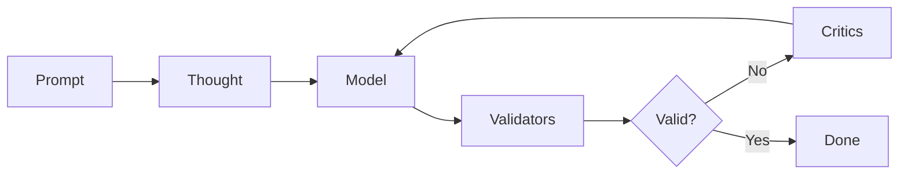

# Sifaka Architecture

Sifaka is a framework for AI text generation with validation and iterative improvement. The core architecture uses a `Thought` container that flows through a `Chain` of components: Model → Validators → Critics.

## Execution Flow

1. Create a `Thought` from the input prompt
2. Model generates text and adds it to the `Thought`
3. Validators check the generated text and record results in the `Thought`
4. If validation fails or critics are configured to always run, critics provide feedback
5. Process repeats with the feedback until validation passes or max iterations reached



## Core Components

### Thought Container
Central state object that carries data between components. Contains the prompt, generated text, validation results, critic feedback, and iteration history. Provides immutable state management and complete audit trail.

### Chain
Orchestrates the execution flow. Runs model → validators → critics in sequence, handles retrieval operations, and manages iteration limits. Entry point is `chain.run()`.

### Models
Generate text from prompts. Supported types include OpenAI, Anthropic, HuggingFace, Ollama, and Mock implementations. Interface: `model.generate_with_thought(thought) → (text, prompt_used)`.

### Validators
Check generated text against specified requirements. Types include length constraints, regex patterns, content filters, and ML classifiers. Interface: `validator.validate(text) → ValidationResult(passed=bool)`.

### Critics
Provide improvement suggestions for generated text. Types include Reflexion, Self-RAG, Constitutional, and N-Critics ensemble approaches. Interface: `critic.critique(thought) → CriticFeedback(suggestions=list)`.

## How Chain Execution Actually Works

### Basic Flow
```python
# This is what happens when you call chain.run()
thought = Thought(prompt="Write a story")

# 1. Model generates text
thought.text = model.generate_with_thought(thought)

# 2. Validators check quality
for validator in validators:
    result = validator.validate(thought.text)
    thought.validation_results[validator.name] = result

# 3. If validation fails OR always_apply_critics=True
if not all_passed or always_apply_critics:
    for critic in critics:
        feedback = critic.critique(thought)
        thought.critic_feedback.append(feedback)

    # 4. Create next iteration with feedback
    thought = thought.next_iteration()
    # Go back to step 1 (up to max_iterations)

return thought  # Final result
```

### With Retrievers (Optional)
```python
# Chain orchestrates retrieval automatically
thought = Thought(prompt="Write about AI")

# 1. PRE-generation retrieval (gives model context)
for retriever in retrievers:
    thought = retriever.retrieve_for_thought(thought, is_pre_generation=True)

# 2. Model generates (using retrieved context)
thought.text = model.generate_with_thought(thought)

# 3. POST-generation retrieval (gives critics context)
for retriever in retrievers:
    thought = retriever.retrieve_for_thought(thought, is_pre_generation=False)

# 4. Validators and critics run as normal
```

## The Thought Object

The `Thought` object serves as the data container that flows through the chain:

```python
class Thought:
    # Basic info
    prompt: str              # "Write a story about robots"
    text: str               # "Once upon a time, there was a robot..."
    iteration: int          # 0, 1, 2... (how many times we've improved)

    # Validation results
    validation_results: dict # {"length": ValidationResult(passed=True), ...}

    # Critic feedback
    critic_feedback: list   # [CriticFeedback(suggestions=["Add more detail"]), ...]

    # Retrieved context (if using retrievers)
    pre_generation_context: list   # Documents retrieved before generation
    post_generation_context: list  # Documents retrieved after generation

    # History tracking
    history: list           # References to previous iterations
    parent_id: str         # ID of previous iteration
```

### Key Methods
```python
# Add context from retrievers
thought = thought.add_pre_generation_context(documents)

# Add validation results
thought = thought.add_validation_result("length", ValidationResult(passed=True))

# Add critic feedback
thought = thought.add_critic_feedback(CriticFeedback(suggestions=["Be more specific"]))

# Create next iteration (preserves history)
next_thought = thought.next_iteration()

# Serialize to JSON
json_data = thought.model_dump_json()
```

## Storage & Retrieval

### 3-Tier Storage System
Memory → Redis → Milvus architecture:

- **L1 (Memory)**: Fastest access, LRU cache, process-local
- **L2 (Redis)**: Fast network access, cross-process shared cache
- **L3 (Milvus)**: Persistent storage with vector search

```python
# All storage follows the same pattern
storage = SifakaStorage(redis_config, milvus_config)

# Get specialized storage
thought_storage = storage.get_thought_storage()
cached_retriever = storage.get_retriever_cache(base_retriever)

# Automatic tier management
value = storage.get(key)  # Checks L1 → L2 → L3, caches in faster tiers
storage.set(key, value)   # Saves to L1, async saves to L2 + L3
```

### Retrievers
Find relevant documents for context. The Chain orchestrates retrieval timing automatically.

```python
# Chain handles retrieval for you
chain = Chain(model=model, retrievers=[retriever])
result = chain.run()  # Retriever runs at the right times

# Manual usage (if needed)
documents = retriever.retrieve("search query")
thought = retriever.retrieve_for_thought(thought, is_pre_generation=True)
```

Available types:
- **MockRetriever**: Returns predefined documents for testing
- **InMemoryRetriever**: Keyword search in memory
- **CachedRetriever**: Wraps any retriever with 3-tier caching
- **ResilientRetriever**: Adds error recovery with fallbacks

## Design Principles

### 1. Consistent APIs
All components implement standardized interfaces for interoperability and type safety.

### 2. Composable Architecture
Components can be mixed and matched:
```python
chain = Chain(
    model=any_model,           # OpenAI, Anthropic, HuggingFace, Ollama
    validators=[any_validators], # Length, Regex, Content, ML classifiers
    critics=[any_critics],      # Reflexion, Self-RAG, Constitutional
    retrievers=[any_retrievers] # Mock, InMemory, Redis, Milvus
)
```

### 3. Immutable State Management
- Each iteration creates a new `Thought` object
- Previous iterations preserved in `thought.history`
- Complete audit trail maintained

### 4. Error Recovery
- Circuit breakers prevent cascading failures
- Automatic retries with exponential backoff
- Fallback mechanisms for service failures
- Graceful degradation when components fail

### 5. Performance Monitoring
- Built-in timing for all components
- Bottleneck detection and analysis
- JSON export for external analysis
- Minimal performance overhead

## Error Recovery

The framework implements automatic error recovery:

```python
# This is what happens behind the scenes
try:
    result = model.generate(prompt)
except APIError:
    if circuit_breaker.is_open():
        raise FastFailError("Service unavailable")

    # Try with exponential backoff
    for attempt in [1, 2, 4, 8]:  # seconds
        try:
            time.sleep(attempt)
            result = model.generate(prompt)
            break
        except APIError:
            continue
    else:
        # Use fallback model if available
        if fallback_model:
            result = fallback_model.generate(prompt)
        else:
            raise AllRetriesFailedError()
```

### Features
- Automatic retries with exponential backoff
- Circuit breakers to prevent cascading failures
- Fallback mechanisms for service failures
- Graceful degradation under partial failures

## Performance Monitoring

Chains automatically track execution metrics:

```python
# Run your chain normally
result = chain.run()

# Get performance data
perf = chain.get_performance_summary()
print(f"Total time: {perf['total_time']:.2f}s")
print(f"Model time: {perf['model_time']:.2f}s")
print(f"Validation time: {perf['validation_time']:.2f}s")

# Find bottlenecks
bottlenecks = chain.get_performance_bottlenecks()
for component, time in bottlenecks:
    print(f"Slow component: {component} ({time:.2f}s)")

# Export for analysis
import json
with open("performance.json", "w") as f:
    json.dump(perf, f)
```

### Features
- Zero-configuration monitoring
- Automatic bottleneck detection
- JSON export for external analysis
- Minimal performance overhead

## Summary

The architecture provides:

1. Simple API: `Chain(model, validators, critics, retrievers).run()`
2. Automatic error recovery and retry mechanisms
3. Complete audit trail via the `Thought` container
4. Built-in performance monitoring and analysis
5. Composable component design

All data flows through the central `Thought` container, providing predictable execution and complete observability.
