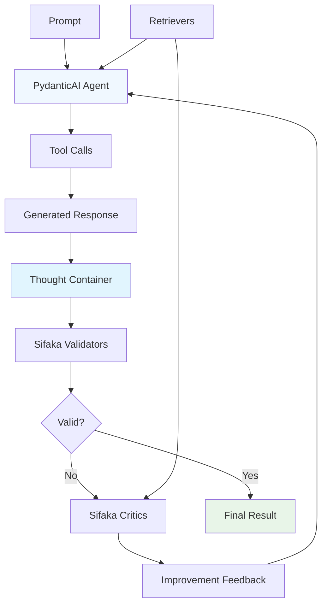
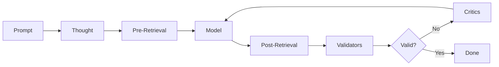
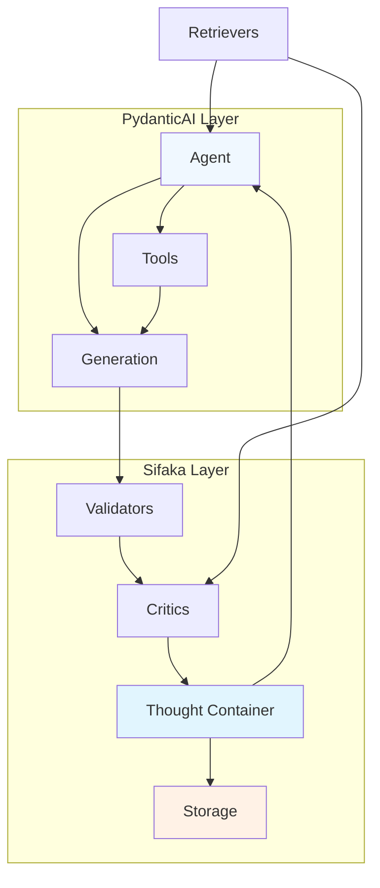

# Sifaka Architecture

Sifaka is a framework for AI text generation with validation and iterative improvement. The framework supports two architectures: a modern PydanticAI-based approach for new projects and a legacy Traditional Chain for existing projects.

## Modern PydanticAI Chain Architecture

The recommended approach uses PydanticAI agents with Sifaka's validation and criticism components:

### Execution Flow
1. Create a PydanticAI `Agent` with tools and system prompt
2. Agent generates response using tools and context
3. Response is captured in a `Thought` container
4. Sifaka validators check the generated text
5. If validation fails or critics are configured to always run, Sifaka critics provide feedback
6. Feedback is used to improve the agent's next generation
7. Process repeats until validation passes or max iterations reached



## Legacy Traditional Chain Architecture

The original pipeline-based approach (maintenance mode):

### Execution Flow
1. Create a `Thought` from the input prompt
2. Optional pre-generation retrieval adds context to the `Thought`
3. Model generates text using the `Thought` (including any retrieved context)
4. Optional post-generation retrieval adds additional context for critics
5. Validators check the generated text and record results in the `Thought`
6. If validation fails or critics are configured to always run, critics provide feedback
7. Process repeats with the feedback until validation passes or max iterations reached



## Hybrid Architecture Overview

The modern Sifaka architecture combines PydanticAI's agent capabilities with Sifaka's research-grade validation and criticism:



**Key Benefits:**
- **PydanticAI**: Modern tool calling, type safety, async patterns
- **Sifaka**: Research-grade validation, criticism, and observability
- **Composition**: Clean separation allows independent evolution

## Core Components

### Thought Container
Central state object that carries data between components. Contains the prompt, generated text, validation results, critic feedback, and iteration history. Provides immutable state management and complete audit trail.

**Works with both architectures**: PydanticAI chains capture agent responses in Thought containers, while Traditional chains flow Thoughts through the pipeline.

### Chain Types

**PydanticAI Chain** (`create_pydantic_chain()`):
- **PydanticAIChain**: Orchestrates PydanticAI agents with Sifaka components
- **Agent Integration**: Manages agent execution and tool calling
- **Validation Orchestration**: Coordinates validators and critics with agent responses
- **Thought Management**: Captures agent responses in Thought containers

Entry point is `chain.run(prompt)` with runtime prompts.

**Traditional Chain** (`Chain()` - Legacy):
- **ChainConfig**: Manages configuration state and component references
- **ChainOrchestrator**: Coordinates high-level workflow and iteration logic
- **ChainExecutor**: Handles low-level execution of individual steps
- **RecoveryManager**: Manages checkpointing and error recovery (optional)

Entry point is `chain.run()` or `chain.run_with_recovery()` with configured prompts.

### Models
Generate text from prompts. Supported providers:
- **OpenAI**: GPT-3.5, GPT-4 models via OpenAI API
- **Anthropic**: Claude models via Anthropic API
- **Google Gemini**: Gemini Pro and Flash models via Google AI API
- **HuggingFace**: Remote models via Inference API
- **Ollama**: Local models via Ollama server
- **Mock**: Deterministic responses for testing

Interface: `model.generate_with_thought(thought) → (text, prompt_used)`

### Validators
Check generated text against requirements. Available types:
- **LengthValidator**: Min/max character or word limits
- **RegexValidator**: Pattern matching validation
- **ContentValidator**: Prohibited content detection
- **FormatValidator**: JSON, Markdown, custom format validation
- **ClassifierValidator**: ML-based classification (bias, toxicity, sentiment, etc.)
- **GuardrailsValidator**: Integration with GuardrailsAI

Interface: `validator.validate(thought) → ValidationResult(passed=bool, message=str)`

### Critics
Provide improvement suggestions. Available approaches:
- **ReflexionCritic**: Self-reflection based improvement
- **SelfRAGCritic**: Retrieval-augmented self-critique
- **ConstitutionalCritic**: Constitutional AI principles
- **MetaRewardingCritic**: Two-stage judgment with meta-evaluation
- **SelfConsistencyCritic**: Multiple critique generation with consensus
- **NCriticsCritic**: Ensemble of multiple critics
- **SelfRefineCritic**: Iterative self-refinement
- **PromptCritic**: Custom prompt-based critique

Interface: `critic.critique(thought) → CriticFeedback(suggestions=list)`

### Retrievers
Find relevant context for generation and critique:
- **MockRetriever**: Predefined documents for testing
- **InMemoryRetriever**: Keyword search in memory
- **CachedRetriever**: Wraps any retriever with 3-tier caching

Interface: `retriever.retrieve_for_thought(thought, is_pre_generation=bool) → Thought`

## How Chain Execution Actually Works

### PydanticAI Chain Flow
```python
# This is what happens when you call pydantic_chain.run(prompt)
from pydantic_ai import Agent

# 1. Agent generates response (with tools)
agent_response = agent.run_sync(prompt)
thought = Thought(prompt=prompt, text=agent_response.data)

# 2. Validators check quality
for validator in validators:
    result = validator.validate(thought)
    thought.validation_results[validator.name] = result

# 3. If validation fails OR always_apply_critics=True
if not all_passed or always_apply_critics:
    for critic in critics:
        feedback = critic.critique(thought)
        thought.critic_feedback.append(feedback)

    # 4. Use feedback to improve agent's next generation
    improvement_prompt = create_improvement_prompt(thought)
    # Go back to step 1 with improved prompt (up to max_iterations)

return thought  # Final result
```

### Traditional Chain Flow
```python
# This is what happens when you call traditional_chain.run()
thought = Thought(prompt="Write a story")

# 1. Model generates text
thought.text = model.generate_with_thought(thought)

# 2. Validators check quality
for validator in validators:
    result = validator.validate(thought)
    thought.validation_results[validator.name] = result

# 3. If validation fails OR always_apply_critics=True
if not all_passed or always_apply_critics:
    for critic in critics:
        feedback = critic.critique(thought)
        thought.critic_feedback.append(feedback)

    # 4. Create next iteration with feedback
    thought = thought.next_iteration()
    # Go back to step 1 (up to max_iterations)

return thought  # Final result
```

### With Retrievers (Optional)
```python
# Chain orchestrates retrieval automatically
thought = Thought(prompt="Write about AI")

# 1. PRE-generation retrieval (gives model context)
for retriever in retrievers:
    thought = retriever.retrieve_for_thought(thought, is_pre_generation=True)

# 2. Model generates (using retrieved context)
thought.text = model.generate_with_thought(thought)

# 3. POST-generation retrieval (gives critics context)
for retriever in retrievers:
    thought = retriever.retrieve_for_thought(thought, is_pre_generation=False)

# 4. Validators and critics run as normal
```

## The Thought Object

The `Thought` object serves as the data container that flows through the chain:

```python
class Thought:
    # Basic info
    prompt: str              # "Write a story about robots"
    text: str               # "Once upon a time, there was a robot..."
    iteration: int          # 0, 1, 2... (how many times we've improved)

    # Validation results
    validation_results: dict # {"length": ValidationResult(passed=True), ...}

    # Critic feedback
    critic_feedback: list   # [CriticFeedback(suggestions=["Add more detail"]), ...]

    # Tool calls (PydanticAI agent interactions)
    tool_calls: list        # [ToolCall(tool_name="search", arguments={...}, result="...", success=True), ...]

    # Retrieved context (if using retrievers)
    pre_generation_context: list   # Documents retrieved before generation
    post_generation_context: list  # Documents retrieved after generation

    # History tracking
    history: list           # References to previous iterations
    parent_id: str         # ID of previous iteration
```

### Key Methods
```python
# Add context from retrievers
thought = thought.add_pre_generation_context(documents)

# Add validation results
thought = thought.add_validation_result("length", ValidationResult(passed=True))

# Add critic feedback
thought = thought.add_critic_feedback(CriticFeedback(suggestions=["Be more specific"]))

# Add tool call records (PydanticAI agent interactions)
tool_call = ToolCall(tool_name="search", arguments={"query": "AI research"}, result="Found 10 papers", success=True)
thought = thought.add_tool_call(tool_call)

# Create next iteration (preserves history)
next_thought = thought.next_iteration()

# Serialize to JSON
json_data = thought.model_dump_json()
```

## Storage Architecture

Sifaka provides a flexible storage system supporting multiple backends (Memory, File, Redis, Milvus) that can be used individually or combined in layered configurations for optimal performance.

### Official MCP Servers

> **⚠️ Currently Broken**: MCP integration with Redis and Milvus is experiencing issues and is being actively fixed.

Sifaka integrates with the official MCP servers for Redis and Milvus:

```bash
# Redis MCP Server (official)
git clone https://github.com/redis/mcp-redis.git
cd mcp-redis
uv sync
uv run src/main.py

# Milvus MCP Server (official)
git clone https://github.com/zilliztech/mcp-server-milvus.git
cd mcp-server-milvus
uv sync
uv run src/mcp_server_milvus/server.py --milvus-uri http://localhost:19530
```

### MCP Configuration Examples
```python
from sifaka.storage import RedisStorage, MilvusStorage
from sifaka.mcp import MCPServerConfig, MCPTransportType

# Redis via official MCP server
redis_config = MCPServerConfig(
    name="redis-server",
    transport_type=MCPTransportType.STDIO,
    url="uv run --directory /path/to/mcp-redis src/main.py"
)
redis_storage = RedisStorage(redis_config)

# Milvus via local MCP server
milvus_config = MCPServerConfig(
    name="milvus-server",
    transport_type=MCPTransportType.STDIO,
    url="cd mcp/mcp-server-milvus && python -m mcp_server_milvus"
)
milvus_storage = MilvusStorage(milvus_config, collection_name="thoughts")

# 3-tier storage: Memory → Redis → Milvus
from sifaka.storage import CachedStorage, MemoryStorage
layered_storage = CachedStorage(
    cache=MemoryStorage(),
    persistence=CachedStorage(
        cache=redis_storage,
        persistence=milvus_storage
    )
)
```

For detailed storage setup, configuration, and usage examples, see the **[Storage Guide](STORAGE.md)**.

## Design Principles

### 1. Consistent APIs
All components implement standardized interfaces for interoperability and type safety.

### 2. Composable Architecture
Components can be mixed and matched:
```python
chain = Chain(
    model=any_model,           # OpenAI, Anthropic, Gemini, HuggingFace, Ollama
    validators=[any_validators], # Length, Regex, Content, ML classifiers
    critics=[any_critics],      # Reflexion, Self-RAG, Constitutional
    retrievers=[any_retrievers] # Mock, InMemory, Redis, Milvus
)
```

### 3. Immutable State Management
- Each iteration creates a new `Thought` object
- Previous iterations preserved in `thought.history`
- Complete audit trail maintained

### 4. Error Recovery & Checkpointing
- Optional checkpointing saves execution state at key points
- Automatic recovery suggestions based on error analysis
- Chain can resume from last successful checkpoint
- Recovery strategies include retry, skip, restart, or parameter modification

### 5. Performance Monitoring
- Built-in timing for all components
- Bottleneck detection and analysis
- JSON export for external analysis
- Minimal performance overhead

## Error Recovery & Checkpointing

The framework provides optional error recovery through checkpointing:

```python
from sifaka.storage.checkpoints import CachedCheckpointStorage

# Enable checkpointing and recovery
checkpoint_storage = CachedCheckpointStorage(your_storage)
chain = Chain(
    model=model,
    checkpoint_storage=checkpoint_storage
)

# Run with automatic recovery
try:
    result = chain.run_with_recovery()
except Exception as e:
    # Recovery is handled automatically
    # Check logs for recovery attempts and strategies
    print(f"Chain execution failed after recovery attempts: {e}")
```

### Recovery Features
- **Checkpointing**: Saves state at initialization, generation, validation, and completion
- **Error Analysis**: Analyzes error types and suggests appropriate recovery strategies
- **Recovery Strategies**: Retry current step, skip to next step, restart iteration, modify parameters
- **Resumption**: Can resume from last successful checkpoint when possible

### Recovery Strategies
The system automatically chooses recovery strategies based on error type:
- **Connection/Timeout errors**: Retry with exponential backoff
- **Validation errors**: Skip validation or restart from generation
- **Rate limit errors**: Add delays and reduce request frequency
- **Memory errors**: Reduce batch sizes and context length

## Performance Monitoring

Chains automatically track execution metrics:

```python
# Run your chain normally
result = chain.run()

# Get performance data
perf = chain.get_performance_summary()
print(f"Total time: {perf['total_time']:.2f}s")
print(f"Model time: {perf['model_time']:.2f}s")
print(f"Validation time: {perf['validation_time']:.2f}s")

# Find bottlenecks
bottlenecks = chain.get_performance_bottlenecks()
for component, time in bottlenecks:
    print(f"Slow component: {component} ({time:.2f}s)")

# Export for analysis
import json
with open("performance.json", "w") as f:
    json.dump(perf, f)
```

### Features
- Zero-configuration monitoring
- Automatic bottleneck detection
- JSON export for external analysis
- Minimal performance overhead

## Summary

The Sifaka architecture provides:

### Modern PydanticAI Chain
1. **Agent-Based Design**: PydanticAI agents with tool calling and type safety
2. **Simple API**: `create_pydantic_chain(agent, validators, critics).run(prompt)`
3. **Hybrid Architecture**: Combines PydanticAI's modern patterns with Sifaka's research-grade components
4. **Runtime Flexibility**: Dynamic prompts and tool-driven workflows
5. **Type Safety**: Full type checking and structured outputs

### Traditional Chain (Legacy)
1. **Pipeline Design**: Separated concerns with ChainConfig, ChainOrchestrator, ChainExecutor, and RecoveryManager
2. **Configuration API**: `Chain(model, validators, critics, retrievers).run()`
3. **Advanced Features**: Checkpointing, recovery, and complex retrieval patterns
4. **Mature Ecosystem**: Extensive configuration options and pre-built features

### Shared Features
1. **Immutable State**: All data flows through the central `Thought` container with complete audit trail
2. **Flexible Storage**: Unified storage protocol supporting Memory, File, Redis, and Milvus backends
3. **Composable Components**: Mix and match validators, critics, and retrievers
4. **Performance Monitoring**: Built-in timing and bottleneck detection
5. **Research Integration**: Academic techniques as production-ready components

The architecture emphasizes **modern patterns for new projects** (PydanticAI Chain) while maintaining **backward compatibility** (Traditional Chain). Both approaches provide complete observability and research-grade reliability.

## References

- **[Design Decisions](DESIGN_DECISIONS.md)** - Architectural decisions and trade-offs
- **[Vision Document](../VISION.md)** - Strategic direction and philosophy
- **[PydanticAI Integration Guide](guides/chain-selection.md)** - Implementation patterns
