# Sifaka Architecture Guide

This guide explains how Sifaka works under the hood, from high-level concepts to implementation details.

## 🎯 Core Philosophy

Sifaka transforms AI text generation from a **black box** into a **transparent, iterative improvement system**:

- **Traditional AI**: Prompt → Model → Text → Hope it's good ❌
- **Sifaka**: Prompt → Generate → Validate → Critique → Improve → Repeat → Guaranteed Quality ✅

## 🏗️ High-Level Architecture


## 🔄 Core Workflow

The heart of Sifaka is an iterative improvement loop:

```mermaid
graph TD
    START[User Prompt] --> THOUGHT[Create SifakaThought]
    THOUGHT --> GEN[🤖 Generate Text]
    GEN --> VAL[✅ Validate Output]
    VAL --> CRIT[🔍 Apply Critics]
    CRIT --> DECISION{Continue?}
    
    DECISION -->|✅ Quality Met<br/>OR Max Iterations| COMPLETE[🎯 Return Result]
    DECISION -->|❌ Needs Improvement| FEEDBACK[📝 Combine Feedback]
    FEEDBACK --> GEN
    
    classDef startEnd fill:#c8e6c9,stroke:#388e3c,stroke-width:3px
    classDef process fill:#e3f2fd,stroke:#1976d2,stroke-width:2px
    classDef decision fill:#fff3e0,stroke:#f57c00,stroke-width:2px
    
    class START,COMPLETE startEnd
    class THOUGHT,GEN,VAL,CRIT,FEEDBACK process
    class DECISION decision
```



### Decision Logic

The system continues iterating when:
- ✅ **Validation fails** (requirements not met)
- ✅ **Critics suggest improvements** (quality can be better)
- ✅ **Under max iterations** (haven't hit the limit)

The system stops when:
- 🎯 **All validations pass AND no critic suggestions** (perfect quality)
- 🔄 **Max iterations reached** (time to finalize)

## 🧠 State Management

### SifakaThought: The Central State Container

Every improvement process is tracked in a `SifakaThought` object:


**Complete Audit Trail**: Every generation, validation result, critique, and model conversation is preserved.

## 🎭 Component Architecture

### 1. Generators (AI Models)


### 2. Validators (Quality Checks)


### 3. Critics (Improvement Agents)

```mermaid
graph TD
    subgraph "Research-Backed Critics"
        REFLEXION[Reflexion Critic<br/>Self-reflection & improvement<br/>📄 Shinn et al. 2023]
        CONSTITUTIONAL[Constitutional Critic<br/>Principle-based evaluation<br/>📄 Anthropic 2022]
        SELFREFINE[Self-Refine Critic<br/>Iterative self-improvement<br/>📄 Madaan et al. 2023]
    end
    
    subgraph "Advanced Critics"
        SELFRAG[Self-RAG Critic<br/>Retrieval-augmented critique<br/>📄 Asai et al. 2023]
        METAREWARD[Meta-Rewarding Critic<br/>Two-stage judgment<br/>📄 Wu et al. 2024]
    end
    
    classDef research fill:#f3e5f5,stroke:#7b1fa2,stroke-width:2px
    classDef advanced fill:#e3f2fd,stroke:#1976d2,stroke-width:2px
    
    class REFLEXION,CONSTITUTIONAL,SELFREFINE research
    class SELFRAG,METAREWARD advanced
```



## 🔧 Configuration System

Sifaka provides multiple configuration levels for different user needs:

```mermaid
graph TD
    subgraph "Configuration Levels"
        SIMPLE[Simple API<br/>sifaka.improve()]
        CONFIG[SifakaConfig<br/>Builder Pattern]
        DEPS[SifakaDependencies<br/>Full Control]
    end
    
    subgraph "Configuration Options"
        MODELS[Model Selection]
        VALIDATORS[Validator Setup]
        CRITICS[Critic Configuration]
        WEIGHTS[Feedback Weighting]
        STORAGE[Storage Backend]
    end
    
    SIMPLE --> MODELS
    CONFIG --> MODELS
    DEPS --> MODELS
    
    CONFIG --> VALIDATORS
    DEPS --> VALIDATORS
    
    CONFIG --> CRITICS
    DEPS --> CRITICS
    
    DEPS --> WEIGHTS
    DEPS --> STORAGE
    
    classDef level fill:#e3f2fd,stroke:#1976d2,stroke-width:2px
    classDef option fill:#fff3e0,stroke:#f57c00,stroke-width:2px
    
    class SIMPLE,CONFIG,DEPS level
    class MODELS,VALIDATORS,CRITICS,WEIGHTS,STORAGE option
```

## 📊 Feedback Weighting System

Sifaka combines validation and critic feedback using configurable weights:


**Why This Works**: Validation feedback ensures requirements are met, while critic feedback drives quality improvements.

## 💾 Storage Architecture

Sifaka supports multiple storage backends with automatic failover:


## 🚀 Performance Characteristics

### Parallel Processing


**Key Benefits**:
- ⚡ **Parallel Validation**: All validators run simultaneously
- ⚡ **Parallel Critique**: All critics run simultaneously  
- ⚡ **Async Throughout**: Full async/await support
- ⚡ **Caching**: Model responses and validation results cached

## 🔍 Observability

Every aspect of the improvement process is observable:


## 🎯 Design Principles

1. **Transparency**: Every decision is logged and auditable
2. **Modularity**: Components can be mixed and matched
3. **Extensibility**: Easy to add custom validators and critics
4. **Performance**: Parallel processing and caching throughout
5. **Type Safety**: Full Pydantic integration for reliability
6. **Research-Backed**: Implementations of proven academic techniques

## 🔮 Future Architecture

Planned enhancements:
- **Multi-Agent Workflows**: Specialized agents for different tasks
- **Retrieval Integration**: RAG-based critics and validators
- **Streaming Support**: Real-time improvement feedback
- **Distributed Processing**: Scale across multiple machines
- **Advanced Caching**: Semantic similarity-based cache hits

This architecture enables Sifaka to provide guaranteed quality improvements while maintaining full transparency and extensibility.
