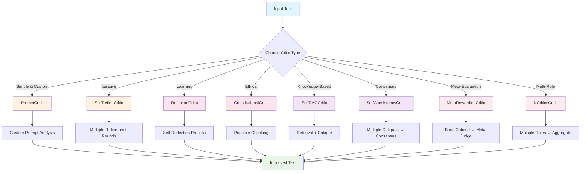

# Critics: A Visual Guide

Critics in Sifaka provide automated feedback and improvement suggestions for generated text. This guide presents each critic type with visual explanations, progressing from simple to complex approaches.

## Overview: The Critic Landscape

### Complexity Levels

| Level | Critics | Key Features |
|-------|---------|--------------|
| ⭐ **Beginner** | PromptCritic | Custom prompts, simple rules |
| ⭐⭐ **Intermediate** | SelfRefineCritic | Iterative improvement loops |
| ⭐⭐⭐ **Intermediate-Advanced** | ReflexionCritic<br/>ConstitutionalCritic | Self-reflection & learning<br/>Principle-based evaluation |
| ⭐⭐⭐⭐ **Advanced** | SelfRAGCritic<br/>SelfConsistencyCritic<br/>NCriticsCritic | External knowledge integration<br/>Consensus from multiple critiques<br/>Multi-role perspective analysis |
| ⭐⭐⭐⭐⭐ **Expert** | MetaRewardingCritic | Two-stage meta-evaluation |

### Quick Picker

<details>
<summary><strong>🎯 I want simple, custom feedback</strong></summary>

**→ PromptCritic** - Define your own criteria with custom prompts
</details>

<details>
<summary><strong>🔄 I want iterative improvement</strong></summary>

**→ SelfRefineCritic** - Multiple rounds of self-critique and revision
</details>

<details>
<summary><strong>🪞 I want learning from experience</strong></summary>

**→ ReflexionCritic** - Self-reflection with episodic memory
</details>

<details>
<summary><strong>⚖️ I want ethical/principle compliance</strong></summary>

**→ ConstitutionalCritic** - Evaluation against constitutional principles
</details>

<details>
<summary><strong>🔍 I want fact-checking with external knowledge</strong></summary>

**→ SelfRAGCritic** - Retrieval-augmented critique with external sources
</details>

<details>
<summary><strong>🎯 I want reliable, consensus-based feedback</strong></summary>

**→ SelfConsistencyCritic** - Multiple critiques with majority agreement
</details>

<details>
<summary><strong>🎭 I want comprehensive multi-perspective analysis</strong></summary>

**→ NCriticsCritic** - Multiple specialized roles (content, style, structure, etc.)
</details>

<details>
<summary><strong>🏆 I want maximum quality assurance</strong></summary>

**→ MetaRewardingCritic** - Two-stage judgment with meta-evaluation
</details>

### Interactive Critic Flow Diagram



**All critics share the same interface:**
- `critique(thought)` → Analyze and provide feedback
- `improve(thought)` → Generate improved version

---

## 1. PromptCritic 🎯
**Complexity: ⭐ (Beginner)**

The simplest critic - you define exactly what to look for using custom prompts.

### Visual Flow
```
Input Text ──→ [Your Custom Prompt] ──→ Critique ──→ [Your Improvement Prompt] ──→ Better Text
```

### Key Concept
Think of this as having a human reviewer with specific instructions. You tell the critic exactly what criteria to use and how to improve text.

### When to Use
- You have specific, well-defined criteria
- Domain-specific requirements (legal, medical, technical)
- Simple, focused improvements
- Getting started with critics

### Example
```python
from sifaka.critics.prompt import PromptCritic

critic = PromptCritic(
    model=model,
    critique_prompt="Check if this text is professional and clear. List any issues.",
    improvement_prompt="Rewrite this text to be more professional: {text}"
)
```

---

## 2. SelfRefineCritic 🔄
**Complexity: ⭐⭐ (Intermediate)**

Iteratively improves text through multiple rounds of self-critique and revision with learning from past refinement patterns.

### Visual Flow
```
Input Text ──→ [Extract Learning] ──→ [Enhanced Critique] ──→ [Smart Improve] ──→ [Store Outcomes] ──→ Final Text
     │              │                        │                      │                    │
     │              │                        │                      │                    │
     └─── Past ─────┴─── Successful ────────┴─── Apply ────────────┴─── Learn ─────────┘
       Patterns         Strategies           Learned              for Future
                                           Strategies
```

### Key Concept
Like a writer who not only reviews their work multiple times, but also learns from experience. Remembers what refinement strategies worked well in the past and applies them to new tasks. Builds expertise over time through pattern recognition.

### When to Use
- General text improvement with learning
- When you want multiple refinement passes that get smarter over time
- Tasks where refinement patterns can be learned and reused
- Long-term improvement across similar tasks

### Example
```python
from sifaka.critics.self_refine import SelfRefineCritic

critic = SelfRefineCritic(
    model=model,
    max_iterations=3,  # Up to 3 rounds of improvement
    improvement_criteria=["clarity", "accuracy", "engagement"]
)
```

---

## 3. ReflexionCritic 🪞
**Complexity: ⭐⭐⭐ (Intermediate-Advanced)**

Uses self-reflection to understand failures and successes, learning from experience.

### Visual Flow
```
Input Text ──→ [Initial Critique] ──→ [Self-Reflection] ──→ [Improved Text]
     │               │                       │                    │
     │               │                       │                    │
     └─── Task ──────┴─── "Why did ─────────┴─── Apply ─────────┘
       Feedback           this fail?"           Insights
```

### Key Concept
Like a thoughtful student who not only identifies mistakes but reflects on *why* they happened within the current task. Performs deeper analysis by reflecting on its own critique process.

### When to Use
- When you want deeper, more thoughtful critique
- Complex reasoning tasks requiring self-awareness
- When you have external feedback signals to incorporate
- Tasks where understanding the "why" matters

### Example
```python
from sifaka.critics.reflexion import ReflexionCritic

critic = ReflexionCritic(
    model=model,
    reflection_prompt_template="Reflect on why this critique was effective or ineffective",
    improve_prompt_template="Based on reflection, improve this text"
)
```

---

## 4. ConstitutionalCritic ⚖️
**Complexity: ⭐⭐⭐ (Intermediate-Advanced)**

Evaluates text against a set of constitutional principles with learning about which principles matter most for different contexts.

### Visual Flow
```
Input Text ──→ [Extract Learning] ──→ [Weighted Principles] ──→ [Smart Evaluation] ──→ [Learn & Store] ──→ Constitutional Feedback
     │              │                        │                      │                    │
     │              │                        │                      │                    │
     └─ Past ─────┴─── Violation ──────────┴─── Apply ────────────┴─── Update ─────────┘
       Patterns         Patterns             Learned              Principle
                                           Weights               Weights
```

### Key Concept
Like an experienced constitutional court that learns which principles are most important for different types of cases. Remembers violation patterns and adapts principle emphasis based on context and past experience.

### When to Use
- Ensuring ethical AI outputs with adaptive learning
- Compliance with organizational guidelines that vary by context
- Safety-critical applications that improve over time
- Content moderation with contextual principle weighting

### Example
```python
from sifaka.critics.constitutional import ConstitutionalCritic

principles = [
    "Be helpful and informative",
    "Avoid harmful or offensive content",
    "Provide accurate information",
    "Respect user privacy"
]

critic = ConstitutionalCritic(model=model, principles=principles)
```

---

## 5. SelfRAGCritic 🔍
**Complexity: ⭐⭐⭐⭐ (Advanced)**

Combines retrieval-augmented generation with self-reflection, learning when external knowledge helps vs. hurts.

### Visual Flow
```
Input Text ──→ [Extract Learning] ──→ [Smart Retrieval Decision] ──→ [Retrieve Docs] ──→ [Critique & Learn] ──→ [Improve]
     │              │                        │                           │                    │
     │              │                        │                           │                    │
     └─ Past ─────┴─── Retrieval ──────────┴─── Apply ─────────────────┴─── Store ─────────┘
       Patterns         Effectiveness         Learned                    Outcomes
                        Data                  Strategies                 for Future
```

### Key Concept
Like an experienced researcher who learns when to look up information. Remembers which types of tasks benefit from retrieval and adapts decisions based on past effectiveness patterns.

### When to Use
- Fact-checking and accuracy with adaptive learning
- Domain-specific knowledge requirements that vary by task type
- When external context matters and you want to optimize retrieval decisions
- Research and analysis tasks that benefit from retrieval pattern learning

### Example
```python
from sifaka.critics.self_rag import SelfRAGCritic

critic = SelfRAGCritic(
    model=model,
    retriever=your_retriever,  # External knowledge source
    use_reflection_tokens=True,
    max_retrieved_docs=5
)
```

---

## 6. SelfConsistencyCritic 🎯
**Complexity: ⭐⭐⭐⭐ (Advanced)**

Generates multiple independent critiques and uses consensus to determine the most reliable feedback, learning when consensus is reliable vs. unreliable.

### Visual Flow
```
Input Text ──→ [Extract Learning] ──→ [Adaptive Critiques] ──→ [Smart Consensus] ──→ [Learn & Store] ──→ Reliable Feedback
     │              │                        │                      │                    │
     │              │                        │                      │                    │
     └─ Past ─────┴─── Reliability ────────┴─── Apply ────────────┴─── Update ─────────┘
       Patterns         Predictions         Learned              Consistency
                                           Thresholds            Patterns
```

### Key Concept
Like an experienced panel of reviewers who learn when their consensus is reliable. Remembers which types of tasks lead to consistent vs. inconsistent critiques and adapts the consensus mechanism accordingly.

### When to Use
- High-stakes decisions requiring reliability with adaptive learning
- Reducing critique noise and errors through learned patterns
- When single critiques might be inconsistent and you want to predict reliability
- Quality assurance scenarios that benefit from consistency pattern learning

### Example
```python
from sifaka.critics.self_consistency import SelfConsistencyCritic

critic = SelfConsistencyCritic(
    model=model,
    num_iterations=5,  # Generate 5 different critiques
    consensus_threshold=0.6,  # 60% agreement required
    aggregation_method="majority_vote"
)
```

---

## 7. MetaRewardingCritic 🏆
**Complexity: ⭐⭐⭐⭐⭐ (Expert)**

Two-stage judgment process: first critique, then meta-evaluate the quality of that critique, learning when meta-judgment helps vs. hurts.

### Visual Flow
```
Input Text ──→ [Extract Learning] ──→ [Smart Initial Judge] ──→ [Adaptive Meta-Judge] ──→ [Learn & Store] ──→ Final Critique
     │              │                        │                      │                    │
     │              │                        │                      │                    │
     └─ Past ─────┴─── Meta-Effectiveness ──┴─── Apply ────────────┴─── Update ─────────┘
       Patterns         Predictions         Learned              Meta-Learning
                                           Strategies            Patterns
```

### Key Concept
Like an experienced senior reviewer who learns when meta-evaluation improves vs. worsens judgments. Remembers which types of tasks benefit from meta-judgment and adapts the meta-evaluation approach accordingly.

### When to Use
- Maximum quality assurance with adaptive learning
- Training and evaluation scenarios that improve over time
- When critique quality varies significantly and you want to predict when meta-judgment helps
- Research and development with meta-learning capabilities

### Example
```python
from sifaka.critics.meta_rewarding import MetaRewardingCritic
from sifaka.critics.constitutional import ConstitutionalCritic

base_critic = ConstitutionalCritic(model=model, principles=principles)

critic = MetaRewardingCritic(
    model=model,
    base_critic=base_critic,
    meta_judge_model_name="openai:gpt-4",  # Separate model for meta-judgment
    use_scoring=True,
    score_range=(1, 10)
)
```

---

## 8. NCriticsCritic 🎭
**Complexity: ⭐⭐⭐⭐ (Advanced)**

Uses multiple specialized roles with the same model to provide comprehensive, multi-perspective feedback.

### Visual Flow
```
Input Text ──→ [Content Expert] ────┐
           ──→ [Style Editor] ───────┤
           ──→ [Structure Analyst] ──┼──→ [Aggregate Scores] ──→ [Combined Feedback]
           ──→ [Audience Specialist] ─┤      & Feedback
           ──→ [Quality Assurance] ──┘
                    │
              Same Model, Different Roles
```

### Key Concept
Like having one expert reviewer wear different "hats" - evaluating the same text from multiple specialized perspectives (content, style, structure, audience, quality) and then combining all the feedback.

### When to Use
- Comprehensive evaluation from multiple perspectives
- When you want thorough coverage but only have one model
- Structured, role-based feedback
- Quality assurance with detailed breakdowns

### Example
```python
from sifaka.critics.n_critics import NCriticsCritic

critic = NCriticsCritic(
    model=model,
    num_critics=5,  # Number of specialized roles
    critic_roles=[
        "Content Expert: Focus on factual accuracy and completeness",
        "Style Editor: Focus on writing style, tone, and clarity",
        "Structure Analyst: Focus on organization and logical flow",
        "Audience Specialist: Focus on target audience appropriateness",
        "Quality Assurance: Focus on overall quality and consistency"
    ]
)
```

---

## Choosing the Right Critic

### Decision Tree
```
Start Here
    │
    ├─ Simple, specific criteria? ──→ PromptCritic
    │
    ├─ Need iterative improvement? ──→ SelfRefineCritic
    │
    ├─ Learning from experience? ──→ ReflexionCritic
    │
    ├─ Ethical/guideline compliance? ──→ ConstitutionalCritic
    │
    ├─ Need external knowledge? ──→ SelfRAGCritic
    │
    ├─ Need reliable consensus? ──→ SelfConsistencyCritic
    │
    ├─ Need meta-evaluation? ──→ MetaRewardingCritic
    │
    └─ Need multi-role analysis? ──→ NCriticsCritic
```

### Complexity vs. Comprehensiveness
```
Comprehensiveness ↑
                  │
                  │    MetaRewarding ●
                  │
                  │  SelfConsistency ●    NCritics ●
                  │
                  │    SelfRAG ●
                  │
                  │  Constitutional ●  Reflexion ●
                  │
                  │    SelfRefine ●
                  │
                  │  PromptCritic ●
                  │
                  └────────────────────────────→ Complexity

Note: Higher comprehensiveness means broader coverage of potential issues,
not necessarily better results. Choose based on your specific needs.
```

---

## Best Practices

### 🚀 **Getting Started**
1. Start with `PromptCritic` to understand the basics
2. Move to `SelfRefineCritic` for general improvement
3. Add specialized critics as needed

### ⚡ **Performance**
- Use simpler critics for real-time applications
- Reserve complex critics for batch processing
- Consider caching for repeated critiques

### 🎯 **Effectiveness**
- Combine multiple critics for comprehensive coverage
- Use domain-specific prompts in `PromptCritic`
- Provide external feedback to `ReflexionCritic`

### 🔧 **Integration**
```python
# Chain multiple critics
chain = Chain(model=model, prompt="Your prompt")
chain.improve_with(PromptCritic(model=model, ...))
chain.improve_with(ConstitutionalCritic(model=model, ...))

# Or use multi-role approach
multi_role_critic = NCriticsCritic(
    model=model,
    num_critics=5,
    critic_roles=[
        "Content Expert: Focus on factual accuracy",
        "Style Editor: Focus on writing clarity",
        "Structure Analyst: Focus on organization",
        "Audience Specialist: Focus on target audience",
        "Quality Assurance: Focus on overall quality"
    ]
)
chain.improve_with(multi_role_critic)
```

---

## Research Papers & Implementation Notes

Each critic is based on research papers with some adaptations for practical use:

- **PromptCritic**: Custom implementation for domain-specific critique criteria
- **SelfRefineCritic**: Based on "Self-Refine: Iterative Refinement with Self-Feedback" with enhanced learning from refinement patterns
- **ReflexionCritic**: Simplified from full Actor/Evaluator/Self-Reflection architecture
- **ConstitutionalCritic**: Based on "Constitutional AI: Harmlessness from AI Feedback" with enhanced learning from principle violation patterns
- **SelfRAGCritic**: Combines retrieval with self-reflection tokens from "Self-RAG" with enhanced learning from retrieval effectiveness patterns
- **SelfConsistencyCritic**: Adapted from reasoning to text critique domain with enhanced learning from consistency patterns
- **NCriticsCritic**: Based on "N-Critics: Self-Refinement of Large Language Models with Ensemble of Critics"
- **MetaRewardingCritic**: Implements two-stage judgment with meta-evaluation from "Meta-Rewarding" with enhanced learning from meta-judgment effectiveness patterns

For full research context, see the [API Reference](api/api-reference.md#critics).

---

*This guide provides visual explanations to help you understand and choose the right critic for your needs. Each critic serves different purposes and complexity levels - start simple and add sophistication as needed.*
