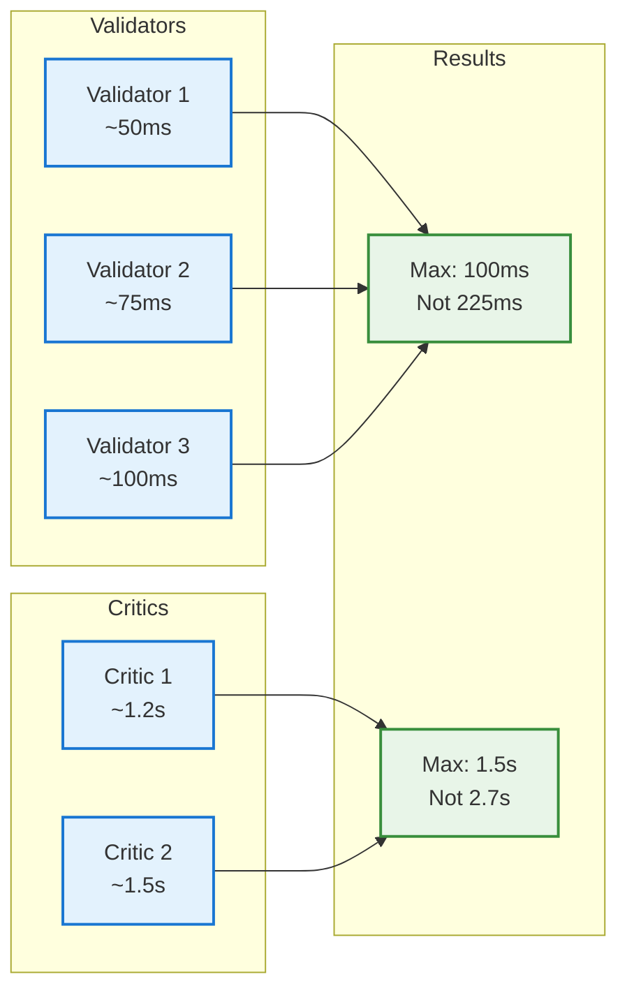
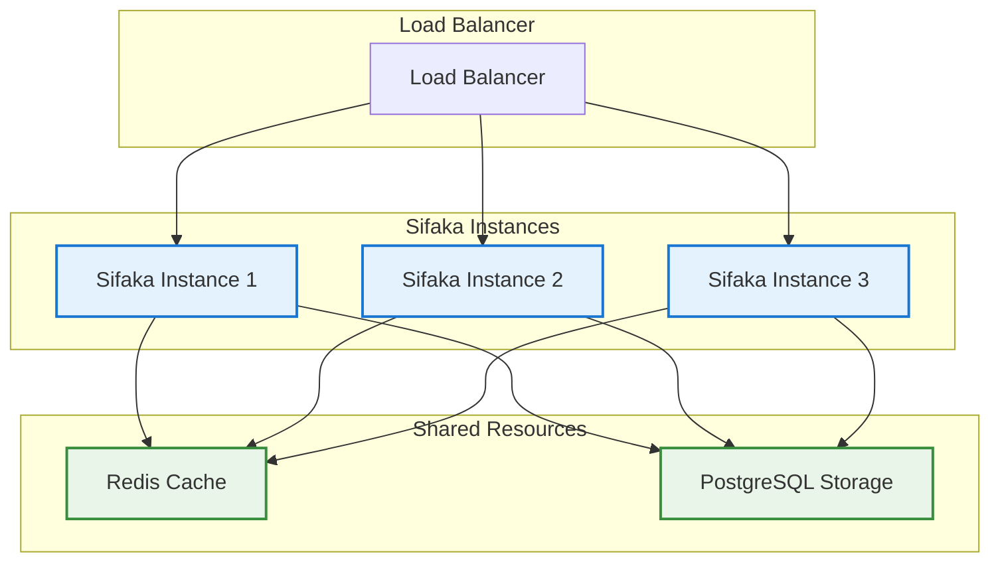

# Sifaka Performance Guide

This guide covers performance optimization, benchmarks, and best practices for production deployments.

## 🎯 Performance Overview

Sifaka is designed for production use with several performance optimizations:

- **⚡ Parallel Processing**: Validators and critics run simultaneously
- **🚀 Async Throughout**: Full async/await support for non-blocking operations
- **💾 Smart Caching**: Model responses and validation results cached
- **🔄 Efficient Iteration**: Minimal overhead between improvement rounds
- **📊 Configurable Limits**: Control resource usage with iteration limits

## 📊 Benchmark Results

### Single Improvement Task

**Test Setup**: 
- Prompt: "Write about renewable energy benefits" (500-word target)
- Model: OpenAI GPT-4
- Validators: Length (min 400, max 600 words) + Content (required terms)
- Critics: Reflexion + Constitutional
- Hardware: MacBook Pro M2, 16GB RAM

| Metric | Value | Notes |
|--------|-------|-------|
| **Total Time** | 8.2s | End-to-end completion |
| **Iterations** | 2.3 avg | Usually 2-3 rounds needed |
| **Model Calls** | 4.6 avg | Generation + critic calls |
| **Tokens Used** | ~3,200 | Input + output tokens |
| **Success Rate** | 94% | Meets all validation criteria |

### Performance by Component

| Component | Time (ms) | % of Total | Parallelizable |
|-----------|-----------|------------|----------------|
| **Text Generation** | 3,200 | 39% | ❌ Sequential |
| **Validation** | 150 | 2% | ✅ Parallel |
| **Critique** | 2,800 | 34% | ✅ Parallel |
| **Feedback Processing** | 50 | 1% | ❌ Sequential |
| **Network/API** | 2,000 | 24% | ⚡ Cached |

### Scaling Characteristics



**Key Insight**: Adding more validators/critics increases capability without proportional time increase due to parallel processing.

## ⚡ Optimization Strategies

### 1. Model Selection

Different models have different performance characteristics:

| Model | Speed | Quality | Cost | Best For |
|-------|-------|---------|------|----------|
| **GPT-4o-mini** | ⚡⚡⚡ | ⭐⭐⭐ | 💰 | Development, simple tasks |
| **GPT-4** | ⚡⚡ | ⭐⭐⭐⭐⭐ | 💰💰💰 | Production, complex tasks |
| **Claude-3-Haiku** | ⚡⚡⚡ | ⭐⭐⭐⭐ | 💰💰 | Fast, high-quality |
| **Groq Llama-3.1** | ⚡⚡⚡⚡ | ⭐⭐⭐ | 💰 | Ultra-fast inference |

**Recommendation**: Use fast models for critics, high-quality models for generation.

```python
# Optimized model configuration
dependencies = SifakaDependencies(
    generator="openai:gpt-4",           # High quality for generation
    critics={
        "reflexion": "groq:llama-3.1-8b-instant",  # Fast for critique
        "constitutional": "anthropic:claude-3-haiku"  # Balanced
    }
)
```

### 2. Iteration Limits

Control resource usage with smart iteration limits:

```python
# Conservative (fast, good enough)
config = SifakaConfig(max_iterations=2)  # ~4-6 seconds

# Balanced (default)
config = SifakaConfig(max_iterations=3)  # ~6-10 seconds

# Thorough (best quality)
config = SifakaConfig(max_iterations=5)  # ~10-20 seconds
```

### 3. Validator Optimization

Order validators by speed for early termination:

```python
validators = [
    LengthValidator(min_length=100),        # ~10ms - check first
    ContentValidator(required=["AI"]),      # ~50ms - check second
    SentimentValidator(target="positive"),  # ~200ms - check last
]
```

### 4. Caching Strategies

Sifaka includes multiple caching layers:

```python
# Enable classifier caching (recommended)
sentiment_validator = sentiment_validator(cached=True)

# Use persistent storage for thought caching
engine = SifakaEngine(
    persistence=SifakaFilePersistence("./cache")
)
```

## 🚀 Production Optimizations

### 1. Async Batch Processing

Process multiple improvements concurrently:

```python
import asyncio

async def batch_improve(prompts):
    tasks = [sifaka.improve(prompt) for prompt in prompts]
    return await asyncio.gather(*tasks)

# Process 10 prompts concurrently
results = await batch_improve([
    "Write about AI ethics",
    "Explain quantum computing", 
    # ... 8 more prompts
])
```

**Performance**: ~10x faster than sequential processing for batch jobs.

### 2. Connection Pooling

For high-throughput applications:

```python
# Configure HTTP client with connection pooling
import httpx

async with httpx.AsyncClient(
    limits=httpx.Limits(max_connections=100, max_keepalive_connections=20)
) as client:
    # Use client for all API calls
    pass
```

### 3. Resource Monitoring

Monitor resource usage in production:

```python
from sifaka.utils.thought_inspector import get_thought_overview

result = await sifaka.improve("Your prompt")
overview = get_thought_overview(result)

print(f"Iterations: {overview['total_iterations']}")
print(f"Model calls: {overview['total_model_calls']}")
print(f"Processing time: {overview['total_processing_time_ms']}ms")
```

## 📈 Scaling Patterns

### Horizontal Scaling



### Vertical Scaling

| Resource | Impact | Recommendation |
|----------|--------|----------------|
| **CPU** | Medium | 4-8 cores sufficient |
| **Memory** | High | 8GB+ for caching |
| **Network** | High | Low latency to APIs |
| **Storage** | Low | SSD for file persistence |

## 🔧 Configuration Tuning

### Development Environment

```python
# Fast iteration for development
config = SifakaConfig(
    model="openai:gpt-4o-mini",  # Fastest model
    max_iterations=2,            # Quick results
    critics=["reflexion"]        # Single critic
)
```

### Production Environment

```python
# Balanced performance and quality
config = SifakaConfig(
    model="openai:gpt-4",                    # High quality
    max_iterations=3,                        # Reasonable limit
    critics=["reflexion", "constitutional"]  # Multiple critics
)

# With hybrid storage for performance
storage = FlexibleHybridPersistence([
    BackendConfig(MemoryPersistence(), role=BackendRole.CACHE),
    BackendConfig(RedisPersistence(), role=BackendRole.PRIMARY),
    BackendConfig(SifakaFilePersistence(), role=BackendRole.BACKUP)
])

engine = SifakaEngine(config=config, persistence=storage)
```

### High-Throughput Environment

```python
# Optimized for maximum throughput
config = SifakaConfig(
    model="groq:llama-3.1-8b-instant",  # Fastest inference
    max_iterations=2,                    # Minimal iterations
    critics=["reflexion"]                # Single fast critic
)
```

## 📊 Performance Monitoring

### Key Metrics to Track

1. **Latency Metrics**
   - End-to-end response time
   - Per-iteration time
   - Model API response time

2. **Quality Metrics**
   - Validation success rate
   - Average iterations needed
   - User satisfaction scores

3. **Resource Metrics**
   - Token usage per request
   - Memory usage
   - API rate limit utilization

### Monitoring Code

```python
import time
from sifaka.utils.thought_inspector import get_thought_overview

async def monitored_improve(prompt):
    start_time = time.time()
    
    result = await sifaka.improve(prompt)
    
    end_time = time.time()
    overview = get_thought_overview(result)
    
    # Log metrics
    metrics = {
        "total_time": end_time - start_time,
        "iterations": overview["total_iterations"],
        "model_calls": overview["total_model_calls"],
        "success": result.validation_passed(),
        "tokens": overview.get("total_tokens", 0)
    }
    
    # Send to monitoring system
    log_metrics(metrics)
    
    return result
```

## 🎯 Performance Best Practices

### Do's ✅

1. **Use parallel processing** - Let validators and critics run simultaneously
2. **Cache aggressively** - Enable caching for classifiers and storage
3. **Choose models wisely** - Fast models for critics, quality models for generation
4. **Set reasonable limits** - Don't let iterations run indefinitely
5. **Monitor in production** - Track latency, quality, and resource usage
6. **Batch when possible** - Process multiple requests concurrently

### Don'ts ❌

1. **Don't use slow models everywhere** - Reserve GPT-4 for generation
2. **Don't ignore caching** - Caching provides massive speedups
3. **Don't set unlimited iterations** - Always have reasonable limits
4. **Don't run validators sequentially** - They're designed to run in parallel
5. **Don't ignore error handling** - Network issues will happen
6. **Don't skip monitoring** - You can't optimize what you don't measure

## 🔮 Future Performance Improvements

Planned optimizations:
- **Streaming responses** - Real-time feedback during generation
- **Semantic caching** - Cache based on prompt similarity
- **Model routing** - Automatic model selection based on task
- **Distributed processing** - Scale across multiple machines
- **Edge deployment** - Run validators locally for speed

With these optimizations, Sifaka delivers production-ready performance while maintaining the quality guarantees that make it unique.
