# Sifaka Documentation

Welcome to the comprehensive Sifaka documentation! This guide will help you master AI text improvement with guaranteed quality.

## 🎯 Documentation Overview

Sifaka documentation is organized by user journey and complexity level:

```mermaid
graph TD
    START[New to Sifaka?] --> GETTING_STARTED[🚀 Getting Started]
    GETTING_STARTED --> EXAMPLES[📝 Examples]
    EXAMPLES --> ARCHITECTURE[🏗️ Architecture]
    ARCHITECTURE --> API_REF[📖 API Reference]
    API_REF --> PERFORMANCE[⚡ Performance]
    PERFORMANCE --> PRODUCTION[🏭 Production]

    GETTING_STARTED --> TROUBLESHOOTING[🛠️ Troubleshooting]
    EXAMPLES --> TROUBLESHOOTING

    classDef start fill:#e8f5e8,stroke:#388e3c,stroke-width:3px
    classDef guide fill:#e3f2fd,stroke:#1976d2,stroke-width:2px
    classDef reference fill:#f3e5f5,stroke:#7b1fa2,stroke-width:2px
    classDef support fill:#fff3e0,stroke:#f57c00,stroke-width:2px

    class START start
    class GETTING_STARTED,EXAMPLES,ARCHITECTURE guide
    class API_REF,PERFORMANCE,PRODUCTION reference
    class TROUBLESHOOTING support
```



## 📚 Core Documentation

### 🚀 [Getting Started](GETTING_STARTED.md)
**5-minute tutorial to get up and running**
- What is Sifaka and why use it?
- Installation and setup
- Your first text improvement
- Common use cases
- Configuration levels
- Next steps

**Perfect for**: First-time users, quick evaluation

### 🏗️ [Architecture Guide](ARCHITECTURE.md)
**How Sifaka works under the hood**
- Core philosophy and workflow
- Component architecture with diagrams
- State management and audit trails
- Feedback weighting system
- Storage architecture
- Performance characteristics

**Perfect for**: Understanding the system, advanced configuration

### 📖 [API Reference](API_REFERENCE.md)
**Complete API documentation**
- Simple API functions
- Configuration classes
- Advanced dependency injection
- Storage backends
- Pydantic models
- Utilities and helpers

**Perfect for**: Implementation details, integration

### 🔧 [Simple Features](SIMPLE_FEATURES.md)
**Built-in logging, timing, and caching**
- Simple boolean flag configuration
- Performance monitoring
- Result caching with TTL
- User and session tracking
- Production-ready features

**Perfect for**: Essential features without complexity

### ⚡ [Performance Guide](PERFORMANCE.md)
**Optimization tips and benchmarks**
- Performance benchmarks
- Optimization strategies
- Production configurations
- Scaling patterns
- Monitoring and profiling
- Best practices

**Perfect for**: Production deployments, optimization

### 🛠️ [Troubleshooting](TROUBLESHOOTING.md)
**Common issues and solutions**
- API key and connection issues
- Performance problems
- Validation failures
- Debugging tools
- Error patterns
- Getting help

**Perfect for**: Problem solving, debugging

## 📝 Examples and Use Cases

### 📁 [Examples Directory](../examples/)
**Real-world usage examples organized by complexity**

#### Available Examples
- **[Simple Features](../examples/simple_features.py)** ⭐ - Built-in logging, timing, and caching
- **[Self-Refine](../examples/self_refine.py)** ⭐⭐ - Iterative self-improvement workflow
- **[Reflexion with Classifiers](../examples/reflexion_classifiers.py)** ⭐⭐ - Self-reflection with validation
- **[N-Critics](../examples/n_critics.py)** ⭐⭐⭐ - Multiple critics working together
- **[Self-RAG](../examples/self_rag.py)** ⭐⭐⭐ - Retrieval-augmented generation
- **[Comprehensive Analysis](../examples/comprehensive_analysis.py)** ⭐⭐⭐ - Full workflow analysis

## 🔧 Technical Documentation

### [Installation Guide](INSTALLATION.md)
Detailed installation instructions for different environments and use cases.

### [Storage Backends](BACKENDS.md)
Production-ready storage configurations including Redis, PostgreSQL, and hybrid setups.

### [Design Decisions](DESIGN_DECISIONS.md)
Architecture rationale and design philosophy behind Sifaka's implementation.

### [Tool Discovery](TOOL_DISCOVERY.md)
Integration with external tools and services for enhanced functionality.

### [Vision](VISION.md)
Long-term roadmap and vision for Sifaka's development.

## 🎓 Learning Path

### For Beginners
1. **[Getting Started](GETTING_STARTED.md)** - Understand the basics
2. **[Simple Features Example](../examples/simple_features.py)** - Try built-in features
3. **[Self-Refine Example](../examples/self_refine.py)** - Basic improvement workflow
4. **[Troubleshooting](TROUBLESHOOTING.md)** - When things go wrong

### For Developers
1. **[Architecture Guide](ARCHITECTURE.md)** - Understand the system
2. **[API Reference](API_REFERENCE.md)** - Learn the interfaces
3. **[Simple Features](SIMPLE_FEATURES.md)** - Built-in logging, timing, caching
4. **[Reflexion Example](../examples/reflexion_classifiers.py)** - Advanced validation

### For Production
1. **[Performance Guide](PERFORMANCE.md)** - Optimize for scale
2. **[Storage Backends](BACKENDS.md)** - Production storage
3. **[N-Critics Example](../examples/n_critics.py)** - Multiple critics
4. **[Comprehensive Analysis](../examples/comprehensive_analysis.py)** - Full workflow

## 🎯 Quick Reference

### Common Tasks

| Task | Documentation | Example |
|------|---------------|---------|
| **First time setup** | [Getting Started](GETTING_STARTED.md) | [Simple Features](../examples/simple_features.py) |
| **Configure validation** | [API Reference](API_REFERENCE.md#validators) | [Reflexion Classifiers](../examples/reflexion_classifiers.py) |
| **Improve performance** | [Performance Guide](PERFORMANCE.md) | [Simple Features](../examples/simple_features.py) |
| **Production deployment** | [Storage Backends](BACKENDS.md) | [Self-Refine](../examples/self_refine.py) |
| **Debug issues** | [Troubleshooting](TROUBLESHOOTING.md) | [Comprehensive Analysis](../examples/comprehensive_analysis.py) |
| **Custom logic** | [Architecture Guide](ARCHITECTURE.md) | [Custom Critics](../examples/custom_critics.py) |

### API Quick Reference

```python
# Simple API
import sifaka
result = await sifaka.improve("Your prompt", max_rounds=3)

# Configuration API
from sifaka import SifakaConfig, SifakaEngine
config = (SifakaConfig.builder()
         .model("openai:gpt-4")
         .max_iterations(5)
         .build())
engine = SifakaEngine(config=config)

# Advanced API
from sifaka.graph import SifakaDependencies
deps = SifakaDependencies(generator="openai:gpt-4", validators=[...])
engine = SifakaEngine(dependencies=deps)
```

## 🤝 Contributing to Documentation

We welcome documentation improvements! Here's how to contribute:

1. **Identify gaps** - What's missing or unclear?
2. **Follow the style** - Match existing documentation patterns
3. **Include examples** - Code examples make everything clearer
4. **Test your examples** - Ensure all code actually works
5. **Update the index** - Add new docs to this README

### Documentation Standards

- **Clear headings** with emoji for visual hierarchy
- **Code examples** for every concept
- **Mermaid diagrams** for complex relationships
- **Cross-references** between related documents
- **Beginner-friendly** language with technical depth available

## 🆘 Getting Help

### Documentation Issues
- **Missing information?** [Open an issue](https://github.com/sifaka-ai/sifaka/issues)
- **Found an error?** [Submit a PR](https://github.com/sifaka-ai/sifaka/pulls)
- **Need clarification?** [Start a discussion](https://github.com/sifaka-ai/sifaka/discussions)

### Usage Questions
- **Check [Troubleshooting](TROUBLESHOOTING.md)** first
- **Browse [Examples](../examples/)** for similar use cases
- **Search [GitHub Issues](https://github.com/sifaka-ai/sifaka/issues)** for existing solutions
- **Ask in [Discussions](https://github.com/sifaka-ai/sifaka/discussions)** for community help

## 🎉 What's Next?

Ready to dive in? Here are the recommended next steps:

1. **New to Sifaka?** → [Getting Started](GETTING_STARTED.md)
2. **Want to understand how it works?** → [Architecture Guide](ARCHITECTURE.md)
3. **Need specific examples?** → [Examples Directory](../examples/)
4. **Building for production?** → [Performance Guide](PERFORMANCE.md)
5. **Having issues?** → [Troubleshooting](TROUBLESHOOTING.md)

Welcome to the future of guaranteed AI text quality! 🚀
