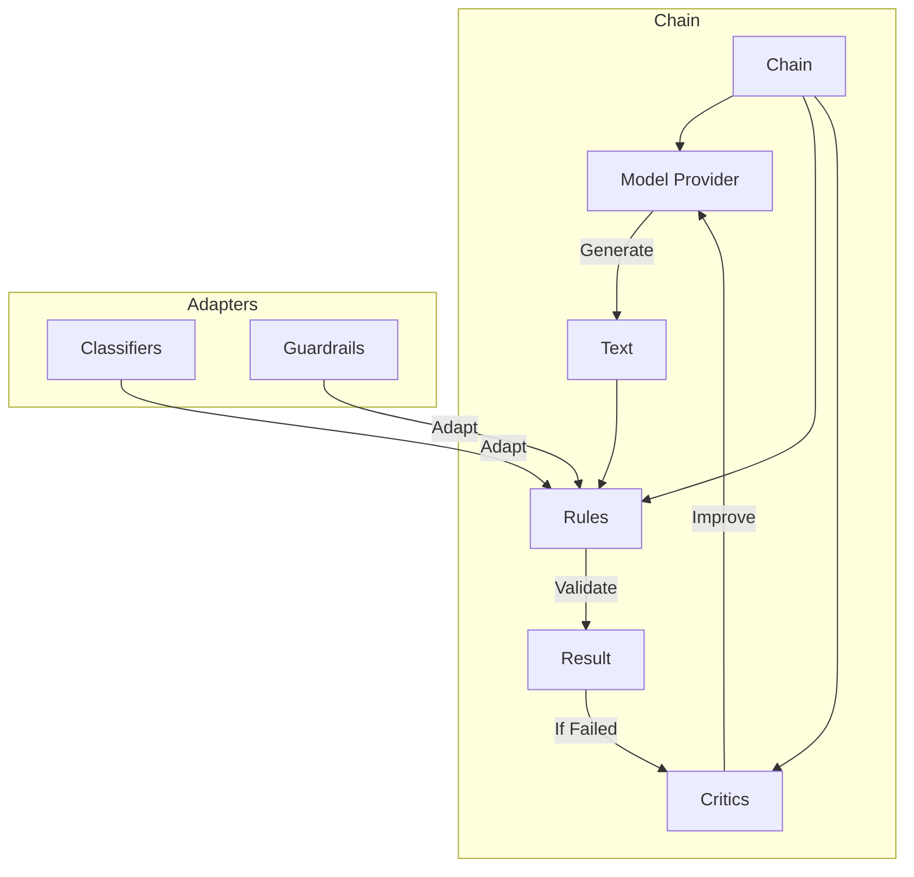

# Sifaka API Reference

This API reference provides detailed documentation for all major components in the Sifaka framework.

## Core Components

Sifaka is built around several core component types that work together to provide a complete system for text generation, validation, and improvement:

- [Rules](rules/README.md): Binary pass/fail validation of text
- [Classifiers](classifiers/README.md): Analysis and categorization of text
- [Critics](critics/README.md): Feedback and suggestions for improving text
- [Model Providers](models/README.md): Connection to language models for text generation
- [Chains](chain/README.md): Orchestration of models, rules, and critics
- [Adapters](adapters/README.md): Integration with external frameworks and systems

## Component Relationships

The components in Sifaka work together to create a feedback loop for text generation and improvement:



## Common Patterns

Throughout the Sifaka API, you'll find these common patterns:

### Factory Functions

Most components provide factory functions for easy instantiation:

```python
from sifaka.rules.formatting.length import create_length_rule
from sifaka.classifiers.toxicity import create_toxicity_classifier
from sifaka.critics.prompt import create_prompt_critic
from sifaka.models.openai import create_openai_chat_provider
from sifaka.chain import create_simple_chain

# Create components using factory functions
rule = create_length_rule(min_chars=10, max_chars=100)
classifier = create_toxicity_classifier()
critic = create_prompt_critic(system_prompt="You are an expert editor.")
model = create_openai_chat_provider(model_name="gpt-4")
chain = create_simple_chain(model=model, rules=[rule], critic=critic)
```

### Configuration Objects

All components use standardized configuration objects:

```python
from sifaka.rules.base import RuleConfig
from sifaka.critics.base import CriticConfig
from sifaka.models.base import ModelConfig

# Create configuration objects
rule_config = RuleConfig(priority="HIGH", cost=5, params={"min_length": 10})
critic_config = CriticConfig(name="prompt_critic", max_attempts=3)
model_config = ModelConfig(temperature=0.7, max_tokens=1000)
```

### State Management

Components use consistent state management patterns:

```python
# Components manage state internally
component._state_manager.get("key")
component._state_manager.set("key", value)
component._state_manager.clear()
```

## Type System

Sifaka uses Python's type hints extensively, including generics:

```python
from sifaka.rules.base import Rule
from sifaka.classifiers.base import BaseClassifier
from sifaka.critics.base import BaseCritic

# Generic types for specialized components
rule: Rule[str] = create_length_rule(min_chars=10)
classifier: BaseClassifier[str, str] = create_toxicity_classifier()
critic: BaseCritic[str, str] = create_prompt_critic()
```

## Error Handling

Sifaka provides specialized exception types:

```python
from sifaka.rules.base import ValidationError
from sifaka.models.base import ModelError

# Handle specific exception types
try:
    result = rule.validate(text)
except ValidationError as e:
    print(f"Validation error: {e}")

try:
    output = model.generate(prompt)
except ModelError as e:
    print(f"Model error: {e}")
```
