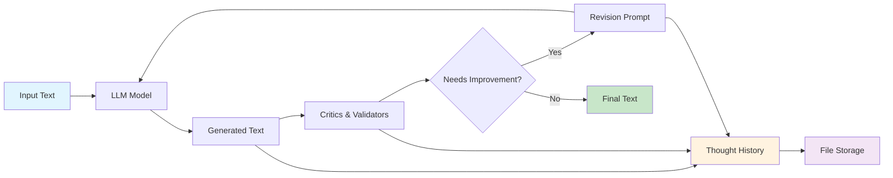

# Sifaka Architecture

This document provides a comprehensive overview of Sifaka's architecture, design principles, and component relationships.

## 🎯 Design Philosophy

Sifaka is built around three core principles:

1. **Research-Backed Critique** - All improvement methods implement peer-reviewed academic papers
2. **Production Readiness** - Memory-bounded and observable operations
3. **Developer Experience** - Simple API, clear errors, comprehensive testing

## 🏗️ High-Level Architecture



## 🧩 Component Architecture

### 1. User Interface Layer

#### `improve()` Function
The single entry point for all text improvement operations.

```python
async def improve(
    text: str,
    *,
    max_iterations: int = 3,
    model: str = "gpt-4o-mini",
    critics: list[str] = ["reflexion"],
    validators: list[Validator] = None,
    temperature: float = 0.7,
    timeout_seconds: int = 300,
    storage: StorageBackend = None
) -> SifakaResult
```

**Design Decisions:**
- Single function reduces API complexity
- Keyword-only arguments prevent positional argument confusion
- Sensible defaults for quick experimentation
- Full configurability for production use

### 2. Core Engine

#### SifakaEngine
The central orchestrator that coordinates all components.

**Responsibilities:**
- Configuration validation
- Iteration management
- Resource limits enforcement
- Memory bounds enforcement
- Error handling and recovery
- Audit trail generation

**Key Features:**
- **Memory Bounded**: Collections limited to prevent OOM
- **Resource Aware**: Real-time resource tracking with limits
- **Observable**: Complete audit trail of operations
- **Resilient**: Graceful handling of API failures

### 3. Critique System

Each critic implements a specific research methodology:

#### Reflexion Critic
**Research**: [Reflexion: Language Agents with Verbal Reinforcement Learning](https://arxiv.org/abs/2303.11366)

**Approach**: Self-reflection on previous outputs to identify and correct mistakes.

**Implementation**:
```python
class ReflexionCritic(Critic):
    async def critique(self, text: str, result: SifakaResult) -> CritiqueResult:
        # Analyze previous iterations for learning opportunities
        # Generate reflection-based feedback
        # Provide specific improvement suggestions
```

#### Constitutional AI Critic
**Research**: [Constitutional AI: Harmlessness from AI Feedback](https://arxiv.org/abs/2212.08073)

**Approach**: Principle-based evaluation against ethical and quality guidelines.

#### Self-Refine Critic
**Research**: [Self-Refine: Iterative Refinement with Self-Feedback](https://arxiv.org/abs/2303.17651)

**Approach**: Iterative self-improvement through quality-focused feedback.

#### N-Critics Critic
**Research**: [N-Critics: Self-Refinement of Large Language Models with Ensemble of Critics](https://arxiv.org/abs/2310.18679)

**Approach**: Multi-perspective ensemble evaluation for comprehensive analysis.

#### Self-RAG Critic
**Research**: [Self-RAG: Learning to Retrieve, Generate, and Critique through Self-Reflection](https://arxiv.org/abs/2310.11511)

**Approach**: Retrieval-augmented critique for factual accuracy verification.

#### Meta-Rewarding Critic
**Research**: [Meta-Rewarding: Learning to Judge Judges with Self-Generated Meta-Judgments](https://arxiv.org/abs/2407.19594)

**Approach**: Two-stage judgment with meta-evaluation of evaluation quality.

#### Self-Consistency Critic
**Research**: [Self-Consistency Improves Chain of Thought Reasoning in Language Models](https://arxiv.org/abs/2203.11171)

**Approach**: Multiple independent evaluations with consensus building.

### 4. Validation System

#### Abstract Validator Interface
```python
class Validator(ABC):
    @property
    @abstractmethod
    def name(self) -> str:
        pass
    
    @abstractmethod
    async def validate(self, text: str, result: SifakaResult) -> ValidationResult:
        pass
```

#### Built-in Validators
- **LengthValidator**: Text length constraints
- **ContentValidator**: Required/forbidden terms
- **FormatValidator**: Structure and format validation

#### Custom Validators
Users can implement custom validation logic by extending the Validator interface.

### 5. Storage System

#### Plugin Architecture
```python
class StorageBackend(ABC):
    @abstractmethod
    async def save(self, result: SifakaResult) -> str:
        pass
    
    @abstractmethod
    async def load(self, result_id: str) -> Optional[SifakaResult]:
        pass
```

#### Built-in Storage
- **MemoryStorage**: In-memory with LRU eviction
- **FileStorage**: JSON file persistence with cleanup

#### Plugin System
- **Entry point discovery** for automatic plugin loading
- **Runtime registration** for dynamic plugins
- **Type safety** with interface enforcement

### 6. Model Provider Abstraction

#### Unified Interface
All model providers (OpenAI, Anthropic, Google) are accessed through a unified interface that handles:
- **Authentication** via API keys
- **Rate limiting** and retry logic
- **Error handling** with provider-specific error types

## 🔄 Data Flow

### 1. Request Flow
```
User Input → Configuration Validation → Engine Initialization → Iteration Loop
```

### 2. Iteration Loop
```
Text Generation → Critique Evaluation → Validation Check → Storage Update → Continue/Stop Decision
```

### 3. Response Flow
```
Final Result Assembly → Audit Trail Creation → Result Return
```

## 🛡️ Error Handling Strategy

### Hierarchical Error System
```python
SifakaError
├── ConfigurationError      # Invalid parameters
├── ModelProviderError      # API failures
├── ResourceLimitError     # Resource limits exceeded
├── TimeoutError           # Operation timeout
├── ValidationError        # Validation failures
└── CriticError           # Critique failures
```

### Recovery Strategies
- **Graceful degradation** when critics fail
- **Partial results** when operations timeout
- **Clear error messages** for debugging
- **Retry logic** for transient failures

## 📊 Observability

### Complete Audit Trail
Every operation generates a comprehensive audit trail including:
- **All text generations** with metadata
- **All critique results** with confidence scores
- **All validation results** with details
- **Resource usage** by operation
- **Timing information** for performance analysis

### Memory Management
- **Bounded collections** prevent memory leaks
- **LRU eviction** for long-running processes
- **Resource cleanup** on operation completion

## 🔌 Extensibility Points

### 1. Custom Critics
Implement the `Critic` interface to add new critique methodologies.

### 2. Custom Validators
Extend the `Validator` interface for domain-specific validation.

### 3. Storage Plugins
Create new storage backends for different persistence needs.

### 4. Model Providers
Add support for new LLM providers through the unified interface.

## 🚀 Performance Characteristics

### Scalability
- **Async/await** throughout for concurrency
- **Bounded memory** usage prevents OOM
- **Resource tracking** prevents excessive usage
- **Timeout handling** prevents hanging operations

### Efficiency
- **Minimal dependencies** (5 core packages)
- **Lazy loading** of optional components
- **Efficient serialization** with Pydantic
- **Efficient API calls** with retry logic

## 🔒 Security Considerations

### API Key Management
- **Environment variable** storage recommended
- **No logging** of sensitive information
- **Secure transmission** over HTTPS

### Input Validation
- **Type checking** with Pydantic
- **Range validation** for numeric parameters
- **Content filtering** through validators

### Output Safety
- **Error message sanitization** to prevent information leakage
- **Result validation** before storage
- **Audit trail protection** from tampering

## 🧪 Testing Strategy

### Comprehensive Coverage
- **Unit tests** for all components (75%+ coverage)
- **Integration tests** for end-to-end workflows
- **Performance tests** for scalability validation
- **Error condition tests** for resilience verification

### Test Categories
- **Functional tests** verify correct behavior
- **Performance tests** ensure scalability
- **Security tests** validate input handling
- **Compatibility tests** across Python versions

This architecture provides a solid foundation for reliable, scalable, and maintainable text improvement operations while remaining simple to use and extend.