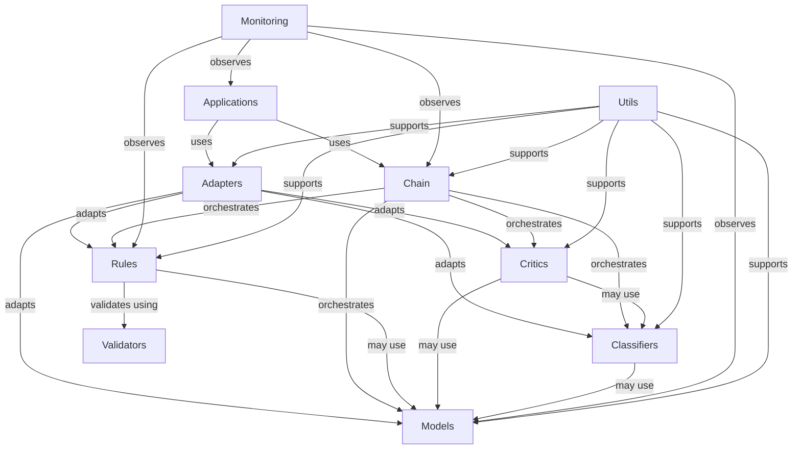

# Sifaka Component Architecture

This document provides a comprehensive overview of Sifaka's component architecture, explaining how different components interact and their responsibilities.

## Architectural Overview

Sifaka follows a layered architecture with clear separation of concerns between different components:

```
┌─────────────────────────────────────────────────────────────┐
│                        Applications                          │
└───────────────────────────┬─────────────────────────────────┘
                            │
┌───────────────────────────▼─────────────────────────────────┐
│                     Integration Layer                        │
│                                                             │
│  ┌─────────────┐    ┌─────────────┐    ┌─────────────────┐  │
│  │  Adapters   │    │  Chain      │    │  Monitoring     │  │
│  └─────────────┘    └─────────────┘    └─────────────────┘  │
└───────────────────────────┬─────────────────────────────────┘
                            │
┌───────────────────────────▼─────────────────────────────────┐
│                      Core Components                         │
│                                                             │
│  ┌─────────────┐    ┌─────────────┐    ┌─────────────────┐  │
│  │    Rules    │    │ Classifiers │    │     Critics     │  │
│  └─────────────┘    └─────────────┘    └─────────────────┘  │
│                                                             │
│  ┌─────────────────────────────────────────────────────┐    │
│  │                       Models                         │    │
│  └─────────────────────────────────────────────────────┘    │
└───────────────────────────┬─────────────────────────────────┘
                            │
┌───────────────────────────▼─────────────────────────────────┐
│                    Utility Components                        │
│                                                             │
│  ┌─────────────┐    ┌─────────────┐    ┌─────────────────┐  │
│  │   Logging   │    │   Tracing   │    │   Validation    │  │
│  └─────────────┘    └─────────────┘    └─────────────────┘  │
└─────────────────────────────────────────────────────────────┘
```

## Core Components

### Models

The Models layer provides a unified interface to various LLM providers:

- `models/base.py` - Defines the base interfaces for all model providers
- `models/anthropic.py` - Consolidated Anthropic model implementation
- `models/openai.py` - OpenAI models implementation
- `models/gemini.py` - Google Gemini models implementation
- `models/core.py` - Core model functionality and shared components

Models are responsible for:
- Text generation with prompts
- Parameter management (temperature, max tokens, etc.)
- Token counting and optimization
- Error handling and retries

### Rules

The Rules system provides validation logic for text content:

- `rules/base.py` - Base classes for all rule types
- `rules/formatting/` - Rules for text formatting (length, style, etc.)
- `rules/content/` - Rules for content validation (toxicity, bias, etc.)
- `rules/factual/` - Rules for factual verification
- `rules/domain/` - Domain-specific rule implementations

Rules follow a delegation pattern:
1. Rules delegate validation to Validators
2. Validators implement specific validation logic
3. Rules process and return the validation results

### Classifiers

Classifiers analyze and categorize text:

- `classifiers/base.py` - Base classifier interface
- `classifiers/toxicity.py` - Detects toxic content
- `classifiers/sentiment.py` - Analyzes sentiment
- `classifiers/topic.py` - Identifies topics
- `classifiers/ner.py` - Named entity recognition

Classifiers:
- Implement the classification logic
- Return structured classification results
- Can use models for inference or rule-based approaches

### Critics

Critics analyze and suggest improvements to text:

- `critics/base.py` - Base critic interface
- `critics/improvement.py` - Core improvement logic
- Various specialized critics for specific use cases

Critics:
- Analyze text for specific issues
- Suggest improvements based on analysis
- Work with models to generate improved versions

## Integration Layer

### Adapters

Adapters provide integration with external frameworks:

- `adapters/rules/` - Adapters for rule-based systems
  - `adapters/rules/classifier.py` - Adapter for classifier-based rules
  - `adapters/rules/guardrails_adapter.py` - Integration with Guardrails
  - `adapters/rules/base.py` - Base adapter functionality
- `adapters/langchain.py` - Integration with LangChain
- `adapters/langgraph.py` - Integration with LangGraph

Adapters:
- Translate between Sifaka's interfaces and external frameworks
- Wrap Sifaka components for use in external systems
- Provide compatibility layers

### Chain

The Chain module provides a workflow system for connecting components:

- `chain/base.py` - Base chain components
- `chain/validation.py` - Validation chains
- `chain/generation.py` - Text generation chains
- `chain/improvement.py` - Text improvement chains

Chains:
- Connect components in processing pipelines
- Handle data flow between components
- Manage state and context during processing

### Monitoring

The Monitoring module provides observability:

- `monitoring.py` - Monitoring and metrics collection

## Utility Components

### Logging and Tracing

- `utils/logging.py` - Enhanced logging functionality
- `utils/tracing.py` - Tracing for debugging and auditing

### Validation

- `utils/validation.py` - Configuration validation utilities

## Component Relationships

### Rule-Validator Pattern

```
┌────────────┐       ┌───────────────┐
│            │ uses  │               │
│    Rule    ├──────►│   Validator   │
│            │       │               │
└──────┬─────┘       └───────┬───────┘
       │                     │
       │                     │
       │                     │
┌──────▼─────┐       ┌───────▼───────┐
│            │       │               │
│ RuleConfig │       │ ValidatorImpl │
│            │       │               │
└────────────┘       └───────────────┘
```

The Rule-Validator pattern separates the interface from implementation:
1. Rules define the public interface and configuration
2. Validators implement the validation logic
3. This separation allows for reuse and extension

### Adapter Pattern

```
┌────────────┐       ┌───────────────┐
│            │ uses  │               │
│  External  ├──────►│    Adapter    │
│  Framework │       │               │
└────────────┘       └───────┬───────┘
                             │
                             │
                             │
                     ┌───────▼───────┐
                     │               │
                     │ Sifaka Core   │
                     │ Components    │
                     │               │
                     └───────────────┘
```

The Adapter pattern allows integration with external frameworks:
1. Adapters translate between external frameworks and Sifaka
2. This allows Sifaka components to be used in various environments
3. Adapters handle conversion of data formats and API differences

### Model Provider Pattern

```
┌────────────┐       ┌───────────────┐       ┌───────────────┐
│            │ uses  │               │ uses  │               │
│   Client   ├──────►│ Model Provider├──────►│   LLM API     │
│            │       │               │       │               │
└────────────┘       └───────────────┘       └───────────────┘
```

The Model Provider pattern:
1. Abstracts away specific LLM API details
2. Provides a consistent interface for text generation
3. Handles provider-specific configuration and error handling

## Dependencies Between Components



## Component Lifecycle

1. **Initialization**: Components are created with appropriate configuration
2. **Composition**: Components are composed into chains or adapters
3. **Operation**: Components process inputs and produce outputs
4. **Monitoring**: Operation is monitored for performance and errors
5. **Cleanup**: Resources are released when no longer needed

## Design Principles

1. **Separation of Concerns**: Each component has a clear responsibility
2. **Composability**: Components can be combined in flexible ways
3. **Extensibility**: New components can be added without modifying existing ones
4. **Interface Stability**: Public interfaces are stable across versions
5. **Configuration over Code**: Behavior is controlled by configuration where possible

## Common Patterns

1. **Factory Functions**: Components are created using factory functions
2. **Delegation**: Components delegate work to specialized implementations
3. **Validation**: Inputs and configurations are validated before use
4. **Error Handling**: Errors are caught, logged, and handled appropriately
5. **Configuration**: Components are configured through structured config objects

## Recent Architectural Changes

The following architectural changes were recently implemented:

1. **Adapter Layer Creation**:
   - Created a dedicated `/sifaka/adapters/` directory
   - Moved integration code into appropriate adapter modules
   - Added rule adapters in `/sifaka/adapters/rules/`

2. **Model Consolidation**:
   - Consolidated Anthropic implementations into `models/anthropic.py`
   - Ensured consistent interfaces across model providers

3. **Simplified Directory Structure**:
   - Removed incomplete domain directory
   - Organized code by component responsibility
   - Improved import paths for better discoverability

These changes improve code organization, reduce duplication, and make the architecture more consistent and maintainable.