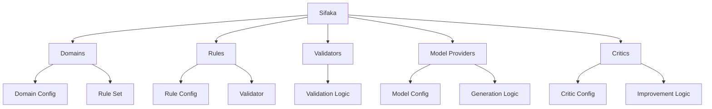
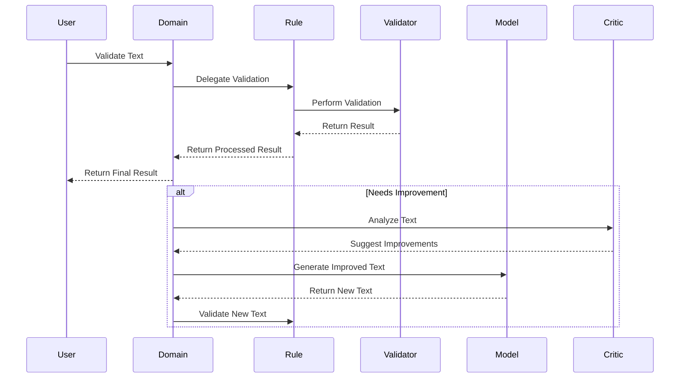
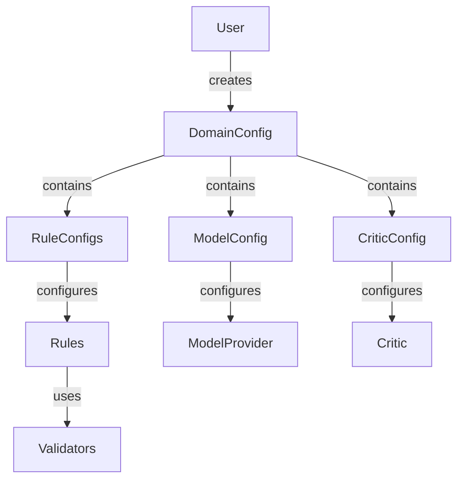
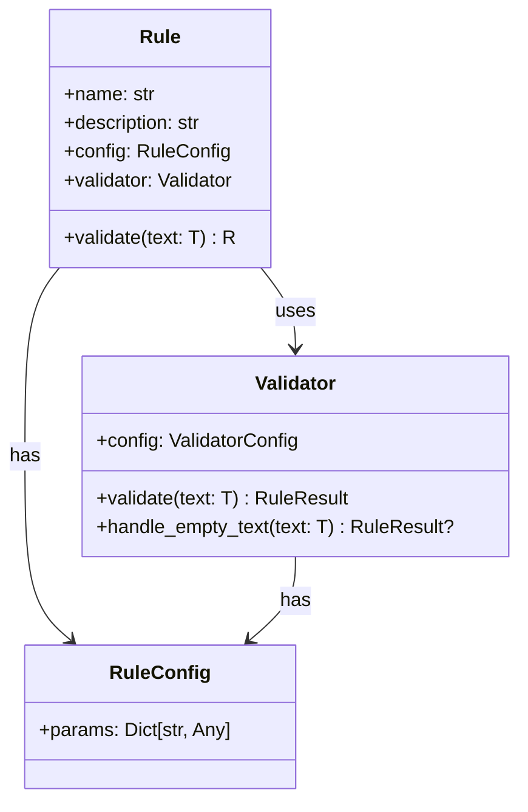
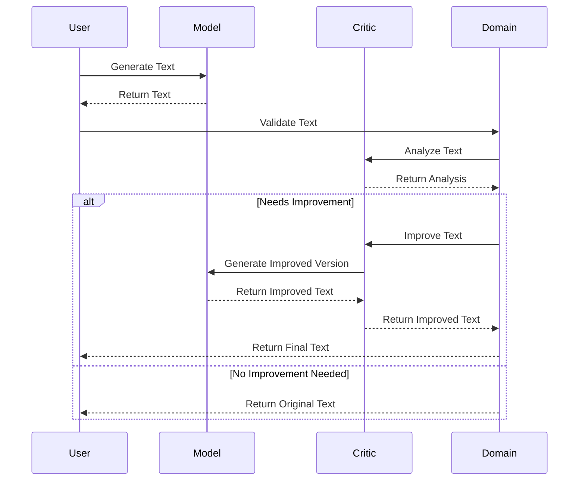
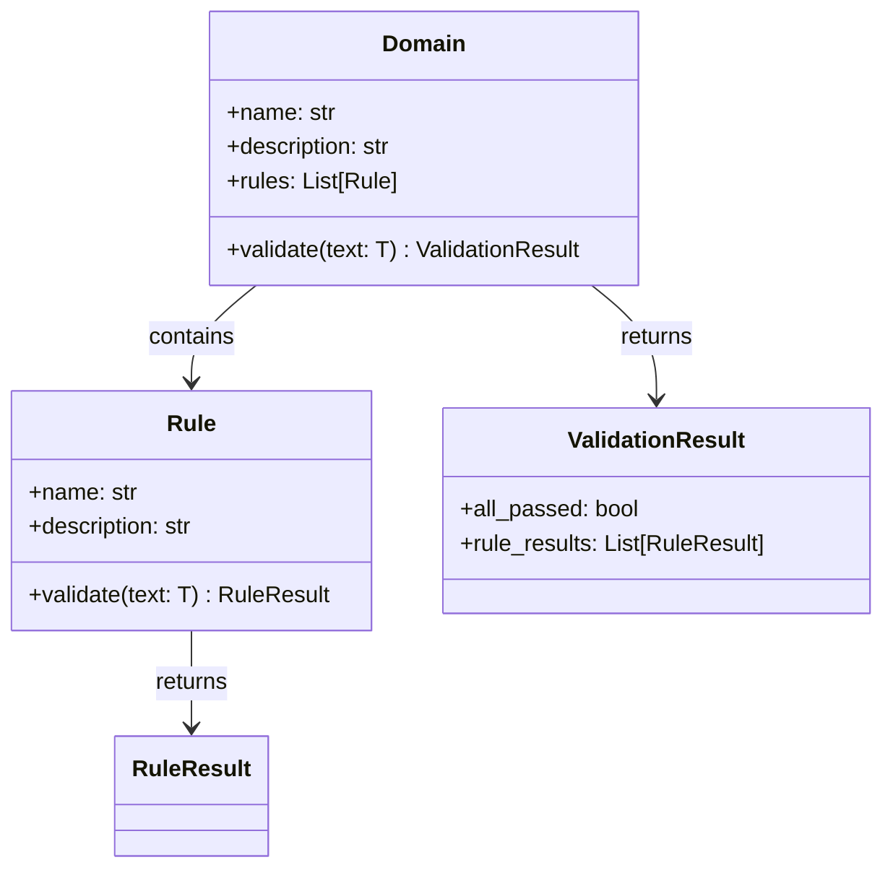
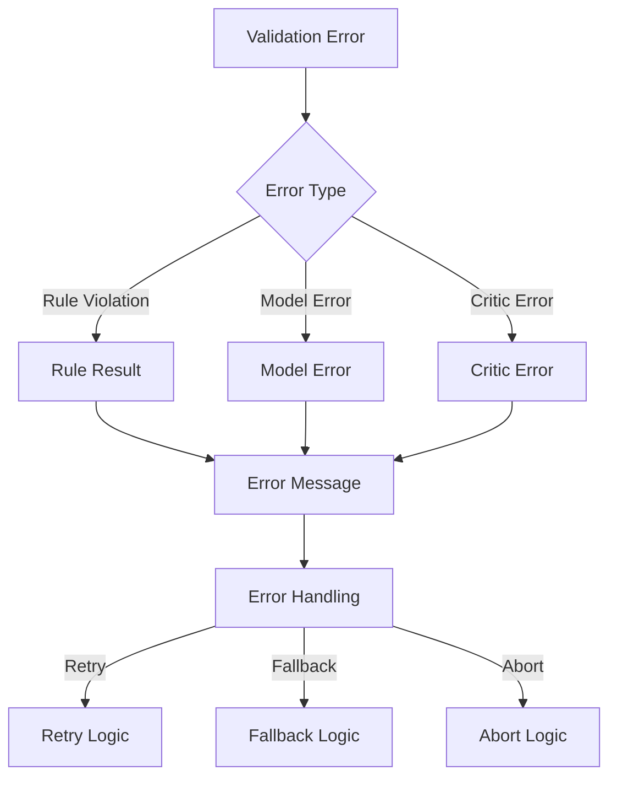
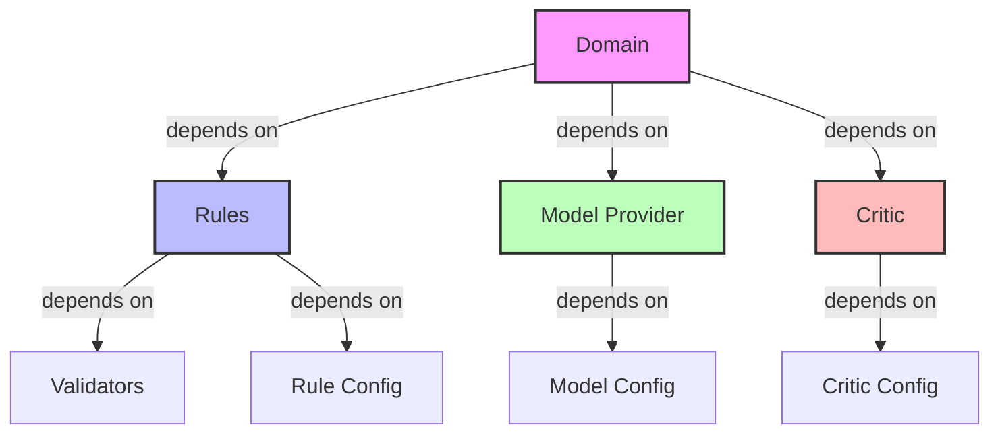
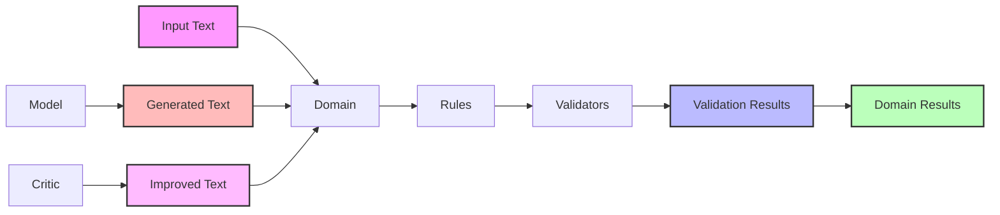

# Component Relationship Diagrams

This document provides visual representations of Sifaka's component relationships and interactions.

## Core Component Hierarchy

## Validation Flow

## Configuration Flow

## Rule-Validator Pattern

## Model-Critic Interaction

## Domain Composition

## Error Handling Flow

## Component Dependencies

## Data Flow

These diagrams illustrate:
1. The hierarchical structure of Sifaka's components
2. The flow of validation and improvement
3. Configuration relationships
4. The rule-validator pattern
5. Model-critic interactions
6. Domain composition
7. Error handling flows
8. Component dependencies
9. Data flow through the system

Each diagram provides a different perspective on how the components interact and work together to provide Sifaka's functionality.