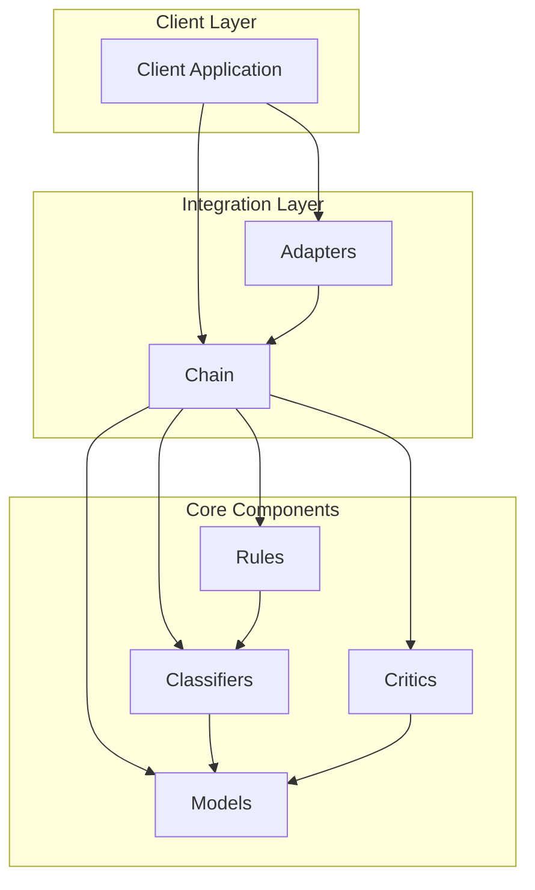
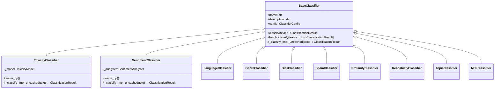
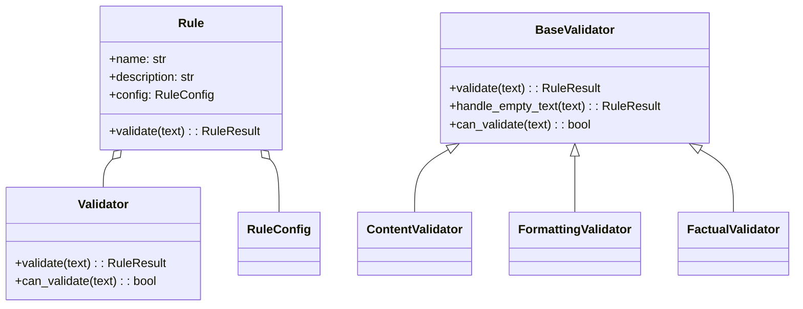
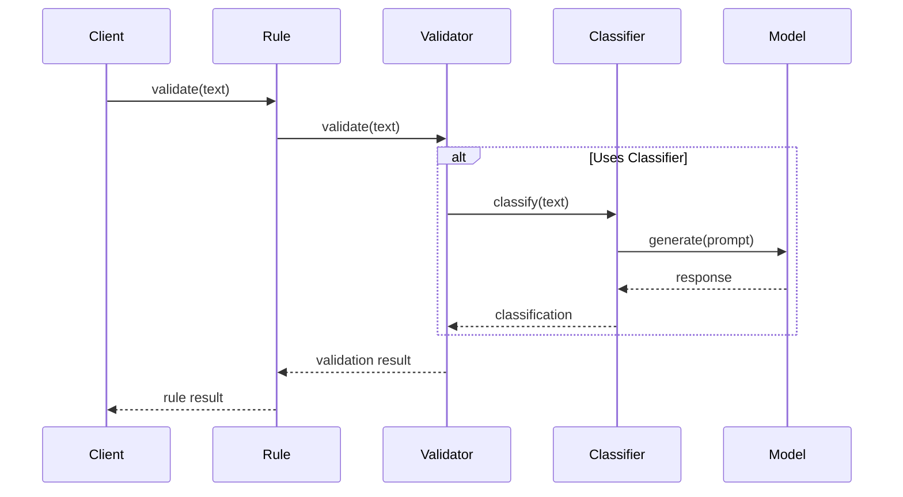
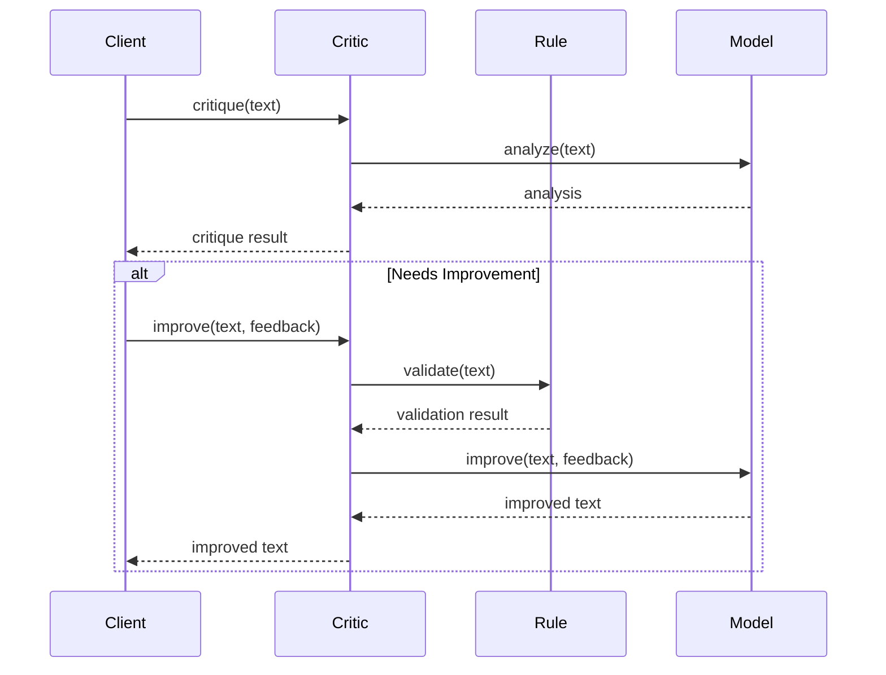
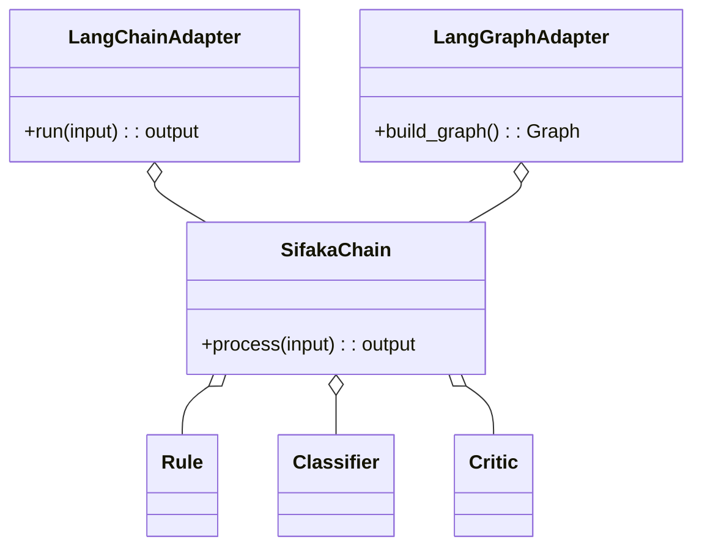
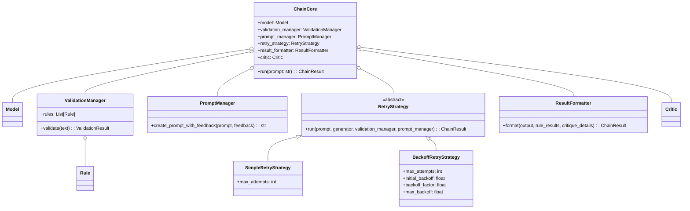
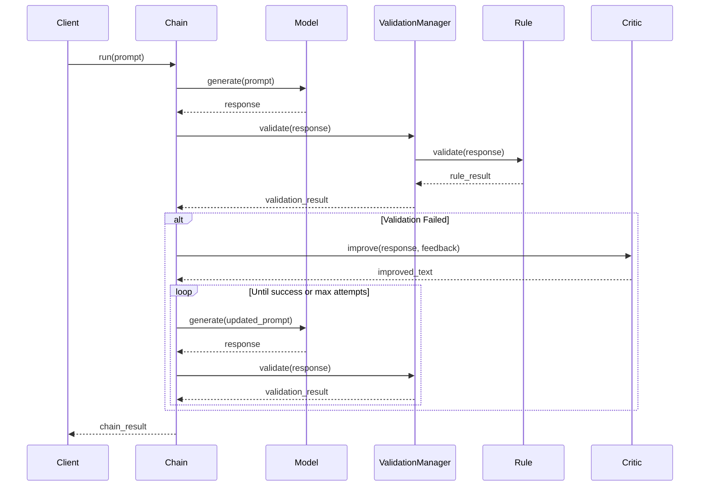
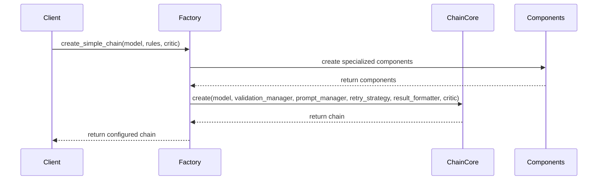
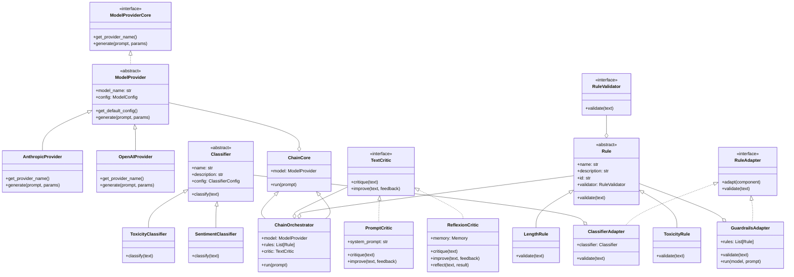

# Component Relationship Diagrams

This document provides Mermaid diagrams showing the relationships between key Sifaka components.

## High-Level Component Relationships



## Classifier Inheritance Hierarchy



## Rule Component Relationships



## Request Processing Sequence



## Critic Workflow



## Adapter Pattern



## Chain Architecture



## Chain Processing Flow



## Chain Factory Pattern



These diagrams provide a visual representation of the key relationships and interactions between Sifaka components. They can be rendered directly in GitHub or any Markdown viewer that supports Mermaid.



```mermaid
graph TD
    SifakaChain[SifakaChain] --> Model
    SifakaChain --> Rule
    SifakaChain --> Classifier
    SifakaChain --> Critic

    ClassifierAdapter[ClassifierAdapter] --> Classifier
    ClassifierAdapter --> Rule

    GuardrailsAdapter[GuardrailsAdapter] --> Rule
    GuardrailsAdapter --> SifakaChain

    class SifakaChain {
        +process(input): output
    }

    class Rule {
        +validate(text): result
    }

    class Classifier {
        +classify(text): result
    }

    class Critic {
        +improve(text, feedback): improved_text
    }

    class ClassifierAdapter {
        +validate(text): result
    }

    class GuardrailsAdapter {
        +run(prompt): result
    }

    class Model {
        +generate(prompt): text
    }
```