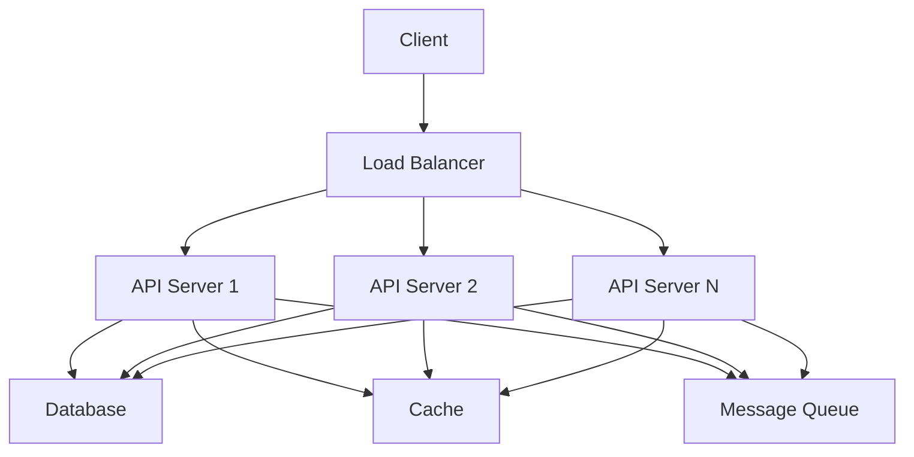
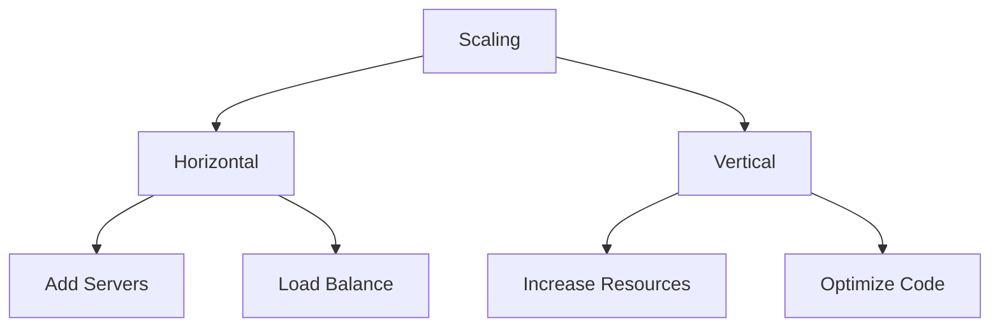
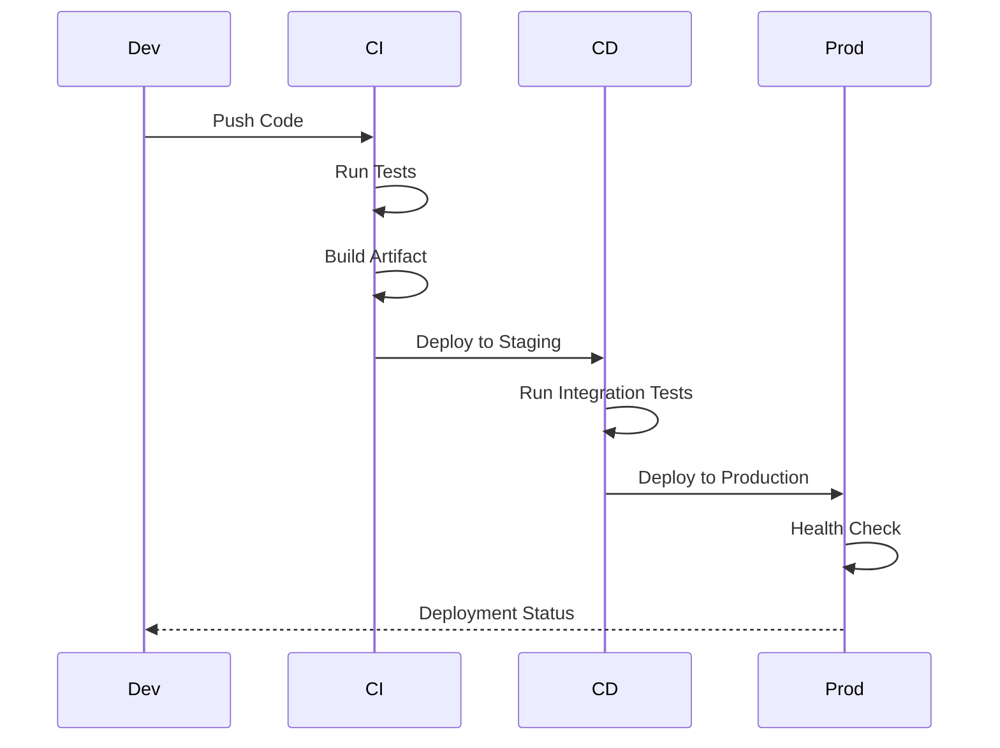
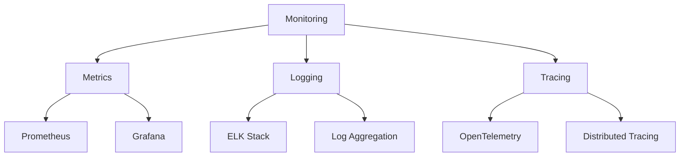
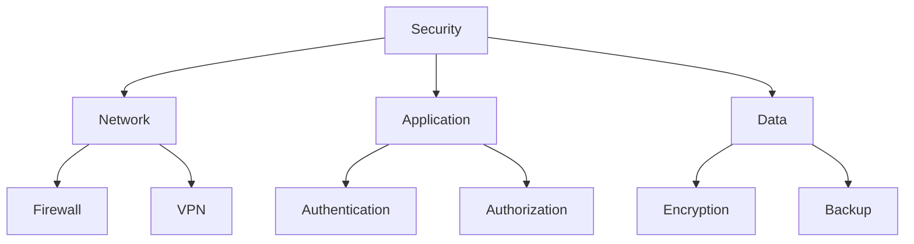
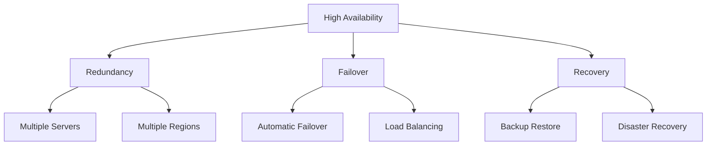
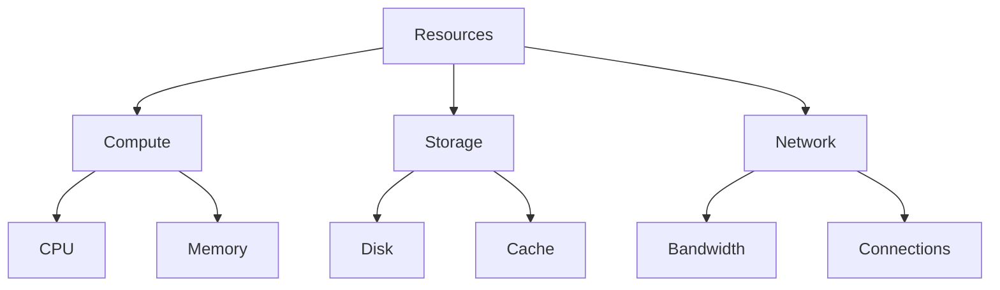
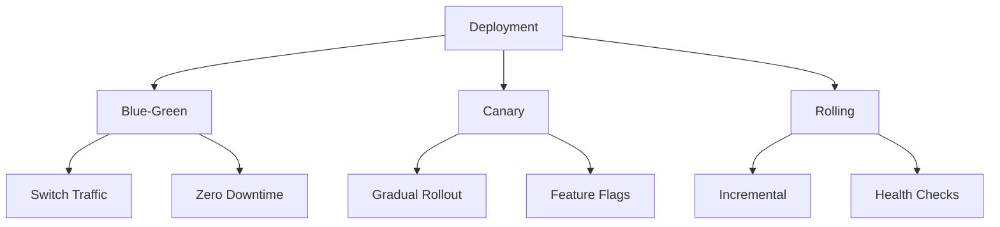

# Deployment Architecture

This document provides visual representations of Sifaka's deployment architecture and patterns.

## Deployment Topology

## Scaling Strategy

## Deployment Pipeline

## Monitoring Architecture

## Security Architecture

## High Availability

## Resource Management

## Deployment Patterns

These diagrams illustrate:
1. The deployment topology
2. Scaling strategies
3. Deployment pipeline
4. Monitoring architecture
5. Security considerations
6. High availability setup
7. Resource management
8. Deployment patterns

Each diagram provides a different perspective on how Sifaka is deployed and managed in production environments.