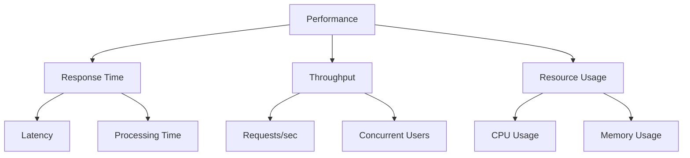
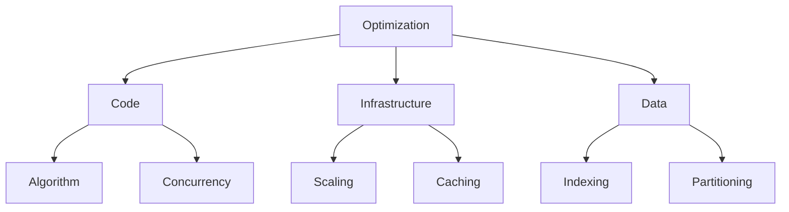
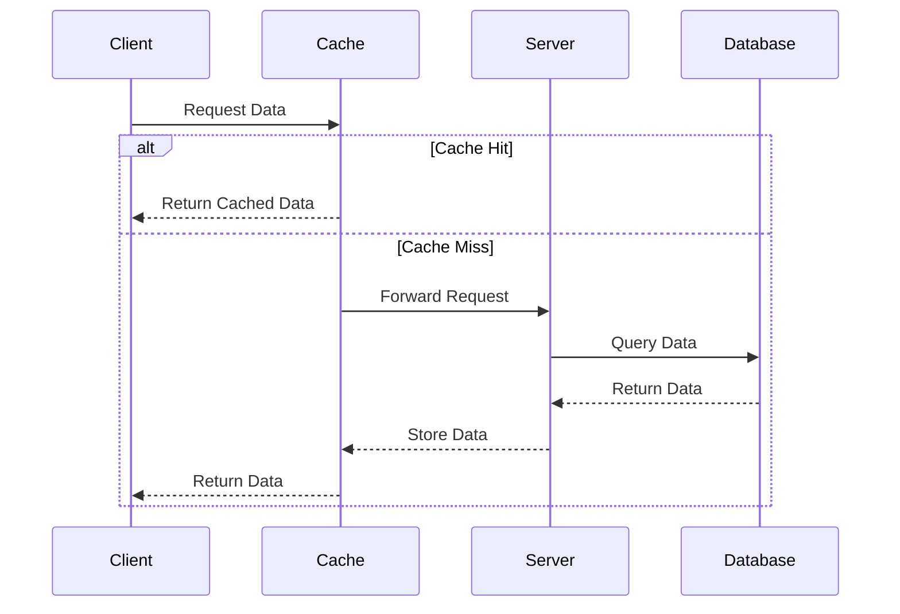
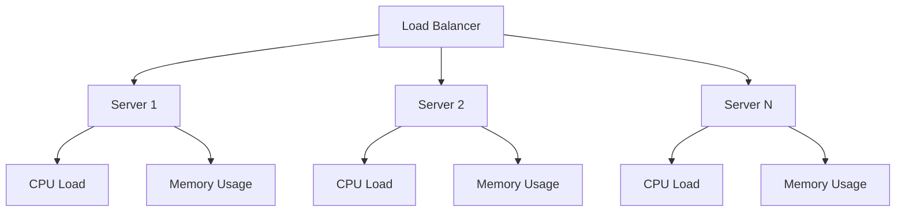
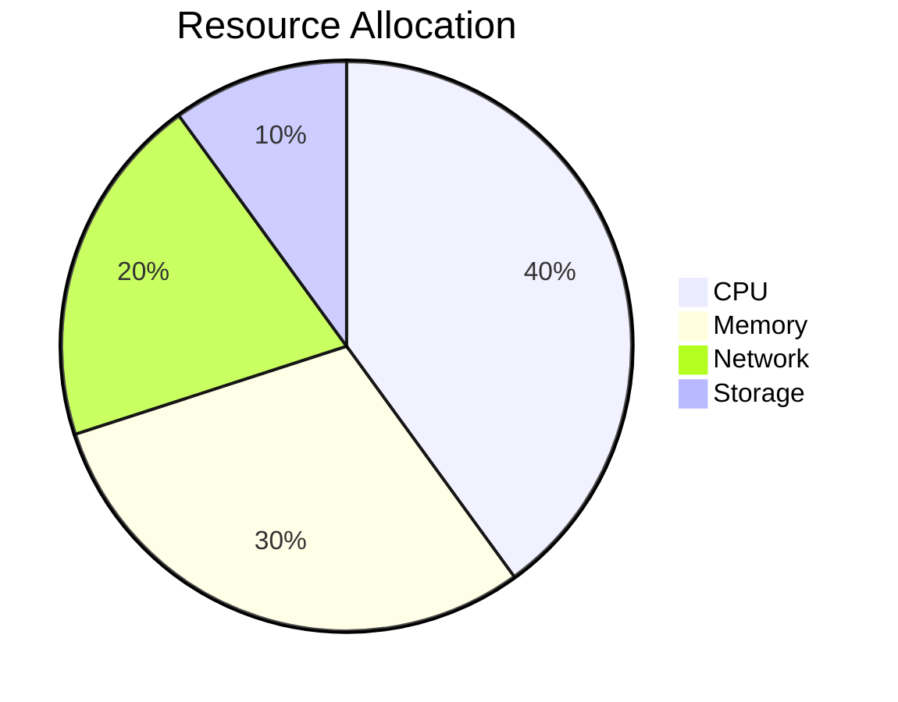
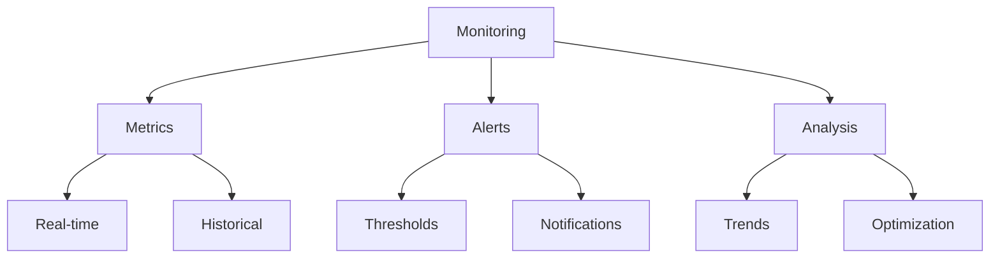
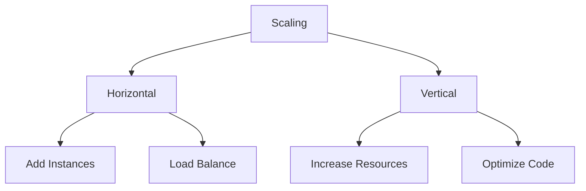
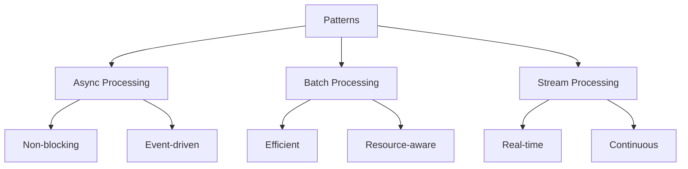

# Performance Architecture

This document provides visual representations of Sifaka's performance characteristics and optimization strategies.

## Performance Characteristics

## Optimization Strategies

## Caching Strategy

## Load Balancing

## Resource Allocation

## Performance Monitoring

## Scaling Strategy

## Performance Patterns

These diagrams illustrate:
1. Key performance characteristics
2. Optimization strategies
3. Caching implementation
4. Load balancing approach
5. Resource allocation
6. Performance monitoring
7. Scaling strategies
8. Performance patterns

Each diagram provides a different perspective on how Sifaka handles performance optimization and monitoring.