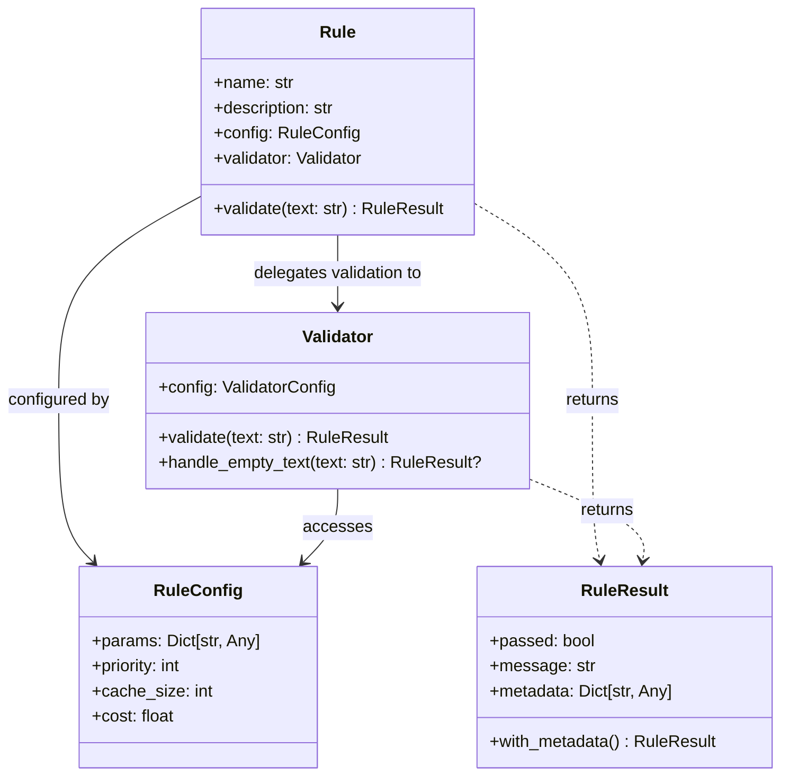
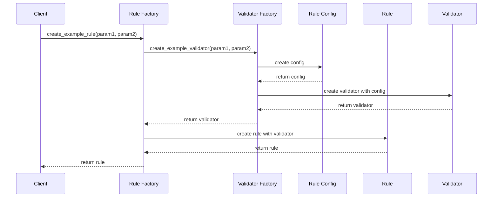
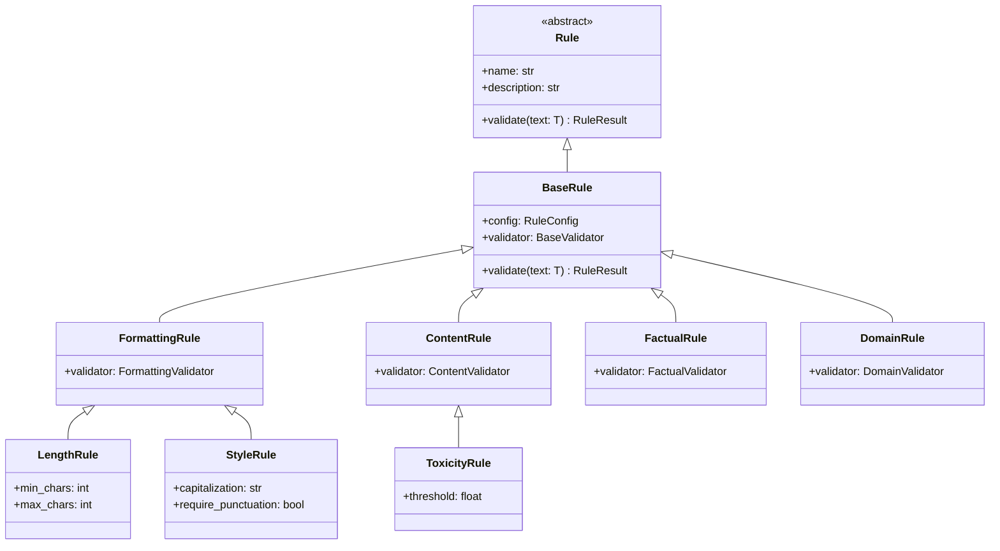
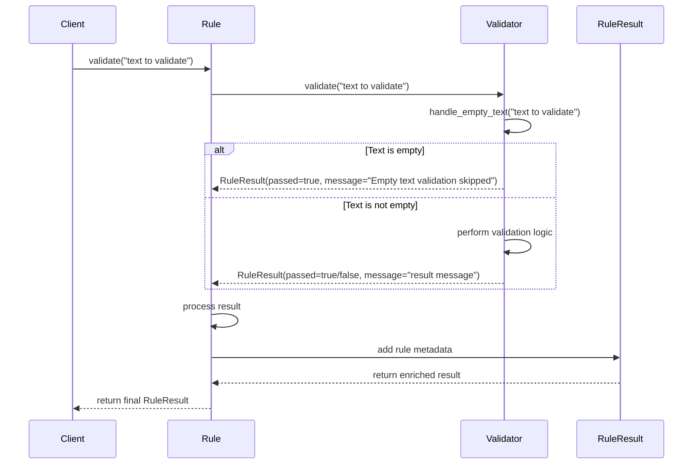
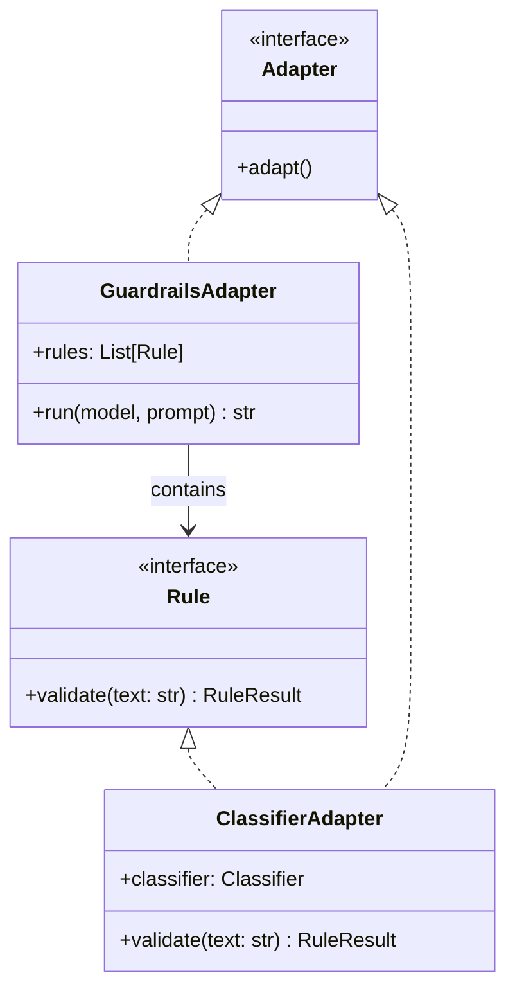
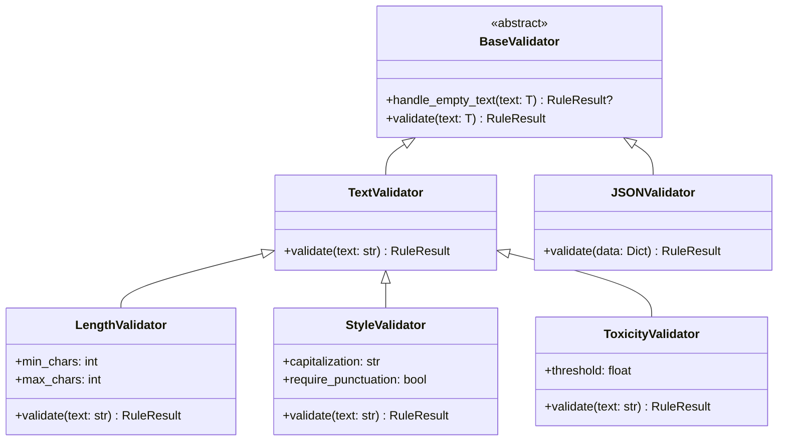
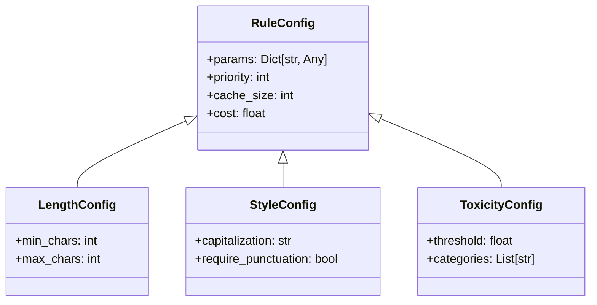
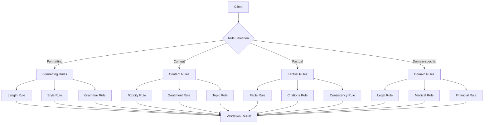
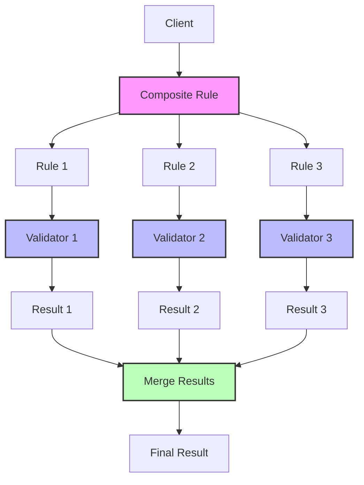
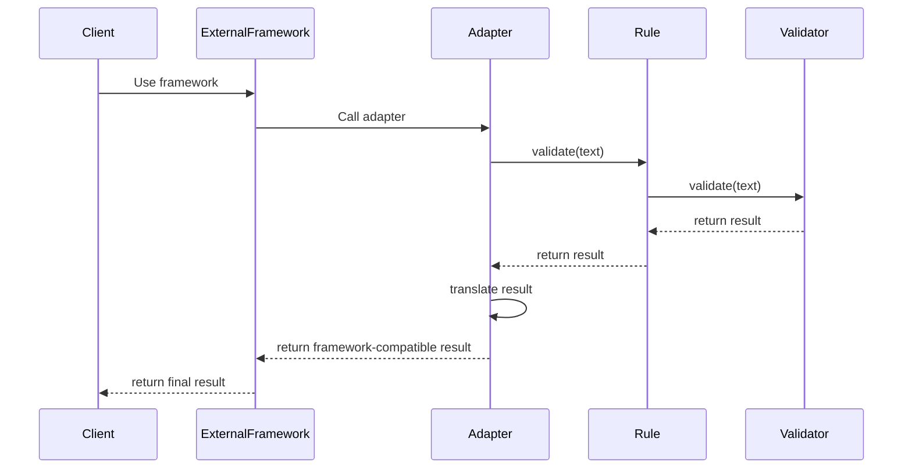

# Rules and Validators Relationship

This document provides visual representations of the relationship between Rules and Validators in Sifaka.

## Basic Rule-Validator Pattern

## Factory Pattern for Rules and Validators

## Rule Hierarchy and Inheritance

## Rule-Validator Delegation Flow

## Rule Adapters

## Validator Types

## Rule Configuration

## Rule Use Cases

## Rule Composition

## Adapter-Rule Integration

These diagrams illustrate:

1. The class relationships between Rules and Validators
2. The factory pattern used to create Rules and Validators
3. The inheritance hierarchy of different Rule and Validator types
4. The delegation flow during validation
5. Rule adaptation to external frameworks
6. Different types of Validators
7. Configuration structure for Rules
8. Rule use cases by category
9. Rule composition for complex validation
10. Integration of Adapters with Rules and external frameworks

The Rule-Validator pattern is central to Sifaka's architecture, providing separation of concerns, reusability, and extensibility.