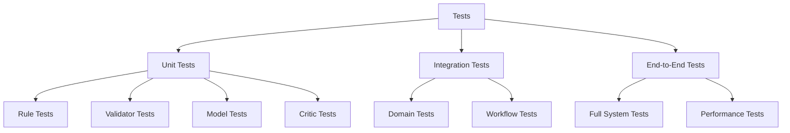
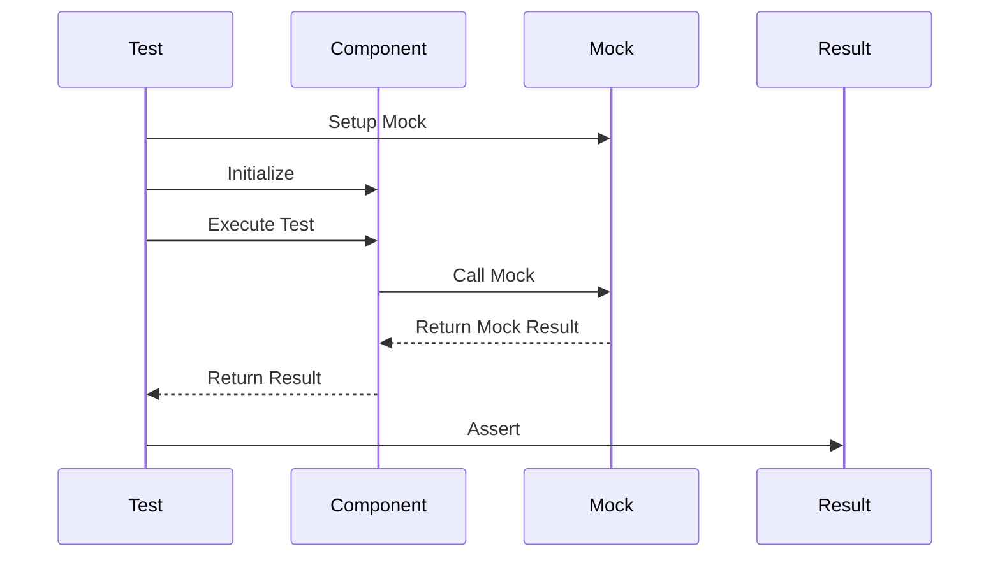
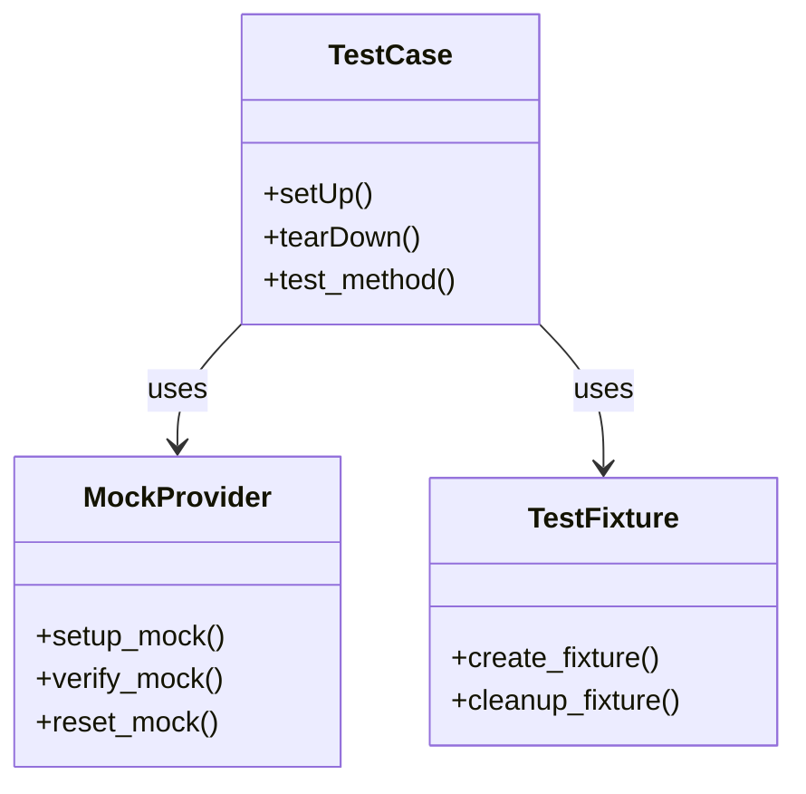
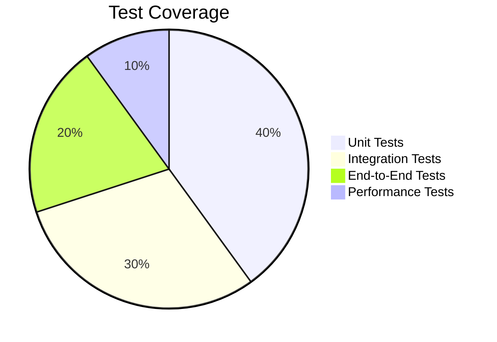
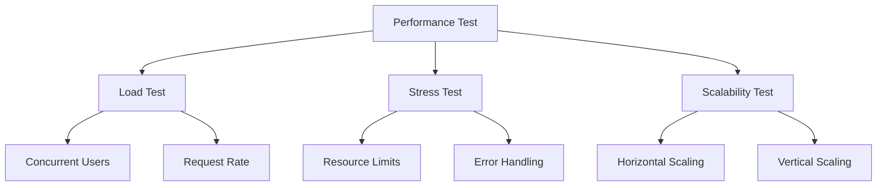
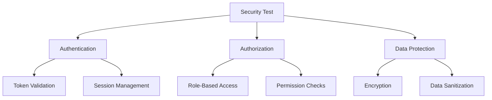
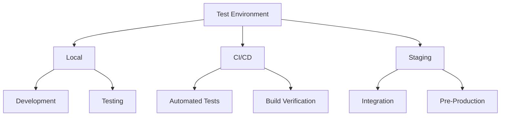
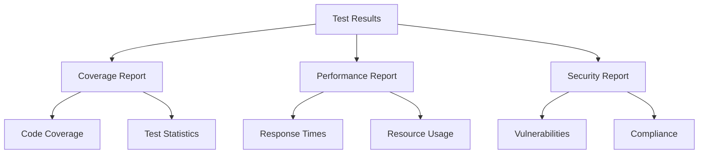

# Testing Workflows

This document provides visual representations of Sifaka's testing workflows and patterns.

## Test Architecture

## Test Data Flow

## Mocking Strategy

## Test Coverage

## Performance Testing

## Security Testing

## Test Environment

## Test Reporting

These diagrams illustrate:
1. The overall test architecture
2. Test data flow patterns
3. Mocking strategies
4. Test coverage distribution
5. Performance testing approaches
6. Security testing considerations
7. Test environment setup
8. Test reporting structure

Each diagram provides a different perspective on how testing is implemented and managed in Sifaka.