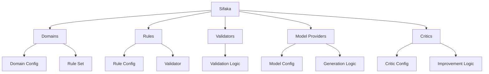
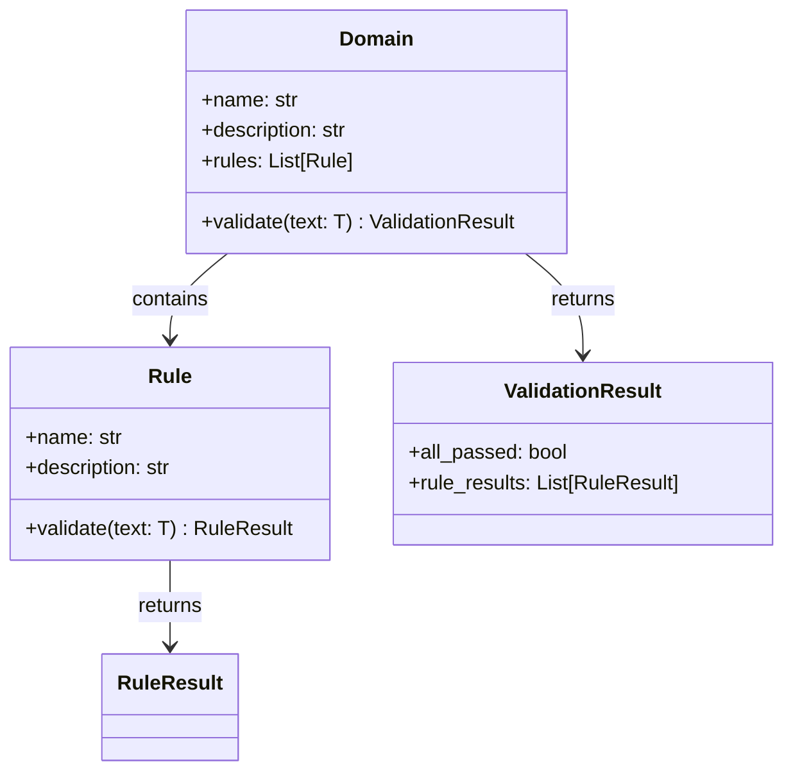
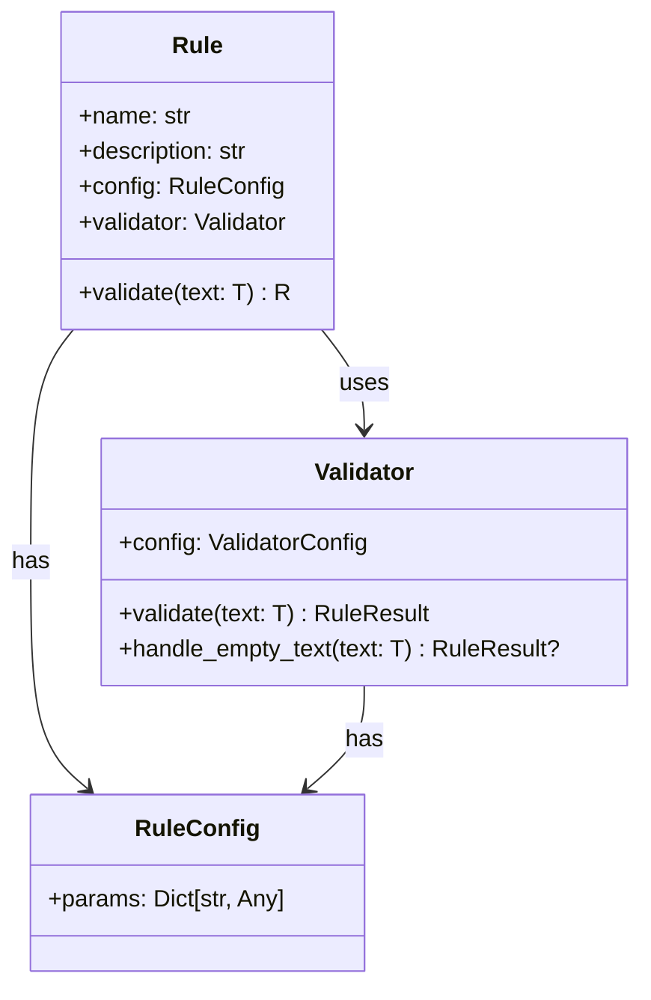
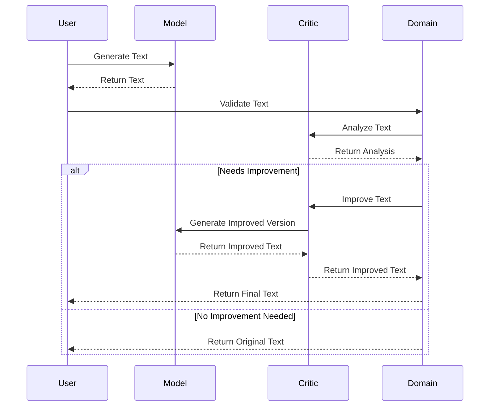
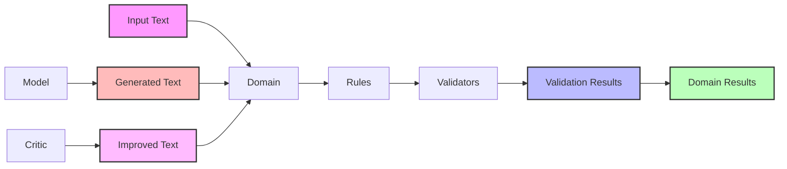
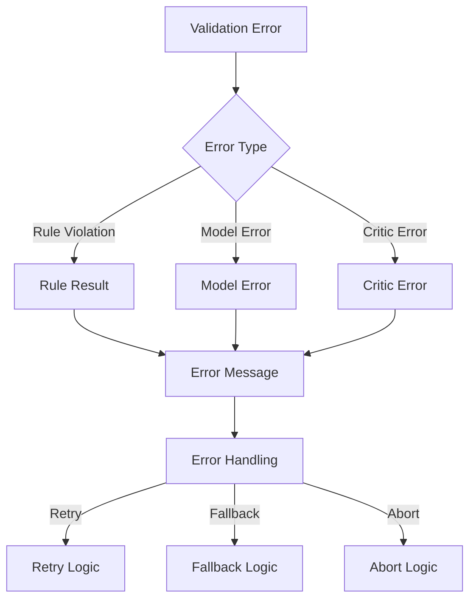
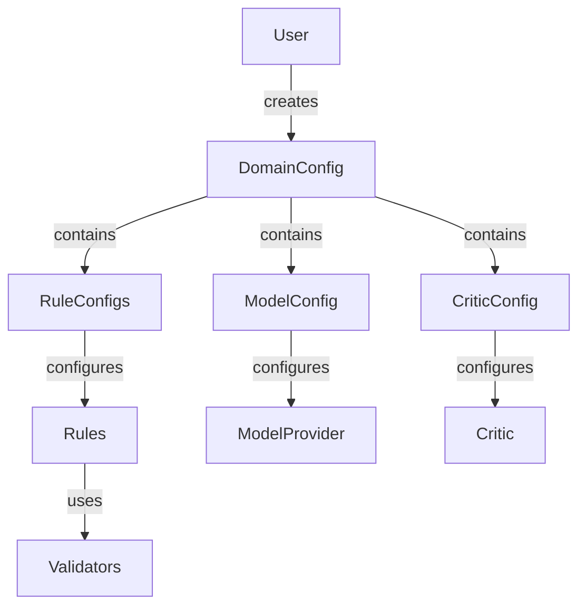

# System Design

This document provides a high-level overview of Sifaka's system design, including its architecture, components, and their interactions.

## System Overview

Sifaka is a flexible and extensible framework for text validation and improvement. It follows a modular design that allows for easy extension and customization.

### Core Architecture

The system is built around several core components that work together to provide text validation and improvement capabilities:

## Component Design

### 1. Domains

Domains are the top-level containers that manage validation and improvement workflows. They coordinate the interaction between rules, models, and critics.

### 2. Rules and Validators

Rules and validators follow a delegation pattern where rules manage the validation lifecycle and validators implement the actual validation logic.

### 3. Model Providers

Model providers interface with language models to generate and improve text. They handle model-specific configuration and token management.

## Data Flow

The system follows a clear data flow pattern:

## Error Handling

The system implements a comprehensive error handling strategy:

## Configuration Management

Configuration is managed through a hierarchical structure:

## Design Principles

1. **Modularity**: Each component has a single responsibility and clear interfaces
2. **Extensibility**: New rules, validators, and critics can be added without modifying core code
3. **Configuration-Driven**: Behavior is controlled through configuration rather than code changes
4. **Type Safety**: Strong typing throughout the system to catch errors early
5. **Error Handling**: Comprehensive error handling with clear error messages and recovery strategies
6. **Performance**: Efficient validation and improvement processes
7. **Testability**: Components are designed to be easily testable in isolation

## Implementation Patterns

1. **Factory Pattern**: Used for creating rules, validators, and other components
2. **Strategy Pattern**: Used for different validation and improvement strategies
3. **Observer Pattern**: Used for monitoring validation and improvement progress
4. **Decorator Pattern**: Used for adding functionality to existing components
5. **Composite Pattern**: Used for managing collections of rules and validators

## Best Practices

1. **Rule Implementation**
   - Use factory functions for creation
   - Delegate validation to validators
   - Process validation results
   - Provide clear error messages

2. **Validator Implementation**
   - Focus on single validation task
   - Handle edge cases
   - Return detailed results
   - Support configuration

3. **Configuration**
   - Use type-safe config classes
   - Validate configuration values
   - Provide sensible defaults
   - Document configuration options

4. **Integration**
   - Follow established patterns
   - Use provided interfaces
   - Handle errors gracefully
   - Support customization