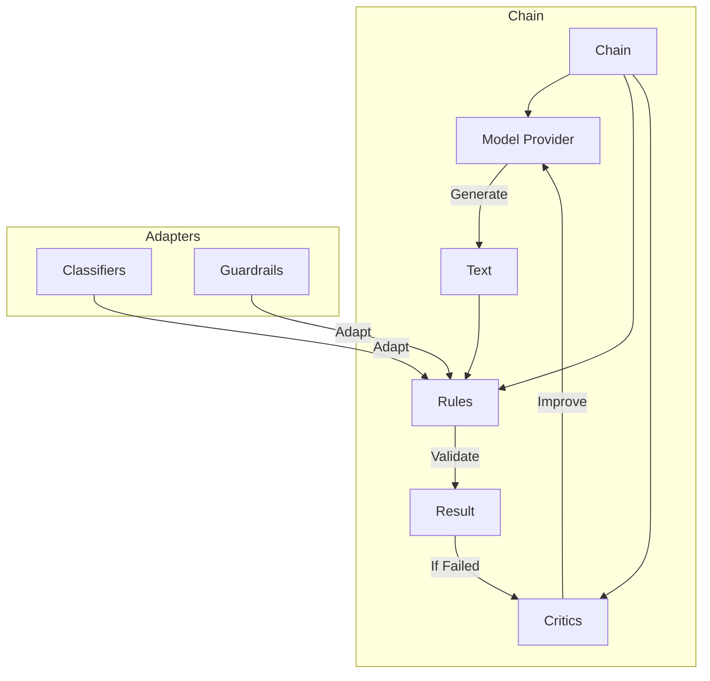

# Sifaka Components

This directory contains documentation for specific components in the Sifaka framework.

## Core Components

- [Rules](rules.md) - Binary pass/fail validation of text
- [Classifiers](classifiers.md) - Analysis and categorization of text
- [Critics](critics.md) - Feedback and suggestions for improving text
- [Model Providers](model_providers.md) - Connection to language models for text generation
- [Chains](chains.md) - Orchestration of models, rules, and critics

## Specific Implementations

### Classifiers

- [NER Classifier](ner_classifier.md) - Named Entity Recognition for identifying entities like people, organizations, and locations in text

### Adapters

- [Guardrails Integration](guardrails_integration.md) - Integration with Guardrails AI for advanced validation capabilities

## Component Relationships

The components in Sifaka work together to create a feedback loop for text generation and improvement:

## Getting Started

To get started with Sifaka components, see the [README](../../README.md) for installation instructions and basic usage examples.

For detailed documentation on specific components, see the links above.
