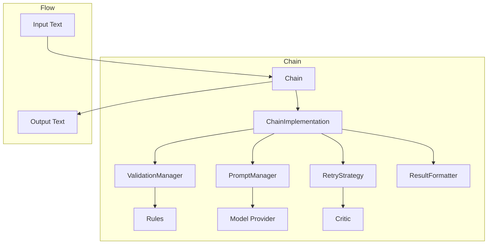

# Chains Component

Chains orchestrate the interaction between models, rules, and critics. They manage the improvement loop that generates text, validates it, and improves it if necessary.

## Architecture

Chains follow a composition-based architecture:

1. **Chain**: Main class that delegates to specialized implementations
2. **ChainImplementation**: Protocol for chain implementations
3. **ValidationManager**: Manages rule validation
4. **PromptManager**: Manages prompt creation and formatting
5. **RetryStrategy**: Implements retry logic for failed validations
6. **ResultFormatter**: Formats chain results



## Core Components

### ChainConfig

`ChainConfig` is an immutable configuration class for chains:

```python
from sifaka.chain.models import ChainConfig

# Create a chain configuration
config = ChainConfig(
    name="my_chain",
    description="A custom chain",
    max_attempts=3,
    cache_size=100,
    params={
        "system_prompt": "You are a helpful assistant.",
    }
)

# Access configuration values
print(f"Name: {config.name}")
print(f"Max attempts: {config.max_attempts}")
print(f"System prompt: {config.params.get('system_prompt')}")
```

### ChainResult

`ChainResult` is the standardized result format for chain execution:

```python
from sifaka.chain.models import ChainResult
from sifaka.rules.base import RuleResult

# Create a chain result
result = ChainResult(
    input="Write a short story",
    output="Once upon a time...",
    rule_results=[
        RuleResult(passed=True, message="Length is good"),
        RuleResult(passed=True, message="No prohibited content")
    ],
    attempt_count=1,
    success=True,
    metadata={
        "token_count": 50,
        "generation_time": 1.2,
    }
)

# Access result properties
print(f"Input: {result.input}")
print(f"Output: {result.output}")
print(f"Success: {result.success}")
print(f"Attempt count: {result.attempt_count}")
print("Rule results:")
for rule_result in result.rule_results:
    print(f"- {rule_result.message}")
```

## Chain Types

Sifaka provides several types of chains:

### Simple Chain

A basic chain that uses a simple retry strategy:

```python
from sifaka.chain import create_simple_chain
from sifaka.models import create_openai_provider
from sifaka.rules import create_length_rule
from sifaka.critics import create_prompt_critic

# Create components
model = create_openai_provider("gpt-4")
rules = [create_length_rule(min_chars=10, max_chars=1000)]
critic = create_prompt_critic(
    llm_provider=model,
    system_prompt="You are an expert editor."
)

# Create a simple chain
chain = create_simple_chain(
    model=model,
    rules=rules,
    critic=critic,
    max_attempts=3
)

# Run the chain
result = chain.run("Write a short story")
print(f"Output: {result.output}")
```

### Backoff Chain

A chain that uses an exponential backoff retry strategy:

```python
from sifaka.chain import create_backoff_chain
from sifaka.models import create_anthropic_provider
from sifaka.rules import create_length_rule, create_toxicity_rule
from sifaka.critics import create_prompt_critic

# Create components
model = create_anthropic_provider("claude-3-opus-20240229")
rules = [
    create_length_rule(min_chars=10, max_chars=1000),
    create_toxicity_rule(threshold=0.7)
]
critic = create_prompt_critic(
    llm_provider=model,
    system_prompt="You are an expert editor."
)

# Create a backoff chain
chain = create_backoff_chain(
    model=model,
    rules=rules,
    critic=critic,
    max_attempts=5,
    initial_backoff=1.0,
    backoff_factor=2.0,
    max_backoff=60.0
)

# Run the chain
result = chain.run("Write a short story")
print(f"Output: {result.output}")
```


## Using Chains

The recommended way to create chains is through factory functions:

```python
from sifaka.chain import create_simple_chain
from sifaka.models import create_openai_provider
from sifaka.rules import create_length_rule
from sifaka.critics import create_prompt_critic

# Create components
model = create_openai_provider("gpt-4")
rules = [create_length_rule(min_chars=10, max_chars=1000)]
critic = create_prompt_critic(
    llm_provider=model,
    system_prompt="You are an expert editor."
)

# Create a chain using the factory function
chain = create_simple_chain(
    model=model,
    rules=rules,
    critic=critic,
    max_attempts=3
)

# Run the chain
result = chain.run("Write a short story")

# Access the results
print(f"Input: {result.input}")
print(f"Output: {result.output}")
print(f"Success: {result.success}")
print(f"Attempt count: {result.attempt_count}")
print("Rule results:")
for rule_result in result.rule_results:
    print(f"- {rule_result.message}")
```

## Advanced Usage

### Custom System Prompts

Chains support custom system prompts for the model:

```python
from sifaka.chain import create_simple_chain
from sifaka.models import create_openai_provider

# Create a chain with a custom system prompt
chain = create_simple_chain(
    model=create_openai_provider("gpt-4"),
    system_prompt="You are a creative writer who specializes in short stories."
)

# Run the chain
result = chain.run("Write a short story about a robot")
```

### Custom Validation Logic

Chains support custom validation logic:

```python
from sifaka.chain import create_simple_chain
from sifaka.models import create_openai_provider
from sifaka.rules.base import FunctionRule, RuleResult

# Create a custom rule using a function
def contains_keywords(text: str, keywords: list) -> RuleResult:
    """Check if text contains required keywords."""
    found = [keyword for keyword in keywords if keyword.lower() in text.lower()]
    passed = len(found) > 0
    return RuleResult(
        passed=passed,
        message=f"Found {len(found)} of {len(keywords)} required keywords" if passed else "No required keywords found",
        metadata={"found": found, "keywords": keywords}
    )

# Create a rule from the function
keyword_rule = FunctionRule(
    func=lambda text: contains_keywords(text, ["robot", "future", "technology"]),
    name="keyword_rule",
    description="Checks if text contains required keywords"
)

# Create a chain with the custom rule
chain = create_simple_chain(
    model=create_openai_provider("gpt-4"),
    rules=[keyword_rule]
)

# Run the chain
result = chain.run("Write a short story")
```

### Custom Critics

Chains support custom critics:

```python
from sifaka.chain import create_simple_chain
from sifaka.models import create_openai_provider
from sifaka.critics.base import BaseCritic, CriticConfig, CriticMetadata

# Create a custom critic
class KeywordCritic(BaseCritic):
    """A critic that suggests adding missing keywords."""

    def validate(self, text: str) -> bool:
        """Validate that text contains required keywords."""
        keywords = self.config.params.get("keywords", [])
        found = [keyword for keyword in keywords if keyword.lower() in text.lower()]
        return len(found) == len(keywords)

    def critique(self, text: str) -> CriticMetadata:
        """Critique text and provide feedback."""
        keywords = self.config.params.get("keywords", [])
        found = [keyword for keyword in keywords if keyword.lower() in text.lower()]
        missing = [keyword for keyword in keywords if keyword.lower() not in text.lower()]

        if not missing:
            return CriticMetadata(
                score=1.0,
                feedback="All required keywords are present.",
                issues=[],
                suggestions=[]
            )

        return CriticMetadata(
            score=len(found) / len(keywords) if keywords else 1.0,
            feedback=f"Missing {len(missing)} required keywords: {', '.join(missing)}",
            issues=[f"Missing keyword: {keyword}" for keyword in missing],
            suggestions=[f"Add the keyword '{keyword}'" for keyword in missing]
        )

    def improve(self, text: str, feedback: Any = None) -> str:
        """Improve text by suggesting missing keywords."""
        keywords = self.config.params.get("keywords", [])
        found = [keyword for keyword in keywords if keyword.lower() in text.lower()]
        missing = [keyword for keyword in keywords if keyword.lower() not in text.lower()]

        if not missing:
            return text

        # Simple improvement: add missing keywords
        improved = text
        for keyword in missing:
            improved += f" {keyword}"

        return improved

# Create the critic
critic = KeywordCritic(
    CriticConfig(
        name="keyword_critic",
        description="Suggests adding missing keywords",
        params={"keywords": ["robot", "future", "technology"]}
    )
)

# Create a chain with the custom critic
chain = create_simple_chain(
    model=create_openai_provider("gpt-4"),
    critic=critic
)

# Run the chain
result = chain.run("Write a short story")
```

## Creating Custom Chains

To create a custom chain:

1. Create a class that implements the `ChainImplementation` protocol
2. Create a factory function that returns a `Chain` with your implementation
3. Use standardized state management with `_state_manager`

Example:

```python
from typing import Dict, Any, List, Optional
from pydantic import BaseModel, ConfigDict, PrivateAttr
from sifaka.chain.implementation import Chain, ChainImplementation
from sifaka.chain.config import ChainConfig
from sifaka.chain.result import ChainResult
from sifaka.models.base import ModelProvider
from sifaka.rules.base import Rule, RuleResult
from sifaka.critics.base import CriticCore
from sifaka.utils.state import create_chain_state, ChainState, StateManager

class CustomChainImplementation(BaseModel):
    """A custom chain implementation."""

    model_config = ConfigDict(arbitrary_types_allowed=True)

    # State management using StateManager
    _state_manager = PrivateAttr(default_factory=create_chain_state)

    def __init__(
        self,
        model: ModelProvider,
        rules: List[Rule],
        critic: Optional[CriticCore] = None,
        max_attempts: int = 3,
        **kwargs: Any,
    ):
        """Initialize the implementation."""
        # Initialize the base class
        super().__init__(**kwargs)

        # Initialize state
        state = self._state_manager.get_state()
        state.model = model
        state.rules = rules
        state.critic = critic
        state.max_attempts = max_attempts
        state.initialized = True

    def run_impl(self, prompt: str) -> ChainResult:
        """Run the chain implementation with the given prompt."""
        # Get state
        state = self._state_manager.get_state()

        # Initialize result tracking
        attempt_count = 0

        # Generate initial text
        output = state.model.generate(prompt)

        # Track attempts
        while attempt_count < state.max_attempts:
            attempt_count += 1

            # Validate output
            rule_results = [rule.validate(output) for rule in state.rules]
            all_passed = all(result.passed for result in rule_results)

            # If all rules passed, return success
            if all_passed:
                return ChainResult(
                    output=output,
                    rule_results=rule_results,
                    metadata={"attempt_count": attempt_count}
                )

            # If critic is available, use it to improve output
            if state.critic and attempt_count < state.max_attempts:
                # Get feedback from critic
                critique = state.critic.critique(output)

                # Improve output
                output = state.critic.improve(output, critique)
            else:
                # No critic or max attempts reached
                break

        # Return final result (success or failure)
        return ChainResult(
            output=output,
            rule_results=rule_results,
            metadata={"attempt_count": attempt_count}
        )

    def warm_up_impl(self) -> None:
        """Warm up the chain implementation."""
        # No special initialization needed
        pass

# Factory function
def create_custom_chain(
    model: ModelProvider,
    rules: List[Rule],
    critic: Optional[CriticCore] = None,
    max_attempts: int = 3,
    name: str = "custom_chain",
    description: str = "A custom chain implementation",
    **kwargs: Any,
) -> Chain:
    """Create a custom chain."""
    # Create config
    config = ChainConfig(
        max_attempts=max_attempts,
        params=kwargs,
    )

    # Create implementation
    implementation = CustomChainImplementation(
        model=model,
        rules=rules,
        critic=critic,
        max_attempts=max_attempts,
    )

    # Create and return chain
    return Chain(
        name=name,
        description=description,
        config=config,
        implementation=implementation,
    )

# Usage example
from sifaka.models import create_openai_provider
from sifaka.rules import create_length_rule
from sifaka.critics import create_prompt_critic

# Create components
model = create_openai_provider("gpt-4")
rules = [create_length_rule(min_chars=10, max_chars=1000)]
critic = create_prompt_critic(
    llm_provider=model,
    system_prompt="You are an expert editor."
)

# Create a custom chain
chain = create_simple_custom_chain(
    model=model,
    rules=rules,
    critic=critic,
    max_attempts=3
)

# Run the chain
result = chain.run("Write a short story")
print(f"Output: {result.output}")
```

## Best Practices

1. **Use factory functions** for creating chains
2. **Use standardized state management** with `_state_manager`
3. **Set reasonable max_attempts** to prevent infinite loops
4. **Include detailed metadata** in chain results
5. **Handle empty text gracefully** in all methods
6. **Use appropriate rules** for your use case
7. **Use appropriate critics** for your use case
8. **Document chain behavior** in docstrings
9. **Implement error handling** for model failures
10. **Use system prompts** to guide model behavior

## Error Handling

Chains implement several error handling patterns:

1. **Input Validation**: Validate all inputs before processing
2. **Graceful Degradation**: Return a meaningful result rather than raising exceptions
3. **Diagnostic Information**: Include diagnostic information in the result metadata
4. **Exception Management**: Use a clear exception hierarchy
   - `ValueError`: For issues with input validation
   - `RuntimeError`: For issues with chain execution

## Performance Considerations

1. **Rule Ordering**: Order rules by computational cost (cheapest first)
2. **Caching**: Enable caching for rules and critics that are used frequently
3. **Token Optimization**: Optimize prompts to reduce token usage
4. **Cost Awareness**: Be aware of the computational cost of different components
5. **Resource Management**: Release resources when no longer needed
