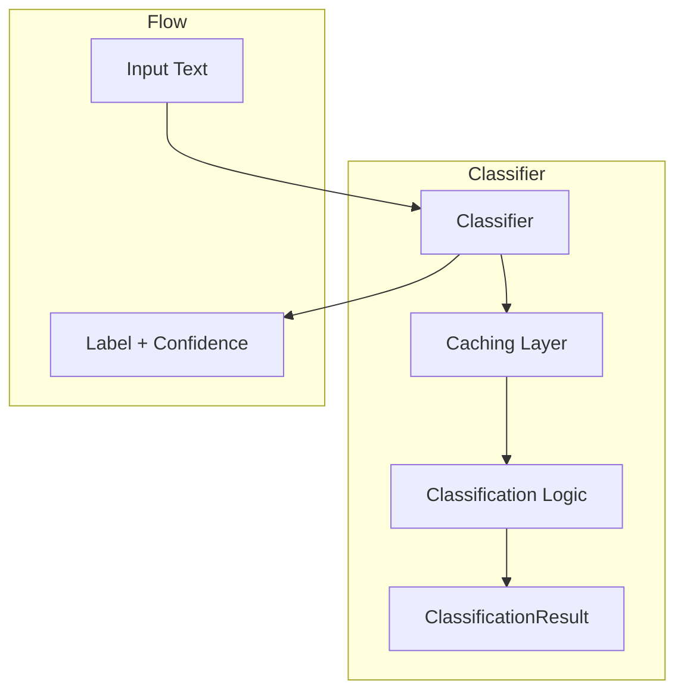

# Classifiers Component

Classifiers analyze and categorize text based on various criteria. Unlike rules, which provide binary pass/fail validation, classifiers return a label and confidence score, providing more nuanced analysis of text.

## Architecture

Classifiers follow a layered architecture:

1. **Public API**: `classify()` and `batch_classify()` methods
2. **Caching Layer**: `_classify_impl()` handles caching
3. **Core Logic**: `_classify_impl_uncached()` implements classification logic
4. **Validation**: `validate_input()` and `validate_batch_input()` ensure valid inputs



## Core Components

### ClassifierConfig

`ClassifierConfig` is an immutable configuration class for classifiers:

```python
from sifaka.classifiers.base import ClassifierConfig

# Create a classifier configuration
config = ClassifierConfig(
    labels=["positive", "negative", "neutral"],
    min_confidence=0.7,
    cache_size=100,
    cost=2,
    params={
        "model_name": "sentiment-large",
        "threshold": 0.7,
    }
)

# Access configuration values
print(f"Labels: {config.labels}")
print(f"Min confidence: {config.min_confidence}")
print(f"Model name: {config.params.get('model_name')}")
```

### ClassificationResult

`ClassificationResult` is the standardized result format for classification:

```python
from sifaka.classifiers.base import ClassificationResult

# Create a classification result
result = ClassificationResult(
    label="positive",
    confidence=0.85,
    metadata={
        "compound_score": 0.8,
        "positive_score": 0.9,
        "negative_score": 0.1,
    }
)

# Access result properties
print(f"Label: {result.label}")
print(f"Confidence: {result.confidence:.2f}")
print(f"Compound score: {result.metadata['compound_score']:.2f}")

# Create a new result with additional metadata
enhanced = result.with_metadata(
    timestamp="2023-07-01T12:34:56"
).with_metadata(
    action_taken="content_approved"
)
```

## Classifier Types

Sifaka provides several types of classifiers:

### Content Analysis Classifiers

Classifiers that analyze the content of text:

```python
from sifaka.classifiers import (
    create_sentiment_classifier,
    create_toxicity_classifier,
    create_profanity_classifier,
    create_spam_classifier,
    create_bias_detector,
)

# Create a sentiment classifier
sentiment = create_sentiment_classifier(
    positive_threshold=0.1,
    negative_threshold=-0.1,
    cache_size=100
)

# Create a toxicity classifier
toxicity = create_toxicity_classifier(
    general_threshold=0.5,
    severe_toxic_threshold=0.7,
    threat_threshold=0.7,
    cache_size=100
)

# Create a profanity classifier
profanity = create_profanity_classifier(
    threshold=0.5,
    cache_size=100
)

# Create a spam classifier
spam = create_spam_classifier(
    threshold=0.7,
    cache_size=100
)

# Create a bias detector
bias = create_bias_detector(
    cache_size=100
)
```

### Text Properties Classifiers

Classifiers that analyze the properties of text:

```python
from sifaka.classifiers import (
    create_language_classifier,
    create_readability_classifier,
    create_topic_classifier,
    create_genre_classifier,
)

# Create a language classifier
language = create_language_classifier(
    min_confidence=0.1,
    fallback_lang="en",
    cache_size=100
)

# Create a readability classifier
readability = create_readability_classifier(
    cache_size=100
)

# Create a topic classifier
topic = create_topic_classifier(
    cache_size=100
)

# Create a genre classifier
genre = create_genre_classifier(
    cache_size=100
)
```

### Entity Analysis Classifiers

Classifiers that analyze entities in text:

```python
from sifaka.classifiers import create_ner_classifier

# Create a named entity recognition classifier
ner = create_ner_classifier(
    model_name="en_core_web_sm",
    entity_types=["PERSON", "ORG", "GPE"],
    cache_size=100
)
```

## Using Classifiers

The recommended way to create classifiers is through factory functions:

```python
from sifaka.classifiers import create_sentiment_classifier

# Create a classifier using the factory function
classifier = create_sentiment_classifier(
    positive_threshold=0.1,
    negative_threshold=-0.1,
    cache_size=100
)

# Classify text
result = classifier.classify("I had a great day today!")
print(f"Label: {result.label}, Confidence: {result.confidence:.2f}")
print(f"Compound score: {result.metadata['compound_score']:.2f}")

# Batch classify multiple texts
texts = [
    "I had a great day today!",
    "This is terrible, I'm very upset.",
    "Just a normal day, nothing special."
]
results = classifier.batch_classify(texts)
for text, result in zip(texts, results):
    print(f"Text: '{text}'")
    print(f"  Label: {result.label}, Confidence: {result.confidence:.2f}")
```

## Creating Custom Classifiers

To create a custom classifier:

1. Create a class that extends `BaseClassifier`
2. Implement the `_classify_impl_uncached()` method
3. Optionally implement the `warm_up()` method for resource initialization
4. Add a `create()` factory method

Example:

```python
from typing import Dict, Any, List, Optional
from sifaka.classifiers.base import BaseClassifier, ClassificationResult, ClassifierConfig

class KeywordClassifier(BaseClassifier[str, str]):
    """Classifier that categorizes text based on keywords."""
    
    def __init__(self, name: str, description: str, config: ClassifierConfig[str]):
        """Initialize the classifier."""
        super().__init__(name=name, description=description, config=config)
        
    def warm_up(self) -> None:
        """Initialize resources if not already initialized."""
        # Get state
        state = self._state_manager.get_state()
        if not state.initialized:
            # Initialize keyword dictionaries
            state.keyword_dict = {}
            for label in self.config.labels:
                keywords = self.config.params.get(f"{label}_keywords", [])
                state.keyword_dict[label] = keywords
            
            # Mark as initialized
            state.initialized = True
    
    def _classify_impl_uncached(self, text: str) -> ClassificationResult[str]:
        """Implement the core classification logic."""
        # Ensure initialized
        self.warm_up()
        
        # Get state
        state = self._state_manager.get_state()
        
        # Handle empty text
        if not text:
            return ClassificationResult(
                label="unknown",
                confidence=1.0,
                metadata={"reason": "empty_text"}
            )
        
        # Convert text to lowercase for case-insensitive matching
        text_lower = text.lower()
        
        # Count keyword occurrences for each label
        counts = {}
        for label, keywords in state.keyword_dict.items():
            count = sum(1 for keyword in keywords if keyword.lower() in text_lower)
            counts[label] = count
        
        # Find the label with the most keyword matches
        total_matches = sum(counts.values())
        if total_matches == 0:
            # No matches, return unknown
            return ClassificationResult(
                label="unknown",
                confidence=1.0,
                metadata={"counts": counts, "reason": "no_matches"}
            )
        
        # Find the label with the most matches
        best_label = max(counts.items(), key=lambda x: x[1])[0]
        confidence = counts[best_label] / total_matches
        
        # Return the result
        return ClassificationResult(
            label=best_label,
            confidence=confidence,
            metadata={"counts": counts}
        )
    
    @classmethod
    def create(
        cls,
        name: str = "keyword_classifier",
        description: str = "Classifies text based on keywords",
        labels: Optional[List[str]] = None,
        min_confidence: float = 0.5,
        cache_size: int = 100,
        **kwargs: Any,
    ) -> "KeywordClassifier":
        """Create a keyword classifier."""
        # Set default labels if not provided
        if labels is None:
            labels = ["positive", "negative", "neutral", "unknown"]
        
        # Extract keyword dictionaries from kwargs
        params = kwargs.pop("params", {})
        for label in labels:
            if f"{label}_keywords" in kwargs:
                params[f"{label}_keywords"] = kwargs.pop(f"{label}_keywords")
        
        # Create configuration
        config = ClassifierConfig(
            labels=labels,
            min_confidence=min_confidence,
            cache_size=cache_size,
            params=params,
            **kwargs
        )
        
        # Create and return classifier
        return cls(name=name, description=description, config=config)

# Usage example
classifier = KeywordClassifier.create(
    name="sentiment_keywords",
    description="Simple sentiment classifier based on keywords",
    positive_keywords=["good", "great", "excellent", "happy", "positive"],
    negative_keywords=["bad", "terrible", "awful", "sad", "negative"],
    neutral_keywords=["okay", "fine", "average", "neutral"],
    cache_size=100
)

result = classifier.classify("I had a great day today!")
print(f"Label: {result.label}, Confidence: {result.confidence:.2f}")
```

## Converting Classifiers to Rules

Classifiers can be converted to rules using the `ClassifierAdapter`:

```python
from sifaka.adapters.rules.classifier import create_classifier_rule
from sifaka.classifiers import create_toxicity_classifier

# Create a toxicity classifier
toxicity_classifier = create_toxicity_classifier()

# Create a rule that uses the toxicity classifier
toxicity_rule = create_classifier_rule(
    classifier=toxicity_classifier,
    name="toxicity_rule",
    description="Validates that text is not toxic",
    valid_labels=["non-toxic"],
    threshold=0.7
)

# Validate text
result = toxicity_rule.validate("This is a friendly message.")
if result.passed:
    print("Text is not toxic!")
else:
    print(f"Text is toxic: {result.message}")
```

## Best Practices

1. **Use factory functions** for creating classifiers
2. **Enable caching** for frequently used classifiers
3. **Implement warm_up()** for lazy initialization of expensive resources
4. **Handle empty text gracefully** in _classify_impl_uncached()
5. **Use standardized state management** with _state_manager
6. **Include detailed metadata** in classification results
7. **Set appropriate min_confidence** thresholds for your use case
8. **Use batch_classify()** for multiple texts when possible
9. **Document label meanings** in docstrings and metadata

## Error Handling

Classifiers implement several error handling patterns:

1. **Input Validation**: Validate all inputs before processing
2. **Graceful Degradation**: Return a meaningful result rather than raising exceptions
3. **Diagnostic Information**: Include diagnostic information in the result metadata
4. **Exception Management**: Use a clear exception hierarchy
   - `ValueError`: For issues with input validation
   - `RuntimeError`: For issues with classification

## Performance Considerations

1. **Caching**: Enable caching for classifiers that are used frequently
2. **Lazy Initialization**: Use warm_up() for lazy initialization of expensive resources
3. **Batch Classification**: Use batch_classify() for multiple texts when possible
4. **Cost Awareness**: Be aware of the computational cost of classifiers
5. **Resource Management**: Release resources when no longer needed
