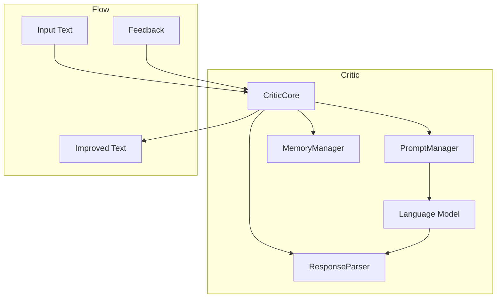

# Critics Component

Critics provide feedback and suggestions for improving text that fails validation. They analyze text, identify issues, and generate improvements, serving as a key component in the Sifaka feedback loop.

## Architecture

Critics follow a component-based architecture:

1. **CriticCore**: Central implementation that delegates to specialized components
2. **PromptManager**: Manages prompt creation and formatting
3. **ResponseParser**: Parses responses from language models
4. **MemoryManager**: Manages memory for reflection-based critics



## Core Components

### CriticConfig

`CriticConfig` is an immutable configuration class for critics:

```python
from sifaka.critics.models import CriticConfig

# Create a critic configuration
config = CriticConfig(
    name="my_critic",
    description="A custom critic",
    min_confidence=0.7,
    max_attempts=3,
    cache_size=100,
    params={
        "system_prompt": "You are an expert editor.",
    }
)

# Access configuration values
print(f"Name: {config.name}")
print(f"Max attempts: {config.max_attempts}")
print(f"System prompt: {config.params.get('system_prompt')}")
```

### PromptCriticConfig

`PromptCriticConfig` is a specialized configuration class for prompt-based critics:

```python
from sifaka.critics.models import PromptCriticConfig

# Create a prompt critic configuration
config = PromptCriticConfig(
    name="prompt_critic",
    description="A prompt-based critic",
    min_confidence=0.7,
    max_attempts=3,
    system_prompt="You are an expert editor.",
    temperature=0.7,
    max_tokens=1000
)

# Access configuration values
print(f"System prompt: {config.system_prompt}")
print(f"Temperature: {config.temperature}")
```

### ReflexionCriticConfig

`ReflexionCriticConfig` is a specialized configuration class for reflection-based critics:

```python
from sifaka.critics.models import ReflexionCriticConfig

# Create a reflexion critic configuration
config = ReflexionCriticConfig(
    name="reflexion_critic",
    description="A reflection-based critic",
    min_confidence=0.7,
    max_attempts=3,
    system_prompt="You are an expert editor.",
    temperature=0.7,
    max_tokens=1000,
    memory_size=5
)

# Access configuration values
print(f"Memory size: {config.memory_size}")
```

### CriticMetadata

`CriticMetadata` is the standardized format for critique results:

```python
from sifaka.critics.models import CriticMetadata

# Create critique metadata
metadata = CriticMetadata(
    score=0.8,
    feedback="The text is well-structured but could use more examples.",
    issues=["Missing examples", "Too technical"],
    suggestions=["Add more examples", "Simplify technical terms"]
)

# Access metadata properties
print(f"Score: {metadata.score:.2f}")
print(f"Feedback: {metadata.feedback}")
print("Issues:")
for issue in metadata.issues:
    print(f"- {issue}")
print("Suggestions:")
for suggestion in metadata.suggestions:
    print(f"- {suggestion}")
```

## Critic Types

Sifaka provides several types of critics:

### Prompt Critic

A critic that uses a language model to generate feedback and improvements:

```python
from sifaka.critics import create_prompt_critic
from sifaka.models import create_openai_provider

# Create a language model provider
model = create_openai_provider("gpt-4")

# Create a prompt critic
critic = create_prompt_critic(
    llm_provider=model,
    name="content_critic",
    description="Improves content quality",
    system_prompt="You are an expert editor who improves text quality.",
    temperature=0.7,
    max_tokens=1000
)

# Use the critic
text = "This is a test message."
critique = critic.critique(text)
print(f"Feedback: {critique.feedback}")

# Improve text based on feedback
improved = critic.improve(text, critique.feedback)
print(f"Improved text: {improved}")
```

### Reflexion Critic

A critic that uses reflection to learn from feedback and improve over time:

```python
from sifaka.critics import create_reflexion_critic
from sifaka.models import create_anthropic_provider

# Create a language model provider
model = create_anthropic_provider("claude-3-opus-20240229")

# Create a reflexion critic
critic = create_reflexion_critic(
    llm_provider=model,
    name="reflexion_critic",
    description="Improves text using reflection",
    system_prompt="You are an expert editor who learns from feedback.",
    temperature=0.7,
    max_tokens=1000,
    memory_size=5
)

# Use the critic
text = "This is a test message."
critique = critic.critique(text)
print(f"Feedback: {critique.feedback}")

# Improve text based on feedback
improved = critic.improve(text, critique.feedback)
print(f"Improved text: {improved}")

# The critic will learn from this interaction and improve future critiques
```

## Using Critics

The recommended way to create critics is through factory functions:

```python
from sifaka.critics import create_prompt_critic
from sifaka.models import create_openai_provider

# Create a language model provider
model = create_openai_provider("gpt-4")

# Create a critic using the factory function
critic = create_prompt_critic(
    llm_provider=model,
    name="content_critic",
    description="Improves content quality",
    system_prompt="You are an expert editor who improves text quality.",
    temperature=0.7,
    max_tokens=1000
)

# Validate text
is_valid = critic.validate(text)
if not is_valid:
    # Critique text
    critique = critic.critique(text)
    print(f"Feedback: {critique.feedback}")
    
    # Improve text
    improved = critic.improve(text, critique.feedback)
    print(f"Improved text: {improved}")
```

## Critic Interfaces

Critics implement several interfaces:

### TextValidator

The `TextValidator` interface provides methods for validating text:

```python
from sifaka.critics.protocols import TextValidator

# A critic that implements TextValidator
validator = critic  # assuming critic is already created

# Validate text
is_valid = validator.validate(text)
if is_valid:
    print("Text is valid!")
else:
    print("Text needs improvement.")
```

### TextImprover

The `TextImprover` interface provides methods for improving text:

```python
from sifaka.critics.protocols import TextImprover

# A critic that implements TextImprover
improver = critic  # assuming critic is already created

# Improve text based on feedback
improved = improver.improve(text, "The text is too short and lacks detail.")
print(f"Improved text: {improved}")
```

### TextCritic

The `TextCritic` interface provides methods for critiquing text:

```python
from sifaka.critics.protocols import TextCritic

# A critic that implements TextCritic
text_critic = critic  # assuming critic is already created

# Critique text
critique = text_critic.critique(text)
print(f"Score: {critique.score:.2f}")
print(f"Feedback: {critique.feedback}")
```

## Creating Custom Critics

To create a custom critic:

1. Create a class that extends `BaseCritic`
2. Implement the required interfaces (`TextValidator`, `TextImprover`, `TextCritic`)
3. Use standardized state management with `_state_manager`
4. Create a factory function for easy instantiation

Example:

```python
from typing import Dict, Any, List, Optional
from pydantic import BaseModel, PrivateAttr
from sifaka.critics.base import BaseCritic
from sifaka.critics.models import CriticConfig, CriticMetadata
from sifaka.utils.state import create_critic_state

class SimpleRuleBasedCritic(BaseCritic):
    """A simple rule-based critic that doesn't use a language model."""
    
    # State management using StateManager
    _state_manager = PrivateAttr(default_factory=create_critic_state)
    
    def __init__(self, config: CriticConfig):
        """Initialize the critic."""
        super().__init__(config)
        
        # Initialize state
        state = self._state_manager.get_state()
        
        # Set up rules from config
        state.rules = self.config.params.get("rules", {})
        
        # Mark as initialized
        state.initialized = True
    
    def validate(self, text: str) -> bool:
        """Validate text against rules."""
        # Get state
        state = self._state_manager.get_state()
        
        # Check if text passes all rules
        for rule_name, rule_func in state.rules.items():
            if not rule_func(text):
                return False
        
        return True
    
    def critique(self, text: str) -> CriticMetadata:
        """Critique text and provide feedback."""
        # Get state
        state = self._state_manager.get_state()
        
        # Check each rule and collect issues
        issues = []
        suggestions = []
        for rule_name, rule_func in state.rules.items():
            if not rule_func(text):
                issues.append(f"Failed rule: {rule_name}")
                suggestions.append(state.rules.get(f"{rule_name}_fix", "Fix this issue"))
        
        # Calculate score based on number of passing rules
        total_rules = len(state.rules)
        passing_rules = total_rules - len(issues)
        score = passing_rules / total_rules if total_rules > 0 else 1.0
        
        # Create feedback
        if issues:
            feedback = f"The text has {len(issues)} issues that need to be addressed."
        else:
            feedback = "The text passes all rules."
        
        # Return metadata
        return CriticMetadata(
            score=score,
            feedback=feedback,
            issues=issues,
            suggestions=suggestions
        )
    
    def improve(self, text: str, feedback: Optional[Any] = None) -> str:
        """Improve text based on rules."""
        # Get state
        state = self._state_manager.get_state()
        
        # Start with original text
        improved = text
        
        # Apply fixes for each failing rule
        for rule_name, rule_func in state.rules.items():
            if not rule_func(improved):
                fix_func = state.rules.get(f"{rule_name}_fix_func")
                if fix_func:
                    improved = fix_func(improved)
        
        return improved

# Factory function
def create_simple_rule_based_critic(
    name: str = "rule_based_critic",
    description: str = "A simple rule-based critic",
    rules: Dict[str, Any] = None,
    min_confidence: float = 0.7,
    max_attempts: int = 3,
    **kwargs: Any,
) -> SimpleRuleBasedCritic:
    """Create a simple rule-based critic."""
    # Set default rules if not provided
    if rules is None:
        rules = {
            "min_length": lambda text: len(text) >= 10,
            "min_length_fix": "Make the text longer",
            "min_length_fix_func": lambda text: text + " Additional content to meet minimum length.",
            
            "has_punctuation": lambda text: any(c in text for c in ".!?"),
            "has_punctuation_fix": "Add proper punctuation",
            "has_punctuation_fix_func": lambda text: text + "." if not any(c in text for c in ".!?") else text,
        }
    
    # Create configuration
    config = CriticConfig(
        name=name,
        description=description,
        min_confidence=min_confidence,
        max_attempts=max_attempts,
        params={"rules": rules},
        **kwargs
    )
    
    # Create and return critic
    return SimpleRuleBasedCritic(config)

# Usage example
critic = create_simple_rule_based_critic()
text = "This is a test"
is_valid = critic.validate(text)
if not is_valid:
    critique = critic.critique(text)
    print(f"Feedback: {critique.feedback}")
    print("Issues:")
    for issue in critique.issues:
        print(f"- {issue}")
    
    improved = critic.improve(text)
    print(f"Improved text: {improved}")
```

## Best Practices

1. **Use factory functions** for creating critics
2. **Use standardized state management** with `_state_manager`
3. **Implement all required interfaces** (`TextValidator`, `TextImprover`, `TextCritic`)
4. **Handle empty text gracefully** in all methods
5. **Include detailed metadata** in critique results
6. **Use appropriate temperature settings** for language models
7. **Set reasonable max_attempts** to prevent infinite loops
8. **Document prompt templates** in docstrings
9. **Use system prompts** to guide language model behavior
10. **Implement warm_up()** for lazy initialization of expensive resources

## Error Handling

Critics implement several error handling patterns:

1. **Input Validation**: Validate all inputs before processing
2. **Graceful Degradation**: Return a meaningful result rather than raising exceptions
3. **Diagnostic Information**: Include diagnostic information in the result metadata
4. **Exception Management**: Use a clear exception hierarchy
   - `ValueError`: For issues with input validation
   - `RuntimeError`: For issues with critique generation

## Performance Considerations

1. **Caching**: Enable caching for critics that are used frequently
2. **Lazy Initialization**: Use warm_up() for lazy initialization of expensive resources
3. **Token Optimization**: Optimize prompts to reduce token usage
4. **Cost Awareness**: Be aware of the computational cost of critics
5. **Resource Management**: Release resources when no longer needed
