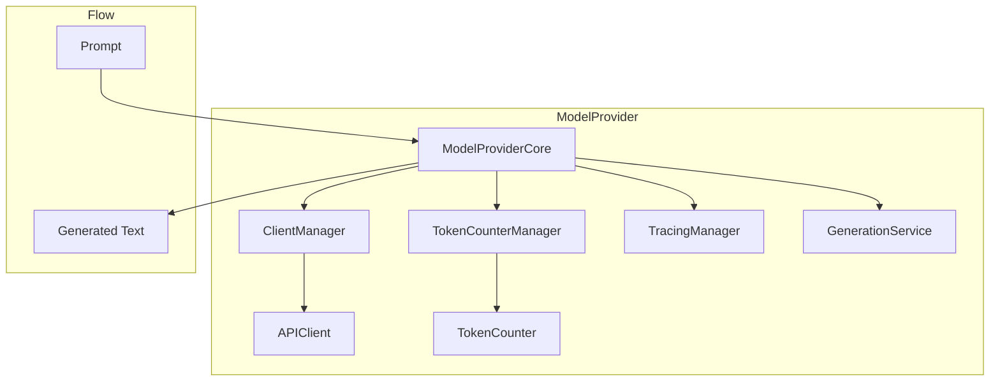

# Model Providers Component

Model providers connect to language models for text generation. They handle the communication with various LLM services, token counting, and error handling, providing a consistent interface for text generation across different providers.

## Architecture

Model providers follow a component-based architecture:

1. **ModelProviderCore**: Main interface that delegates to specialized components
2. **ClientManager**: Manages API client creation and management
3. **TokenCounterManager**: Manages token counting functionality
4. **TracingManager**: Manages tracing and logging
5. **GenerationService**: Handles text generation and error handling



## Core Components

### ModelConfig

`ModelConfig` is an immutable configuration class for model providers:

```python
from sifaka.models.base import ModelConfig

# Create a model configuration
config = ModelConfig(
    temperature=0.7,
    max_tokens=1000,
    api_key="your-api-key",
    trace_enabled=True
)

# Access configuration values
print(f"Temperature: {config.temperature}")
print(f"Max tokens: {config.max_tokens}")

# Create a new configuration with updated options
updated_config = config.with_options(temperature=0.5, max_tokens=2000)
```

### APIClient

`APIClient` is the interface for communicating with language model services:

```python
from sifaka.models.base import APIClient

class CustomAPIClient(APIClient):
    """Custom API client implementation."""
    
    def __init__(self, api_key: str):
        """Initialize the client."""
        self.api_key = api_key
    
    def send_prompt(self, prompt: str, config: ModelConfig) -> str:
        """Send a prompt to the language model service."""
        # Implementation details
        return f"Response to: {prompt}"
```

### TokenCounter

`TokenCounter` is the interface for counting tokens in text:

```python
from sifaka.models.base import TokenCounter

class CustomTokenCounter(TokenCounter):
    """Custom token counter implementation."""
    
    def __init__(self, model: str):
        """Initialize the token counter."""
        self.model = model
    
    def count_tokens(self, text: str) -> int:
        """Count tokens in text."""
        # Simple implementation
        return len(text.split())
```

## Provider Implementations

Sifaka provides several model provider implementations:

### OpenAI Provider

Provider for OpenAI models:

```python
from sifaka.models import create_openai_provider

# Create an OpenAI provider
provider = create_openai_provider(
    model_name="gpt-4",
    temperature=0.7,
    max_tokens=1000,
    api_key="your-openai-api-key"
)

# Generate text
response = provider.generate("Explain quantum computing in simple terms.")
print(f"Response: {response}")

# Count tokens
token_count = provider.count_tokens("How many tokens is this?")
print(f"Token count: {token_count}")
```

### Anthropic Provider

Provider for Anthropic models:

```python
from sifaka.models import create_anthropic_provider

# Create an Anthropic provider
provider = create_anthropic_provider(
    model_name="claude-3-opus-20240229",
    temperature=0.7,
    max_tokens=1000,
    api_key="your-anthropic-api-key"
)

# Generate text
response = provider.generate("Explain quantum computing in simple terms.")
print(f"Response: {response}")
```

### Gemini Provider

Provider for Google Gemini models:

```python
from sifaka.models import create_gemini_provider

# Create a Gemini provider
provider = create_gemini_provider(
    model_name="gemini-pro",
    temperature=0.7,
    max_tokens=1000,
    api_key="your-gemini-api-key"
)

# Generate text
response = provider.generate("Explain quantum computing in simple terms.")
print(f"Response: {response}")
```

### Mock Provider

Provider for testing and development:

```python
from sifaka.models import create_mock_provider

# Create a mock provider
provider = create_mock_provider(
    responses={"Hello": "Hi there!"},
    default_response="I don't know how to respond to that."
)

# Generate text
response = provider.generate("Hello")
print(f"Response: {response}")  # Output: "Hi there!"

response = provider.generate("Goodbye")
print(f"Response: {response}")  # Output: "I don't know how to respond to that."
```

## Using Model Providers

The recommended way to create model providers is through factory functions:

```python
from sifaka.models import create_openai_provider

# Create a provider using the factory function
provider = create_openai_provider(
    model_name="gpt-4",
    temperature=0.7,
    max_tokens=1000,
    api_key="your-openai-api-key"
)

# Generate text
response = provider.generate("Explain quantum computing in simple terms.")
print(f"Response: {response}")

# Generate text with config overrides
response = provider.generate(
    "Explain quantum computing in simple terms.",
    temperature=0.5,
    max_tokens=500
)
print(f"Response: {response}")
```

## Creating Custom Providers

To create a custom model provider:

1. Create a class that extends `ModelProviderCore`
2. Implement the `_create_default_client()` method
3. Implement the `_create_default_token_counter()` method
4. Create a factory function for easy instantiation

Example:

```python
from typing import Dict, Any, Optional
from sifaka.models.base import APIClient, TokenCounter, ModelConfig
from sifaka.models.core import ModelProviderCore

class CustomAPIClient(APIClient):
    """Custom API client implementation."""
    
    def __init__(self, api_key: str):
        """Initialize the client."""
        self.api_key = api_key
    
    def send_prompt(self, prompt: str, config: ModelConfig) -> str:
        """Send a prompt to the language model service."""
        # Implementation details
        return f"Response to: {prompt}"

class CustomTokenCounter(TokenCounter):
    """Custom token counter implementation."""
    
    def __init__(self, model: str):
        """Initialize the token counter."""
        self.model = model
    
    def count_tokens(self, text: str) -> int:
        """Count tokens in text."""
        # Simple implementation
        return len(text.split())

class CustomProvider(ModelProviderCore):
    """Custom model provider implementation."""
    
    # Default model name
    DEFAULT_MODEL = "custom-model"
    
    def _create_default_client(self) -> APIClient:
        """Create the default API client."""
        return CustomAPIClient(api_key=self.config.api_key)
    
    def _create_default_token_counter(self) -> TokenCounter:
        """Create the default token counter."""
        return CustomTokenCounter(model=self.model_name)

# Factory function
def create_custom_provider(
    model_name: str = CustomProvider.DEFAULT_MODEL,
    temperature: float = 0.7,
    max_tokens: int = 1000,
    api_key: Optional[str] = None,
    trace_enabled: bool = True,
    config: Optional[ModelConfig] = None,
    api_client: Optional[APIClient] = None,
    token_counter: Optional[TokenCounter] = None,
    **kwargs: Any,
) -> CustomProvider:
    """Create a custom model provider."""
    # Create configuration
    if config is None:
        config = ModelConfig(
            temperature=temperature,
            max_tokens=max_tokens,
            api_key=api_key,
            trace_enabled=trace_enabled,
            **kwargs
        )
    
    # Create provider
    return CustomProvider(
        model_name=model_name,
        config=config,
        api_client=api_client,
        token_counter=token_counter
    )

# Usage example
provider = create_custom_provider(
    model_name="custom-model",
    api_key="your-api-key"
)

response = provider.generate("Hello, world!")
print(f"Response: {response}")
```

## Advanced Usage

### Error Handling

Model providers implement several error handling patterns:

```python
from sifaka.models import create_openai_provider

# Create a provider
provider = create_openai_provider(
    model_name="gpt-4",
    api_key="your-openai-api-key"
)

# Error handling pattern
try:
    response = provider.generate("Explain quantum computing")
except ValueError as e:
    # Handle input validation errors
    print(f"Input error: {e}")
except RuntimeError as e:
    # Handle API and generation errors
    print(f"Generation failed: {e}")
    # Implement fallback strategy
    fallback_provider = create_openai_provider(
        model_name="gpt-3.5-turbo",
        api_key="your-openai-api-key"
    )
    response = fallback_provider.generate("Explain quantum computing briefly")
```

### Tracing

Model providers support tracing for monitoring and debugging:

```python
from sifaka.models import create_openai_provider
from sifaka.models.tracing import CustomTracer

# Create a custom tracer
class MyTracer(CustomTracer):
    def log_event(self, event_type: str, data: Dict[str, Any]) -> None:
        """Log an event."""
        print(f"Event: {event_type}")
        for key, value in data.items():
            print(f"  {key}: {value}")

# Create a provider with tracing
provider = create_openai_provider(
    model_name="gpt-4",
    api_key="your-openai-api-key",
    trace_enabled=True,
    tracer=MyTracer()
)

# Generate text (events will be logged)
response = provider.generate("Hello, world!")
```

### Configuration Specialization

Model providers support specialized configurations:

```python
from sifaka.models.config import OpenAIConfig
from sifaka.models import OpenAIProvider

# Create a specialized configuration
config = OpenAIConfig(
    temperature=0.7,
    max_tokens=1000,
    api_key="your-openai-api-key",
    params={
        "top_p": 0.9,
        "frequency_penalty": 0.5,
        "presence_penalty": 0.5,
    }
)

# Create a provider with the specialized configuration
provider = OpenAIProvider(
    model_name="gpt-4",
    config=config
)

# Generate text
response = provider.generate("Hello, world!")
```

## Best Practices

1. **Use factory functions** for creating model providers
2. **Set appropriate temperature** for your use case
3. **Set reasonable max_tokens** to control response length
4. **Handle API keys securely** using environment variables
5. **Implement error handling** for API failures
6. **Use tracing** for monitoring and debugging
7. **Optimize token usage** to reduce costs
8. **Implement fallback strategies** for API failures
9. **Use specialized configurations** for provider-specific options
10. **Document model behavior** in docstrings

## Error Handling

Model providers implement several error handling patterns:

1. **Input Validation**: Validate all inputs before processing
2. **Graceful Degradation**: Implement fallback strategies for API failures
3. **Diagnostic Information**: Include diagnostic information in error messages
4. **Exception Management**: Use a clear exception hierarchy
   - `ValueError`: For issues with input validation
   - `RuntimeError`: For issues with API communication

## Performance Considerations

1. **Token Optimization**: Optimize prompts to reduce token usage
2. **Cost Awareness**: Be aware of the computational cost of different models
3. **Caching**: Implement caching for repeated prompts
4. **Batching**: Use batching for multiple prompts when possible
5. **Resource Management**: Release resources when no longer needed
