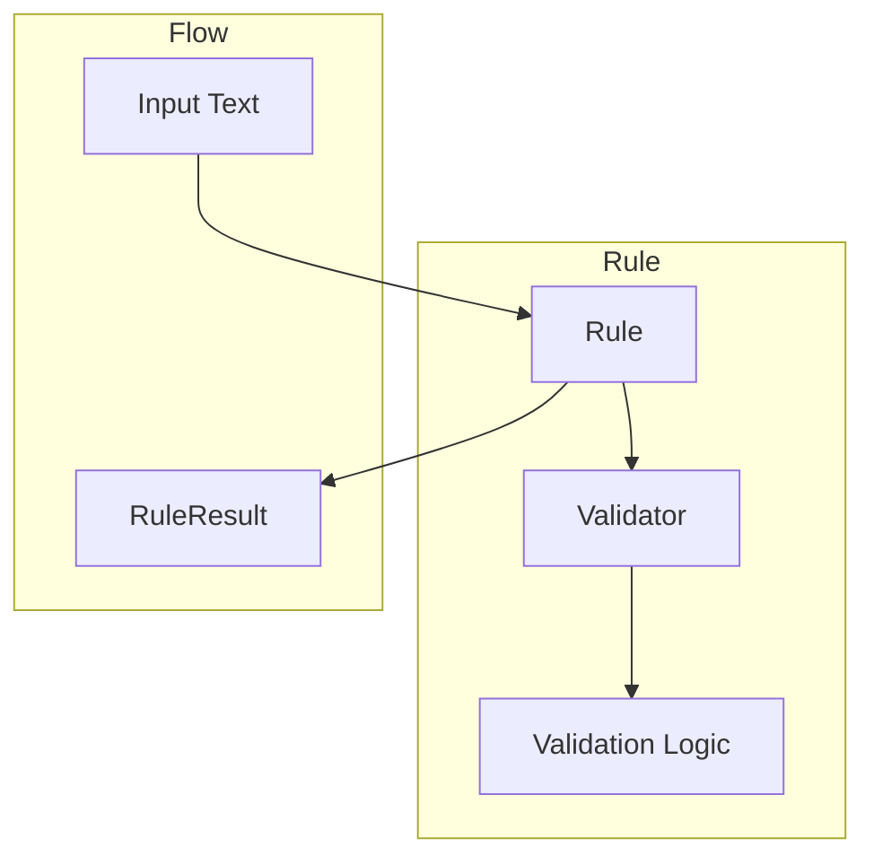

# Rules Component

Rules are a core component of the Sifaka framework that provide binary pass/fail validation of text. They enforce constraints like length limits, content restrictions, and formatting requirements.

## Architecture

The rules system follows a delegation pattern:

1. **Rules** are high-level containers that define what to validate
2. **Validators** implement the actual validation logic
3. Rules delegate validation work to their validators

This separation of concerns allows for:
- Reusing validation logic across different rules
- Testing validation logic independently
- Extending the framework with custom validators



## Core Components

### RuleConfig

`RuleConfig` is an immutable configuration class for rules:

```python
from sifaka.rules.base import RuleConfig, RulePriority

# Create a rule configuration
config = RuleConfig(
    priority=RulePriority.HIGH,
    cost=5,
    cache_size=100,
    params={
        "min_chars": 10,
        "max_chars": 100,
    }
)

# Create a new configuration with updated options
updated_config = config.with_options(priority=RulePriority.CRITICAL)

# Create a new configuration with updated params
parameterized_config = config.with_params(min_chars=20, max_chars=200)
```

### RulePriority

`RulePriority` is an enumeration that defines the priority levels for rules:

```python
from sifaka.rules.base import RulePriority

# Priority levels from lowest to highest
LOW = RulePriority.LOW           # Cosmetic or style validations
MEDIUM = RulePriority.MEDIUM     # Default priority for most rules
HIGH = RulePriority.HIGH         # Important validations
CRITICAL = RulePriority.CRITICAL # Essential validations (security, safety)
```

### RuleResult

`RuleResult` is the standardized result format for rule validation:

```python
from sifaka.rules.base import RuleResult

# Create a rule result
result = RuleResult(
    passed=True,
    message="Text meets length requirements",
    metadata={
        "min_chars": 10,
        "max_chars": 100,
        "actual_chars": 50,
    }
)

# Access result properties
if result.passed:
    print(f"Validation passed: {result.message}")
else:
    print(f"Validation failed: {result.message}")
    
# Access metadata
print(f"Character count: {result.metadata['actual_chars']}")
```

## Rule Types

Sifaka provides several types of rules:

### Formatting Rules

Rules that validate the formatting of text:

```python
from sifaka.rules.formatting.length import create_length_rule
from sifaka.rules.formatting.style import create_style_rule

# Create a length rule
length_rule = create_length_rule(
    min_chars=10,
    max_chars=100,
    min_words=2,
    max_words=20
)

# Create a style rule
style_rule = create_style_rule(
    capitalization="sentence",
    punctuation=True
)
```

### Content Rules

Rules that validate the content of text:

```python
from sifaka.rules.content.prohibited import create_prohibited_content_rule
from sifaka.rules.content.required import create_required_content_rule

# Create a prohibited content rule
prohibited_rule = create_prohibited_content_rule(
    terms=["harmful", "offensive"],
    case_sensitive=False
)

# Create a required content rule
required_rule = create_required_content_rule(
    terms=["disclaimer", "warning"],
    all_required=True
)
```

### Factual Rules

Rules that validate factual accuracy:

```python
from sifaka.rules.factual.accuracy import create_accuracy_rule

# Create an accuracy rule
accuracy_rule = create_accuracy_rule(
    facts=["The Earth orbits the Sun", "Water boils at 100°C at sea level"],
    threshold=0.8
)
```

### Classifier-Based Rules

Rules that use classifiers for validation:

```python
from sifaka.adapters.rules.classifier import create_classifier_rule
from sifaka.classifiers.toxicity import create_toxicity_classifier

# Create a toxicity classifier
toxicity_classifier = create_toxicity_classifier()

# Create a rule that uses the toxicity classifier
toxicity_rule = create_classifier_rule(
    classifier=toxicity_classifier,
    valid_labels=["non-toxic"],
    threshold=0.7
)
```

## Using Rules

The recommended way to create rules is through factory functions:

```python
from sifaka.rules.formatting.length import create_length_rule

# Create a rule using the factory function
rule = create_length_rule(min_chars=10, max_chars=100)

# Validate text
result = rule.validate("This is a test")
if result.passed:
    print("Validation passed!")
else:
    print(f"Validation failed: {result.message}")
```

Each rule type provides two factory functions:
1. `create_X_validator()` - Creates a standalone validator
2. `create_X_rule()` - Creates a rule with a validator

## Combining Rules

Rules can be combined to create more complex validation logic:

```python
from sifaka.rules.formatting.length import create_length_rule
from sifaka.rules.content.prohibited import create_prohibited_content_rule

# Create rules
length_rule = create_length_rule(min_chars=10, max_chars=100)
prohibited_rule = create_prohibited_content_rule(terms=["harmful", "offensive"])

# Create a list of rules
rules = [length_rule, prohibited_rule]

# Validate text against all rules
text = "This is a test message."
results = [rule.validate(text) for rule in rules]

# Check if all rules passed
all_passed = all(result.passed for result in results)
if all_passed:
    print("All validations passed!")
else:
    # Print failed validations
    for rule, result in zip(rules, results):
        if not result.passed:
            print(f"{rule.name}: {result.message}")
```

## Creating Custom Rules

To create a custom rule:

1. Create a validator class that extends `BaseValidator`
2. Implement the validation logic in the validator
3. Create a rule class that extends `Rule`
4. Implement `_create_default_validator()` to create your validator
5. Create factory functions for both the validator and rule

Example:

```python
from typing import Dict, Any, Optional
from sifaka.rules.base import BaseValidator, Rule, RuleResult, RuleConfig

# Step 1: Create a validator class
class CustomValidator(BaseValidator[str]):
    """Custom validator implementation."""
    
    def __init__(self, threshold: float = 0.5):
        """Initialize the validator."""
        self.threshold = threshold
        
    def validate(self, text: str) -> RuleResult:
        """Validate the text."""
        # Handle empty text
        if not text:
            return self.handle_empty_text()
            
        # Implement validation logic
        score = self._calculate_score(text)
        passed = score >= self.threshold
        
        # Create result
        return RuleResult(
            passed=passed,
            message=f"Score {score:.2f} is {'above' if passed else 'below'} threshold {self.threshold}",
            metadata={
                "score": score,
                "threshold": self.threshold,
            }
        )
        
    def _calculate_score(self, text: str) -> float:
        """Calculate a score for the text."""
        # Implement scoring logic
        return len(text) / 100  # Simple example

# Step 2: Create a rule class
class CustomRule(Rule[str, RuleResult, CustomValidator, None]):
    """Custom rule implementation."""
    
    def _create_default_validator(self) -> CustomValidator:
        """Create the default validator."""
        threshold = self.config.params.get("threshold", 0.5)
        return CustomValidator(threshold=threshold)

# Step 3: Create factory functions
def create_custom_validator(threshold: float = 0.5) -> CustomValidator:
    """Create a custom validator."""
    return CustomValidator(threshold=threshold)

def create_custom_rule(
    name: str = "custom_rule",
    description: str = "Custom validation rule",
    threshold: float = 0.5,
    config: Optional[RuleConfig] = None,
    **kwargs: Any,
) -> CustomRule:
    """Create a custom rule."""
    # Extract parameters
    params = kwargs.pop("params", {})
    params["threshold"] = threshold
    
    # Create or update config
    if config is None:
        config = RuleConfig(params=params, **kwargs)
    else:
        config = config.with_params(**params)
    
    # Create rule
    return CustomRule(
        name=name,
        description=description,
        config=config,
    )
```

## Best Practices

1. **Always use factory functions** to create rules and validators
2. **Don't instantiate rule or validator classes directly** unless you have a specific reason
3. **Pass configuration as direct parameters** to factory functions, not as dictionaries
4. **Implement both validator and rule factory functions** for all rule types
5. **Document the relationship** between rules and validators in module docstrings
6. **Handle empty text consistently** using the BaseValidator.handle_empty_text method
7. **Use type-safe config classes** that extend RuleConfig
8. **Extract rule-specific parameters** in factory functions
9. **Delegate validation logic** from rules to validators
10. **Add rule_id to metadata** in rule.validate method

## Error Handling

Rules implement several error handling patterns:

1. **Input Validation**: Validate all inputs before processing
2. **Graceful Degradation**: Return a meaningful RuleResult rather than raising exceptions
3. **Diagnostic Information**: Include diagnostic information in the result metadata
4. **Exception Management**: Use a clear exception hierarchy
   - `ValidationError`: For issues during validation
   - `ConfigurationError`: For issues with rule configuration

## Performance Considerations

1. **Caching**: Enable caching for rules that are used frequently
2. **Cost Awareness**: Be aware of the computational cost of rules
3. **Priority Ordering**: Order rules by priority to fail fast on critical validations
4. **Batch Validation**: Use batch validation for multiple texts when possible
