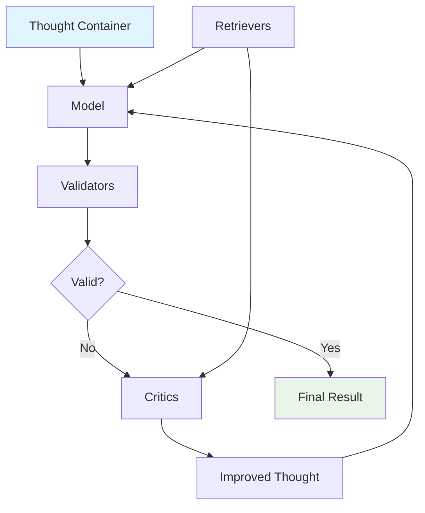

# Basic Concepts

Understanding Sifaka's core concepts will help you build more effective AI applications. This guide covers the fundamental building blocks and how they work together.

## Core Architecture

Sifaka uses a **Thought-centric architecture** where everything revolves around a central state container:



## The Thought Container

The **Thought** is the central state container that flows through your entire pipeline. It's immutable - each operation returns a new Thought with updated state.

### What's in a Thought?

```python
from sifaka.core.thought import Thought

# Create a thought
thought = Thought(prompt="Write a story about AI")

# Thoughts contain:
print(f"Prompt: {thought.prompt}")           # Original prompt
print(f"Text: {thought.text}")               # Generated text (initially None)
print(f"Iteration: {thought.iteration}")     # Current iteration number
print(f"Chain ID: {thought.chain_id}")       # Unique identifier
print(f"History: {thought.history}")         # Complete evolution
```

### Immutable Updates

Thoughts are immutable - operations return new instances:

```python
# Set text (returns new Thought)
updated_thought = thought.set_text("Once upon a time...")

# Move to next iteration (returns new Thought)
next_iteration = thought.next_iteration()

# Original thought is unchanged
print(f"Original: {thought.text}")      # None
print(f"Updated: {updated_thought.text}") # "Once upon a time..."
```

## Models

Models generate text from prompts. Sifaka supports multiple providers with a unified interface.

### Creating Models

```python
from sifaka.models import create_model

# OpenAI models
openai_model = create_model("openai:gpt-4")
gpt35_model = create_model("openai:gpt-3.5-turbo")

# Anthropic models
claude_model = create_model("anthropic:claude-3-sonnet")

# Mock models (for testing)
mock_model = create_model("mock:test-model")
```

### Model Interface

All models implement the same interface:

```python
# Generate text
text = model.generate("Write a story about robots")

# Count tokens
token_count = model.count_tokens("Some text to count")
```

## Validators

Validators check if generated text meets your requirements. They return detailed results with pass/fail status and suggestions.

### Built-in Validators

```python
from sifaka.validators import LengthValidator, RegexValidator

# Length validation
length_validator = LengthValidator(min_length=50, max_length=500)

# Pattern validation
email_validator = RegexValidator(
    required_patterns=[r'\b[A-Za-z0-9._%+-]+@[A-Za-z0-9.-]+\.[A-Z|a-z]{2,}\b'],
    name="email_validator"
)
```

### Validation Results

```python
# Run validation
result = length_validator.validate(thought)

print(f"Passed: {result.passed}")           # True/False
print(f"Message: {result.message}")         # Human-readable message
print(f"Score: {result.score}")             # Numeric score (0.0-1.0)
print(f"Issues: {result.issues}")           # List of problems found
print(f"Suggestions: {result.suggestions}") # List of improvement suggestions
```

## Critics

Critics analyze text and provide feedback for improvement. Unlike validators, critics don't just check - they actively help improve the text.

### Built-in Critics

```python
from sifaka.critics import ReflexionCritic, ConstitutionalCritic

# Reflexion critic (self-reflection)
reflexion_critic = ReflexionCritic(model=model)

# Constitutional AI critic
constitutional_critic = ConstitutionalCritic(
    model=model,
    principles=[
        "Be helpful and informative",
        "Avoid harmful content",
        "Provide accurate information"
    ]
)
```

### Critic Workflow

Critics work in two phases:

1. **Critique**: Analyze the text and provide feedback
2. **Improve**: Generate improved text based on the critique

```python
# Critique the text
critique_result = critic.critique(thought)
print(f"Needs improvement: {critique_result['needs_improvement']}")
print(f"Feedback: {critique_result['feedback']}")

# Improve the text
if critique_result['needs_improvement']:
    improved_text = critic.improve(thought)
    print(f"Improved: {improved_text}")
```

## The Chain

The **Chain** orchestrates the entire workflow, coordinating models, validators, and critics.

### Basic Chain

```python
from sifaka import Chain

# Create a chain
chain = Chain(
    model=model,
    prompt="Write a story about AI",
    max_improvement_iterations=3
)

# Add validators and critics
chain.validate_with(length_validator)
chain.improve_with(reflexion_critic)

# Run the chain
result = chain.run()
```

### Chain Execution Flow

When you run a chain, this happens:

1. **Initialize**: Create initial Thought with your prompt
2. **Generate**: Model generates text from the prompt
3. **Validate**: All validators check the generated text
4. **Improve**: If validation fails or critics are configured, critics analyze and improve
5. **Iterate**: Repeat generation/validation/improvement until success or max iterations
6. **Return**: Final Thought with complete audit trail

## Retrievers (Optional)

Retrievers provide additional context to models and critics by fetching relevant documents.

### Types of Retrievers

```python
from sifaka.retrievers import InMemoryRetriever
from sifaka.storage import RedisStorage, MilvusStorage

# In-memory retriever
memory_retriever = InMemoryRetriever()

# Redis-backed retriever
redis_retriever = RedisStorage(redis_config)

# Milvus vector retriever
milvus_retriever = MilvusStorage(milvus_config)
```

### Retrieval Phases

Retrievers can provide context at different phases:

- **Pre-generation**: Context before text generation
- **Post-generation**: Context after text generation
- **Critic**: Context for critic analysis

## Storage (Optional)

Storage systems persist Thoughts for later analysis, caching, and debugging.

### Storage Backends

```python
from sifaka.storage import MemoryStorage, FileStorage, RedisStorage

# Memory storage (temporary)
memory_storage = MemoryStorage()

# File storage (persistent)
file_storage = FileStorage(directory="./thoughts")

# Redis storage (fast, persistent)
redis_storage = RedisStorage(redis_config)
```

## Putting It All Together

Here's how all the concepts work together:

```python
from sifaka import Chain
from sifaka.models import create_model
from sifaka.validators import LengthValidator
from sifaka.critics import ReflexionCritic
from sifaka.storage import MemoryStorage

# Create components
model = create_model("openai:gpt-4")
validator = LengthValidator(min_length=100, max_length=1000)
critic = ReflexionCritic(model=model)
storage = MemoryStorage()

# Build chain
chain = Chain(
    model=model,
    prompt="Write an engaging story about AI helping humanity",
    storage=storage,
    max_improvement_iterations=3
)

# Configure validation and improvement
chain.validate_with(validator)
chain.improve_with(critic)

# Run and get complete results
thought = chain.run()

# Access all the information
print(f"Final text: {thought.text}")
print(f"Iterations: {thought.iteration}")
print(f"Validation results: {thought.validation_results}")
print(f"Critic feedback: {thought.critic_feedback}")
print(f"Complete history: {len(thought.history)} iterations")
```

## Key Benefits

This architecture provides:

- **Complete Observability**: Every step is tracked and auditable
- **Iterative Improvement**: Automatic refinement until quality standards are met
- **Composability**: Mix and match any models, validators, and critics
- **Immutable State**: Safe concurrent operations and easy debugging
- **Research Integration**: Academic breakthroughs as production-ready components

## Next Steps

Now that you understand the core concepts:

1. **[Explore examples](../../examples/)** - See real-world usage patterns
2. **[Custom models guide](../guides/custom-models.md)** - Create your own model integrations
3. **[Custom validators guide](../guides/custom-validators.md)** - Build domain-specific validation
4. **[Storage setup guide](../guides/storage-setup.md)** - Configure persistent storage
5. **[API reference](../api/API_REFERENCE.md)** - Complete technical documentation

## Common Patterns

### Development vs Production

```python
# Development (fast feedback)
dev_chain = QuickStart.for_development()

# Production (comprehensive validation)
prod_chain = QuickStart.for_production(
    "openai:gpt-4",
    "Your prompt",
    validators=["length", "toxicity"],
    critics=["reflexion"]
)
```

### Research Setup

```python
# Research (multiple critics, comprehensive analysis)
research_chain = QuickStart.for_research(
    "anthropic:claude-3-sonnet",
    "Research question",
    storage="redis+milvus"
)
```

The modular design lets you start simple and add complexity as needed, always maintaining the same clean interfaces and complete observability.
