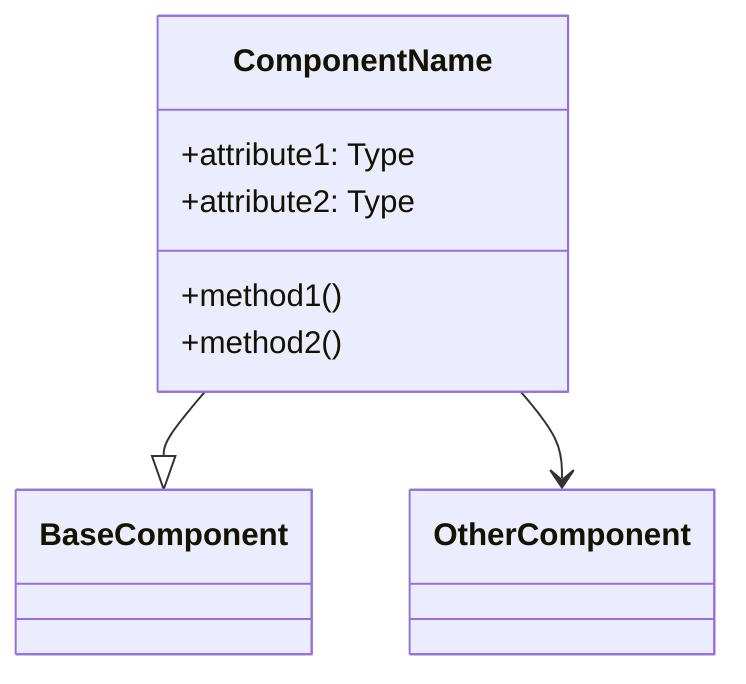

# [Component Name] Implementation Notes

This document provides detailed implementation notes for the [Component Name] in Sifaka.

## Overview

[Brief description of the component and its purpose in the Sifaka ecosystem]

## Architecture

### Component Structure

[Detailed description of the component's structure, including classes, methods, and relationships]



### State Management

[Description of how the component manages state, including initialization, updates, and cleanup]

```python
# Example state management implementation
class ComponentState:
    def __init__(self):
        self.cache = {}
        self.initialized = False
        # Other state attributes

class Component:
    _state_manager = PrivateAttr(default_factory=create_component_state)
    
    def warm_up(self):
        state = self._state_manager.get_state()
        if not state.initialized:
            # Initialize state
            state.initialized = True
```

### Configuration

[Description of the component's configuration options and how they affect behavior]

```python
# Example configuration implementation
class ComponentConfig(BaseConfig):
    name: str
    description: str
    param1: str
    param2: int = 10
    
    class Config:
        extra = "forbid"
```

## Implementation Details

### Core Functionality

[Detailed description of how the core functionality is implemented]

```python
# Example core functionality implementation
def process_input(self, input_data):
    state = self._state_manager.get_state()
    
    # Check cache
    if input_data in state.cache:
        return state.cache[input_data]
    
    # Process input
    result = self._process_input_internal(input_data)
    
    # Cache result
    state.cache[input_data] = result
    
    return result
```

### Integration Points

[Description of how the component integrates with other components]

```python
# Example integration implementation
def integrate_with_other_component(self, other_component):
    # Integration logic
    return IntegratedResult(self, other_component)
```

### Error Handling

[Description of how the component handles errors and edge cases]

```python
# Example error handling implementation
def process_with_error_handling(self, input_data):
    try:
        return self.process_input(input_data)
    except InvalidInputError:
        # Handle invalid input
        return fallback_result
    except ExternalServiceError:
        # Handle external service errors
        raise ComponentError("External service unavailable")
```

## Performance Considerations

[Description of performance characteristics, optimizations, and potential bottlenecks]

- Time complexity: O(n) for most operations
- Space complexity: O(n) for cache storage
- Potential bottlenecks: External API calls, large input processing

## Testing Strategy

[Description of how the component should be tested]

```python
# Example test implementation
def test_component_basic_functionality():
    component = create_component(param1="value1")
    result = component.process_input("test input")
    assert result.status == "success"
    assert result.value == expected_value
```

## Future Improvements

[List of potential future improvements for the component]

1. Add support for feature X
2. Optimize performance for large inputs
3. Implement more sophisticated caching strategy
4. Add support for streaming responses
5. Improve error handling for edge case Y

## References

- [Link to relevant documentation]
- [Link to relevant research papers or articles]
- [Link to related components]
