# Basic Usage Tutorial - Common Patterns & Workflows

**Goal**: Master the most common Sifaka patterns and workflows for everyday use.

**Prerequisites**: Complete [Quick Start Tutorial](01-quick-start.md)

## The Sifaka Workflow

Understanding how Sifaka works helps you use it more effectively:

```mermaid
graph TD
    A[📝 Your Prompt] --> B[🤖 Generate Text]
    B --> C[✅ Validate Quality]
    C --> D{Meets Standards?}
    D -->|No| E[🔍 Critique & Improve]
    E --> B
    D -->|Yes| F[🎯 Final Result]
```



**Key Insight**: Sifaka doesn't just generate text - it **guarantees quality** through iterative improvement.

## Pattern 1: Content Type Optimization

Different content types need different approaches. Sifaka's presets are optimized for specific use cases:

### Academic Writing
```python
import asyncio
import sifaka

async def academic_examples():
    # Research papers and formal analysis
    result = await sifaka.academic_writing(
        "Analyze the impact of artificial intelligence on healthcare outcomes"
    )
    
    # Explanatory content
    result = await sifaka.academic_writing(
        "Explain the principles of quantum computing for computer science students"
    )
    
    # Literature reviews
    result = await sifaka.academic_writing(
        "Review recent advances in natural language processing"
    )

asyncio.run(academic_examples())
```

**Academic preset features**:
- Formal, scholarly tone
- Comprehensive coverage (300+ words)
- Fact-checking and coherence validation
- Constitutional AI for accuracy

### Creative Writing
```python
async def creative_examples():
    # Short stories
    result = await sifaka.creative_writing(
        "Write a science fiction story about AI consciousness"
    )
    
    # Marketing copy
    result = await sifaka.creative_writing(
        "Create compelling product descriptions for a new smartphone"
    )
    
    # Blog posts
    result = await sifaka.creative_writing(
        "Write an engaging blog post about sustainable living"
    )

asyncio.run(creative_examples())
```

**Creative preset features**:
- Engaging, narrative style
- Emotional impact optimization
- Flexible length (up to 800 words)
- Self-refine critic for style improvement

### Technical Documentation
```python
async def technical_examples():
    # API documentation
    result = await sifaka.technical_docs(
        "Document the authentication endpoints for our REST API"
    )
    
    # How-to guides
    result = await sifaka.technical_docs(
        "Write installation instructions for a Python package"
    )
    
    # Architecture explanations
    result = await sifaka.technical_docs(
        "Explain microservices architecture patterns"
    )

asyncio.run(technical_examples())
```

**Technical preset features**:
- Clear, practical explanations
- Code examples and practical details
- Structured format validation
- Reflexion critic for clarity

## Pattern 2: Quality Control

### Length Requirements
```python
async def length_control():
    # Exact length requirements
    result = await sifaka.improve(
        "Summarize machine learning in exactly 100 words",
        min_length=95,   # Allow slight flexibility
        max_length=105,
        max_rounds=5
    )
    
    # Minimum content requirements
    result = await sifaka.improve(
        "Write a comprehensive guide to Python",
        min_length=1000,  # Ensure thorough coverage
        max_rounds=7
    )

asyncio.run(length_control())
```

### Content Requirements
```python
async def content_requirements():
    # Must include specific topics
    from sifaka.advanced import SifakaEngine, SifakaConfig
    from sifaka.validators import ContentValidator
    
    config = SifakaConfig(
        model="openai:gpt-4",
        max_iterations=5,
        validators=[
            ContentValidator(
                required=["benefits", "challenges", "examples"],
                case_sensitive=False
            )
        ]
    )
    
    engine = SifakaEngine(config=config)
    result = await engine.think(
        "Discuss renewable energy adoption in developing countries"
    )

asyncio.run(content_requirements())
```

### Sentiment Control
```python
async def sentiment_control():
    # Ensure positive tone
    result = await sifaka.improve(
        "Write about the future of work",
        required_sentiment="positive",
        max_rounds=4
    )
    
    # Professional, neutral tone
    result = await sifaka.business_writing(
        "Announce company restructuring to employees"
    )

asyncio.run(sentiment_control())
```

## Pattern 3: Multi-Model Strategies

Different models excel at different tasks:

```python
async def model_strategies():
    # GPT-4 for complex reasoning
    result = await sifaka.improve(
        "Analyze the economic implications of universal basic income",
        model="openai:gpt-4",
        max_rounds=5
    )
    
    # Claude for creative writing
    result = await sifaka.improve(
        "Write a compelling short story",
        model="anthropic:claude-3-sonnet",
        max_rounds=4
    )
    
    # Gemini for technical content
    result = await sifaka.improve(
        "Explain database indexing strategies",
        model="gemini-1.5-pro",
        max_rounds=3
    )

asyncio.run(model_strategies())
```

## Pattern 4: Iterative Refinement

### Progressive Improvement
```python
async def progressive_improvement():
    # Start with quick draft
    draft = await sifaka.quick_draft(
        "Write about climate change solutions"
    )
    print(f"Draft: {len(draft.final_text)} characters")
    
    # Improve with more rounds
    improved = await sifaka.improve(
        draft.final_text,
        max_rounds=5,
        critics=["reflexion", "constitutional"],
        min_length=500
    )
    print(f"Improved: {len(improved.final_text)} characters")
    
    # Final polish
    final = await sifaka.high_quality(
        improved.final_text
    )
    print(f"Final: {len(final.final_text)} characters")

asyncio.run(progressive_improvement())
```

### Feedback-Driven Improvement
```python
async def feedback_driven():
    # Initial generation
    result = await sifaka.academic_writing(
        "Explain neural network architectures"
    )
    
    # Check if it meets your specific needs
    if len(result.final_text) < 500:
        # Need more detail
        result = await sifaka.improve(
            f"Expand this explanation with more technical details: {result.final_text}",
            min_length=500,
            max_rounds=3
        )
    
    if not result.validation_passed():
        # Quality issues - apply more critics
        result = await sifaka.improve(
            result.final_text,
            critics=["reflexion", "constitutional", "self_refine"],
            max_rounds=5
        )

asyncio.run(feedback_driven())
```

## Pattern 5: Batch Processing

### Multiple Related Pieces
```python
async def batch_processing():
    topics = [
        "Introduction to machine learning",
        "Supervised learning algorithms", 
        "Unsupervised learning techniques",
        "Deep learning fundamentals"
    ]
    
    results = []
    for topic in topics:
        result = await sifaka.technical_docs(topic)
        results.append(result)
        print(f"Completed: {topic}")
    
    # Combine into comprehensive guide
    combined_text = "\n\n".join([r.final_text for r in results])
    
    # Final polish on the complete document
    final_guide = await sifaka.improve(
        f"Create a cohesive guide from these sections:\n\n{combined_text}",
        min_length=2000,
        max_rounds=3
    )

asyncio.run(batch_processing())
```

## Pattern 6: Error Handling & Recovery

```python
async def robust_processing():
    try:
        result = await sifaka.improve(
            "Write about quantum computing",
            model="openai:gpt-4",
            max_rounds=5
        )
        
    except sifaka.ConfigurationError as e:
        print(f"Configuration issue: {e}")
        # Fallback to simpler configuration
        result = await sifaka.quick_draft(
            "Write about quantum computing"
        )
        
    except sifaka.ValidationError as e:
        print(f"Validation failed: {e}")
        # Try with more lenient criteria
        result = await sifaka.improve(
            "Write about quantum computing",
            max_rounds=10  # More attempts
        )
        
    except Exception as e:
        print(f"Unexpected error: {e}")
        # Ultimate fallback
        result = await sifaka.quick_draft(
            "Write about quantum computing"
        )

asyncio.run(robust_processing())
```

## Best Practices

### 1. Start Simple, Add Complexity
```python
# ✅ Good: Start with presets
result = await sifaka.academic_writing("Your topic")

# ✅ Then customize if needed
result = await sifaka.improve("Your topic", min_length=500)

# ❌ Avoid: Starting with complex configuration
```

### 2. Use Appropriate Presets
```python
# ✅ Match preset to content type
await sifaka.academic_writing("Research topic")      # Formal analysis
await sifaka.creative_writing("Marketing copy")      # Engaging content  
await sifaka.technical_docs("API documentation")     # Clear instructions
await sifaka.business_writing("Project proposal")    # Professional communication
```

### 3. Monitor Iterations
```python
result = await sifaka.improve("Your prompt", max_rounds=5)

if result.iteration >= 5:
    print("Hit max rounds - consider adjusting criteria")
else:
    print(f"Converged in {result.iteration} rounds")
```

### 4. Leverage the Audit Trail
```python
result = await sifaka.academic_writing("Your topic")

# Understand the improvement process
for i, generation in enumerate(result.generations):
    print(f"Round {i+1}: {len(generation.text)} chars")
    
# Check what validations were applied
for validation in result.validations:
    print(f"Validator: {validation.validator}, Passed: {validation.passed}")
```

## What's Next?

🎉 **You've mastered the common Sifaka patterns!**

**Next Steps**:
- **[Advanced Features Tutorial](03-advanced-features.md)** - Custom validators, critics, and workflows
- **[Custom Critics Tutorial](04-custom-critics.md)** - Build your own improvement logic

## Key Takeaways

✅ **Match presets to content types** for optimal results  
✅ **Start simple, add complexity** as needed  
✅ **Monitor iterations** to tune your criteria  
✅ **Use the audit trail** to understand improvements  
✅ **Handle errors gracefully** with fallback strategies  

**You're now ready for advanced Sifaka features! 🚀**

---

**Previous**: 📚 **[Quick Start](01-quick-start.md)**  
**Next**: 📚 **[Advanced Features](03-advanced-features.md)**
