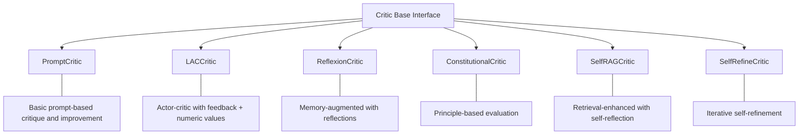
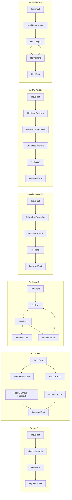

# Sifaka Critics

This package provides specialized text evaluation and improvement components that analyze, critique, and enhance generated text using different methodologies and feedback approaches.

## Overview

Critics are essential components for improving the quality, safety, and effectiveness of language model outputs. They serve as the evaluation and feedback mechanism in the Sifaka framework, helping to refine generated text through targeted feedback and improvements.

## Critic Types

Sifaka provides several specialized critic implementations, each designed for specific use cases and improvement strategies:



### Comparison of Critic Types

| Critic Type | Key Features | Best For | Based On Research |
|-------------|--------------|----------|-------------------|
| **PromptCritic** | Simple prompt-based feedback | General purpose text improvement | N/A |
| **LACCritic** | Combines language feedback and numeric scoring | Quantitative and qualitative assessment | [Language Feedback Improves Language Model-based Decision Making](https://arxiv.org/abs/2403.03692) |
| **ReflexionCritic** | Maintains memory of past reflections | Learning from feedback over time | [Reflexion: Language Agents with Verbal Reinforcement Learning](https://arxiv.org/abs/2303.11366) |
| **ConstitutionalCritic** | Evaluates against predefined principles | Safety and alignment | [Constitutional AI](https://arxiv.org/abs/2212.08073) |
| **SelfRAGCritic** | Retrieves information to enhance critique | Knowledge-based improvement | [Self-RAG](https://arxiv.org/abs/2310.11511) |
| **SelfRefineCritic** | Iteratively refines text through self-critique | Complex text improvement | [Self-Refine](https://arxiv.org/abs/2303.17651) |

## Visual Comparison

The following diagram illustrates the key differences in how these critics operate:



## Using Critics

### Creating Critics

Sifaka provides factory functions for creating each type of critic with sensible defaults:

```python
from sifaka.critics import (
    create_prompt_critic,
    create_lac_critic,
    create_reflexion_critic,
    create_constitutional_critic,
    create_self_rag_critic,
    create_self_refine_critic
)
from sifaka.models import OpenAIProvider

# Create a model provider
model = OpenAIProvider(model_name="gpt-4", api_key="your-openai-key")

# Create a simple prompt critic
prompt_critic = create_prompt_critic(
    llm_provider=model,
    system_prompt="You are an expert editor who improves text clarity and accuracy."
)

# Create a LAC (LLM-Based Actor-Critic) critic
lac_critic = create_lac_critic(
    llm_provider=model,
    system_prompt="You evaluate text based on accuracy and completeness."
)

# Create a Reflexion critic
reflexion_critic = create_reflexion_critic(
    llm_provider=model,
    memory_buffer_size=5,  # Remember the last 5 reflections
    reflection_depth=2     # How far back to consider reflections
)

# Create a Constitutional critic with principles
constitutional_critic = create_constitutional_critic(
    llm_provider=model,
    principles=[
        "Do not provide harmful content.",
        "Explain reasoning clearly.",
        "Respect user autonomy.",
    ]
)

# Create a Self-RAG critic (requires a retriever)
from sifaka.retrieval import create_simple_retriever
retriever = create_simple_retriever(
    documents=["Document 1 content", "Document 2 content"]
)
self_rag_critic = create_self_rag_critic(
    llm_provider=model,
    retriever=retriever,
    retrieval_threshold=0.7  # When to retrieve information
)

# Create a Self-Refine critic
self_refine_critic = create_self_refine_critic(
    llm_provider=model,
    max_refinement_steps=3  # Maximum iterations of refinement
)
```

### Using Critics with Chain

Critics are typically used within a Chain to validate and improve generated content:

```python
from sifaka.chain import Chain
from sifaka.models import OpenAIProvider
from sifaka.critics import create_prompt_critic
from sifaka.rules import create_length_rule, create_prohibited_content_rule

# Create a model provider
model = OpenAIProvider(model_name="gpt-4", api_key="your-openai-key")

# Create a critic
critic = create_prompt_critic(llm_provider=model)

# Create validation rules
rules = [
    create_length_rule(min_chars=50, max_chars=500),
    create_prohibited_content_rule(prohibited_terms=["offensive", "harmful"])
]

# Create a chain
chain = Chain(
    model=model,
    validators=rules,
    improver=critic,
    max_attempts=3
)

# Generate content with automatic validation and improvement
result = chain.run("Write a short story about friendship.")
```

## Choosing the Right Critic

- **PromptCritic**: General-purpose text improvement with simple feedback.
- **LACCritic**: When you need both qualitative feedback and quantitative scores.
- **ReflexionCritic**: When learning from past feedback is important for improvement.
- **ConstitutionalCritic**: When adherence to specific principles or guidelines is critical.
- **SelfRAGCritic**: When external knowledge is needed to validate or improve content.
- **SelfRefineCritic**: When complex text requires multiple refinement iterations.

## Critic Interfaces

All critics implement three core interfaces:

- **TextValidator**: Methods for validating text quality
- **TextImprover**: Methods for improving text
- **TextCritic**: Methods for critiquing and analyzing text

## Creating Custom Critics

You can create custom critics by implementing the interfaces or extending existing critics:

```python
from sifaka.critics.base import Critic
from sifaka.utils.config import CriticConfig

class CustomCritic(Critic):
    """A custom critic implementation."""

    def validate(self, text: str) -> bool:
        """Check if text meets quality standards."""
        # Custom validation logic
        return len(text) > 100  # Example: require at least 100 characters

    def improve(self, text: str, feedback: str = "") -> str:
        """Improve text based on feedback."""
        # Custom improvement logic
        model = self._state_manager.get("model")
        prompt = f"Improve this text: {text}\nFeedback: {feedback}"
        return model.generate(prompt)

    def critique(self, text: str) -> dict:
        """Analyze text and provide detailed feedback."""
        # Custom critique logic
        issues = []
        if len(text) < 100:
            issues.append("Text is too short")

        return {
            "score": 0.7,
            "feedback": "Text needs improvement in clarity and detail.",
            "issues": issues,
            "suggestions": ["Add more detail", "Improve structure"]
        }
```

## Advanced Usage

### Combining Critics

Different critics can be combined for more sophisticated feedback:

```python
from sifaka.critics import create_prompt_critic, create_constitutional_critic

# Create critics
prompt_critic = create_prompt_critic(llm_provider=model)
constitutional_critic = create_constitutional_critic(
    llm_provider=model,
    principles=["Be factually accurate", "Be concise"]
)

# First validate against principles
if constitutional_critic.validate(text):
    # Then improve with prompt critic
    improved_text = prompt_critic.improve(text)
```

## Best Practices

1. **Match the critic to your use case**: Different critics excel at different types of feedback.
2. **Provide specific system prompts**: Guide the critic with clear instructions.
3. **Use appropriate thresholds**: Adjust confidence thresholds based on your requirements.
4. **Combine with rules**: Use rules for validation and critics for improvement.
5. **Enable memory for iterative tasks**: Use ReflexionCritic or SelfRefineCritic for multi-turn interactions.
6. **Leverage external knowledge**: Use SelfRAGCritic when domain-specific information is needed.
7. **Set appropriate retry limits**: Configure max_attempts to balance quality and latency.
